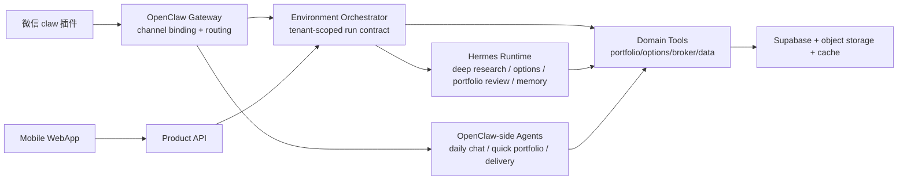

# Agent 框架选型草案

## 选型标准

本系统不是通用聊天机器人，选型要按金融持仓系统的生产约束来打分：

| 标准 | 说明 |
| --- | --- |
| 微信 claw 绑定 | 是否能稳定绑定微信 claw 插件，支持账号/会话路由 |
| 多账户隔离 | 是否天然支持 channel account、workspace、memory、session 隔离 |
| 工具边界 | 是否容易实现只读资源、写工具、审批工具、禁用工具 |
| 长任务可靠性 | 是否支持 cron、checkpoint、resume、失败补偿 |
| 模型路由 | 是否方便日常 MiniMax M2.7、深研 GPT-5.5、规则工具混合 |
| 可观测性 | 是否支持 tracing、step logs、tool audit、eval |
| 工程贴合 | 与现有 Python FastAPI、Supabase、Next.js、OpenClaw skills 的改造成本 |
| 框架锁定风险 | 业务状态是否会被框架内部状态吞掉，导致难迁移 |

## 候选框架对比

| 方案 | 优势 | 风险 | 对本系统建议 |
| --- | --- | --- | --- |
| OpenClaw-first | 多渠道 Gateway、WeChat/Feishu/Teams 等渠道支持、多 agent routing、channel account binding、workspace 概念贴近 2.0 | 个人助理/Gateway 色彩强，金融领域状态和券商接入仍需自建，默认 workspace 不是强沙箱 | **推荐作为交互 Gateway 和账号绑定层** |
| Hermes-first | 强记忆、skills 自进化、cron、消息网关、模型无锁定、支持 OpenClaw 迁移/桥接 | 对微信 claw 的核心能力仍依赖桥接；自学习 memory 对金融系统需要更严格治理 | **推荐作为深研/长任务子 agent，不推荐独占业务基座** |
| OpenAI Agents SDK | Python-first，Agents/Handoffs/Guardrails/Sessions/Tracing/Sandbox Agents/MCP 支持清晰，适合 GPT-5.5 深研 | 主要围绕 OpenAI 生态，MiniMax 等外部模型需要 provider adapter；微信 Gateway 仍需外接 | **适合做深研 agent runtime 或核心 orchestrator POC** |
| LangGraph | checkpoint、human-in-the-loop、fault tolerance、time travel 很适合长流程和审批 | 学习成本和图编排成本高，简单日常对话可能偏重 | **适合深度研究、期权策略、券商同步这类可恢复流程** |
| Google ADK | 多语言、agent teams、workflow agents、eval、deployment、A2A/MCP 生态强 | 更适合 Google Cloud/Gemini 栈；现有系统不是 Google-first | **作为长期备选，不作为当前默认** |
| Microsoft Agent Framework | 企业级、多语言、workflows、A2A、Azure 生态；AutoGen 后继方向 | Azure 绑定感强，与当前 2.0 改造成本较高 | **若未来上 Azure/企业客户再评估** |
| Pydantic AI | Python 类型安全、模型无关、与 FastAPI/Pydantic 贴合，适合工具 schema 和结构化输出 | 编排和多 agent 能力相对需要自建组合 | **适合 domain tool layer 和 typed agent helpers** |
| CrewAI | role/task/crew 概念上手快，适合研究型协作 demo | 对生产金融系统的状态、权限、审计、恢复需要大量外补 | **不建议作为核心基座** |

## 已确认推荐

3.0 采用 **OpenClaw + Hermes 双 agent runtime + 独立 Environment Orchestrator + Domain Tools**：

这个方案的含义：

1. **OpenClaw 不承载全部业务智能，负责最强项：消息入口、账号绑定、channel routing、轻量对话和推送出口。**
2. **Environment Orchestrator 是 3.0 的真正基座。** 它负责创建继承 `routing.json.tenantId/accountId` 的 tenant-scoped run contract，注入可见资源、允许工具、模型策略、审计和审批。
3. **Hermes 是复杂长任务 runtime。** 用在深研、机会捕捉、复杂股票/期权分析、复盘归因、memory curator 和受控自主优化，不把持仓真相源放进 Hermes memory。
4. **Domain Tools 是金融能力底座。** OpenClaw 和 Hermes 共享同一套 typed tools，期权 Greeks、保证金、收益风险比、数据质量评分、回测等尽量使用确定性计算。
5. **GPT-5.5 优先供 Hermes deep jobs 使用。** MiniMax M2.7 负责 OpenClaw 日常对话；复杂任务由 Orchestrator handoff 给 Hermes。

OpenClaw、Hermes、Domain Tools 的详细关系见 `12-openclaw-hermes-agent-runtime.md`。

## 如果必须在 OpenClaw 和 Hermes 二选一

| 场景 | 选择 |
| --- | --- |
| 微信 claw 插件是核心入口，后续还要扩展钉钉/飞书 | OpenClaw |
| 希望 agent 长期在线、学习用户、沉淀技能、从 Telegram/Slack 等多入口对话 | Hermes |
| 当前 2.0 最小改造升级 | OpenClaw 为主，Hermes 做子 agent |
| 未来重做纯 agent-native 产品 | 需要重新评估 Hermes-first 或 LangGraph/ADK-first |

## 开发前已确认决策

1. Hermes 作为独立 worker 运行；Environment Orchestrator 与 Tool Gateway 在 P0 可先放在 Product API 内部模块化实现，但接口边界按独立服务设计。
2. Hermes 工具使用、分析输出允许自主优化自动生效；交易执行动作类优化需要人工确认，可按每周一次频次推送确认清单。金融规则、数据源策略和交易动作仍必须经过受控审批。
3. MiniMax M2.7 通过统一 `model adapter` 接入；业务层不直接依赖 MiniMax SDK/CLI，MiniMax CLI 只作为接入实现之一。
4. OpenClaw-side 日常意图/文本使用 MiniMax M2.7；Hermes-side 深研/长任务使用 GPT-5.5；高风险输出走规则和风控复核。

## 参考

- [OpenClaw GitHub](https://github.com/openclaw/openclaw)
- [OpenClaw agent routing](https://github.com/openclaw/openclaw/blob/main/docs/cli/agents.md)
- [OpenClaw agent workspace](https://github.com/openclaw/openclaw/blob/main/docs/concepts/agent-workspace.md)
- [Hermes Agent GitHub](https://github.com/NousResearch/hermes-agent)
- [OpenAI Agents SDK](https://openai.github.io/openai-agents-python/)
- [LangGraph persistence](https://docs.langchain.com/oss/python/langgraph/persistence)
- [Google Agent Development Kit](https://adk.dev/)
- [Microsoft Agent Framework](https://learn.microsoft.com/en-us/agent-framework/)
- [Pydantic AI](https://github.com/pydantic/pydantic-ai)
- [CrewAI](https://github.com/crewAIInc/crewAI)
