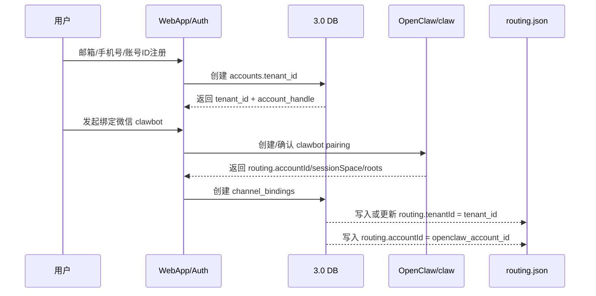
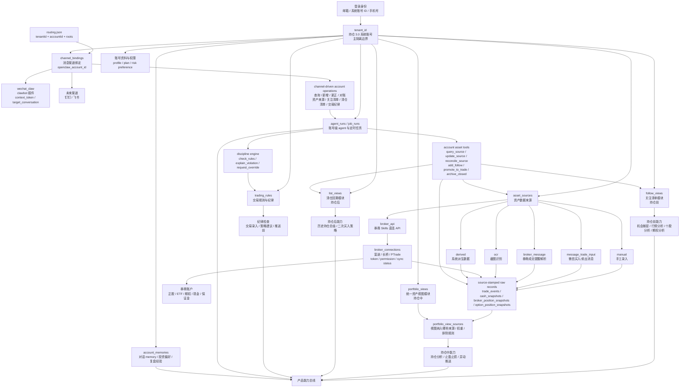
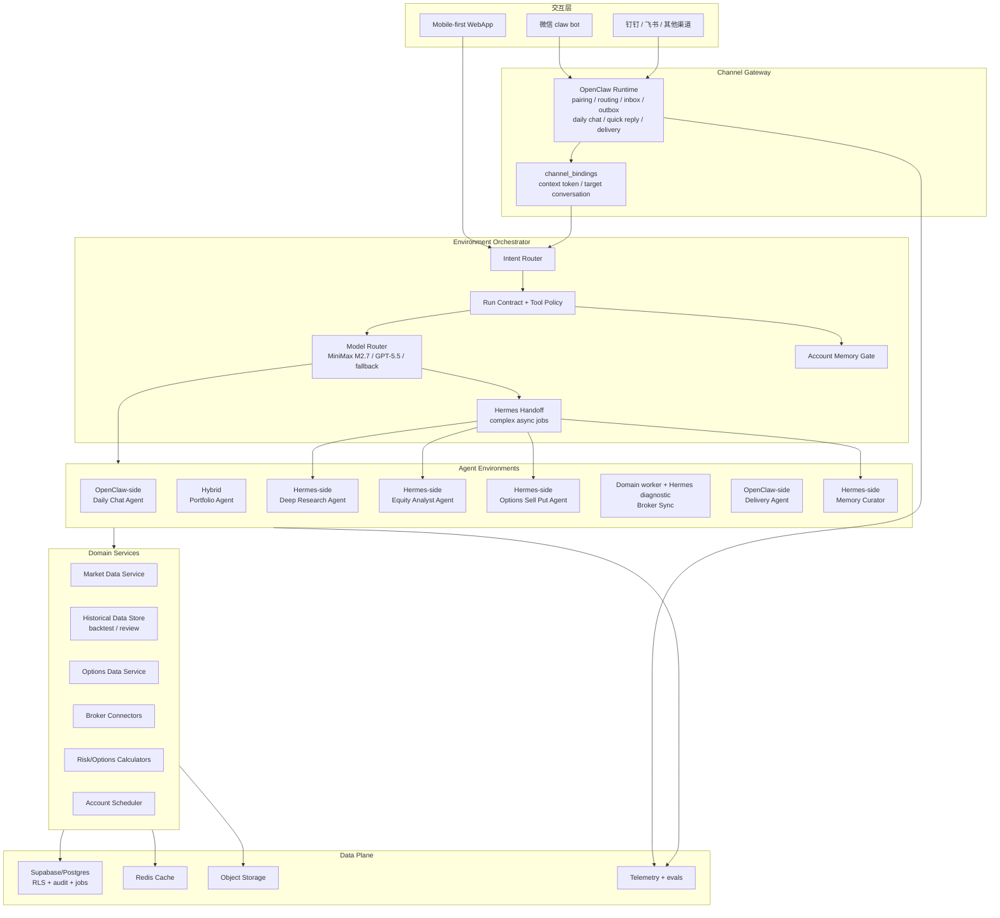

# 3.0 目标架构

## 身份与隔离模型

已确认：**账号是持仓 3.0 系统账号**，不是微信 claw bot，也不是单一券商账户。用户通过邮箱、账号 ID 或手机号登录系统；账号绑定微信 clawbot 插件后获得渠道消息交互能力。一个账号下可以整合手工录入、买入/卖出消息、OCR、券商 skills 直连 API 等多种资产来源，并形成统一资产视图。

同时，为继承当前持仓系统 `routing.json` 的语义，3.0 参数必须避免把“系统账号”和“OpenClaw 微信机器人账号”混在一起：

- `routing.json.accountId` 继续表示 **OpenClaw 内部微信机器人账号 ID**，3.0 内部字段命名为 `openclaw_account_id`。
- `routing.json.tenantId` 继续表示 **数据隔离租户 ID**，3.0 将它提升为持仓系统账号的技术主键，内部字段命名为 `tenant_id`。
- 用户口语里的“账号”可以仍然叫“持仓系统账号”，但实现参数使用 `tenant_id`，避免和 `accountId` 冲突。

因此身份模型收敛为以下层次：

| ID | 含义 | 隔离职责 |
| --- | --- | --- |
| `tenant_id` | 持仓 3.0 系统账号和数据隔离根，继承 `routing.json.tenantId` | 最高层产品身份；持仓、交易、策略、对话 memory、账单与权限的主隔离边界 |
| `openclaw_account_id` | OpenClaw 内部微信机器人账号 ID，继承 `routing.json.accountId` | 标识某个微信 bot，不作为投资数据隔离主键 |
| `channel_binding_id` | 某个系统账号绑定的微信 clawbot、未来钉钉/飞书等消息渠道 | 入站路由、出站推送、context token、target conversation、会话恢复 |
| `asset_source_id` | 某个系统账号下的数据来源，例如手工录入、微信买卖消息、OCR、券商 API 同步 | 写入来源、可信度、对账、追溯 |
| `broker_connection_id` | `asset_source_id` 的券商类特化，指富途、长桥、PTrade 等生产账号授权 | 券商 token、同步状态、权限范围、现金/保证金/期权仓位 |
| `portfolio_view_id` | 持仓中统一资产视图或策略分组 | 在同一 `tenant_id` 内聚合多个券商账户和手工数据 |
| `follow_view_id` | 持仓前关注清单 | 管理可能买入、可能 sell put、等待研究或等待触发的投资标的 |
| `list_view_id` | 持仓后清仓清单和回溯列表 | 查询已清仓标的、历史交易结果、复盘结论和二次买入条件 |
| `trading_rule_id` | 交易规则与交易纪律 | 保存用户风险偏好、禁止项、时间限制、仓位限制和操作纪律 |

核心约束：

1. 所有业务表必须带 `tenant_id`。
2. 所有后台写入必须记录来源：`source_type` + `source_ref` 或 `asset_source_id`。
3. 所有对话 memory 必须带 `tenant_id` + `memory_scope`。
4. 所有推送任务必须带 `tenant_id` + `channel_binding_id` + `openclaw_account_id`。
5. agent run 没有 `tenant_id` 不允许访问持仓和 memory。
6. 统一资产视图可以聚合多券商账户，但不能抹掉原始来源。
7. 持仓前的 `follow_views` 和持仓后的 `list_views` 与持仓中的 `portfolio_views` 同级，都是 `tenant_id` 下的账号资产模块。
8. `trading_rules` 是 `tenant_id` 下的纪律约束模块，所有交易录入、交易草稿、策略建议和高风险推送都必须经过规则检查。

## routing.json 兼容参数映射

| 现行 `routing.json` 字段 | 3.0 内部字段 | 归属模块 | 说明 |
| --- | --- | --- | --- |
| `channel` | `channel` | `channel_bindings` | 当前固定为 `openclaw-weixin`，未来可扩展钉钉/飞书 |
| `accountId` | `openclaw_account_id` | `channel_bindings` | OpenClaw 内部微信机器人账号 ID，每个 bot 唯一 |
| `accountLabel` | `channel_account_label` | `channel_bindings` | 主/副账号等人工别名 |
| `humanName` | `human_name` | `channel_bindings` / `accounts` | 真实用户名称，可用于展示和人工识别 |
| `sessionSpace` | `session_space` | `channel_bindings` / `agent_runs` | 会话空间标识，用于隔离对话历史 |
| `memoryRoot` | `memory_root` | `account_memories` / runtime config | 长期记忆文件根目录 |
| `sessionRoot` | `session_root` | `agent_sessions` / runtime config | 会话记录根目录 |
| `identityRoot` | `identity_root` | `account_identity` / runtime config | 身份配置根目录 |
| `tenantId` | `tenant_id` | 全部业务表 | 持仓系统账号和数据隔离根 |
| `dataRoot` | `data_root` | `asset_sources` / runtime config | 投资分析数据根目录，按 `tenant_id` 隔离 |
| `status` | `binding_status` | `channel_bindings` | `active` 表示渠道绑定正常 |

3.0 的命名纪律：

1. 不再使用裸 `account_id` 表示持仓系统账号，统一使用 `tenant_id`。
2. 如果需要表达 OpenClaw 的 `accountId`，必须写成 `openclaw_account_id`。
3. 如果 UI 需要展示“账号 ID”，可以展示 `account_handle` 或 `tenant_id` 的短码，但不要映射到 `routing.json.accountId`。
4. 所有 agent run 都要带完整 routing context，避免跨用户记忆、数据和推送混淆。

标准运行上下文：

```json
{
  "tenant_id": "routing.tenantId",
  "channel": "openclaw-weixin",
  "openclaw_account_id": "routing.accountId",
  "channel_binding_id": "uuid-generated-by-3.0",
  "channel_account_label": "routing.accountLabel",
  "human_name": "routing.humanName",
  "session_space": "routing.sessionSpace",
  "memory_root": "routing.memoryRoot",
  "session_root": "routing.sessionRoot",
  "identity_root": "routing.identityRoot",
  "data_root": "routing.dataRoot",
  "binding_status": "routing.status"
}
```

## 账号与微信绑定生成顺序

结论：**先有 `tenant_id`，后有微信渠道绑定。**

`tenant_id` 是持仓 3.0 系统账号和数据隔离根，必须在用户注册时生成。微信 claw 插件绑定只是给这个系统账号增加一个消息渠道，因此绑定时生成的是 `channel_binding_id`，并把 OpenClaw 的 `routing.json.accountId` 记录为 `openclaw_account_id`。

推荐生命周期：



字段生成规则：

| 时机 | 生成/写入字段 | 说明 |
| --- | --- | --- |
| 用户注册 | `tenant_id` | 系统账号主键、数据隔离根、memory 隔离根 |
| 用户注册 | `account_handle` | 可选的人类可读账号 ID，用于登录或展示 |
| 绑定微信 claw | `channel_binding_id` | 3.0 内部渠道绑定记录 |
| 绑定微信 claw | `openclaw_account_id` | 继承 `routing.json.accountId`，表示 OpenClaw 微信 bot |
| 绑定微信 claw | `session_space`、`memory_root`、`session_root`、`identity_root`、`data_root` | 继承或生成 runtime 路径配置 |
| 绑定微信 claw | `routing.json.tenantId` | 必须引用已有 `tenant_id`，不能另造 |

如果用户先从微信 clawbot 入口进入、尚未注册 Web 账号，则系统可以创建一个 `status=pending_claim` 的临时 `tenant_id`，绑定当前 `openclaw_account_id`；后续用户补充邮箱/手机号时，把登录身份挂到同一个 `tenant_id`，不能创建第二个租户。

## 账号映射与层级关系图



读图规则：

1. `tenant_id` 是系统账号，也是持仓、memory、任务和权限的主隔离边界，继承当前 `routing.json.tenantId`。
2. `openclaw_account_id` 继承当前 `routing.json.accountId`，只表示 OpenClaw 微信 bot，不作为投资数据隔离根。
3. `channel_bindings` 不拥有资产，但它是查询和更改账号资产模块的主要交互入口；微信 clawbot 通过这里映射回系统账号，再触发账号级 agent/tools。
4. `asset_sources` 只解决数据来源问题；券商账户、手工录入、消息解析、OCR 都是来源。
5. `account asset tools` 是受权限控制的操作层：用户可以通过微信消息查询、补录、纠错、对账某个来源，也可以维护关注清单和清仓回溯清单；涉及持仓事实的写入仍必须落到带来源标记的 raw records。
6. `broker_connections` 是券商 API 来源的特化，负责 token、权限、同步状态和生产账号映射。
7. `follow_views` 对应持仓前，承接机会捕捉、行情分析、个股分析、期权分析的结果。
8. `portfolio_views` 对应持仓中，不是原始来源；它通过 `portfolio_view_sources` 定义纳入哪些资产来源、是否排除某些来源、展示哪个统一资产视图。
9. `list_views` 对应持仓后，承接已清仓标的查询、回溯复盘和二次买入策略。
10. `trading_rules` 对应用户交易风格和纪律，在交易记录、交易草稿、策略建议和推送前触发检查。

## 账号资产模块总览

| 模块 | 生命周期 | 管理对象 | 典型动作 |
| --- | --- | --- | --- |
| `follow_views` | 持仓前 | 可能买入、可能 sell put、等待研究或等待触发的标的 | 添加关注、更新买入区间、设置触发器、升级为交易计划 |
| `portfolio_views` | 持仓中 | 当前持仓、现金、期权仓位、券商和手工资产聚合视图 | 查询资产、聚合多来源、分析仓位、止盈止损、异动推送 |
| `list_views` | 持仓后 | 已清仓标的、历史结果、复盘结论、二次买入条件 | 查询历史、复盘归因、生成再入场条件、移回关注清单 |
| `trading_rules` | 全生命周期 | 风险偏好、禁止项、时间限制、仓位限制、操作纪律 | 规则检查、违规提醒、override 记录、纪律评分 |

## Trading Rules & Discipline 模块

`trading_rules` 用于保存用户的交易规则和交易纪律。它不是静态偏好说明，而是一个会在交易相关动作发生时被执行的规则层。

典型规则：

| 规则 | 示例 |
| --- | --- |
| 标的限制 | 不买中概股、不买高杠杆 ETF、不碰小市值股票 |
| 时间限制 | 盘前盘后不下单、财报前 24 小时不新开仓 |
| 仓位限制 | 单一标的不超过 15%，单一行业不超过 35% |
| 期权限制 | 不卖裸 put，只做现金担保 sell put，DTE 限制在 14-45 天 |
| 价格纪律 | 不追高，只在预设买入区间内行动 |
| 冷静期 | 连续亏损后暂停新开仓 24 小时 |
| 确认规则 | 违反高优先级规则时必须二次确认或禁止执行 |

建议表结构：

```sql
trading_rules (
  id uuid primary key,
  tenant_id uuid not null,
  name text not null,
  description text,
  rule_type text not null, -- prohibit, require_confirmation, limit, reminder, cooldown
  category text not null, -- symbol, market, session, position_size, option, event, behavior
  scope text not null, -- all, stock, etf, option, sell_put, follow_view, portfolio_view
  severity text not null, -- info, warning, block
  enabled boolean not null default true,
  override_allowed boolean not null default false,
  rule_expression jsonb not null,
  natural_language_rule text not null,
  examples jsonb not null default '[]',
  source_type text not null, -- user_set, inferred_from_history, default_template, advisor_suggested
  created_by_channel_binding_id uuid,
  effective_from timestamptz,
  effective_to timestamptz,
  created_at timestamptz,
  updated_at timestamptz
);

discipline_checks (
  id uuid primary key,
  tenant_id uuid not null,
  agent_run_id uuid,
  channel_binding_id uuid,
  action_type text not null, -- trade_input, trade_plan, follow_add, strategy_output, delivery_push
  symbol text,
  instrument_type text,
  market text,
  action_payload jsonb not null,
  checked_rule_ids uuid[] not null,
  triggered_rule_ids uuid[] not null,
  result text not null, -- pass, warn, blocked, override_required, overridden
  user_message text,
  override_reason text,
  created_at timestamptz
);
```

规则表达示例：

```json
{
  "operator": "not_in",
  "field": "risk_tags",
  "values": ["china_adr"],
  "message": "你的规则是不买中概股，本次标的命中 china_adr 标签。"
}
```

```json
{
  "operator": "outside_trading_session",
  "market": "US",
  "blocked_sessions": ["pre_market", "post_market"],
  "message": "你的规则是盘前盘后不下单，本次操作发生在盘前/盘后。"
}
```

触发点：

| 动作 | 检查内容 |
| --- | --- |
| 加入关注清单 | 是否违反“不看/不买某类标的”规则 |
| 升级为交易计划 | 是否满足买入区间、仓位、市场、事件窗口限制 |
| 记录买入/卖出 | 是否违反交易时间、标的禁买、仓位上限 |
| sell put 候选输出 | 是否满足现金担保、DTE、delta、财报窗口、愿意接股规则 |
| 推送交易建议 | 推送前再次检查，避免把违规建议发给用户 |

通过消息渠道的典型操作：

| 用户消息 | 系统动作 |
| --- | --- |
| “以后不要提醒我买中概股” | 创建 `trading_rules`，`category=symbol`，`rule_type=prohibit` |
| “盘前盘后不下单” | 创建 session 规则，交易录入和交易计划会触发检查 |
| “这次破例可以买” | 若 `override_allowed=true`，写入 `discipline_checks.override_reason` |
| “总结我最近有没有违反纪律” | 查询 `discipline_checks`，生成纪律评分和复盘 |

## Portfolio Views 模块

`portfolio_views` 用来解决“一个系统账号下，多个券商账户和手工资产如何组成一个或多个当前持仓视图”的问题。它不保存原始成交事实，而是保存聚合口径。

已确认：股票/ETF 和期权在持仓明细、分析参数、风控规则上必须分开。`portfolio_views` 只负责统一展示和聚合口径，底层持仓使用 `portfolio_positions` 作为通用骨架，再拆到 `equity_positions` 和 `option_positions`。完整设计见 `10-position-data-model.md`。

典型视图：

| 视图 | 用途 |
| --- | --- |
| 全部资产 | 默认统一资产视图，纳入所有已启用来源 |
| 港美期权账户 | 只纳入长桥/富途期权相关来源 |
| A 股长期账户 | 只纳入 A 股券商和手工修正来源 |

建议表结构：

```sql
portfolio_views (
  id uuid primary key,
  tenant_id uuid not null,
  name text not null,
  view_type text not null, -- all_assets, strategy_group, broker_group
  base_currency text,
  is_default boolean not null default false,
  rules jsonb not null default '{}',
  created_at timestamptz
);

portfolio_view_sources (
  id uuid primary key,
  tenant_id uuid not null,
  portfolio_view_id uuid not null,
  asset_source_id uuid not null,
  include_mode text not null, -- include, exclude, watch_only
  weight numeric,
  rules jsonb not null default '{}',
  created_at timestamptz
);
```

通过消息渠道的典型操作：

| 用户消息 | 系统动作 |
| --- | --- |
| “查一下全部资产” | 查询默认 `portfolio_view_id`，聚合所有启用来源 |
| “把富途账户加入港美期权视图” | 更新 `portfolio_view_sources`，记录操作来源为 `wechat_claw` |
| “这笔 OCR 识别错了，数量改成 200” | 触发 `update_source`，写修正记录和审计，不直接覆盖原始 OCR |
| “同步长桥账户” | 触发对应 `broker_connection_id` 的只读同步 job |

## Follow Views 模块

`follow_views` 是账号下的持仓前资产模块，用于管理“可能要买入/可能要卖 put/等待研究/等待触发”的投资标的。它承接机会捕捉、行情分析、个股分析和期权分析。

建议表结构：

```sql
follow_views (
  id uuid primary key,
  tenant_id uuid not null,
  name text not null,
  view_type text not null, -- watchlist, opportunity_pool, sell_put_candidates, sector_theme, custom
  market_scope text[], -- A, HK, US
  instrument_scope text[], -- stock, etf, option_underlying
  strategy_focus text[], -- buy, sell_put, swing, long_term, dividend
  is_default boolean not null default false,
  rules jsonb not null default '{}',
  created_by_channel_binding_id uuid,
  created_at timestamptz,
  updated_at timestamptz
);

follow_view_items (
  id uuid primary key,
  tenant_id uuid not null,
  follow_view_id uuid not null,
  symbol text not null,
  provider_symbol text,
  market text not null,
  exchange text,
  instrument_type text not null, -- stock, etf, option_underlying
  name text,
  status text not null, -- watching, researching, candidate, triggered, promoted_to_trade, rejected, archived
  source_type text not null, -- manual, wechat_message, opportunity_hunter, research_agent, imported
  source_ref text,
  thesis text,
  target_action text, -- buy, sell_put, wait, research, avoid
  priority integer,
  conviction_score numeric,
  target_buy_zone jsonb,
  sell_put_preferences jsonb,
  trigger_rules jsonb,
  risk_flags text[],
  last_quote_snapshot jsonb,
  last_analysis_at timestamptz,
  next_review_at timestamptz,
  linked_research_artifact_id uuid,
  created_at timestamptz,
  updated_at timestamptz,
  unique(tenant_id, follow_view_id, symbol, instrument_type)
);
```

通过消息渠道的典型操作：

| 用户消息 | 系统动作 |
| --- | --- |
| “关注一下 NVDA，回调到 820 提醒我” | 写入 `follow_view_items`，设置 `trigger_rules` |
| “把腾讯加入港股观察” | 加入指定 `follow_view_id` |
| “这个标的适合 sell put 吗？” | 调用期权分析，更新 `sell_put_preferences` 和风险标签 |
| “把 AAPL 从关注升级成交易计划” | `status=promoted_to_trade`，生成交易草稿或持仓前研究任务 |

## List Views 模块

`list_views` 是账号下的持仓后资产模块，首要用途是清仓列表：管理已经清仓的投资标的、历史表现、复盘结论和二次买入策略。它承接历史持仓总结和二次买入策略。

建议表结构：

```sql
list_views (
  id uuid primary key,
  tenant_id uuid not null,
  name text not null,
  list_type text not null, -- closed_positions, rebuy_candidates, archived_follow, assignment_history
  market_scope text[],
  instrument_scope text[],
  strategy_scope text[],
  date_range jsonb,
  is_default boolean not null default false,
  rules jsonb not null default '{}',
  created_by_channel_binding_id uuid,
  created_at timestamptz,
  updated_at timestamptz
);

list_view_items (
  id uuid primary key,
  tenant_id uuid not null,
  list_view_id uuid not null,
  symbol text not null,
  provider_symbol text,
  market text not null,
  exchange text,
  instrument_type text not null, -- stock, etf, option_underlying, option_contract
  name text,
  source_position_ref text,
  source_asset_source_ids uuid[],
  opened_at date,
  closed_at date,
  holding_days integer,
  total_buy_amount numeric(18,2),
  total_sell_amount numeric(18,2),
  realized_pnl numeric(18,2),
  realized_pnl_pct numeric(10,4),
  max_drawdown_pct numeric(10,4),
  max_runup_pct numeric(10,4),
  exit_reason text,
  strategy_tag text,
  review_status text not null, -- pending, reviewed, needs_followup
  review_summary text,
  lessons jsonb,
  rebuy_status text, -- not_allowed, watch, candidate, triggered
  rebuy_conditions jsonb,
  linked_follow_item_id uuid,
  data_lineage jsonb not null default '{}',
  created_at timestamptz,
  updated_at timestamptz
);
```

通过消息渠道的典型操作：

| 用户消息 | 系统动作 |
| --- | --- |
| “查一下我清仓过的 TSLA” | 查询 `list_view_items`，返回历史盈亏和复盘摘要 |
| “总结一下今年清仓亏损最多的股票” | 查询 `list_views`，按 realized PnL 排序并生成复盘 |
| “如果 AAPL 回到 165，提醒我二次买入” | 更新 `rebuy_conditions`，必要时创建或关联 `follow_view_items` |
| “把这次清仓标记为纪律执行良好” | 更新 `review_status`、`lessons` 和审计记录 |

## 目标架构图



## Agent 分工

| Agent | Runtime | 触发 | 主要职责 | 账号隔离 |
| --- | --- | --- | --- | --- |
| Daily Chat Agent | OpenClaw-side | 微信/Web 日常问答 | 解释持仓、回答轻量问题、引导用户确认当前系统账号 | 只能读当前 `tenant_id` 摘要 |
| Portfolio Agent | Hybrid | 交易录入、持仓分析、日终复盘 | 轻量查询在 OpenClaw-side；复杂复盘和归因 handoff Hermes | 读写当前 `tenant_id` 业务表，写入时保留来源 |
| Deep Research Agent | Hermes-side | 用户要求深研、机会捕捉、复杂报告 | web/data research、财报/新闻/行业研究、长报告 | 默认只读，产出 research artifact |
| Equity Analyst Agent | Hermes-side | 个股分析 | 基本面、技术面、估值、事件、催化剂 | 可读 watchlist 和当前持仓 |
| Options Sell Put Agent | Hermes-side | 期权策略 | 标的筛选、strike 选择、IV/Greeks/保证金/assignment 风险 | 必须绑定券商账号或现金约束 |
| Broker Sync Agent | Domain worker + Hermes diagnostic | 定时/手动同步 | 同步本身 deterministic；异常诊断和复盘交给 Hermes | 只读生产账号，token 按 connection 隔离 |
| Delivery Agent | OpenClaw-side | cron/outbox | 生成推送、重试、补偿、确认送达 | 严格绑定 `tenant_id + channel_binding_id + openclaw_account_id` |
| Memory Curator | Hermes-side | 对话后、每日整理 | 抽取偏好、策略复盘、纠错记录 | memory 按 `tenant_id` 隔离 |
| Ops Agent | Hermes-side 后置 | 管理员 | 诊断失败任务、数据源健康、投递成功率 | 默认看聚合指标，不看敏感明细 |

历史行情和回测数据不由 agent 直接拼外部 API。Agent 只能通过 `HistoricalDataQueryService` 读取已保存且通过质量检查的数据；缺口由 ingestion/backfill job 补齐后再进入回测或复盘。

Domain Tools 层不是子 agent 本身，而是子 agent 调用的 typed tools / domain services。完整工具包、功能边界和外部依赖见 `11-domain-tools-layer.md`。

OpenClaw 与 Hermes 的双 runtime 关系、handoff 任务包和 Hermes 自主优化边界见 `12-openclaw-hermes-agent-runtime.md`。

Environment Orchestrator 负责为每次请求构建 tenant-scoped run contract，解析模型策略、工具权限、memory scope 和审计策略；完整设计见 `15-environment-orchestrator.md`。

## 模型路由

| 场景 | 建议模型 | 说明 |
| --- | --- | --- |
| 日常对话、状态查询、轻量解释 | MiniMax M2.7 | 成本低、响应快；必须配合账号环境和工具边界 |
| 深度研究、复杂个股分析、期权 sell put 策略 | GPT-5.5 | 只在需要深推理和长上下文时升级 |
| 数据校验、收益率、Greeks、保证金、回测 | deterministic Python/tool | 不让模型心算金融指标 |
| 推送模板压缩、摘要 | MiniMax M2.7 或更小模型 | 内容来自已验证数据快照 |
| 风险审查/最终报告审校 | GPT-5.5 或规则+强模型 | 高影响建议前做二次校验 |

模型路由必须记录：

- `model_provider`
- `model_name`
- `model_version` 或 snapshot
- prompt/template version
- input data snapshot hash
- tool call trace
- cost and latency

## Memory 隔离

建议 memory 分四类：

| Scope | 示例 | 是否跨系统账号 |
| --- | --- | --- |
| `tenant_profile` | 用户语言偏好、风险表达风格、通知偏好 | 不跨系统账号 |
| `tenant_strategy` | 该系统账号偏好 sell put、ETF、长期正股等 | 不跨系统账号 |
| `conversation_summary` | 某系统账号最近对话摘要 | 不跨系统账号 |
| `research_artifact` | 某次个股/期权研究报告 | 默认绑定账号，可手动复制 |

memory 写入原则：

1. 用户明确确认的长期偏好才写入。
2. 交易事实来自 `trade_events` 或 broker sync，不从聊天总结生成。
3. 投资教训和复盘可以写 memory，但要保留来源链接到报告或交易。
4. 用户必须能导出、删除、停用某账号 memory。

## 关键新增表草案

```sql
accounts (
  tenant_id uuid primary key,
  login_email text unique,
  login_phone text unique,
  account_handle text unique,
  display_name text,
  base_currency text,
  status text,
  created_at timestamptz
);

channel_bindings (
  id uuid primary key,
  tenant_id uuid not null,
  channel text not null, -- openclaw-weixin, dingtalk, feishu
  openclaw_account_id text not null,
  channel_account_label text,
  human_name text,
  session_space text not null,
  memory_root text,
  session_root text,
  identity_root text,
  data_root text,
  bot_binding_id text,
  context_token text,
  target_conversation text,
  binding_status text,
  last_seen_at timestamptz
);

asset_sources (
  id uuid primary key,
  tenant_id uuid not null,
  source_type text not null, -- manual, message_trade_input, ocr, broker_api, derived
  source_name text not null,
  reliability_tier text not null,
  status text,
  created_at timestamptz
);

broker_connections (
  id uuid primary key,
  tenant_id uuid not null,
  asset_source_id uuid not null,
  broker text not null, -- futu, longbridge, ptrade
  permission_scope text not null, -- read_only, trade_requires_confirm
  status text,
  token_ref text,
  last_sync_at timestamptz
);

agent_runs (
  id uuid primary key,
  tenant_id uuid not null,
  channel_binding_id uuid,
  openclaw_account_id text,
  session_space text,
  asset_source_id uuid,
  environment_type text not null,
  model_policy jsonb not null,
  tool_policy jsonb not null,
  status text not null,
  trace_id text,
  created_at timestamptz
);

account_memories (
  id uuid primary key,
  tenant_id uuid not null,
  memory_scope text not null,
  content jsonb not null,
  source_run_id uuid,
  confidence numeric,
  valid_from timestamptz,
  valid_to timestamptz
);
```

## 与 2.0 的关系

3.0 不是推翻 2.0，而是在 2.0 上补三块结构：

1. 继承 2.0 的 `tenant_id` 数据隔离语义，并明确 `routing.json.accountId` 只进入 `openclaw_account_id`。
2. 从 OpenClaw skill 清单升级到 tenant-scoped environment contracts。
3. 从行情/持仓分析升级到股票和期权两个产品模块。
4. 从单来源持仓升级为多来源统一资产视图，所有数据保留原始来源和同步 lineage。
