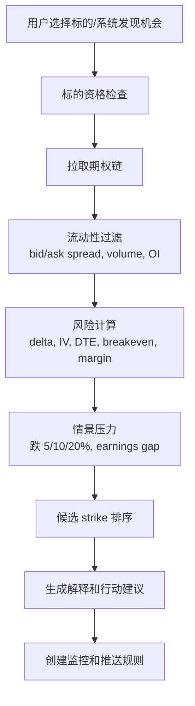

# 产品模块设计

## 产品拆分

3.0 建议拆成两个并行产品模块，共享账号、数据、推送、memory 和审计基础设施。

| 产品 | 核心用户问题 | 关键能力 |
| --- | --- | --- |
| 股票持仓产品 | 我现在持有什么，风险在哪，何时买/卖/复盘 | 机会捕捉、行情分析、个股分析、持仓分析、止盈止损、异动推送、历史复盘、二次买入 |
| 期权策略产品 | 哪些标的适合 sell put，卖哪个 strike，风险和资金占用如何 | 标的筛选、期权链分析、IV/Greeks、现金/保证金、assignment 风险、持仓监控、滚动/接股预案 |

## 持仓生命周期模块

3.0 的功能模块按最初要求分成持仓前、持仓中、持仓后，并分别落到三个账号级资产模块：

| 生命周期 | 账号资产模块 | 负责对象 |
| --- | --- | --- |
| 持仓前 | `follow_views` | 可能要买入、可能 sell put、等待研究、等待触发的投资标的 |
| 持仓中 | `portfolio_views` | 当前持仓、现金、ETF、期权仓位和多来源统一资产视图 |
| 持仓后 | `list_views` | 已清仓标的、历史持仓总结、复盘结论和二次买入策略 |
| 全生命周期 | `trading_rules` | 用户交易规则、风险偏好、操作纪律和违规检查记录 |

### 持仓前

| 模块 | 输入 | 输出 |
| --- | --- | --- |
| 机会捕捉 | 市场行情、板块、新闻、财报、用户 `follow_views`、`trading_rules` | 写入或更新 `follow_view_items`，包含候选机会、催化剂、风险标签、跟踪计划；不推荐违反纪律的标的 |
| 行情分析 | 指数、行业、成交量、波动率、宏观日历 | 更新关注清单的市场状态、风险偏好和策略适配标签 |
| 个股分析 | 基本面、技术面、估值、事件、持仓关联 | 更新 `follow_view_items.thesis`、买点区间、风险点和下一次复核时间 |
| 期权分析 | 标的、期权链、IV Rank、Greeks、流动性、财报日期 | 更新 sell put 候选、strike/到期日偏好、最大风险和资金占用 |

### 持仓中

| 模块 | 输入 | 输出 |
| --- | --- | --- |
| 持仓分析 | broker 持仓、手工交易、实时行情、`portfolio_views`、`trading_rules` | 盈亏、仓位、集中度、行业暴露、风险归因、纪律偏离 |
| 止盈止损策略 | 成本、技术指标、ATR/RSI、交易规则、历史回测 | 今日行动计划、观察价、止盈/减仓建议 |
| 异动推送 | 行情异动、新闻、财报、期权风险、券商成交 | 分级提醒、建议动作、数据来源 |
| 期权持仓监控 | short put 仓位、标的价格、DTE、delta、IV、保证金 | 滚动、平仓、接股、加仓/禁入提示 |

### 持仓后

| 模块 | 输入 | 输出 |
| --- | --- | --- |
| 历史持仓总结 | `list_views` 清仓清单、期间市场、执行记录、`discipline_checks` | 更新 `list_view_items.review_summary`、胜率、收益贡献、纪律评分、复盘报告 |
| 二次买入策略 | 历史买卖点、当前价格、基本面变化、用户偏好 | 更新 `list_view_items.rebuy_conditions`，必要时重新写入 `follow_view_items` |
| 期权 assignment 复盘 | 被指派记录、接股成本、后续表现 | 更新 `list_views`，沉淀 sell put 策略改进、标的黑白名单 |

## 账号资产模块字段重点

| 模块 | 主表 | 明细表 | 必备字段重点 |
| --- | --- | --- | --- |
| 关注清单 | `follow_views` | `follow_view_items` | `view_type`、`strategy_focus`、`symbol`、`target_action`、`thesis`、`target_buy_zone`、`sell_put_preferences`、`trigger_rules`、`risk_flags`、`next_review_at` |
| 当前资产视图 | `portfolio_views` | `portfolio_view_sources` | `view_type`、`base_currency`、`asset_source_id`、`include_mode`、`rules`、`weight` |
| 清仓回溯清单 | `list_views` | `list_view_items` | `list_type`、`symbol`、`opened_at`、`closed_at`、`realized_pnl`、`exit_reason`、`review_summary`、`rebuy_status`、`rebuy_conditions`、`data_lineage` |
| 交易规则与纪律 | `trading_rules` | `discipline_checks` | `rule_type`、`category`、`severity`、`override_allowed`、`rule_expression`、`action_type`、`triggered_rule_ids`、`result` |

这三个模块都属于 `tenant_id`。用户可以通过 WebApp 或微信 clawbot 查询和维护它们，但写入路径必须经过租户级工具层，记录 `tenant_id`、`channel_binding_id`、`openclaw_account_id`、操作来源和审计日志。

`trading_rules` 同样属于 `tenant_id`，但它不是资产清单，而是所有交易相关动作的纪律约束层。交易录入、交易草稿、关注清单升级、sell put 候选和推送前建议都要先经过规则检查。

## 持仓品种拆分

已确认：股票/ETF 和期权是两个不同交易品种，持仓分析内容必须区分。3.0 采用统一资产视图，但底层持仓明细和分析参数拆分：

| 层 | 股票/ETF | 期权 |
| --- | --- | --- |
| 持仓明细 | `equity_positions` | `option_positions` |
| 标的扩展 | `equity_instruments` | `option_contracts` |
| 交易扩展 | `equity_trade_details` | `option_trade_details` |
| 分析结果 | `equity_position_analysis` | `option_position_analysis` |
| 核心风险 | 仓位、行业、回撤、估值、趋势 | DTE、Greeks、IV、保证金、assignment、流动性 |

产品上用户可以看到统一资产总览；进入明细后必须分成股票/ETF持仓和期权持仓两个区域。完整字段设计见 `10-position-data-model.md`。

## 股票产品模块

### 股票机会卡

```json
{
  "symbol": "AAPL",
  "market": "US",
  "opportunity_type": "breakout | pullback | value | event",
  "thesis": "...",
  "catalysts": ["earnings", "sector momentum"],
  "risk_flags": ["valuation_high", "event_gap"],
  "entry_plan": {
    "watch_price": 180,
    "buy_zone": [170, 176],
    "invalid_below": 165
  },
  "data_freshness": {
    "quote_at": "2026-05-09T09:30:00Z",
    "fundamental_at": "2026-05-08"
  }
}
```

### 持仓分析卡

必须包含：

- 当前仓位和成本
- 当前行情与数据时点
- 浮盈浮亏
- 仓位集中度
- 风险标签
- 触发过的策略规则
- agent 建议与置信度
- 是否需要用户确认
- 命中的交易规则或纪律提醒

## 期权产品模块

### Sell Put 策略原则

期权模块第一阶段只做 sell put，不扩展复杂组合。核心是：**卖出用户愿意接股的标的，在可承受资金/保证金范围内，用可解释的 strike 和到期日选择规则控制风险。**

### Sell Put 分析流程



### Sell Put 必备数据

| 数据 | 用途 | 优先来源 |
| --- | --- | --- |
| 标的实时/延迟行情 | moneyness、breakeven、风险提示 | broker / Longbridge / Yahoo |
| 期权链 | strike、到期日、bid/ask、volume、OI | broker / Longbridge / OPRA 数据源 |
| Greeks | delta、theta、vega、gamma | broker 或自算 |
| IV/IV Rank | 判断权利金是否足够 | 数据源或自建历史分位 |
| 财报/除息/事件 | gap risk | 财报日历/新闻源 |
| 现金/保证金 | 是否能接股和资金占用 | broker production account |
| 用户标的偏好 | 是否愿意接股、黑名单 | account memory |
| 交易规则 | 禁买标的、DTE/delta/现金担保、财报窗口、盘前盘后限制 | `trading_rules` |

### Sell Put 输出模板

```json
{
  "underlying": "AAPL",
  "strategy": "cash_secured_put",
  "expiry": "2026-06-19",
  "strike": 170,
  "premium_mid": 2.35,
  "delta": -0.24,
  "breakeven": 167.65,
  "max_assignment_cash_required": 17000,
  "annualized_yield_estimate": 0.18,
  "liquidity_score": 0.82,
  "risk_level": "medium",
  "why_this_strike": [
    "delta in preferred range",
    "breakeven below recent support",
    "spread within liquidity threshold"
  ],
  "do_not_trade_if": [
    "earnings date before expiry and user has not approved event risk",
    "cash reserve below required threshold",
    "bid/ask spread widens above threshold"
  ]
}
```

### 风险边界

1. 不生成“保证收益”表述。
2. 不在没有现金/保证金数据时假设可交易。
3. 财报前 sell put 默认提高风险等级。
4. 深度虚值不等于低风险，必须看标的基本面和 gap risk。
5. 期权建议默认是分析建议，不是自动下单。

## WebApp 形态

WebApp 要移动端优先，第一屏不是营销页，而是账号可操作状态：

- 顶部账号切换器
- 当前总览：关注清单、当前资产、清仓回溯、当日风险、未读提醒
- 股票与期权 Tab
- 生命周期 Tab：关注/机会、持仓、清仓复盘
- 推送/任务状态
- 数据源和券商同步状态
- 绑定微信 claw、券商账号、通知策略

业务数据写入仍建议通过 agent 或确认流完成；WebApp 可写账户配置、绑定、通知偏好、watchlist、风险偏好。
