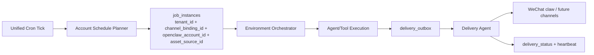
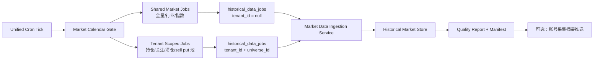
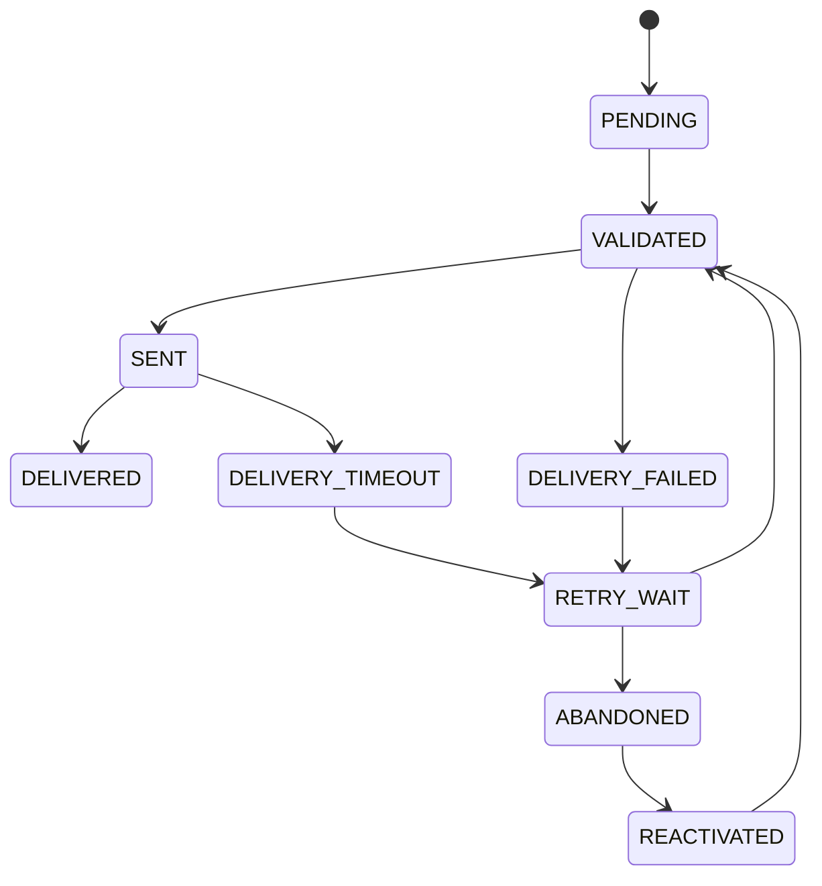
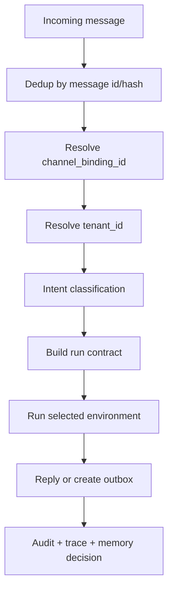

# Cron、推送与对话可靠性

## 分账号定时任务设计

2.0 已有 `task_definitions`、`job_runs`、`delivery_runs` 和 heartbeat 思路。3.0 需要把任务从“全局 cron”升级为“统一 cron 触发 + 分账号展开”。



## 任务定义

`task_definitions` 描述“做什么”，`account_task_subscriptions` 描述“哪个账号要做”，`job_runs` 描述“一次执行”。

```sql
account_task_subscriptions (
  id uuid primary key,
  tenant_id uuid not null,
  channel_binding_id uuid not null,
  openclaw_account_id text,
  task_definition_id uuid not null,
  timezone text not null,
  market_calendar text not null,
  enabled boolean not null,
  quiet_hours jsonb,
  push_policy jsonb,
  created_at timestamptz
);
```

每次统一 cron tick：

1. 根据市场日历和账号订阅找出应执行账号。
2. 为每个系统账号创建 `job_runs`，写入 `tenant_id/channel_binding_id/openclaw_account_id`，必要时写入 `asset_source_id` 或 `broker_connection_id`。
3. 生成 run contract，进入对应 agent 环境。
4. 所有输出先进入 outbox，不直接发送。
5. Delivery Agent 按 channel binding 投递。

## 历史行情采集任务

历史行情采集也是统一 cron 的一部分，但它不完全等同于分账号推送任务：



任务规则：

1. 平台共享采集任务可以不带 `tenant_id`，用于全量公共市场日线、交易日历、公司行动等共享数据。
2. 账号定向采集任务必须带 `tenant_id` 和 `universe_id`，范围来自当前持仓、关注清单、清仓列表、行业选择或 sell put 候选池。
3. 如果采集完成后需要推送摘要，才需要绑定 `channel_binding_id/openclaw_account_id`；纯数据采集不应依赖消息渠道成功率。
4. 每个采集任务必须有 `idempotency_key`，避免同一市场日重复写入。
5. 采集失败进入 repair/backfill 队列，不直接让 agent 用缺失数据生成回测结论。

## 推送准确率设计

每条推送必须包含：

| 字段 | 作用 |
| --- | --- |
| `tenant_id` | 防止 A 系统账号内容推给 B 系统账号 |
| `channel_binding_id` | 明确推送到哪个微信 claw bot |
| `openclaw_account_id` | 继承 `routing.json.accountId`，明确 OpenClaw bot |
| `asset_source_refs` | 标明推送内容来自哪些手工、消息、券商或派生数据 |
| `target_conversation` | 明确目标会话 |
| `context_token` | 当前可用会话 token |
| `content_snapshot_hash` | 防止补偿重试时内容漂移 |
| `idempotency_key` | 防重复 |
| `source_run_id` | 追溯 agent run |
| `data_snapshot_refs` | 追溯行情、持仓、券商同步数据 |

## 投递状态机



重试策略：

| 次数 | 间隔 | 动作 |
| --- | --- | --- |
| 1 | 30 秒 | 重新取最新 context token |
| 2 | 5 分钟 | 检查 channel binding 和会话活跃度 |
| 3 | 30 分钟 | 降级为摘要推送，避免重复长文 |
| 超过 | 停止 | 标记 `ABANDONED`，等用户主动消息重新激活 |

## 对话响应可靠性

| 失败点 | 用户体验 | 系统补偿 |
| --- | --- | --- |
| 行情源失败 | 明确提示数据源不可用，给出最近缓存时间 | 自动 fallback，标注 stale |
| 券商同步失败 | 不生成高置信持仓建议 | 重试同步，创建 reconcile task |
| 模型超时 | 返回“正在继续分析”，稍后推送结果 | 后台 continuation job |
| 工具权限不足 | 告知需要绑定或授权 | 生成绑定/授权入口 |
| 账号不明确 | 要求用户选择账号 | 不读取任何持仓 memory |
| 推送失败 | 不在用户侧重复刷屏 | outbox 重试和 heartbeat 补偿 |
| 深研报告部分失败 | 输出已完成部分和缺失数据 | 可重新运行失败 step |

## 入站消息处理



关键规则：

1. 无法识别账号时，只允许解释“请先选择/绑定账号”，不读取持仓。
2. 一个系统账号可以绑定一个或多个 channel；同一个微信 claw bot 是否允许绑定多个系统账号仍需产品确认。
3. 如果未来允许同一微信 bot 切换多个系统账号，切换必须有可见确认：“已切换到某某账号”。
4. 所有自然语言交易录入必须返回确认摘要。
5. 对话 memory 写入必须在回复后异步执行，不阻塞用户响应。

## 可观测性指标

| 指标 | 目标 |
| --- | --- |
| `message_ingress_success_rate` | 入站消息成功解析率 |
| `account_resolution_failure_rate` | 账号识别失败率 |
| `job_success_rate_by_account` | 分账号任务成功率 |
| `delivery_success_rate_by_channel` | 各渠道推送成功率 |
| `delivery_duplicate_count` | 重复推送数量 |
| `broker_sync_freshness_seconds` | 券商同步新鲜度 |
| `market_data_fallback_rate` | 数据源 fallback 比例 |
| `agent_tool_error_rate` | agent 工具错误率 |
| `model_escalation_rate` | 从 MiniMax 升级到 GPT-5.5 的比例 |
| `memory_cross_account_violation` | 必须为 0 |

## 错误补偿原则

1. 优先补偿数据和推送，不补偿模型自由发挥。
2. 重试必须幂等。
3. 失败消息要保留原因，不能只写 unknown error。
4. 数据过期时可以回答，但必须醒目标注。
5. 对资金/期权风险敏感的建议，在关键数据缺失时必须降级。

## 参考

- [OpenTelemetry GenAI semantic conventions](https://opentelemetry.io/docs/specs/semconv/gen-ai/)
- [LangGraph persistence](https://docs.langchain.com/oss/python/langgraph/persistence)
- [OpenClaw agent routing](https://github.com/openclaw/openclaw/blob/main/docs/cli/agents.md)
