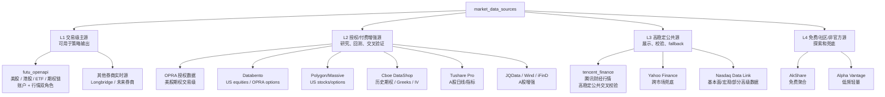
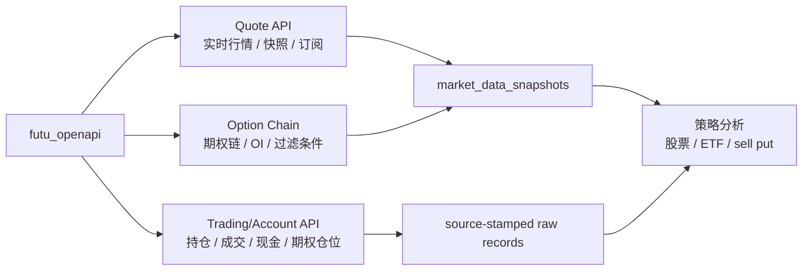

# Market Data Sources 设计

## 当前确认决策

1. **美股、港股、ETF 和期权链以富途为主源。** 用户已有富途账号，因此富途 OpenAPI 同时承担两类角色：
   - `broker_connection`：读取真实持仓、成交、现金、保证金、期权仓位。
   - `market_data_source`：读取美港股行情、ETF 行情、期权链、市场快照和订阅行情。
2. **腾讯财经纳入稳定性较高的公共行情交叉校验源。** 2.0 分析经验显示腾讯财经数据稳定性高，因此 3.0 应设计 `tencent_finance` adapter；但在没有明确授权/官方 SLA 前，它不应单独驱动交易级策略，只用于展示、交叉校验、fallback 和异常检测。
3. **策略输出必须通过 freshness gate。** 数据不新鲜、来源等级不足、关键字段缺失时，输出降级为“观察分析”，不能给出明确买入/卖出/sell put 候选。

## 2.0 已有市场分析能力

| 能力 | 已有 API / Skill | 已有数据源 |
| --- | --- | --- |
| 单票行情 | `GET /api/quote/{symbol}` | Yahoo、Tushare、AkShare、Longbridge |
| 批量行情 | `POST /api/quote/batch` | 同上，Redis cache |
| 标的搜索 | `GET /api/search` | Yahoo 优先，本地 `symbol_registry` 兜底 |
| 代码解析 | `GET /api/resolve/{user_input}` | `symbol_registry` |
| 数据源健康 | `GET /api/health/sources` | yahoo/tushare/akshare/longbridge |
| 日终分析 | `daily-analysis` skill | 持仓 + 行情 + AI 总结 |
| 机会捕捉 | `opportunity-hunter` skill | market scanner / sector hunter / leader selector |
| 止盈计划 | `profit-taking` skill | 行情 + ATR/RSI/均线 + 回测摘要 |
| 周报 | `weekly-report` skill | 历史交易 + 行情/复盘 |

2.0 的缺口：数据源没有形成“交易级主源、交叉校验源、研究源、免费兜底源”的等级；部分行情源只有日线或非官方接口，不适合直接参与实时策略决策。

## 市场分析源分层



## 3.0 首选路由

| 市场/品种 | 主源 | 二级校验 | 兜底 | 策略输出规则 |
| --- | --- | --- | --- | --- |
| 港股正股/ETF | 富途 OpenAPI | 腾讯财经、Longbridge | Yahoo/AkShare | 富途实时可用才允许交易级建议 |
| 美股正股/ETF | 富途 OpenAPI | Polygon/Databento/Tencent 财经（如覆盖） | Yahoo/Alpha Vantage | 富途行情新鲜且交易时段一致才允许交易级建议 |
| 美股期权链 | 富途 OpenAPI 期权链 | OPRA/Databento/Polygon/Cboe | 无可靠免费兜底 | 缺 bid/ask、volume、OI、IV/Greeks、DTE 任一关键项时降级 |
| 港股期权/窝轮等衍生品 | 富途 OpenAPI | HKEX/Longbridge（如覆盖） | 不建议兜底 | 首版只做观察，交易级策略需另行确认 |
| A股正股/ETF | Tushare/JQData/券商实时源 | 腾讯财经、AkShare | Yahoo | Tushare daily 只适合日终，不适合盘中策略 |
| 新闻/财报/事件 | 官方公告、SEC、交易所、付费新闻源 | Finnhub/Nasdaq Data Link | 免费新闻 | 事件数据必须带发布时间和来源 |

## MarketDataSource 字段

```sql
market_data_sources (
  id uuid primary key,
  source_key text not null unique, -- futu_openapi, tencent_finance, tushare, yahoo
  source_name text not null,
  source_tier text not null, -- L1_trading, L2_paid, L3_public_stable, L4_free_fallback
  provider_type text not null, -- broker, exchange, paid_vendor, public_aggregate, community
  markets text[] not null, -- US, HK, A
  instruments text[] not null, -- stock, etf, option, index, news, fundamental
  supports_realtime boolean not null default false,
  supports_streaming boolean not null default false,
  supports_options_chain boolean not null default false,
  supports_greeks boolean not null default false,
  supports_open_interest boolean not null default false,
  supports_volume boolean not null default false,
  entitlement_required boolean not null default false,
  official_sla boolean not null default false,
  max_strategy_staleness_seconds integer,
  default_cache_ttl_seconds integer,
  fallback_allowed boolean not null default true,
  can_drive_trade_strategy boolean not null default false,
  status text not null default 'active',
  created_at timestamptz,
  updated_at timestamptz
);
```

## MarketDataSnapshot 字段

所有进入分析和策略的行情数据都要落标准化快照：

```sql
market_data_snapshots (
  id uuid primary key,
  tenant_id uuid,
  source_key text not null,
  symbol text not null,
  market text not null,
  instrument_type text not null,
  data_kind text not null, -- quote, bar, option_chain, news, fundamental, event
  as_of timestamptz not null,
  received_at timestamptz not null,
  freshness_seconds integer not null,
  delay_seconds integer,
  is_realtime boolean not null default false,
  source_tier text not null,
  confidence_score numeric,
  payload jsonb not null,
  missing_fields text[],
  fallback_used boolean not null default false,
  cross_check_status text, -- matched, mismatch, unchecked
  lineage jsonb not null default '{}'
);
```

## Freshness Gate

| 场景 | 主源要求 | 最大新鲜度 | 不满足时 |
| --- | --- | --- | --- |
| 微信即时问“现在能不能买” | L1 交易级源 | 30-60 秒 | 降级为观察，不给明确动作 |
| 盘中异动推送 | L1 交易级源 + L3 交叉校验 | 30-120 秒 | 延迟推送或标注低置信 |
| 日终复盘 | L1/L2 日线或收盘数据 | 当日收盘后数据 | 可使用 Tushare/Tencent/Yahoo，但标注来源 |
| sell put 候选 | L1 期权链 + 账户现金/保证金 | 30-60 秒 | 不输出可执行候选 |
| 历史回测 | L2/L3 历史数据 | 可离线 | 标注数据供应商和复权口径 |

## 历史行情仓库接口

实时行情源和历史行情仓库需要分工：

| 能力 | 使用对象 | 数据路径 |
| --- | --- | --- |
| 当前价格、盘中异动、即时交易判断 | `market_data_snapshots` + freshness gate | 直接查富途主源，腾讯财经等交叉校验 |
| 历史回测、清仓复盘、二次买入策略 | `historical_data_manifests` + Historical Store | 优先读取本地/云端已保存 Parquet；缺口再补拉 |
| 日终分析 | 当日收盘行情 + 历史仓库 | 收盘后写入历史仓库，再生成复盘 |
| sell put 历史统计 | 标的历史行情 + 期权链快照/付费期权历史 | 首期保存候选池快照，未来接付费 OPRA 级历史 |

原则：

1. 已通过质量检查的历史数据优先于临时外部查询。
2. 历史库只提供回测和复盘的事实基础，不替代实时策略的 freshness gate。
3. 富途、Tushare、腾讯财经等来源写入历史库时必须保留 `source_key`、`as_of`、`adjustment`、`schema_version` 和 `quality_status`。
4. 完整设计见 `09-historical-market-data-store.md`。

## 富途主源设计

富途在 3.0 中既是 `broker_connection`，也是 `market_data_source`。



富途数据用于：

- 港美股实时行情。
- 港美 ETF 行情。
- 美股期权链和 sell put 相关字段。
- 账户现金、保证金、持仓、期权仓位。
- 和腾讯财经、Longbridge/Yahoo 做行情交叉校验。

## 腾讯财经定位

腾讯财经在 3.0 中建议以 `source_key=tencent_finance` 纳入：

| 用途 | 是否允许 |
| --- | --- |
| 行情展示 | 允许 |
| 富途异常时的交叉校验 | 允许 |
| 日终复盘补充 | 允许 |
| 盘中交易级策略主源 | 暂不允许 |
| sell put 可执行建议主源 | 不允许 |

原因：你确认它在 2.0 分析中稳定性高，值得纳入；但如果使用的是非官方公共接口或没有明确授权/SLA，就应该保持在 L3，不作为最终交易级依据。

## 策略输出硬规则

1. 策略输出必须展示 `source_key`、`as_of`、`freshness_seconds`、`source_tier`。
2. 使用 L3/L4 fallback 时，必须在用户可见输出中标注“非交易级/可能延迟”。
3. 对富途主源和腾讯财经校验不一致的行情，进入 `cross_check_status=mismatch`，策略降级。
4. sell put 策略必须同时满足：富途/OPRA 期权链新鲜、标的行情新鲜、账户现金/保证金新鲜。
5. 数据源健康状态影响 agent 工具权限：源不健康时，相关工具只能输出观察报告，不能输出明确行动建议。

## 参考

- [Futu OpenAPI Quote Overview](https://openapi.futunn.com/futu-api-doc/en/quote/overview.html)
- [Futu OpenAPI Real-time Quote](https://openapi.futunn.com/futu-api-doc/en/quote/get-stock-quote.html)
- [Futu OpenAPI Option Chain](https://openapi.futunn.com/futu-api-doc/en/quote/get-option-chain.html)
- [Longbridge Quote Subscribe](https://open.longbridge.com/docs/socket/subscribe_quote)
- [Tushare daily](https://tushare.pro/document/1?doc_id=108)
- [Databento Docs](https://databento.com/docs/quickstart)
- [Polygon Options Docs](https://www.polygon.io/docs/options)
- [Cboe DataShop Documentation](https://datashop.cboe.com/documentation)
