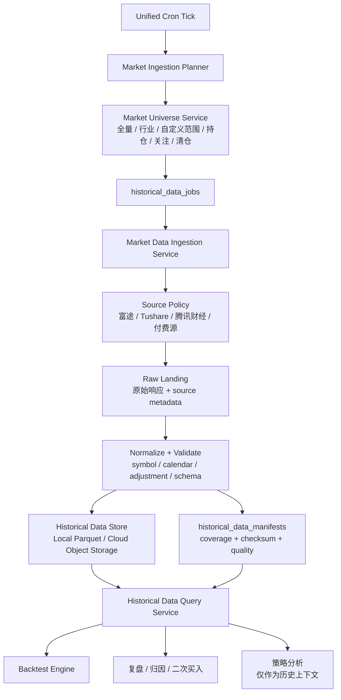
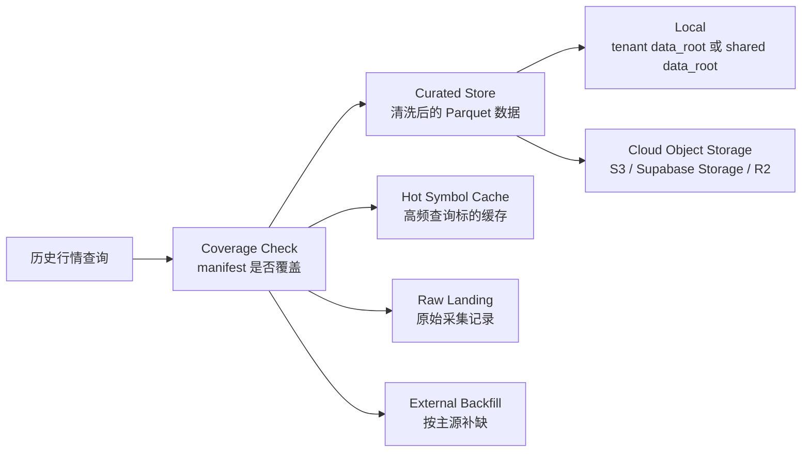
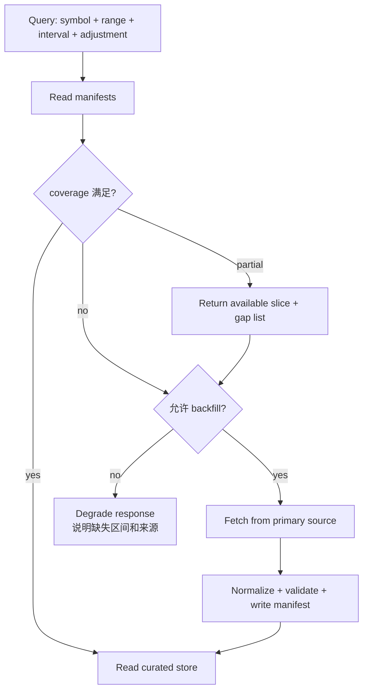

# Historical Market Data Store 设计

## 设计目标

3.0 需要把行情数据从“实时查询 + 短缓存”升级为“可回测、可复盘、可审计的历史行情仓库”。核心目标：

1. 每个交易日按市场日历拉取全量市场、指定行业、指定范围、账号持仓、关注清单或清仓列表相关标的数据。
2. 数据可以保存到本地 `data_root`，也可以保存到云端对象存储。
3. 后续查询历史行情时，优先查询已保存的可信存储数据；缺口再按数据源策略补拉。
4. 回测、复盘和策略归因必须使用带来源、复权口径、覆盖范围和质量报告的数据，不直接依赖临时实时接口。
5. 当前实时策略仍然必须经过 freshness gate；历史库不能替代实时行情主源。

## 总体架构



在 `data-service` 里建议新增五个明确边界：

| 模块 | 责任 |
| --- | --- |
| `MarketUniverseService` | 管理全量市场、行业、指数成分、账号持仓、关注清单、清仓列表、sell put 候选池等采集范围 |
| `MarketDataIngestionService` | 按计划从源头拉取日线、分钟线、期权链快照、复权因子、公司行动等数据 |
| `HistoricalDataStore` | 屏蔽本地和云端存储差异，提供写入、覆盖检查、checksum、manifest 查询 |
| `HistoricalDataQueryService` | 统一历史查询入口，优先读已保存数据，缺口按策略补拉或降级 |
| `BacktestDataService` | 给回测和复盘提供稳定数据切片，不让 agent 直接拼接行情源 |

## 存储分层



推荐第一阶段采用 **Parquet + manifest metadata**：

- 行情明细数据保存为 Parquet，适合本地和对象存储，便于 DuckDB/Polars/Pandas 查询。
- 覆盖范围、数据质量、schema 版本、checksum、数据源和写入 run 记录保存到 Postgres。
- 小规模单机部署可以只启用本地 `data_root`；多账号云端部署启用对象存储。

公共历史行情属于市场公共数据，可以进入共享历史库；账号持仓、券商成交、现金、保证金、对话 memory 仍然必须按 `tenant_id` 隔离。账号只保存自己的采集订阅、查询审计和私有标的范围，不重复保存一份公共 K 线。

## 数据类型

| `data_kind` | 内容 | 首选来源 | 存储策略 |
| --- | --- | --- | --- |
| `bar_1d` | 日 K、成交量、成交额 | 富途美港股、Tushare/JQData A股、腾讯财经校验 | 每交易日收盘后批量保存 |
| `bar_1m` / `bar_5m` | 分钟 K | 富途或付费源 | 仅对持仓、关注、策略池或付费范围采集 |
| `quote_snapshot` | 收盘快照、盘中关键快照 | 富途主源、腾讯财经校验 | 用于异动复盘，不作为完整 tick 历史 |
| `option_chain_snapshot` | 期权链、bid/ask、volume、OI、IV、Greeks | 富途当前链，未来 OPRA/Databento/Polygon/Cboe | 首期保存持仓、关注、sell put 候选标的；全市场期权历史需付费源 |
| `corporate_actions` | 分红、拆股、合股、除权除息 | 交易所/券商/付费源 | 影响复权和长期回测，必须单独存 |
| `symbol_master` | 标的主数据、交易所、币种、行业 | symbol registry + 数据源同步 | 全局共享，支持行业/范围采集 |
| `trading_calendar` | 市场交易日、半日市、假期 | 交易所/数据源 | 所有 cron 和回测的基础 |

期权历史要单独注意：完整 OPRA 级期权历史数据规模和授权成本很高。3.0 首期建议保存“账号相关 + sell put 候选池”的期权链快照；如果后续要做全市场期权回测，再接入 OPRA/Databento/Polygon/Cboe 这类付费历史源。

## Universe 设计

```sql
market_universes (
  id uuid primary key,
  tenant_id uuid, -- null 表示平台共享 universe
  universe_key text not null,
  universe_name text not null,
  universe_type text not null, -- full_market, index, industry, custom_symbols, portfolio_view, follow_view, list_view, sell_put_pool
  market text not null, -- US, HK, A
  instrument_types text[] not null, -- stock, etf, option, index
  source_policy jsonb not null,
  refresh_policy jsonb not null,
  enabled boolean not null default true,
  created_at timestamptz,
  updated_at timestamptz
);

market_universe_members (
  id uuid primary key,
  universe_id uuid not null,
  tenant_id uuid, -- 继承 universe；共享 universe 可为空
  symbol text not null,
  market text not null,
  instrument_type text not null,
  industry text,
  sector text,
  source_ref jsonb,
  valid_from date,
  valid_to date,
  status text not null default 'active'
);
```

典型 universe：

| Universe | 用途 |
| --- | --- |
| `US_full_stock_etf` | 美股正股和 ETF 日线全量采集 |
| `HK_full_stock_etf` | 港股正股和 ETF 日线全量采集 |
| `A_full_stock_etf` | A 股正股和 ETF 日线全量采集 |
| `tenant_portfolio_symbols` | 某个 `tenant_id` 当前持仓相关标的 |
| `tenant_follow_symbols` | 某个 `tenant_id` 关注清单和候选标的 |
| `tenant_closed_symbols` | 某个 `tenant_id` 已清仓标的，用于复盘 |
| `sell_put_pool` | 期权 sell put 候选标的，采集标的行情和期权链快照 |
| `industry_range` | 指定行业、板块、指数成分或自定义范围 |

## 采集任务表

```sql
historical_data_jobs (
  id uuid primary key,
  tenant_id uuid, -- null 表示平台共享采集任务
  universe_id uuid not null,
  job_type text not null, -- daily_ingest, backfill, repair, resample, quality_check
  market text not null,
  data_kinds text[] not null,
  interval text not null, -- 1d, 1m, 5m, snapshot
  date_from date not null,
  date_to date not null,
  source_key text not null,
  storage_backend text not null, -- local, s3, supabase_storage, r2
  storage_root text not null,
  adjustment text not null default 'raw', -- raw, qfq, hfq, split_adjusted
  status text not null, -- pending, running, succeeded, partial, failed
  symbols_requested integer,
  symbols_succeeded integer,
  symbols_failed integer,
  missing_symbols text[],
  error_summary jsonb,
  created_by text not null, -- system_cron, user_request, repair_job
  started_at timestamptz,
  finished_at timestamptz,
  created_at timestamptz
);

historical_data_manifests (
  id uuid primary key,
  tenant_id uuid, -- null 表示共享公共数据
  universe_id uuid,
  job_id uuid not null,
  source_key text not null,
  market text not null,
  symbol text,
  instrument_type text not null,
  data_kind text not null,
  interval text not null,
  adjustment text not null,
  coverage_start date not null,
  coverage_end date not null,
  trading_days_expected integer,
  trading_days_available integer,
  missing_trading_days date[],
  storage_backend text not null,
  storage_uri text not null,
  row_count bigint,
  schema_version text not null,
  checksum text,
  quality_status text not null, -- validated, partial, stale, failed
  quality_report jsonb,
  created_at timestamptz,
  updated_at timestamptz
);
```

## 文件路径约定

本地存储建议继承 `routing.json.dataRoot`，公共市场数据可放在共享根目录，账号私有范围放在 `tenant_id` 下：

```text
{shared_data_root}/market-data/curated/
  source=futu_openapi/
  market=US/
  instrument=stock/
  data_kind=bar_1d/
  interval=1d/
  adjustment=raw/
  year=2026/
  month=05/
  part-000.parquet

{data_root}/{tenant_id}/market-data/private/
  universe=tenant_follow_symbols/
  source=futu_openapi/
  data_kind=option_chain_snapshot/
  date=2026-05-09/
  part-000.parquet
```

说明：

1. `shared_data_root` 保存可共享公共行情。
2. `data_root/{tenant_id}` 保存账号私有采集范围、查询审计和由券商账户派生的非公共数据。
3. Parquet 分区优先服务批量回测；高频单标的查询可以生成 hot symbol cache。
4. 所有文件都必须有 manifest；没有 manifest 的文件不能作为回测可信输入。

## 查询优先级



查询规则：

1. 回测和复盘默认只使用 `quality_status=validated` 的历史数据。
2. 如果用户查询的区间已有完整覆盖，禁止绕过本地/云端存储直接打外部源。
3. 如果缺少部分交易日，返回可用数据和 `missing_trading_days`，可异步触发 repair/backfill。
4. 如果使用 fallback 数据补缺，manifest 必须记录 `fallback_used=true` 和来源等级。
5. 实时买卖建议仍以 `market_data_snapshots` + freshness gate 为准，历史库只提供背景和统计。

## API 草案

| API | 用途 |
| --- | --- |
| `POST /api/market/universes` | 创建全量、行业、自定义、账号持仓/关注/清仓 universe |
| `GET /api/market/universes` | 查询可用采集范围 |
| `POST /api/market/history/ingest` | 触发历史数据采集 |
| `POST /api/market/history/backfill` | 对缺失区间补拉 |
| `POST /api/market/history/repair` | 对质量失败或 checksum 异常的数据重采 |
| `GET /api/market/history/{market}/{symbol}` | 查询单标的历史行情 |
| `POST /api/market/history/batch-query` | 批量查询标的历史行情 |
| `GET /api/market/history/coverage` | 查询某个范围的数据覆盖和缺口 |
| `GET /api/market/history/jobs/{job_id}` | 查看采集任务状态 |

API 默认要求 `tenant_id` 进入 run contract；查询共享公共行情时也要记录请求账号，用于审计、成本归因和权限控制。

## Cron 接入

每日任务分两类：

| 任务 | 范围 | 时间 |
| --- | --- | --- |
| 平台共享日线采集 | 全量市场、指数成分、行业范围 | 对应市场收盘后，等待数据源稳定窗口 |
| 账号定向采集 | 当前持仓、关注清单、清仓列表、sell put 候选池 | 收盘后 + 用户自定义补充窗口 |
| 期权链快照采集 | 持仓期权、sell put 候选标的 | 盘中关键时点和收盘后，首期不做全市场 |
| 质量检查 | 当日写入的数据 | 采集完成后立即执行 |
| Repair/backfill | 缺失或异常数据 | 非交易高峰期执行 |

统一 cron tick 仍然只负责触发，实际执行要展开为 `historical_data_jobs`，并写入 `tenant_id`、`universe_id`、`source_key`、`storage_backend`、`date_range` 和 `idempotency_key`。

## 回测和复盘使用方式

| 场景 | 数据输入 |
| --- | --- |
| 止盈止损策略回测 | 持仓期间 `bar_1d`、ATR/RSI/均线计算、交易事件、纪律检查 |
| 清仓复盘 | `list_view_items` + 持有期行情 + 同行业/指数对比 + 实际交易事件 |
| 二次买入策略 | 清仓后走势、触发条件命中、基本面/事件变化 |
| sell put 回测 | 标的历史波动、期权链快照或付费期权历史、assignment 情况、现金占用 |
| 机会捕捉 | 行业 universe 历史表现、相对强弱、成交量放大、趋势切换 |

Agent 不能直接把外部源临时返回的数据当作回测事实。正确路径是：查询历史库 coverage；如果缺数据，触发补拉；补拉完成并通过质量检查后，再生成回测结论。

## 开发前已确认

1. 历史行情存储云端对象存储优先；P0 使用 Supabase Storage，本地研发用 MinIO。
2. P0 先保存持仓、关注清单、Sell Put 候选池相关标的，暂不做全市场分钟线。
3. 分钟线优先覆盖持仓和关注清单，避免 P0 成本和容量失控。
4. 期权链历史 P0 保存持仓相关、关注标的、Sell Put 候选池快照；全市场 OPRA 级历史放 P1/P2，并依赖付费源。
5. 回测引擎 P0 做轻量指标/规则回测，不做完整撮合、滑点、手续费、保证金仿真。
