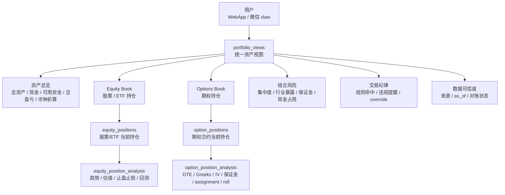
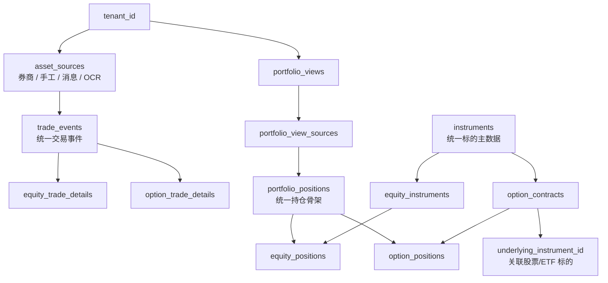

# 持仓数据模型设计

## 核心结论

股票/ETF 和期权是两个不同交易品种，3.0 必须在持仓数据设计阶段就区分开。推荐模型是：

**统一资产视图 + 统一持仓骨架 + 股票/ETF 与期权各自扩展表 + 各自分析模型。**

这样用户可以看到统一总览，但系统不会用股票参数去分析期权，也不会把期权风险压扁成普通盈亏。

## 用户看到的持仓结构



用户界面可以统一展示总资产，但持仓明细应该至少分成：

| 区块 | 用户看到的核心信息 |
| --- | --- |
| 股票/ETF | 数量、成本、现价、市值、浮盈浮亏、仓位占比、行业、止盈止损状态 |
| 期权 | 合约、方向、strike、expiry、DTE、权利金、mark price、IV、Greeks、保证金/现金占用、assignment 风险 |
| 现金与保证金 | 分币种现金、可用资金、期权占用、cash secured put 预留现金 |
| 组合风险 | 市场暴露、行业集中度、单票集中度、到期风险、规则违背 |

## 数据表分层



### 统一标的主数据

```sql
instruments (
  id uuid primary key,
  symbol text not null,
  provider_symbol text,
  market text not null, -- US, HK, A
  exchange text,
  currency text not null,
  instrument_type text not null, -- stock, etf, option_contract, index
  name text,
  status text not null default 'active',
  created_at timestamptz,
  updated_at timestamptz,
  unique(market, symbol, instrument_type)
);
```

### 股票/ETF 标的扩展

```sql
equity_instruments (
  instrument_id uuid primary key,
  tenant_id uuid, -- null 表示公共标的信息
  equity_type text not null, -- stock, etf, reit, adr
  sector text,
  industry text,
  country text,
  lot_size numeric,
  is_marginable boolean,
  is_shortable boolean,
  dividend_policy jsonb,
  fundamentals_ref jsonb,
  created_at timestamptz,
  updated_at timestamptz
);
```

### 期权合约扩展

```sql
option_contracts (
  instrument_id uuid primary key,
  underlying_instrument_id uuid not null,
  option_type text not null, -- call, put
  exercise_style text, -- american, european
  settlement_type text, -- physical, cash
  expiry_date date not null,
  strike numeric not null,
  contract_multiplier numeric not null default 100,
  contract_symbol text not null,
  deliverable jsonb,
  created_at timestamptz,
  updated_at timestamptz,
  unique(contract_symbol)
);
```

期权合约必须通过 `underlying_instrument_id` 关联底层股票/ETF。Sell put 分析时，不能只看期权合约本身，还要拉取底层标的行情、财报、历史波动和用户是否愿意接股。

## 当前持仓骨架

`portfolio_positions` 保存“当前资产视图里的一个持仓行”的通用字段。它只放股票和期权都能共用的字段。

```sql
portfolio_positions (
  id uuid primary key,
  tenant_id uuid not null,
  portfolio_view_id uuid not null,
  instrument_id uuid not null,
  instrument_type text not null, -- stock, etf, option_contract
  position_status text not null, -- open, closing, closed, stale, disputed
  quantity numeric not null,
  average_cost numeric,
  cost_basis numeric,
  market_price numeric,
  market_value numeric,
  currency text not null,
  unrealized_pnl numeric,
  realized_pnl numeric,
  pnl_percent numeric,
  source_quality text, -- broker_verified, user_confirmed, estimated, conflicted
  as_of timestamptz not null,
  source_lineage jsonb not null default '[]',
  reconciliation_status text, -- matched, mismatch, unverified
  created_at timestamptz,
  updated_at timestamptz
);
```

不要把 `strike`、`expiry`、`delta`、`sector`、`dividend_yield` 等字段塞进这张表。它是统一索引和展示骨架，不是全品种大杂烩。

## 股票/ETF 持仓扩展

```sql
equity_positions (
  position_id uuid primary key,
  tenant_id uuid not null,
  instrument_id uuid not null,
  shares numeric not null,
  avg_buy_price numeric,
  latest_price numeric,
  market_value numeric,
  portfolio_weight numeric,
  sector text,
  industry text,
  beta numeric,
  dividend_yield numeric,
  next_earnings_date date,
  stop_loss_price numeric,
  take_profit_plan jsonb,
  technical_snapshot jsonb,
  fundamental_snapshot jsonb,
  created_at timestamptz,
  updated_at timestamptz
);
```

股票/ETF 的核心评估参数：

| 参数 | 用途 |
| --- | --- |
| 成本、现价、市值、仓位占比 | 判断当前仓位和盈亏 |
| 行业、主题、市场、币种 | 组合暴露和集中度 |
| ATR、RSI、均线、支撑压力 | 止盈止损和趋势判断 |
| 估值、财报、分红、基本面 | 中长期持仓质量 |
| 回撤、波动率、相对强弱 | 风险和机会判断 |
| 交易纪律命中 | 是否违反“不买中概股”等规则 |

## 期权持仓扩展

```sql
option_positions (
  position_id uuid primary key,
  tenant_id uuid not null,
  option_contract_instrument_id uuid not null,
  underlying_instrument_id uuid not null,
  option_strategy text, -- single_leg, cash_secured_put, covered_call, spread
  position_side text not null, -- long, short
  option_type text not null, -- call, put
  contracts numeric not null,
  contract_multiplier numeric not null default 100,
  strike numeric not null,
  expiry_date date not null,
  dte integer,
  avg_premium numeric,
  mark_price numeric,
  bid numeric,
  ask numeric,
  implied_volatility numeric,
  delta numeric,
  gamma numeric,
  theta numeric,
  vega numeric,
  open_interest numeric,
  volume numeric,
  underlying_price numeric,
  moneyness text, -- itm, atm, otm
  breakeven_price numeric,
  margin_required numeric,
  cash_secured_amount numeric,
  assignment_risk text, -- low, medium, high
  assignment_intent text, -- willing_to_take, avoid_assignment, unknown
  roll_plan jsonb,
  event_risk jsonb,
  created_at timestamptz,
  updated_at timestamptz
);
```

期权，尤其 sell put 的核心评估参数：

| 参数 | 用途 |
| --- | --- |
| Long/Short、Call/Put、strike、expiry、DTE | 判断合约本质和到期风险 |
| premium、mark price、bid/ask spread | 判断当前盈亏和流动性 |
| IV、Delta、Theta、Gamma、Vega | 判断风险暴露和权利金质量 |
| underlying price、moneyness、breakeven | 判断被指派和安全边际 |
| margin_required、cash_secured_amount | 判断资金占用和是否 cash secured |
| earnings/dividend/event risk | 判断跳空和提前行权风险 |
| assignment_intent | 用户是否愿意按 strike 接股 |
| roll_plan | 到期前如何滚动、平仓或接股 |

Sell put 不应只按收益率排序，必须同时通过：

1. 用户是否愿意接股。
2. 现金/保证金是否足够。
3. DTE、delta、IV、流动性是否在规则范围内。
4. 财报/除息/重大事件是否在到期前。
5. `trading_rules` 是否允许该标的和该交易时间。

## 分析结果表

股票和期权的分析结果也建议分开保存。

```sql
equity_position_analysis (
  id uuid primary key,
  tenant_id uuid not null,
  position_id uuid not null,
  analysis_type text not null, -- daily_review, stop_plan, rebalance, earnings_review
  trend_score numeric,
  valuation_score numeric,
  risk_score numeric,
  stop_loss_suggestion jsonb,
  take_profit_suggestion jsonb,
  historical_backtest_ref jsonb,
  triggered_rule_ids uuid[],
  output_summary text,
  created_at timestamptz
);

option_position_analysis (
  id uuid primary key,
  tenant_id uuid not null,
  position_id uuid not null,
  analysis_type text not null, -- daily_review, sell_put_monitor, roll_decision, expiry_risk
  liquidity_score numeric,
  iv_score numeric,
  assignment_risk_score numeric,
  margin_risk_score numeric,
  roll_suggestion jsonb,
  close_suggestion jsonb,
  assignment_plan jsonb,
  triggered_rule_ids uuid[],
  output_summary text,
  created_at timestamptz
);
```

## 交易事件扩展

`trade_events` 保持统一事件流，方便对账、审计、成本重建；但品种细节分到扩展表。

```sql
trade_events (
  id uuid primary key,
  tenant_id uuid not null,
  asset_source_id uuid not null,
  instrument_id uuid not null,
  instrument_type text not null, -- stock, etf, option_contract
  trade_action text not null, -- buy, sell, sell_to_open, buy_to_close, assignment, expiry
  quantity numeric not null,
  price numeric,
  fees numeric,
  currency text not null,
  trade_time timestamptz not null,
  source_lineage jsonb not null default '[]',
  confirmation_status text not null, -- pending, confirmed, disputed
  created_at timestamptz
);

equity_trade_details (
  trade_event_id uuid primary key,
  shares numeric not null,
  order_type text,
  lot_info jsonb
);

option_trade_details (
  trade_event_id uuid primary key,
  contracts numeric not null,
  premium numeric,
  option_strategy text,
  open_close text, -- open, close, assignment, expiry
  underlying_price_at_trade numeric,
  iv_at_trade numeric,
  delta_at_trade numeric,
  margin_required_at_trade numeric
);
```

## 产品与工具边界

| 边界 | 规则 |
| --- | --- |
| WebApp 展示 | 总览统一，明细按股票/ETF和期权分区 |
| Agent 工具 | Equity Agent 调股票分析工具；Options Agent 调期权分析工具 |
| 回测 | 股票回测和期权回测使用不同参数，不共用简化收益率模型 |
| 风控 | 股票看仓位、行业、回撤、估值；期权看 DTE、Greeks、保证金、assignment |
| 对账 | 券商同步优先，手工/OCR/消息需要确认后进入持仓重建 |
| 纪律规则 | `trading_rules.scope` 必须支持 `stock`、`etf`、`option`、`sell_put` |

## 开发前已确认

1. ETF 首期归入 Equity Product，不单独做 ETF 产品模块。
2. 期权 P0 只支持 single-leg cash-secured Sell Put；covered call / spread 仅保留数据和导航扩展点，不做完整 UI。
3. 已连接券商时优先使用券商返回的保证金/现金占用；未连接券商系统时以内置估算器为主，估算数据必须提示“仅供参考”，不伪装为券商确认口径。
4. Dashboard/持仓总览中拆开展示期权市值、现金担保/保证金占用、可用现金，不混成单一“总资产”。
