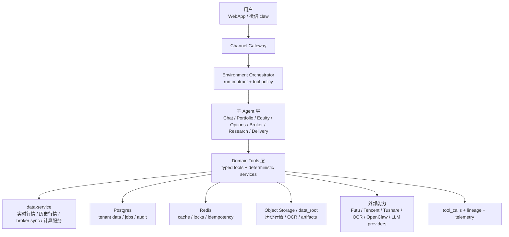
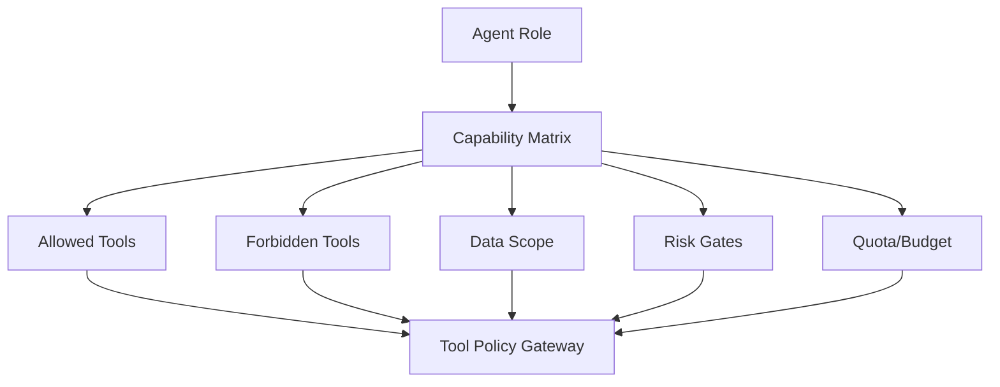
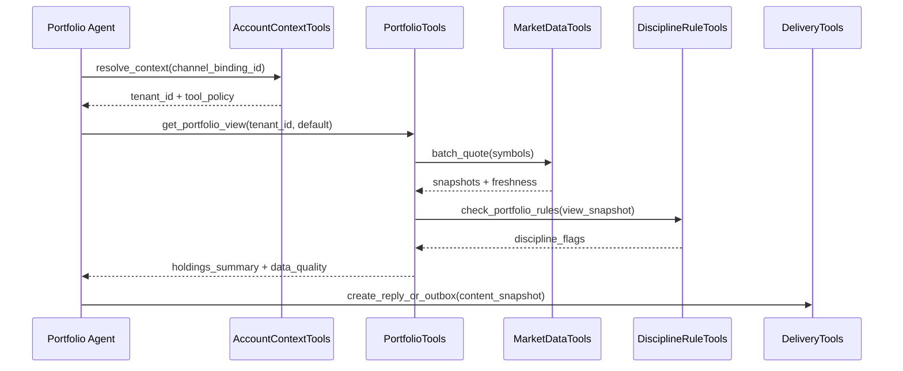
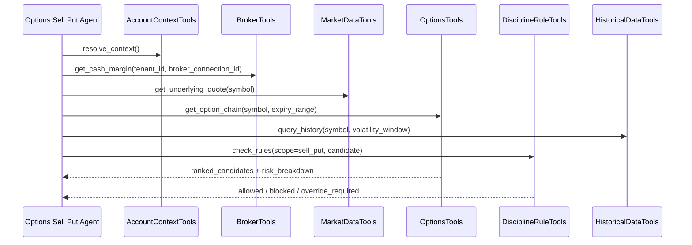

# Domain Tools 层设计

## 架构口径

Domain Tools 层不是子 agent 本身，而是子 agent 可以调用的一组 typed tools / domain services。它负责把金融系统的关键动作做成可审计、可测试、可恢复的工具边界。



原则：

1. 子 agent 不直接读写数据库、不直接访问券商、不直接拼接行情源。
2. 所有工具调用必须带 `tenant_id`、`run_id`、`tool_policy`、`idempotency_key` 和审计上下文。
3. 写入类工具必须记录 `source_lineage`，并支持重试幂等。
4. 交易建议、交易录入、关注清单升级和高风险推送必须经过 `DisciplineRuleTools`。
5. 金融计算、回测、Greeks、保证金、仓位聚合尽量由 deterministic tools 完成，不让模型心算。
6. agent 不能自己决定“是否可执行交易建议”；可执行性必须由数据质量、纪律规则、风险审查和权限共同决定。

## 还需要补齐的控制面能力

除了业务工具，还需要一组控制面工具。它们不直接分析股票或期权，但决定 agent 能不能调用工具、能不能写入、能不能推送、能不能把结果升级成行动建议。

| 控制面能力 | 为什么需要 | 建议组件 |
| --- | --- | --- |
| Tool Contract Registry | 防止工具 schema、权限、版本漂移 | `tool_contracts`、schema version、owner、risk class |
| Agent Capability Matrix | 明确每个 agent 能调用哪些工具 | agent role -> allowed tools / forbidden tools / write scope |
| ConfirmationTools | 高风险写入和用户自然语言交易录入必须确认 | confirmation session、pending action、user approval |
| RiskReviewTools | 区分观察分析、建议、交易草稿和禁止输出 | actionability classifier、risk review、final gate |
| CostQuotaTools | 控制 GPT-5.5、期权链、OCR、付费数据源成本 | quota check、budget reservation、usage events |
| HandoffProgressTools | Hermes 长任务需要可查询进度和可恢复状态 | progress event、checkpoint、cancel/resume |
| EvalReplayTools | 上线前和事故后需要重放 agent run | replay bundle、golden tests、tool result snapshots |
| DegradationPolicyTools | 数据源失败时统一降级，不靠 agent 自己措辞 | fallback policy、blocked reason、safe response template |

这些工具可以先以内部模块实现，不必一开始拆独立服务；但从一开始要有明确 schema 和审计记录。

## Tool Contract 最小字段

每个 Domain Tool 都应该在 registry 中有一份契约：

```json
{
  "tool_name": "options.sell_put.rank_candidates",
  "tool_version": "1.0.0",
  "owner": "options_product",
  "permission_class": "read | controlled_write | proposal_write | admin_write",
  "risk_class": "low | medium | high",
  "cost_class": "free | metered | expensive",
  "requires_freshness_gate": true,
  "requires_rule_check": true,
  "requires_confirmation": false,
  "idempotency_required": true,
  "input_schema_version": "v1",
  "output_schema_version": "v1",
  "timeout_ms": 30000,
  "retry_policy": {
    "max_attempts": 2,
    "retryable_errors": ["timeout", "rate_limited"]
  },
  "forbidden_runtimes": [],
  "lineage_required": true
}
```

规则：

1. `risk_class=high` 的工具结果不能直接发送给用户，必须经过 `RiskReviewTools`。
2. `controlled_write` 工具必须有 `idempotency_key` 和 `confirmation_status`。
3. `expensive` 工具必须先过 `CostQuotaTools.reserve_budget`。
4. 工具输出必须包含 `data_quality`、`lineage_refs` 和 `actionability_level`，否则不能进入最终回复。

## Agent Capability Matrix



建议首期 capability matrix：

| Agent | 默认允许 | 受控写入 | 禁止 |
| --- | --- | --- | --- |
| Daily Chat Agent | account、portfolio summary、market quote、delivery reply | 创建轻量 outbox、创建确认会话 | broker sync、规则删除、深研写入、任何交易动作 |
| Portfolio Agent | asset sources、portfolio views、market、history、rules check | 交易录入待确认、OCR 修正待确认、portfolio view 配置 | 直接覆盖 broker 持仓、自动下单 |
| Equity Analyst Agent | equity、market、history、research artifacts、rules check | 写研究 artifact、更新 follow/list 分析字段 | 修改交易事实、修改交易规则 |
| Options Sell Put Agent | options chain、cash/margin read、market、history、rules check | 写 sell put report、创建监控草案 | 在现金/保证金缺失时输出可执行候选、自动下单 |
| Deep Research Agent | research、market、history、public events | 写 research artifact、生成 proposal | 写持仓事实、写 broker connection |
| Broker Sync Agent | broker read、asset reconcile、audit | 写 broker snapshots、reconcile result | 下单、修改用户规则 |
| Delivery Agent | delivery outbox、account context | 更新投递状态 | 修改内容事实、改写报告结论 |
| Memory Curator | account memory、research artifacts | 写偏好/经验/复盘 memory | 写持仓事实、跨 `tenant_id` 读取 |
| Ops Agent | scheduler、audit、health、metrics | 创建 repair job、暂停异常任务 | 查看敏感明细除非有管理员授权 |

## Actionability Level

每个 agent 输出都要带行动等级，不能只靠自然语言表达“建议”。

| 等级 | 含义 | 允许输出 |
| --- | --- | --- |
| `info_only` | 信息查询 | 当前持仓、行情、任务状态 |
| `analysis_only` | 分析但不可行动 | 使用 fallback、数据过期、缺少关键字段 |
| `suggested_action` | 可作为人工判断参考 | 数据质量通过，但仍需用户自己决策 |
| `trade_draft` | 交易草稿 | 已过数据、规则、风险检查，但必须用户确认 |
| `blocked` | 不允许建议行动 | 数据缺失、规则禁止、权限不足、对账失败 |

`RiskReviewTools` 负责最终确定 `actionability_level`。agent 可以提出候选结论，但不能自己把输出升级成 `trade_draft`。

## 工具功能图

```mermaid
flowchart TB
  subgraph Agents["子 Agent"]
    Chat["Daily Chat Agent"]
    Portfolio["Portfolio Agent"]
    EquityAgent["Equity Analyst Agent"]
    OptionsAgent["Options Sell Put Agent"]
    BrokerAgent["Broker Sync Agent"]
    ResearchAgent["Deep Research Agent"]
    DeliveryAgent["Delivery Agent"]
    MemoryAgent["Memory Curator"]
    OpsAgent["Ops Agent"]
  end

  subgraph Tools["Domain Tools"]
    Account["AccountContextTools<br/>账号解析 / 权限 / routing context"]
    Asset["AssetSourceTools<br/>来源查询 / 手工修正 / OCR修正 / 对账"]
    PortfolioTools["PortfolioTools<br/>资产视图 / 持仓聚合 / 现金保证金 / 组合风险"]
    EquityTools["EquityTools<br/>股票/ETF分析 / 止盈止损 / 机会评分"]
    OptionsTools["OptionsTools<br/>期权链 / sell put筛选 / assignment / roll"]
    MarketTools["MarketDataTools<br/>报价 / 批量行情 / freshness gate / 数据源健康"]
    HistoryTools["HistoricalDataTools<br/>覆盖检查 / 历史查询 / backfill / 回测数据"]
    BrokerTools["BrokerTools<br/>券商只读同步 / 持仓 / 成交 / 现金 / 保证金"]
    RuleTools["DisciplineRuleTools<br/>交易纪律检查 / override / 纪律评分"]
    SchedulerTools["SchedulerTools<br/>分账号任务 / 市场采集任务 / repair队列"]
    DeliveryTools["DeliveryTools<br/>outbox / 幂等投递 / 重试补偿"]
    ResearchTools["ResearchArtifactTools<br/>深研产物 / 事件资料 / 引用快照"]
    MemoryTools["MemoryTools<br/>账号 memory 提炼 / 写入 / 过期"]
    AuditTools["AuditObservabilityTools<br/>tool trace / lineage / eval"]
  end

  Chat --> Account
  Chat --> PortfolioTools
  Chat --> MarketTools
  Chat --> RuleTools
  Chat --> DeliveryTools

  Portfolio --> Account
  Portfolio --> Asset
  Portfolio --> PortfolioTools
  Portfolio --> MarketTools
  Portfolio --> HistoryTools
  Portfolio --> RuleTools

  EquityAgent --> EquityTools
  EquityAgent --> MarketTools
  EquityAgent --> HistoryTools
  EquityAgent --> RuleTools
  EquityAgent --> ResearchTools

  OptionsAgent --> OptionsTools
  OptionsAgent --> MarketTools
  OptionsAgent --> BrokerTools
  OptionsAgent --> HistoryTools
  OptionsAgent --> RuleTools

  BrokerAgent --> BrokerTools
  BrokerAgent --> Asset
  BrokerAgent --> PortfolioTools
  BrokerAgent --> AuditTools

  ResearchAgent --> ResearchTools
  ResearchAgent --> MarketTools
  ResearchAgent --> HistoryTools
  ResearchAgent --> RuleTools

  DeliveryAgent --> DeliveryTools
  DeliveryAgent --> Account
  DeliveryAgent --> AuditTools

  MemoryAgent --> MemoryTools
  MemoryAgent --> ResearchTools
  MemoryAgent --> AuditTools

  OpsAgent --> SchedulerTools
  OpsAgent --> AuditTools
  OpsAgent --> BrokerTools
  OpsAgent --> MarketTools
```



## 外部能力与工具依赖图

```mermaid
flowchart TB
  subgraph External["外部能力"]
    OpenClaw["OpenClaw 微信 claw<br/>入站消息 / 出站推送 / routing.json"]
    Futu["富途 OpenAPI/OpenD<br/>美港股行情 / 期权链 / 账户只读"]
    Longbridge["长桥 / PTrade<br/>备选券商连接器"]
    Tencent["腾讯财经<br/>公共行情交叉校验"]
    MarketVendors["Tushare / JQData / Yahoo / AkShare<br/>A股/公共/兜底数据"]
    PaidData["OPRA / Databento / Polygon / Cboe<br/>期权历史和增强数据"]
    OCR["OCR/Vision<br/>截图识别 / 券商消息识别"]
    LLM["模型供应商<br/>MiniMax M2.7 / GPT-5.5"]
    Calendar["交易日历 / 财报 / 事件日历"]
  end

  subgraph Infra["内部基础设施"]
    DB["Postgres/Supabase<br/>tenant tables / audit / jobs"]
    Redis["Redis<br/>cache / locks / idempotency"]
    Storage["Local data_root / Object Storage<br/>历史行情 / artifacts / OCR文件"]
    Trace["OpenTelemetry / evals<br/>tool_calls / agent_steps"]
  end

  subgraph Tools["Domain Tools"]
    Account["AccountContextTools"]
    Market["MarketDataTools"]
    History["HistoricalDataTools"]
    Broker["BrokerTools"]
    Portfolio["PortfolioTools"]
    Equity["EquityTools"]
    Options["OptionsTools"]
    Asset["AssetSourceTools"]
    Rules["DisciplineRuleTools"]
    Scheduler["SchedulerTools"]
    Delivery["DeliveryTools"]
    Research["ResearchArtifactTools"]
    Memory["MemoryTools"]
  end

  OpenClaw --> Account
  OpenClaw --> Delivery
  Futu --> Market
  Futu --> Broker
  Futu --> Options
  Longbridge --> Broker
  Longbridge --> Market
  Tencent --> Market
  MarketVendors --> Market
  MarketVendors --> History
  PaidData --> History
  PaidData --> Options
  OCR --> Asset
  Calendar --> Scheduler
  Calendar --> Equity
  Calendar --> Options
  LLM --> Research
  LLM --> Memory

  DB --> Account
  DB --> Asset
  DB --> Portfolio
  DB --> Rules
  DB --> Scheduler
  DB --> Delivery
  DB --> Research
  DB --> Memory
  Redis --> Market
  Redis --> Broker
  Redis --> Scheduler
  Redis --> Delivery
  Storage --> History
  Storage --> Research
  Storage --> Asset
  Trace --> Account
  Trace --> Market
  Trace --> Broker
  Trace --> Delivery
```



## 工具包职责与依赖

| 工具包 | 主要功能 | 依赖的外部能力 | 依赖的内部工具/数据 |
| --- | --- | --- | --- |
| `AccountContextTools` | 解析 `tenant_id`、`channel_binding_id`、`openclaw_account_id`、权限和 run contract | OpenClaw routing.json、登录系统 | `accounts`、`channel_bindings`、tool policy、audit |
| `AssetSourceTools` | 查询/更新资产来源，处理手工录入、买卖消息、券商消息、OCR 修正，对账入口 | OCR/Vision、微信消息、券商消息 | `asset_sources`、`trade_events`、raw snapshots、audit |
| `PortfolioTools` | 构建用户当前资产视图，聚合股票/ETF、期权、现金、保证金和组合风险 | 券商账户数据、实时行情 | `portfolio_views`、`portfolio_positions`、`equity_positions`、`option_positions`、cash/margin snapshots |
| `EquityTools` | 股票/ETF 持仓分析、机会评分、止盈止损、二次买入条件 | 行情源、财报/事件日历、历史行情 | `equity_positions`、`follow_views`、`list_views`、`HistoricalDataTools`、`DisciplineRuleTools` |
| `OptionsTools` | 期权链查询、sell put 候选筛选、Greeks/IV、assignment 风险、roll/close 方案 | 富途期权链、未来 OPRA/Databento/Polygon/Cboe、券商现金/保证金 | `option_positions`、`option_contracts`、`BrokerTools`、`MarketDataTools`、`DisciplineRuleTools` |
| `MarketDataTools` | 实时报价、批量行情、数据源健康、freshness gate、交叉校验 | 富途、腾讯财经、Tushare/JQData/Yahoo/AkShare、Longbridge | `market_data_sources`、`market_data_snapshots`、Redis cache |
| `HistoricalDataTools` | 历史行情覆盖检查、查询、每日采集、backfill、repair、回测数据切片 | Tushare/JQData、富途、腾讯财经、付费期权历史源 | `historical_data_jobs`、`historical_data_manifests`、object storage、market universes |
| `BrokerTools` | 券商只读同步：持仓、成交、现金、保证金、期权仓位、同步健康 | 富途 OpenAPI/OpenD、长桥、PTrade | `broker_connections`、broker snapshots、`AssetSourceTools`、reconcile jobs |
| `DisciplineRuleTools` | 检查交易规则和纪律，创建/更新规则，记录 override，生成纪律评分 | 无强外部依赖；可用市场日历辅助 | `trading_rules`、`discipline_checks`、`PortfolioTools`、`OptionsTools` |
| `SchedulerTools` | 分账号 cron 展开、市场采集任务、补偿任务、repair/backfill 队列 | 市场交易日历、系统 cron | `task_definitions`、`account_task_subscriptions`、`job_runs`、`historical_data_jobs` |
| `DeliveryTools` | outbox 写入、内容快照、推送重试、失败补偿、幂等投递 | OpenClaw 微信 claw，未来钉钉/飞书 | `delivery_outbox`、`delivery_runs`、channel bindings、Trace |
| `ResearchArtifactTools` | 保存深研报告、事件引用、数据快照、报告版本 | GPT-5.5、web/research connectors、公告/新闻源 | research artifacts、snapshot refs、object storage |
| `MemoryTools` | 提炼账号级 memory、去重、过期、写入偏好和复盘经验 | MiniMax/GPT 可辅助摘要 | `account_memories`、`tenant_id` memory scope、audit |
| `AuditObservabilityTools` | 记录工具调用、lineage、失败原因、质量指标、eval | OpenTelemetry | `agent_runs`、`agent_steps`、`tool_calls`、metrics |

## 典型调用链

### 查询当前持仓



### Sell Put 候选分析



## 开发前已确认

1. P0 使用 domain service/internal API 作为事实写入口；agent 侧通过受控 tool adapter/MCP facade 调用；禁止 agent 直接写核心业务表。
2. 只允许 Domain Service/Confirmation commit 写事实；agent/Hermes 只能写 proposal、artifact、pending confirmation。
3. P0 支持图片 OCR 和语音输入：图片走 OCR/Vision 候选识别 + 确认中心；语音走 ASR/语音口令识别 + 二次确认；低置信结果不得直接写入。
4. Deep Research 只允许调用已授权、已登记在 Tool Contract Registry 的 web/数据工具；付费数据源未接入前不调用，后续计费和缓存接入 Cost/Quota 与 artifact metadata。
5. P0 所有 broker tools 只读；contract/代码中不暴露 `place_order`、`modify_order`、`cancel_order`。
