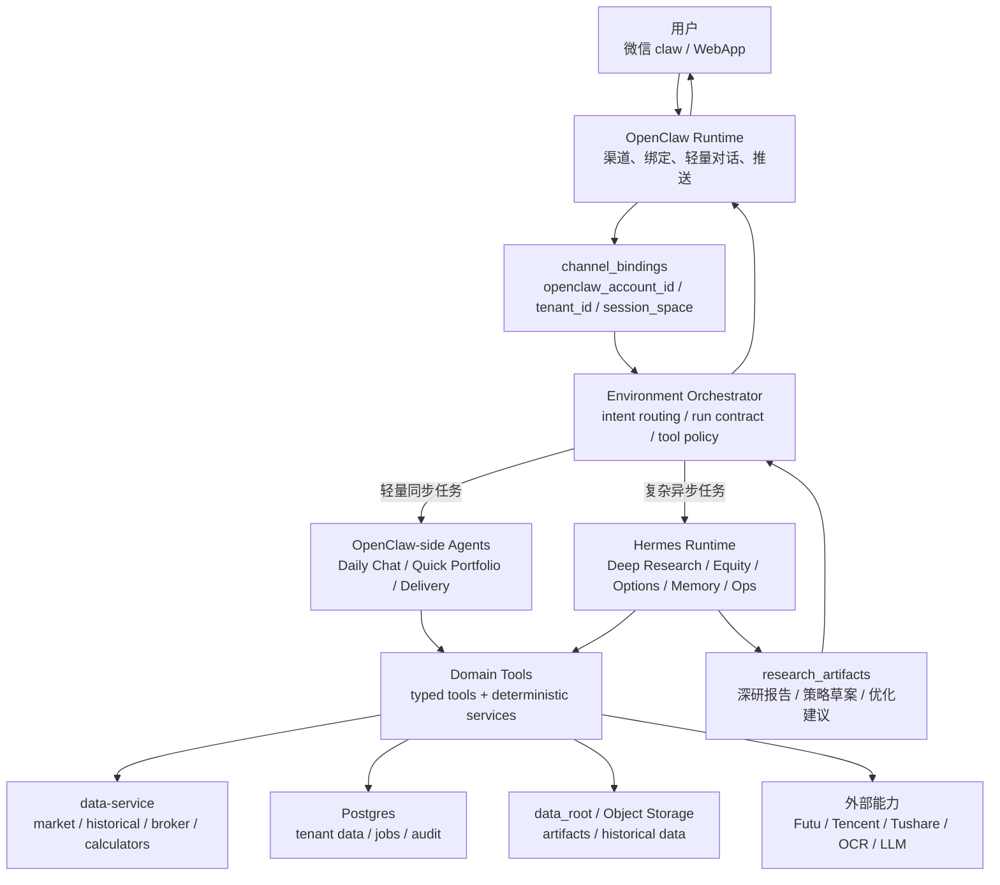
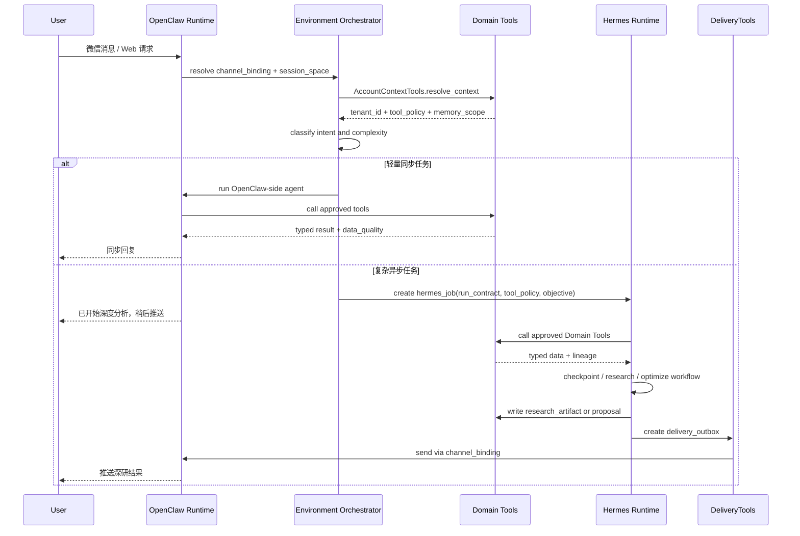
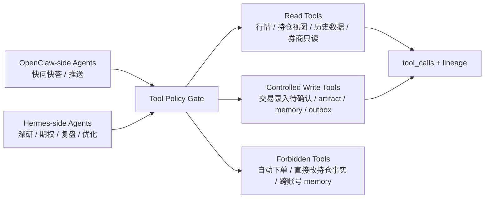

# OpenClaw + Hermes 双 Agent Runtime 设计

## 核心口径

3.0 采用 **OpenClaw + Hermes 双 agent 框架**：

- **OpenClaw** 负责渠道入口、账号绑定、轻量会话、推送闭环和用户可见交互。
- **Hermes** 负责复杂长任务、深度研究、期权策略、复盘归因、经验沉淀和受控自主优化。
- **Domain Tools** 是两者共同调用的金融工具层，负责真实数据查询、计算、写入、审计和幂等。
- **Environment Orchestrator** 负责在 OpenClaw 和 Hermes 之间做任务路由、权限控制、模型选择和 handoff。

Hermes 可以自主优化自己的研究流程、prompt、技能 playbook 和 memory 摘要，但不能直接改写持仓事实、券商数据、交易规则或生产工具代码。所有金融状态写入必须走 Domain Tools。

## 总体关系图



## Agent Runtime 归属

| Agent role | Runtime 归属 | 触发方式 | 主要工具依赖 | 说明 |
| --- | --- | --- | --- | --- |
| Daily Chat Agent | OpenClaw-side | 微信/Web 同步请求 | `AccountContextTools`、`PortfolioTools`、`MarketDataTools`、`DeliveryTools` | 轻量问答、账号确认、状态查询，优先 MiniMax M2.7 |
| Quick Portfolio Agent | OpenClaw-side | “我现在持仓怎么样”等轻量查询 | `PortfolioTools`、`MarketDataTools`、`DisciplineRuleTools` | 可由 Portfolio Agent 的轻量 profile 实现 |
| Delivery Agent | OpenClaw-side | cron/outbox/任务完成 | `DeliveryTools`、`AccountContextTools` | 负责微信 claw 投递、重试、补偿 |
| Portfolio Analysis Agent | Hermes-side for deep mode | 日终复盘、复杂归因、组合风险 | `PortfolioTools`、`HistoricalDataTools`、`DisciplineRuleTools` | 简单持仓查询不进 Hermes，复杂复盘才 handoff |
| Equity Analyst Agent | Hermes-side | 个股深研、止盈止损、二次买入 | `EquityTools`、`MarketDataTools`、`HistoricalDataTools`、`ResearchArtifactTools` | 可用 GPT-5.5，产出 artifact |
| Options Sell Put Agent | Hermes-side | sell put 筛选、期权持仓监控、roll/assignment | `OptionsTools`、`BrokerTools`、`MarketDataTools`、`DisciplineRuleTools` | 高风险任务，默认强模型 + 工具计算 |
| Deep Research Agent | Hermes-side | 用户要求深研、机会捕捉、行业研究 | `ResearchArtifactTools`、`MarketDataTools`、`HistoricalDataTools` | 长任务、checkpoint、引用快照 |
| Broker Sync Agent | Domain worker + Hermes diagnostic | 定时/手动同步 | `BrokerTools`、`AssetSourceTools`、`AuditObservabilityTools` | 同步本身尽量 deterministic；异常诊断可交给 Hermes |
| Memory Curator | Hermes-side | 对话后、每日、复盘后 | `MemoryTools`、`ResearchArtifactTools` | 只写 `tenant_id` scoped memory，不写持仓事实 |
| Ops Agent | Hermes-side 后置 | 运维诊断、任务失败分析 | `SchedulerTools`、`AuditObservabilityTools`、`BrokerTools` | 管理后台成熟后启用 |

首期产品可以把 `Quick Portfolio Agent` 合并到 Daily Chat/Portfolio 轻量 profile，因此用户可见仍是 8 个 agent role；runtime 上分成 OpenClaw-side 和 Hermes-side 两组。

## Handoff 机制



Handoff 的关键不是“把上下文全丢给 Hermes”，而是创建一个受控任务包：

```json
{
  "tenant_id": "uuid",
  "channel_binding_id": "uuid",
  "openclaw_account_id": "wx-bot-id",
  "session_space": "routing.sessionSpace",
  "source_run_id": "agent_run_uuid",
  "objective": "analyze_sell_put_candidates",
  "complexity": "deep",
  "allowed_tools": [
    "market.quote.read",
    "options.chain.read",
    "broker.cash_margin.read",
    "rules.check",
    "research_artifacts.write"
  ],
  "forbidden_tools": [
    "broker.trade.place_order",
    "portfolio_positions.direct_update",
    "trading_rules.delete"
  ],
  "data_scope": {
    "portfolio_view_id": "uuid",
    "follow_view_id": "uuid",
    "symbols": ["AAPL", "NVDA"],
    "memory_scope": "tenant"
  },
  "output_contract": {
    "artifact_type": "sell_put_report",
    "must_include": ["source_refs", "data_freshness", "discipline_result", "risk_summary"],
    "delivery_mode": "wechat_push"
  }
}
```

## 复杂度路由规则

| 用户意图 | Runtime | 原因 |
| --- | --- | --- |
| “查一下我现在持仓” | OpenClaw-side | 快速、短上下文、只需当前资产视图 |
| “帮我记录买入 AAPL 10 股” | OpenClaw-side + Domain Tools | 需要确认和写入审计，不需要深研 |
| “AAPL 现在要不要止盈” | OpenClaw-side 或 Hermes-side | 简单状态用 OpenClaw；涉及历史回测/财报/复杂归因则 handoff Hermes |
| “帮我找下周适合 sell put 的标的” | Hermes-side | 需要期权链、现金保证金、规则、排序和风险解释 |
| “给我做一份英伟达深度研究” | Hermes-side | 长任务、外部研究、引用和 artifact |
| “总结我今年的交易纪律问题” | Hermes-side | 需要历史交易、discipline_checks、复盘归因 |
| 每日收盘推送 | Hybrid | Broker/Market worker 采集，Hermes 做复杂摘要，OpenClaw 投递 |
| 数据源失败诊断 | Hermes-side Ops | 需要 trace、job、fallback 和修复建议 |

## Hermes 自主优化边界

Hermes 可以优化：

| 可优化对象 | 方式 | 生效边界 |
| --- | --- | --- |
| 深研 prompt/template | 根据成功报告和用户反馈生成新版本 | 进入 versioned prompt registry，需 eval 通过 |
| 研究 playbook | 沉淀“个股深研”“sell put 筛选”“清仓复盘”的步骤模板 | 作为 Hermes 内部 skill，不改业务事实 |
| Memory 摘要 | 把用户确认过的偏好、纪律、复盘经验写入账号 memory | 必须带 `tenant_id` 和来源链接 |
| 数据源 fallback 策略建议 | 根据失败率提出路由调整 | 只能生成 proposal，不能直接改生产策略 |
| 报告结构 | 优化输出模板、摘要长度、引用格式 | 低风险模板可自动启用，高风险策略模板需审核 |

Hermes 不能自主执行：

1. 不能直接下单或生成自动下单工具调用。
2. 不能直接修改券商 token、broker connection 权限。
3. 不能直接覆盖 `portfolio_positions`、`trade_events`、`trading_rules`。
4. 不能跨 `tenant_id` 复用用户 memory。
5. 不能把未经确认的研究结论写成持仓事实。
6. 不能绕过 `DisciplineRuleTools` 给出高风险交易建议。

## 运行状态表

```sql
hermes_jobs (
  id uuid primary key,
  tenant_id uuid not null,
  source_run_id uuid,
  channel_binding_id uuid,
  openclaw_account_id text,
  job_type text not null, -- deep_research, equity_analysis, options_sell_put, portfolio_review, memory_curate, ops_diagnostic
  objective text not null,
  complexity text not null, -- medium, deep, background
  status text not null, -- pending, running, waiting_tool, succeeded, failed, cancelled
  tool_policy jsonb not null,
  input_refs jsonb not null default '[]',
  output_artifact_id uuid,
  checkpoint_ref text,
  model_policy jsonb not null,
  created_at timestamptz,
  started_at timestamptz,
  finished_at timestamptz
);

hermes_optimization_proposals (
  id uuid primary key,
  tenant_id uuid, -- null 表示平台级 proposal
  proposal_type text not null, -- prompt, playbook, memory_rule, source_policy, report_template
  source_job_id uuid,
  current_version text,
  proposed_version text,
  rationale text,
  eval_result jsonb,
  risk_level text not null, -- low, medium, high
  approval_status text not null, -- proposed, auto_applied, needs_review, approved, rejected
  created_at timestamptz,
  reviewed_at timestamptz
);
```

## 与 Domain Tools 的关系



Domain Tools 必须对 runtime 无感：OpenClaw 和 Hermes 都只能通过同一套工具 schema 调用，不能各自维护一套金融逻辑。差异只在 tool policy：

- OpenClaw-side：低延迟、少步骤、同步回复优先。
- Hermes-side：长任务、checkpoint、artifact、可恢复、可优化。

## 首期落地建议

1. OpenClaw 保留为唯一微信 claw 入口和出站推送出口。
2. Daily Chat、轻量 Portfolio 查询、Delivery 放在 OpenClaw-side。
3. Deep Research、复杂 Equity 分析、Options Sell Put、Memory Curator 放在 Hermes-side。
4. Broker Sync 不强行做成 LLM agent，同步本身由 deterministic worker 执行；Hermes 只处理异常诊断和复盘。
5. 所有 Hermes 自主优化先落到 `hermes_optimization_proposals`，只允许低风险模板优化自动启用；金融规则、数据源路由、交易策略默认需要审核。

这套双 runtime 架构还需要配套 Tool Policy Gate、Data Quality Gate、Durable Job Runtime、Delivery Guard 和 Hermes Governance，完整健壮性清单见 `13-architecture-hardening.md`。

## 开发前已确认

1. Hermes 作为独立 worker 运行；Environment Orchestrator 与 Tool Gateway 在 P0 可先放在 Product API 内部模块化实现，但接口边界按独立服务设计。
2. Hermes 工具使用、分析输出允许自主优化自动生效；交易执行动作类优化需要人工确认，可按每周一次频次推送确认清单。
3. GPT-5.5 用于 Hermes-side deep jobs；OpenClaw-side 日常意图/文本使用 MiniMax M2.7；高风险输出走规则和风控复核。
4. 用户可以在微信中主动查看 Hermes 长任务简短进度，例如“任务到哪了”；完整进度在 WebApp。
5. Hermes job 默认超时：轻任务 5 分钟，深研 30 分钟；超时进入可恢复排队/失败补偿。
