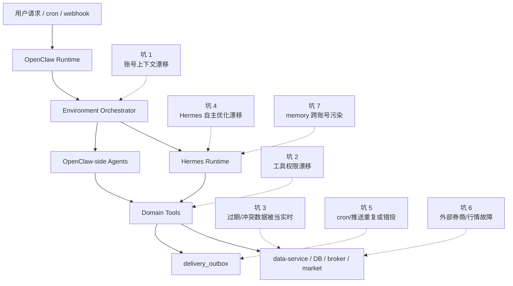
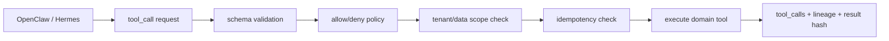
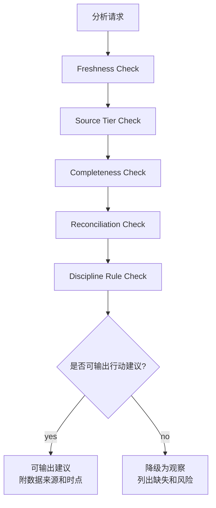

# 架构健壮性与补强清单

## 总体判断

OpenClaw + Hermes + Domain Tools 的分层是干净的，但上线后的主要风险不在“agent 能不能想明白”，而在：

1. 跨 runtime 的上下文和权限是否一致。
2. 数据新鲜度、来源等级和对账状态是否被严格执行。
3. Hermes 自主优化是否产生行为漂移。
4. 分账号 cron、推送和补偿是否幂等。
5. 失败时是否能安全降级，而不是输出高置信错误建议。

因此 3.0 还需要补齐一组“韧性能力”，把架构从可用推进到可运营。

## 风险面总览



## 必补能力图

```mermaid
flowchart TB
  Hardening["Architecture Hardening"] --> Contract["Canonical Run Contract<br/>唯一上下文事实源"]
  Hardening --> ToolGateway["Typed Tool Gateway<br/>权限、schema、幂等、审计"]
  Hardening --> DataGate["Data Quality Gate<br/>freshness / provenance / reconcile"]
  Hardening --> JobRuntime["Durable Job Runtime<br/>lease / retry / backpressure"]
  Hardening --> DeliveryGuard["Delivery Guard<br/>outbox / hash / recipient validation"]
  Hardening --> HermesGuard["Hermes Governance<br/>proposal / eval / approval"]
  Hardening --> MemoryGuard["Memory Guard<br/>tenant scope / fact vs preference"]
  Hardening --> Observability["Observability + Eval<br/>trace / metrics / replay"]
  Hardening --> Secrets["Secrets + Entitlements<br/>broker token / data license"]
  Hardening --> Fallback["Fallback Policy<br/>安全降级 / circuit breaker"]
```



## 核心坑与补强

| 风险 | 典型事故 | 必须补齐的能力 |
| --- | --- | --- |
| 账号上下文漂移 | OpenClaw 识别 A 用户，Hermes job 用了 B 的 memory 或 portfolio | `Canonical Run Contract`，所有 run/job/tool call 都带 `tenant_id + channel_binding_id + session_space + tool_policy_hash` |
| 工具权限漂移 | Hermes 优化后调用了原本不该调用的写工具 | `Tool Policy Gate`，运行时强校验 allow/deny list；禁止 agent 自己扩大权限 |
| 数据新鲜度误用 | 富途断线后，用旧 quote 输出“现在可以买” | `Data Quality Gate`，实时建议必须检查 freshness、source_tier、fallback、reconcile |
| 多源持仓冲突 | 手工录入和券商同步数量不一致，但系统给出高置信仓位建议 | `Reconciliation Gate`，冲突时降级为“待确认”，不输出高置信交易动作 |
| Hermes 行为漂移 | 自主优化 prompt 后，策略风格变激进 | `Hermes Optimization Governance`，proposal + eval + approval；高风险模板禁止自动生效 |
| cron 雪崩 | 多账号同一时间全部深研，券商/行情/模型被打爆 | `Job Queue + Backpressure`，分市场、分账号、分能力限流和优先级 |
| 推送错投/重复 | A 账号报告推给 B 微信，或重试导致刷屏 | `Delivery Guard`，投递前校验 `tenant_id/channel_binding_id/openclaw_account_id/content_hash` |
| Memory 污染 | 研究结论或用户偏好被写成事实，或者跨账号复用 | `Memory Guard`，区分 fact/preference/lesson/research，写入必须带来源和 scope |
| 券商 token 风险 | Hermes 或日志泄露券商授权信息 | Secret vault、token redaction、最小权限、只读 entitlement |
| 期权风险低估 | sell put 只按年化收益排序，忽略现金、财报、IV、流动性 | Options hard gate，必须通过现金/保证金、DTE、delta、spread、event risk、规则检查 |

## Canonical Run Contract

所有进入 OpenClaw、Hermes、Domain Tools 的执行都必须共享一个不可随意改写的 run contract。

```json
{
  "run_id": "uuid",
  "tenant_id": "uuid",
  "channel_binding_id": "uuid",
  "openclaw_account_id": "routing.accountId",
  "session_space": "routing.sessionSpace",
  "runtime": "openclaw | hermes | domain_worker",
  "trigger": "wechat_message | webapp | cron | repair_job",
  "intent": "portfolio_query",
  "risk_level": "low | medium | high",
  "tool_policy_version": "v1",
  "tool_policy_hash": "sha256",
  "memory_scope": "tenant",
  "data_scope": {
    "portfolio_view_id": "uuid",
    "follow_view_id": "uuid",
    "broker_connection_ids": ["uuid"]
  },
  "idempotency_key": "stable-key",
  "created_at": "2026-05-09T00:00:00Z"
}
```

规则：

1. Hermes job 只能继承或收窄 run contract，不能扩大 `data_scope` 和 `allowed_tools`。
2. Tool call 必须记录 `tool_policy_hash`，方便后续复盘“当时为什么允许”。
3. 任何缺少 `tenant_id` 的工具调用直接拒绝。
4. 高风险 intent，例如 sell put、交易录入、规则 override，必须带 `risk_level=high` 并触发额外 gate。

## Tool Policy Gate

Domain Tools 前面需要一个统一工具网关，OpenClaw 和 Hermes 都走同一入口。



补齐字段：

| 字段 | 用途 |
| --- | --- |
| `tool_name` | 精确到能力，例如 `broker.cash_margin.read` |
| `tool_version` | 防止工具升级后结果不可复现 |
| `input_schema_version` | 便于回放和兼容 |
| `permission_class` | read、controlled_write、proposal_write、forbidden |
| `tenant_scope` | 当前账号边界 |
| `result_hash` | 防止补偿重试时内容漂移 |
| `lineage_refs` | 行情、持仓、券商、历史数据引用 |

## Data Quality Gate

任何策略建议前都要先过数据门。



硬规则：

1. 当前买卖建议必须使用 L1 主源或明确授权的交易级源。
2. 使用 L3/L4 fallback 时，只能输出观察分析。
3. 券商持仓、现金、保证金对账失败时，不输出高置信仓位或 sell put 建议。
4. 历史回测必须使用 `historical_data_manifests.quality_status=validated` 的数据。
5. 所有输出必须带 `source_key`、`as_of`、`freshness_seconds`、`reconciliation_status`。

## Hermes Governance

Hermes 的自主优化要有版本和审批。

| 优化对象 | 自动生效 | 需要审核 | 禁止 |
| --- | --- | --- | --- |
| 报告排版、摘要长度 | 允许，需 eval 通过 | 高影响报告模板 | 无 |
| 深研步骤 playbook | 低风险允许灰度 | 改变结论结构或评分逻辑 | 无 |
| prompt/template | 低风险允许灰度 | 交易建议、期权策略、风险评分 | 无 |
| 数据源路由 | 不允许 | 必须审核 | Hermes 直接改生产配置 |
| 交易规则 | 不允许 | 用户确认或管理员审核 | Hermes 自动删除/放宽规则 |
| 持仓事实 | 不允许 | 只能通过确认流 | Hermes 直接覆盖 |

建议补表：

```sql
runtime_policy_versions (
  id uuid primary key,
  policy_type text not null, -- tool_policy, prompt_policy, data_quality_policy, hermes_optimization_policy
  version text not null,
  content jsonb not null,
  status text not null, -- draft, active, deprecated
  created_at timestamptz,
  activated_at timestamptz
);
```

## Durable Jobs 与 Backpressure

需要把 cron、Hermes 长任务、历史行情采集、券商同步统一纳入 durable job runtime。

| 能力 | 说明 |
| --- | --- |
| Lease lock | 同一个 `tenant_id + task + market_day` 只能一个 worker 执行 |
| Idempotency | 重试不会重复写交易、重复推送、重复采集 |
| Priority queue | 用户即时请求高于后台深研，全量采集低于持仓相关采集 |
| Backpressure | 富途、腾讯、Tushare、模型供应商分别限流 |
| Dead letter queue | 多次失败进入人工/ops 诊断，不无限重试 |
| Resume checkpoint | Hermes 深研和历史采集可以从 step 恢复 |
| Quiet hours | 推送遵守用户 quiet hours，数据采集不受消息渠道影响 |

## Observability 与 Replay

上线前必须能回答四个问题：

1. 这个建议用了哪些数据？
2. 当时数据是否新鲜、是否 fallback？
3. 哪个 agent 调用了哪些工具？
4. 为什么允许这个工具调用或为什么降级？

建议核心表：

```sql
tool_calls (
  id uuid primary key,
  run_id uuid not null,
  tenant_id uuid not null,
  runtime text not null, -- openclaw, hermes, domain_worker
  agent_role text,
  tool_name text not null,
  tool_version text not null,
  input_hash text not null,
  result_hash text,
  tool_policy_hash text not null,
  status text not null,
  error_code text,
  lineage_refs jsonb not null default '[]',
  started_at timestamptz,
  finished_at timestamptz
);
```

关键指标：

| 指标 | 目标 |
| --- | --- |
| `cross_tenant_access_denied_count` | 必须可见，正常应为 0 |
| `stale_data_block_count` | 越高说明数据源或 freshness 策略需要优化 |
| `hermes_proposal_approval_rate` | 观察自主优化质量 |
| `delivery_misroute_count` | 必须为 0 |
| `broker_sync_failure_rate` | 触发降级和告警 |
| `high_risk_advice_without_rule_check` | 必须为 0 |
| `tool_policy_violation_count` | 必须告警 |

## 安全降级策略

| 故障 | 安全行为 |
| --- | --- |
| OpenClaw 不可用 | WebApp 可查询，推送进入 outbox 等待恢复 |
| Hermes 不可用 | 轻量查询继续，深研任务排队或返回稍后处理 |
| data-service 不可用 | 不输出策略建议，只提示数据服务不可用 |
| 富途不可用 | 不输出交易级美港股/期权建议，可用腾讯/历史库做观察分析 |
| 期权链缺字段 | sell put 降级，不能输出可执行候选 |
| 券商现金/保证金不同步 | 禁止输出 cash secured put 可执行建议 |
| 纪律规则服务不可用 | 高风险建议暂停，低风险查询可继续 |
| Delivery 失败 | outbox 重试，不重复生成内容 |

## 首期必须补齐的 P0/P1

### P0 上线前必须有

1. Canonical Run Contract。
2. Tool Policy Gate。
3. Data Quality Gate。
4. Delivery Guard。
5. Broker token 只读权限和 secret redaction。
6. Cross-tenant memory/data isolation tests。
7. 高风险建议必须经过 `DisciplineRuleTools`。
8. Hermes 自主优化 proposal 机制，默认不能直接改生产策略。
9. 关键工具调用 trace 和 lineage。
10. 基础配额和 provider-level rate limit，避免少数账号打爆模型、券商或行情源。
11. ConfirmationTools：交易录入、规则 override、OCR 修正等受控写入必须先形成待确认动作。
12. RiskReviewTools：所有高风险输出必须落 `actionability_level`，不能由 agent 自己升级成可执行建议。

### P1 首个可用版本必须有

1. Durable job queue + lease + dead letter queue。
2. Historical data coverage repair/backfill。
3. 数据源 circuit breaker 和 fallback policy。
4. Replay 工具：可以重放一次 agent run 的数据和工具调用。
5. 成本/配额控制：GPT-5.5 deep jobs、付费行情源、OCR。
6. 管理后台 Ops view：任务、投递、数据源、券商同步、Hermes jobs。
7. Eval suite：持仓查询、交易录入、sell put、深研报告、推送错投测试。
8. 增长指标：活跃账号、队列延迟、推送延迟、broker sync 时长、market cache 命中率。
9. Tool Contract Registry 和 Agent Capability Matrix 的管理界面或配置文件。
10. HandoffProgressTools：用户可查询 Hermes 长任务进度，可取消或等待后续推送。

用户增长到 10 万级时的队列、数据、成本和多租户扩展策略见 `14-growth-and-scale-readiness.md`。

## 开发前已确认

1. Hermes 工具使用、分析输出允许自主优化自动生效；交易执行动作类优化需要人工确认，可按每周一次频次推送确认清单。
2. Tool Gateway 在 P0 可集成在 Product API/Environment Orchestrator 内部模块，但接口边界按独立服务设计。
3. 生产券商 token 不保存到云端；云端只保存连接状态、脱敏 snapshot 和 source lineage。
4. 高风险输出走规则和风控复核；P0 不自动下单，所有交易执行动作类变更需要确认。
5. 降级策略 P0 默认保守：L2 及以下不输出交易草稿，只输出 `analysis_only`；用户可配置保守模式放 P1。
