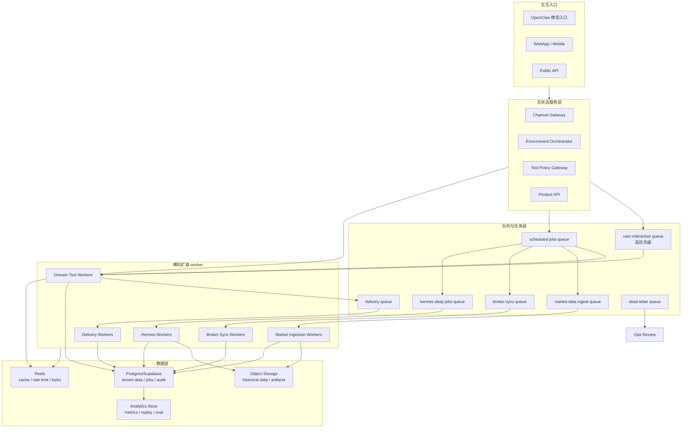
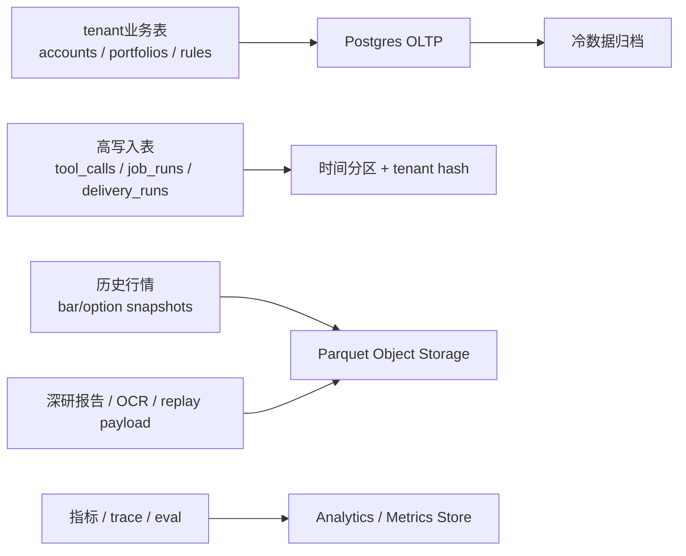
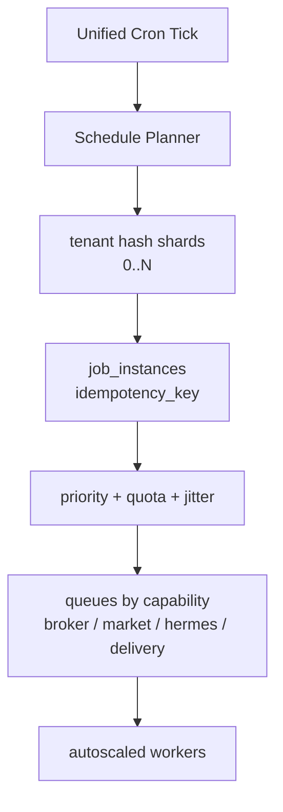

# 用户增长与 10 万级稳定性设计

## 设计原则

目标不是一开始就按 10 万付费用户重度投入基础设施，而是做到：

1. MVP 结构简单，能快速迭代。
2. 从第一天开始避免不可迁移的设计债。
3. 用户增长后，能通过横向扩容、队列拆分、数据分区和配额治理平滑升级。
4. 所有高成本能力，例如 GPT-5.5 deep jobs、券商同步、期权链、OCR、付费行情源，都必须有配额、限流和降级。

关键判断：**10 万用户的压力峰值不在注册账号数量，而在收盘 cron、批量推送、券商同步、深研任务、行情源配额和数据库高频写入。**

## 增长就绪架构图



## 不过度设计但必须预留的边界

| 能力 | MVP 做法 | 未来增长时怎么扩 |
| --- | --- | --- |
| Product API / Orchestrator | 一个服务进程也可以 | 保持无状态，可水平扩容 |
| Domain Tools | 先作为内部模块或 FastAPI internal endpoints | 后续拆成 Tool Gateway + tool workers |
| Postgres | 单库、多租户、RLS、正确索引 | 热表按时间/tenant hash 分区，读副本，必要时大客户隔离 |
| 历史行情 | 本地/对象存储 Parquet + manifest | 共享市场数据湖，计算 workers 横向扩 |
| Cron | 统一 tick + job fanout | 分队列、分市场、分租户 hash 分片 |
| Hermes | 单 worker 或少量 worker | 独立 worker pool，按任务类型和付费等级限流 |
| OpenClaw 推送 | 单 delivery worker | 按 `channel_binding_id` 分片，独立重试和限速 |
| 券商同步 | 手动/少量定时同步 | 按 broker/source rate limit 分队列和错峰 |

## 10 万用户压力点

| 压力点 | 为什么危险 | 设计策略 |
| --- | --- | --- |
| 收盘后统一推送 | 10 万账号同一时间生成分析和推送会造成任务雪崩 | cron fanout 加 jitter，按付费等级、市场、活跃度分批 |
| 券商同步 | 富途/长桥/PTrade 都会有连接、登录、频率和授权约束 | broker queue，per-broker limiter，只同步活跃账号和订阅任务 |
| 行情查询 | 每个用户重复拉同一标的会浪费配额和触发限流 | 市场数据共享 cache，按 symbol 聚合查询，不按 tenant 重复拉 |
| 期权链 | 期权链数据大、字段多、实时性要求高 | 只对持仓、关注、sell put 池拉取；全市场期权历史走付费源和批处理 |
| GPT-5.5 深研 | 成本和延迟不可控 | deep job quota、排队、人工触发、付费等级限制 |
| Memory 写入 | 对话后都写 memory 会产生大量低价值写入 | 异步批处理、去重、低价值消息不写入 |
| 推送错投 | 用户量越大，错投影响越严重 | Delivery Guard，recipient validation，content snapshot hash |
| 数据库热表 | `tool_calls`、`job_runs`、`delivery_runs`、`market_data_snapshots` 增长最快 | 按月分区、冷热归档、TTL、对象存储外置大 payload |

## 数据层增长策略



表设计规则：

1. 所有 tenant 业务表必须有 `tenant_id`，并建立常用组合索引，例如 `(tenant_id, created_at)`、`(tenant_id, status)`。
2. 高写入 append-only 表从一开始就按时间组织，例如 `job_runs`、`delivery_runs`、`tool_calls`。
3. 大 payload 不直接塞 Postgres；报告、OCR 原图、历史行情和 replay payload 放对象存储，Postgres 只存 URI、hash、manifest。
4. 公共市场数据不按 `tenant_id` 重复保存；账号只保存采集订阅、查询审计和私有范围。
5. 未来如果出现大客户或高频账号，可以按 `tenant_id` 做 dedicated storage / dedicated queue，而不是重写业务模型。

## Cron 与批任务扩容

10 万账号时，不能用“到点遍历所有账号并同步执行”的方式。



规则：

1. 每个任务生成稳定 `idempotency_key`：`tenant_id + task_key + market_day + portfolio_view_id`。
2. 收盘任务必须 jitter，例如在收盘后 15-90 分钟内分批。
3. 用户即时请求高于后台任务；交易风险提醒高于普通日报。
4. 全量市场采集和账号个性化分析分开：市场数据先共享采集，账号分析再读共享数据。
5. 失败任务进入 DLQ，不无限重试。

## 成本与配额治理

```sql
usage_quotas (
  id uuid primary key,
  tenant_id uuid not null,
  subscription_tier text not null, -- free, pro, premium, advisor
  quota_type text not null, -- deep_research, broker_sync, option_chain, ocr, delivery, market_api
  period text not null, -- daily, monthly
  hard_limit integer,
  soft_limit integer,
  used_count integer not null default 0,
  reset_at timestamptz,
  created_at timestamptz,
  updated_at timestamptz
);
```

建议配额策略：

| 能力 | 免费/低阶 | 付费/高阶 |
| --- | --- | --- |
| 即时持仓查询 | 基础可用 | 更高频率、更低延迟 |
| 深度研究 | 少量/月，排队 | 更多次数，优先队列 |
| sell put 扫描 | 关注池范围 | 更大范围、更高频期权链 |
| 券商同步 | 手动/低频 | 定时同步、更多 broker connection |
| 历史回测 | 标准窗口 | 更长历史、更复杂策略 |
| OCR | 少量截图 | 更多截图和更高优先级 |

配额必须在 Orchestrator 和 Tool Gateway 双层校验，避免 agent 绕过。

## 多租户隔离与付费用户

用户付费后，系统会同时面对安全、成本和体验隔离：

| 隔离对象 | 设计 |
| --- | --- |
| 数据 | `tenant_id` + RLS + tool scope check |
| Memory | `tenant_id + memory_scope`，禁止跨账号读取 |
| 任务 | 每个 job 带 `tenant_id` 和 tier priority |
| 成本 | GPT、行情、OCR、推送都落 `usage_events` |
| 推送 | `channel_binding_id + openclaw_account_id` 二次校验 |
| 券商 token | secret vault 或本地 OpenD，不进 Hermes prompt/log |
| SLA | 不同订阅等级对应不同队列优先级和限额 |

## 服务拆分时机

不要一开始就拆太多服务。建议按“痛点出现再拆，但接口先留好”的方式演进：

| 阶段 | 用户规模 | 推荐形态 |
| --- | --- | --- |
| Phase 0 | 内测/个人使用 | 单体 API + data-service + 本地/轻量队列 |
| Phase 1 | 1k-10k 账号 | API 无状态化，Redis queue，独立 workers，Postgres 正确索引 |
| Phase 2 | 10k-50k 账号 | Tool Gateway 独立，broker/market/hermes/delivery workers 分池 |
| Phase 3 | 50k-100k+ 账号 | 表分区、读副本、对象存储数据湖、队列分片、Ops 控制台和容量告警 |

拆分触发信号：

1. `job_queue_lag_seconds` 持续超过目标。
2. `delivery_lag_seconds` 导致推送错过市场窗口。
3. `broker_sync_failure_rate` 因限流上升。
4. Postgres hot table 写入或查询成为瓶颈。
5. GPT-5.5 deep job 成本不可控。
6. OpenClaw 入站/出站事件堆积。

## 关键容量指标

| 指标 | 用途 |
| --- | --- |
| `active_tenants_1d` / `active_tenants_30d` | 判断真实活跃用户，而不是注册数 |
| `tenant_tier_distribution` | 估算成本和 SLA |
| `job_queue_lag_seconds_by_type` | 判断队列是否堆积 |
| `delivery_lag_seconds_by_channel` | 判断推送是否及时 |
| `broker_sync_duration_seconds` | 判断券商同步窗口 |
| `market_api_calls_per_symbol` | 检查是否重复拉行情 |
| `deep_job_cost_by_tenant` | 控制 GPT-5.5 成本 |
| `db_rows_written_by_table` | 找出高写入热表 |
| `cache_hit_rate_market_data` | 衡量共享行情 cache 效果 |
| `tool_policy_denied_count` | 观察权限或攻击/bug |

## MVP 现在就要做的轻量约束

这些不算过度设计，成本低，但会救命：

1. 所有高频表带 `tenant_id`、`created_at`、`status` 索引。
2. 所有任务有 `idempotency_key`。
3. 所有外部调用有 provider-level rate limiter。
4. 所有 GPT-5.5/Hermes deep job 有 quota 和 budget 字段。
5. 市场数据查询先查共享 cache，再查外部源。
6. 历史行情使用共享存储，不按用户重复保存。
7. 推送必须 outbox 化，不能边生成边发送。
8. 大 payload 放对象存储，DB 只放引用和 hash。
9. 每个 tool call 都记录 `tenant_id`、`tool_name`、`runtime`、`duration`、`status`。
10. Ops 页面至少能看到队列延迟、推送失败、券商同步失败、数据源失败。

## 开发前已确认 / 已延后

1. 10 万级容量口径放 P1/P2 进一步定标；P0 保持可迁移架构和指标，不做重型分片实现。
2. 顾问/机构账号延后；P0 不实现一个 tenant 管多个最终客户，只预留 tenant/account/profile 字段扩展。
3. 付费等级影响 deep research 次数、broker sync 频率、期权链范围和推送 SLA 延后；P0 只保留内部 cost/quota 字段。
4. 生产券商连接采用用户本地 OpenD/local connector，云端不保存生产券商 token。
5. OpenClaw P0 默认一个系统账号绑定一个主 bot；一个用户多个 bot、一个 bot 多账号切换放 P1。
