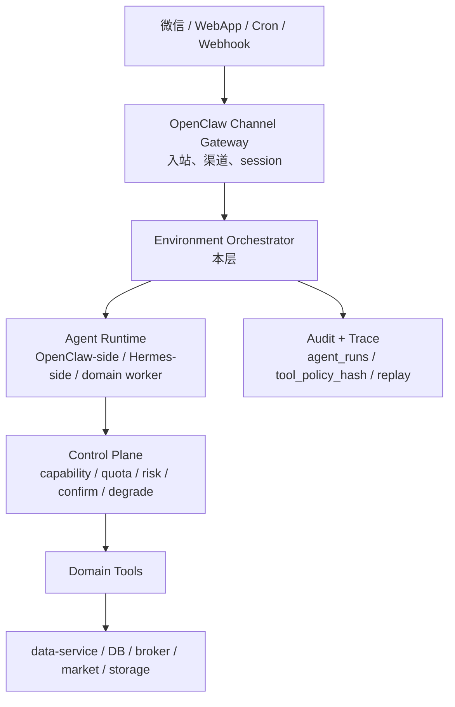
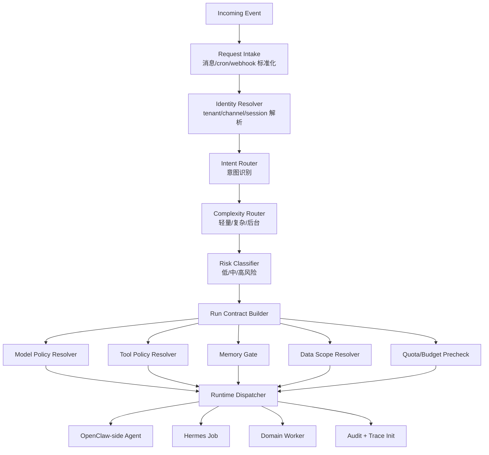
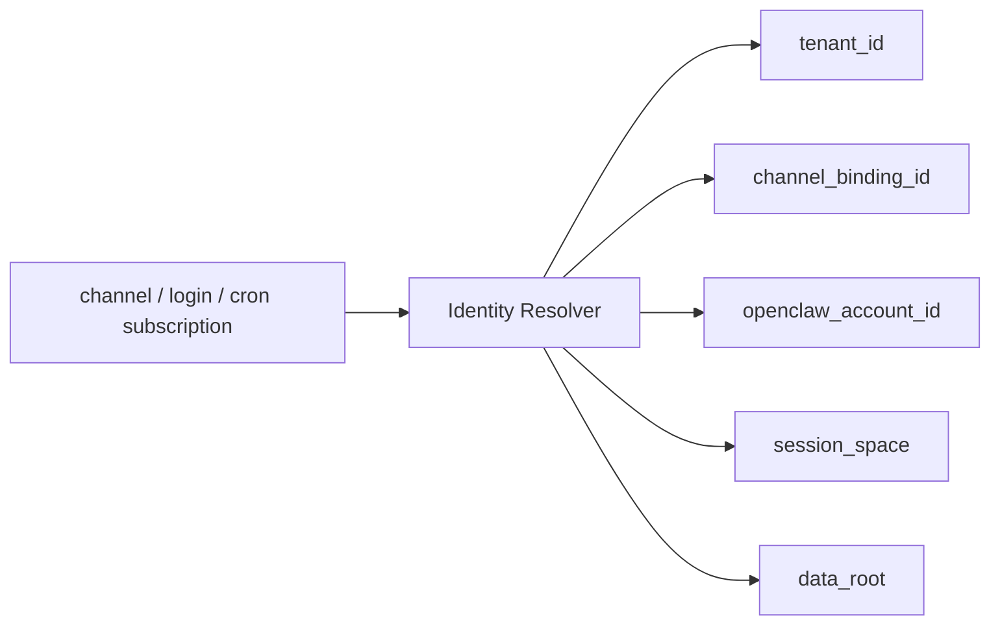
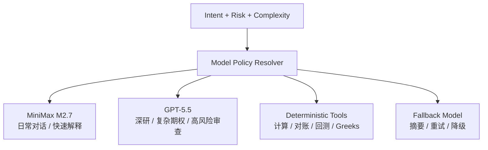
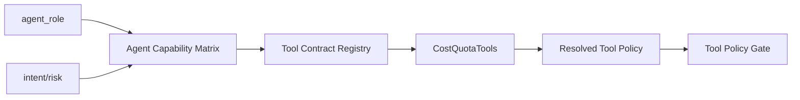
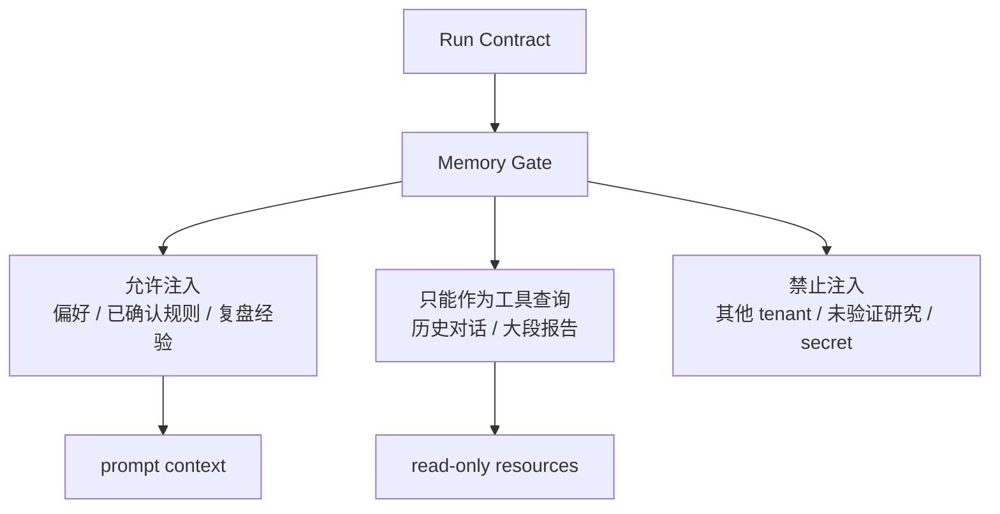
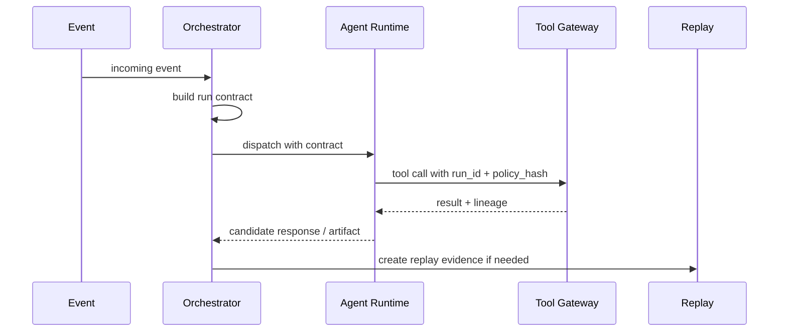
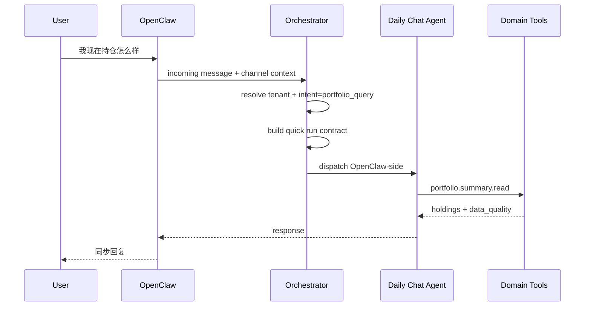
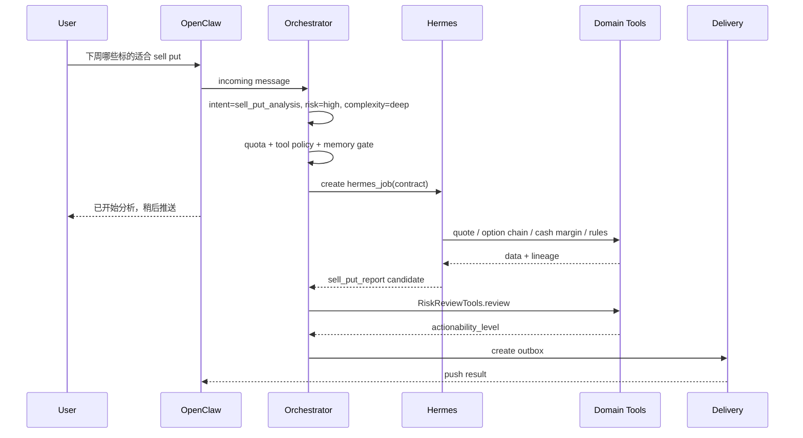

# Environment Orchestrator 设计

## 一句话定义

`Environment Orchestrator` 是每次请求、cron、webhook 或 Hermes 长任务启动前的**租户级运行环境构建器**。

它不是 agent，也不是 Domain Tool。它负责把“用户说了一句话 / 系统到点跑任务”转换成一个可控执行环境：

- 谁在请求：`tenant_id`、`channel_binding_id`、`openclaw_account_id`。
- 要做什么：intent、复杂度、风险等级。
- 交给谁做：OpenClaw-side、Hermes-side、domain worker。
- 可以看什么：持仓视图、关注清单、清仓列表、memory 范围、数据快照。
- 可以调用什么：tool policy、capability matrix、cost quota。
- 用什么模型：MiniMax M2.7、GPT-5.5、deterministic worker。
- 怎么留痕：`agent_runs`、`tool_calls`、`model_calls`、`lineage_refs`、`replay_bundle`。

它的产物是一个 **tenant-scoped run contract**。后续 agent、Domain Tools、控制面能力都必须围绕这个 contract 执行。

## 所在层级



一个容易理解的比喻：**OpenClaw 是门口和前台，Hermes 是深度工作室，Domain Tools 是专业设备，Environment Orchestrator 是进门前给每次任务发工作证、钥匙、预算和监控记录的人。**

## 解决的问题

如果没有 Orchestrator，多 agent 系统会出现几类问题：

| 问题 | 后果 |
| --- | --- |
| agent 自己判断账号 | 可能跨账号读持仓或 memory |
| agent 自己决定工具权限 | Hermes 优化后可能越权 |
| agent 自己选择模型 | GPT-5.5 成本失控，或低能力模型处理高风险任务 |
| agent 自己拼上下文 | 把研究结论当持仓事实，把旧数据当实时行情 |
| agent 自己处理失败 | 降级口径不一致，用户看不出数据是否可靠 |
| agent 自己留日志 | 事故后无法重放和审计 |

Orchestrator 的目标不是“让 agent 更聪明”，而是让 agent 每次运行都在正确的边界内。

## 核心模块



### Request Intake

把不同入口标准化：

| 入口 | 输入 | 标准化产物 |
| --- | --- | --- |
| 微信 claw | 消息、会话、OpenClaw account | `incoming_event` + `channel_binding_id` |
| WebApp | 登录用户、页面上下文、表单动作 | `incoming_event` + authenticated `tenant_id` |
| Cron | task definition、market calendar、subscription | `scheduled_event` |
| Webhook | 券商消息、异步回调、系统事件 | `webhook_event` |
| Hermes continuation | checkpoint、job id、上游 run | `continuation_event` |

### Identity Resolver

把入口身份解析成系统身份：



规则：

1. 没有 `tenant_id`，不能访问持仓、券商、memory。
2. 微信入口必须从 `channel_bindings` 解析 `tenant_id`，不能从自然语言猜账号。
3. 一个系统账号可以绑定多个 channel，但每次 run 必须绑定一个明确 `channel_binding_id`。
4. 如果未来允许一个微信 bot 切换多个系统账号，切换动作必须显式确认并写审计。

### Intent Router

识别“用户到底要干什么”，但不直接执行业务。

| Intent | 示例 | 默认 runtime |
| --- | --- | --- |
| `portfolio_query` | “我现在持仓怎么样” | OpenClaw-side |
| `trade_record_input` | “买入 AAPL 10 股” | OpenClaw-side + Confirmation |
| `equity_analysis` | “AAPL 要不要止盈” | OpenClaw-side 或 Hermes-side |
| `sell_put_analysis` | “下周适合卖哪个 put” | Hermes-side |
| `deep_research` | “做一份英伟达深研” | Hermes-side |
| `broker_sync` | “同步富途账户” | domain worker |
| `delivery_status` | “昨天日报为什么没推送” | OpenClaw-side / Ops |
| `memory_update` | “以后不要提醒我中概股” | OpenClaw-side + Confirmation/Rules |

### Complexity Router

复杂度决定同步还是异步：

| 复杂度 | 条件 | 处理方式 |
| --- | --- | --- |
| `quick` | 只读、少工具、短上下文 | OpenClaw-side 同步回复 |
| `standard` | 多工具、需要数据质量/规则检查 | OpenClaw-side 可短异步，必要时 handoff |
| `deep` | 深研、回测、期权链、长报告 | Hermes job + 进度/稍后推送 |
| `background` | cron、采集、券商同步、repair | domain worker / Hermes diagnostic |

### Risk Classifier

风险等级决定必须经过哪些 gate：

| 风险等级 | 场景 | 必经控制面 |
| --- | --- | --- |
| `low` | 查询持仓、查看任务状态 | Capability + Tool Policy |
| `medium` | 分析、关注清单、普通推送 | Data Quality + Degradation |
| `high` | sell put、交易录入、规则 override、交易草稿 | RiskReview + Confirmation + Discipline |
| `admin` | 修复任务、暂停账号、查看敏感日志 | Admin entitlement + audit |

## Tenant-Scoped Run Contract

Run Contract 是 Orchestrator 的核心产物。

```json
{
  "run_id": "uuid",
  "tenant_id": "uuid",
  "channel_binding_id": "uuid",
  "openclaw_account_id": "routing.accountId",
  "session_space": "routing.sessionSpace",
  "trigger": "wechat_message",
  "intent": "sell_put_analysis",
  "environment_type": "option_sell_put",
  "runtime_target": "hermes",
  "agent_role": "options_sell_put_agent",
  "complexity": "deep",
  "risk_level": "high",
  "data_scope": {
    "portfolio_view_id": "uuid",
    "follow_view_id": "uuid",
    "broker_connection_ids": ["uuid"],
    "symbols": ["AAPL", "NVDA"]
  },
  "memory_scope": {
    "tenant_id": "uuid",
    "allowed_memory_types": ["preference", "lesson", "confirmed_rule"],
    "forbidden_memory_types": ["unverified_research", "other_tenant_memory"]
  },
  "model_policy": {
    "primary": "gpt-5.5",
    "fallback": "minimax-m2.7",
    "deterministic_tools_required": ["options.greeks", "margin.check"],
    "budget_limit": {
      "max_cost_usd": 3.0,
      "quota_type": "deep_research"
    }
  },
  "tool_policy": {
    "policy_version": "v1",
    "policy_hash": "sha256",
    "allowed_tools": [
      "market.quote.read",
      "options.chain.read",
      "broker.cash_margin.read",
      "rules.check",
      "research_artifacts.write"
    ],
    "forbidden_tools": [
      "broker.trade.place_order",
      "portfolio_positions.direct_update",
      "trading_rules.delete"
    ]
  },
  "audit_policy": {
    "trace_level": "full",
    "capture_tool_results": true,
    "create_replay_bundle": true
  },
  "idempotency_key": "tenant-task-marketday-symbols",
  "created_at": "2026-05-09T00:00:00Z"
}
```

关键规则：

1. 下游只能继承或收窄 contract，不能扩大权限。
2. Hermes job 不能自己添加工具，只能请求 Orchestrator 重新签发 contract。
3. Tool Gateway 根据 `tool_policy_hash` 校验调用是否允许。
4. 所有写入都必须带 `run_id`、`tenant_id`、`source_lineage` 和 `idempotency_key`。

## 模型策略

模型策略不是“哪个模型更聪明”，而是“什么任务值得花多少钱、承担多大延迟和风险”。



| 场景 | 默认策略 |
| --- | --- |
| 日常问答、状态查询 | MiniMax M2.7 |
| 持仓聚合、收益率、Greeks、保证金 | deterministic tools，不让模型心算 |
| 个股复杂分析、深研、sell put 排序 | Hermes-side GPT-5.5 + tools |
| 高风险输出最终审查 | 规则 + RiskReviewTools，必要时 GPT-5.5 二审 |
| 推送摘要压缩 | MiniMax M2.7 或小模型 |
| 模型失败/超时 | 降级为“正在继续分析”或 `analysis_only`，进入 continuation job |

模型策略必须记录：

- `model_provider`
- `model_name`
- `model_version`
- prompt/template version
- input snapshot hash
- cost and latency
- escalation reason

## 工具权限策略

Orchestrator 不手写权限，而是从控制面组合出 `tool_policy`：



权限解析顺序：

1. 根据 intent 选 agent role。
2. 读取 Agent Capability Matrix。
3. 读取 Tool Contract Registry，确认工具版本、风险、成本、必经 gate。
4. 通过 CostQuotaTools 预留预算。
5. 生成 `allowed_tools`、`forbidden_tools`、`controlled_write_tools`。
6. 写入 `tool_policy_hash`。

例子：

| 请求 | 允许 | 禁止 |
| --- | --- | --- |
| “查持仓” | `portfolio.summary.read`、`market.quote.read` | `broker.sync.run`、`trade.write` |
| “记录买入” | `trade.parse`、`confirmation.create`、`trade_events.pending_write` | `portfolio_positions.direct_update` |
| “sell put 分析” | `options.chain.read`、`broker.cash_margin.read`、`rules.check` | `broker.trade.place_order` |

## Memory Gate

Memory Gate 决定哪些 memory 可以进入本次环境。



Memory 分类：

| 类型 | 是否可进 prompt | 说明 |
| --- | --- | --- |
| `preference` | 可以 | 用户偏好，如“不买中概股” |
| `confirmed_rule` | 可以，但以规则工具为准 | 规则事实仍由 `trading_rules` 管 |
| `lesson` | 可以摘要注入 | 复盘经验 |
| `research_summary` | 谨慎注入 | 必须带 artifact 和时间 |
| `conversation_history` | 默认不整段注入 | 按需摘要或工具查询 |
| `broker_secret` | 禁止 | token、账号敏感信息 |
| `other_tenant_memory` | 禁止 | 跨账号隔离 |

原则：

1. memory 是偏好和经验，不是持仓事实。
2. 交易事实来自 `trade_events`、broker sync 或确认流。
3. 未确认研究结论不能写成 memory fact。
4. Memory 写入异步执行，不阻塞用户回复。

## 审计与 Trace

Orchestrator 在执行开始时创建审计主线。



建议表：

```sql
agent_runs (
  id uuid primary key,
  tenant_id uuid not null,
  channel_binding_id uuid,
  openclaw_account_id text,
  session_space text,
  trigger_type text not null,
  intent text not null,
  environment_type text not null,
  runtime_target text not null,
  agent_role text not null,
  risk_level text not null,
  complexity text not null,
  run_contract jsonb not null,
  tool_policy_hash text not null,
  model_policy jsonb not null,
  status text not null,
  idempotency_key text,
  created_at timestamptz,
  started_at timestamptz,
  finished_at timestamptz
);

model_calls (
  id uuid primary key,
  run_id uuid not null,
  tenant_id uuid not null,
  agent_role text,
  provider text not null,
  model_name text not null,
  model_version text,
  prompt_template_version text,
  input_hash text not null,
  output_hash text,
  cost_usd numeric,
  latency_ms integer,
  status text not null,
  created_at timestamptz
);
```

## Orchestrator 与控制面的关系

Orchestrator 负责“编排”，控制面负责“裁决”。

| 问题 | Orchestrator | 控制面 |
| --- | --- | --- |
| 谁来处理 | 选择 runtime/agent | Capability Matrix 限制角色能力 |
| 能不能用工具 | 请求解析工具策略 | Tool Policy Gate 执行校验 |
| 能不能花钱 | 请求预算预留 | CostQuotaTools 裁决 |
| 能不能输出建议 | 送审候选结果 | RiskReviewTools 裁决 |
| 失败怎么说 | 请求降级策略 | DegradationPolicyTools 给模板和原因码 |
| 写入要不要确认 | 标记高风险写入 | ConfirmationTools 生成确认会话 |
| 事故能不能复盘 | 打开 trace/replay | EvalReplayTools 生成证据包 |

## Orchestrator 与 OpenClaw/Hermes 的关系

| Runtime | Orchestrator 交付物 |
| --- | --- |
| OpenClaw-side | 低延迟 run contract、少量工具、同步回复目标、outbox 策略 |
| Hermes-side | hermes job、checkpoint policy、artifact contract、progress hooks、预算限制 |
| Domain worker | durable job contract、idempotency key、rate limit、retry policy |

Hermes 的复杂任务必须通过 handoff：

1. Orchestrator 创建 `hermes_job`。
2. Hermes 只拿到必要 data scope 和 allowed tools。
3. Hermes 写 artifact/proposal，不直接改持仓事实。
4. 完成后通过 DeliveryTools/OpenClaw 推回用户。

## 典型流程

### 轻量持仓查询



### Sell Put 深度分析



## P0 / P1

### P0

1. Request Intake + Identity Resolver。
2. Run Contract Builder。
3. Intent Router 覆盖持仓查询、交易录入、sell put、深研、cron。
4. Model Policy Resolver 支持 MiniMax M2.7、GPT-5.5、deterministic tools。
5. Tool Policy Resolver 接入 Capability Matrix 和 Tool Contract Registry。
6. Memory Gate 最小实现：只允许 tenant scoped preference/lesson/confirmed_rule。
7. Audit 初始化：`agent_runs`、`model_calls`、`tool_policy_hash`。
8. Hermes handoff 最小闭环：创建 job、查询进度、完成推送。

### P1

1. 更细的 complexity/risk classifier。
2. 多模型 fallback 和二次审查。
3. Replay bundle 自动生成策略。
4. 用户可见任务进度 UI。
5. 按订阅等级和成本动态调整 runtime。
6. Orchestrator 管理后台：run contract 查看、失败原因、重放入口。

## 开发前已确认

1. Orchestrator P0 可先放在 Product API 内部模块化实现，但接口边界按独立服务设计。
2. Intent Router P0 规则 + 小分类器优先；模型只做低风险补充分流。
3. Run Contract 不对用户展示完整内容；P0 在报告/详情页展示“数据来源与新鲜度”摘要。
4. Hermes job 默认超时：轻任务 5 分钟，深研 30 分钟；超时进入可恢复排队/失败补偿。
5. 降级策略 P0 默认保守：L2 及以下不输出交易草稿，只输出 `analysis_only`；用户自定义保守模式放 P1。
6. P0 支持账户级 quiet hours 和基础频控，不按付费等级区分。
