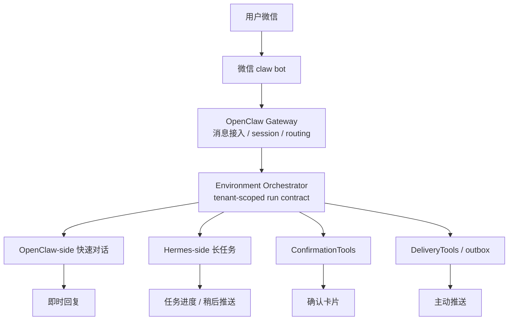
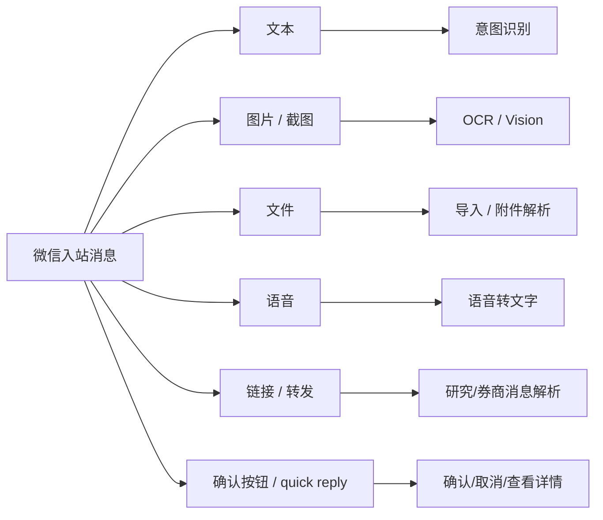
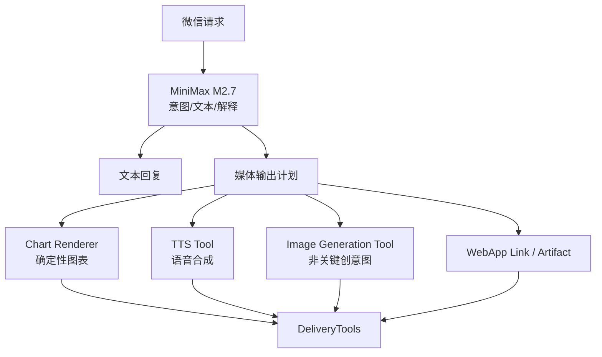
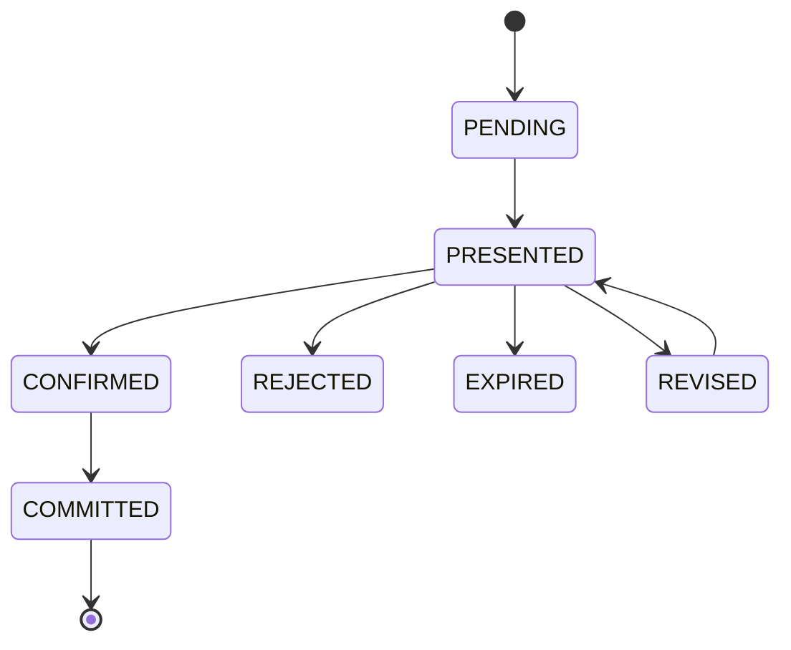
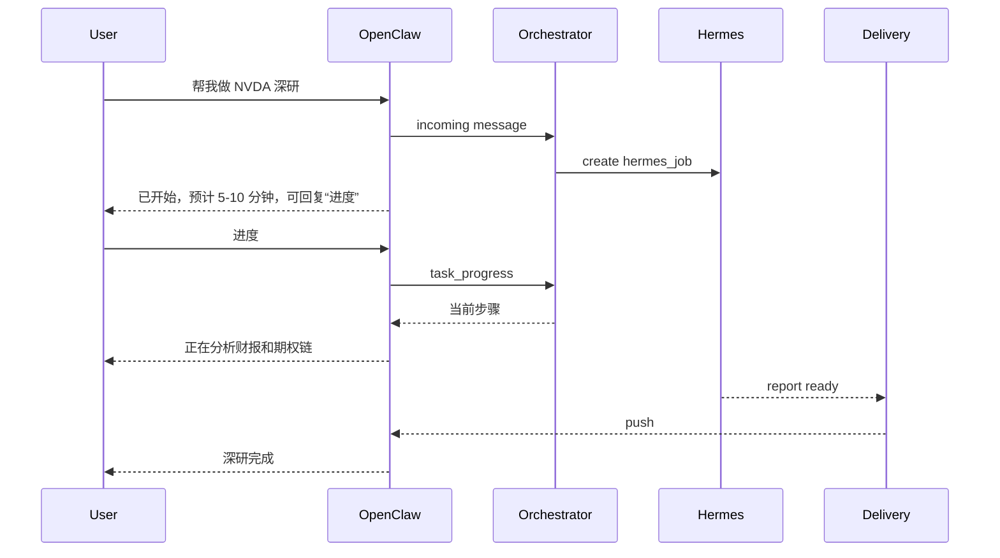

# 微信对话体验设计

## 定位

微信 claw 是 3.0 的核心高频交互入口，负责：

1. 日常持仓查询和轻量解释。
2. 自然语言交易录入、OCR/截图修正和用户确认。
3. 关注清单、清仓回溯、交易规则的快捷维护。
4. 定时推送、异动提醒、深研任务结果投递。
5. OpenClaw-side 快速响应与 Hermes-side 长任务 handoff。

微信层不直接做投资分析，不直接读数据库，不直接访问券商。它把消息标准化后交给 OpenClaw Gateway，再由 Environment Orchestrator 生成 run contract。

账号绑定、券商授权、账号切换和渠道管理不在微信对话内完成，只在 WebApp 或管理后台完成。微信侧遇到未绑定、权限不足或需要授权的情况，只能给出引导提示，不在微信里执行绑定或切换。

## 交互层级图



## 微信交互种类

| 交互种类 | 触发方 | 同步/异步 | 典型内容 | 处理路径 |
| --- | --- | --- | --- | --- |
| 即时问答 | 用户 | 同步优先 | 当前持仓、行情、任务状态、数据源状态 | OpenClaw-side Agent |
| 指令式操作 | 用户 | 同步 + 确认 | 交易录入、加入关注、修改规则、同步券商 | ConfirmationTools / Domain worker |
| 深度分析请求 | 用户 | 异步 | 个股深研、sell put 筛选、年度复盘 | Hermes handoff + HandoffProgressTools |
| 确认交互 | 系统发起，用户响应 | 同步 | 确认交易记录、OCR 修正、规则 override、交易草稿 | ConfirmationTools |
| 主动推送 | 系统 | 异步 | 每日收盘、异动提醒、止盈止损、期权风险、深研完成 | DeliveryTools |
| 进度查询 | 用户 | 同步 | “深研到哪了”、“任务取消” | HandoffProgressTools |
| 错误/降级回复 | 系统 | 同步或异步 | 数据过期、券商失败、期权链缺字段、权限不足 | DegradationPolicyTools |
| 绑定/授权引导 | 系统 | 同步 | 未绑定、券商未授权、账号不明确 | 只提示去 WebApp/管理后台处理 |

## 入站消息类型



| 类型 | 首期支持 | 用途 | 关键约束 |
| --- | --- | --- | --- |
| 文本 | P0 | 查询、交易录入、规则设置、深研请求 | 必须解析账号和 intent |
| 图片/截图 | P0/P1 | OCR 持仓/成交截图、券商通知截图 | OCR 低置信必须确认 |
| 快捷按钮/确认 | P0 | 确认、取消、查看详情、继续分析 | 必须绑定 `confirmation_session_id` |
| 链接/转发 | P1 | 财报、新闻、券商提醒、研究材料 | 不直接写事实，先生成待确认来源 |
| 语音 | P1/P2 | 快速口述交易或查询 | ASR 结果必须二次确认 |
| 文件 | P2 | 券商对账单、CSV 导入 | 需要 WebApp 或后台导入流 |

## 多模态输入/输出能力边界

微信渠道可以承载文本、图片、语音、链接转发等多种输入，也可以发送文本、图片、语音和链接类输出。但模型能力要分层设计，不能把 MiniMax M2.7 直接视为“所有模态都自己生成”的模型。

### 输入侧

| 输入 | 微信支持 | 处理方式 | 首期建议 |
| --- | --- | --- | --- |
| 文本 | 支持 | M2.7/日常模型做意图识别和回复生成 | P0 |
| 图片/截图 | 支持 | OCR/Vision 工具识别，低置信进入确认流 | P0/P1 |
| 语音 | 支持 | ASR 转文本，再进入文本 intent；高风险动作必须二次确认 | P1 |
| Web URL/转发 | 支持 | URL fetch/readability/research 工具读取，不直接写事实 | P1 |
| 文件 | 视 claw 能力 | 导入工具或 WebApp 上传 | P2 |

### 输出侧

| 输出 | 是否由 M2.7 直接生成 | 推荐生成方式 | 用途 |
| --- | --- | --- | --- |
| 文本 | 是，作为主要输出 | MiniMax M2.7 或 fallback LLM | 日常对话、解释、摘要 |
| 语音 | 不建议理解为 M2.7 本体能力 | MiniMax Speech/TTS 或其他 TTS tool | 收盘语音摘要、重要提醒播报 |
| 图片 | 不建议理解为 M2.7 本体能力 | 图表渲染工具；必要时 MiniMax Image model | 持仓图、收益曲线、风险热力图 |
| 链接/卡片 | 不是模型能力 | WebApp 报告链接渲染 | 深研报告、确认详情、长表格 |

MiniMax 平台本身提供语音合成、图像生成、视频等多模态 API；但在本系统里，**M2.7 应作为文本/agent 推理模型，图片和语音输出通过专用 Media Tools 完成**。这样更可控，也更适合金融场景。



金融内容的图片输出首选确定性图表，不优先使用生成式图片。比如持仓结构、收益曲线、期权到期天数分布、风险热力图，都应该由系统数据渲染生成，不能让图像模型自由画。

### Media Tools 草案

| 工具 | 功能 | 约束 |
| --- | --- | --- |
| `media.chart.render` | 根据结构化数据生成 PNG/SVG 图表 | 必须有数据 lineage 和 chart spec |
| `media.tts.synthesize` | 把短摘要转语音 | 必须控制长度、成本、敏感内容 |
| `media.image.generate` | 生成非关键视觉图 | 不能用于交易事实、收益图、风险图 |
| `media.link.render` | 生成 WebApp 深链或报告链接 | 需要鉴权和过期策略 |

微信发送媒体前仍必须走 `DeliveryTools`，记录 `tenant_id + channel_binding_id + openclaw_account_id + content_snapshot_hash`。

## 用户可见文案原则

1. 不向用户展示内部枚举、任务名、数据表名、`tenant_id`、`run contract`、`delivery_outbox` 等工程术语。
2. 数据质量必须说清楚影响：例如“行情更新时间偏久，当前仅供观察”，而不是直接展示 `freshness` 或 `analysis_only`。
3. 金融含义要保守：可使用“观察、复核、生成草稿、确认后记录”，避免把系统结论写成自动下单或确定性收益。
4. 推送里必须包含数据来源和更新时间，但来源用用户能理解的名称，如“富途行情”“腾讯财经校验”“截图识别”。

## 内容类型

### 1. 状态型回复

用于回答“现在是什么状态”。

| 内容 | 示例 | actionability |
| --- | --- | --- |
| 当前资产摘要 | “总资产、现金、今日盈亏、主要仓位” | `info_only` |
| 股票/ETF 持仓摘要 | “AAPL 持仓、成本、现价、浮盈亏” | `info_only` |
| 期权持仓摘要 | “卖出认沽、到期天数、现金占用、接股风险” | `info_only` 或 `analysis_only` |
| 任务状态 | “NVDA 深研进行到财报分析” | `info_only` |
| 数据源状态 | “富途行情正常，腾讯校验正常” | `info_only` |

### 2. 分析型回复

用于解释“为什么、风险在哪里、下一步关注什么”。

| 内容 | 示例 | 规则 |
| --- | --- | --- |
| 持仓分析 | 仓位、行业集中度、盈亏归因 | 必须带数据时点 |
| 股票止盈止损 | 止盈区、观察价、风险点 | 缺实时行情时降级 |
| 个股分析 | 基本面、技术面、事件 | 深度分析可转入后台长任务 |
| Sell Put 分析 | 候选行权价、到期天数、隐含波动率、现金占用 | 必须经过风险复核 |
| 清仓复盘 | 买卖点、纪律执行、二次买入条件 | 使用历史行情仓库 |

### 3. 操作型回复

用于用户要改变系统状态。

| 内容 | 示例 | 是否确认 |
| --- | --- | --- |
| 交易录入 | “买入 AAPL 10 股 180” | 必须确认 |
| 截图识别修正 | “这张截图识别成 200 股是否正确” | 必须确认 |
| 加入关注 | “关注 NVDA，回调提醒” | 低风险可直接写，关键条件需确认 |
| 规则设置 | “以后不要提醒我中概股” | 建议确认 |
| 同步券商 | “同步富途账户” | 触发只读同步，可提示进行中 |
| 取消任务 | “取消刚才的深研” | 需要任务归属校验 |

### 4. 确认型内容

确认型内容必须结构化，不靠长段自然语言。



确认卡片最少包含：

| 字段 | 说明 |
| --- | --- |
| 动作类型 | 交易录入、截图识别修正、规则例外说明、交易草稿 |
| 账号 | 用户可读账号名；内部账号标识不直接展示 |
| 标的/金额/数量 | 用户要确认的关键事实 |
| 数据来源 | 文本、截图识别、券商消息、语音识别 |
| 风险提示 | 命中的规则、数据缺失、是否只记录不下单 |
| 操作按钮 | 确认、修改、取消、查看详情 |
| 过期时间 | 防止旧确认被误点 |

### 5. 推送型内容

主动推送必须可追溯、可去重、可降级。

| 推送 | 触发 | 内容 |
| --- | --- | --- |
| 每日收盘摘要 | 市场收盘后 | 资产变化、风险、纪律、待确认事项 |
| 持仓异动 | 价格/新闻/财报/成交 | 异动原因、影响仓位、数据时点 |
| 止盈止损提醒 | 触发策略规则 | 观察价、建议等级、确认入口 |
| 期权风险提醒 | 到期天数、delta、接近行权价、现金占用 | 接股风险、展期 / 平仓观察 |
| 深研完成 | 后台长任务完成 | 摘要、结论等级、查看完整报告 |
| 系统异常 | 券商同步失败、数据源故障 | 影响范围、当前降级策略 |

推送都必须经过 `delivery_outbox`，不能边生成边发送。

## 对话 intent 分类

| Intent | 用户表达 | 内容类型 | 默认处理 |
| --- | --- | --- | --- |
| `portfolio_query` | “现在持仓怎么样” | 状态型 | OpenClaw-side 同步 |
| `position_detail` | “看下 AAPL” | 状态 + 分析 | OpenClaw-side，必要时 Hermes |
| `trade_record_input` | “买入 TSLA 5 股” | 操作 + 确认 | ConfirmationTools |
| `follow_add` | “关注 NVDA” | 操作 | Domain Tools |
| `rule_update` | “以后不要买中概股” | 操作 + 确认 | Discipline + Confirmation |
| `sell_put_analysis` | “这个适合卖 put 吗” | 分析 | Hermes-side |
| `deep_research` | “做个深研” | 分析 + 异步 | Hermes-side |
| `task_progress` | “刚才任务到哪了” | 状态型 | HandoffProgressTools |
| `broker_sync` | “同步富途” | 操作型 | Domain worker |
| `closed_review` | “复盘我清仓的 TSLA” | 分析型 | Hermes-side |
| `delivery_issue` | “昨天没收到日报” | 状态/异常 | DeliveryTools/Ops |

## 微信回复结构

微信回复建议分成 5 个固定区域，但不一定每次都出现：

```text
标题/结论
关键数据
风险/纪律/数据质量
可操作项
来源与时间
```

示例口径：

```text
AAPL 当前持仓：浮盈 +12.4%，仓位 18.2%

关键数据：
- 数量：100 股
- 成本：180.20
- 现价：202.55
- 数据来源：富途行情，更新时间 09:31:20

风险：
- 仓位偏高，接近你设置的单票 20% 上限
- 下周有财报，止盈方案仅供观察

可操作：
- 回复“止盈计划 AAPL”查看详细方案
- 回复“设提醒 AAPL 195”创建提醒
```

## 用户可见话术分级

| 内部分级 | 微信表现 |
| --- | --- |
| `info_only` | 只展示事实和状态 |
| `analysis_only` | 用户只看到“仅供观察”；不展示内部枚举名 |
| `suggested_action` | 可以说“可考虑/建议关注”，必须列依据和风险；不展示内部枚举名 |
| `trade_draft` | 用户看到“可生成交易草稿”；必须确认，不得自动下单 |
| `blocked` | 用户看到“暂不建议操作”；明确说明原因和需要补齐什么 |

## 长任务体验

深度分析任务不应让用户等在微信里。



用户可用口令：

| 口令 | 动作 |
| --- | --- |
| “进度” | 查看最近一个深度分析任务 |
| “取消任务” | 取消最近一个可取消任务 |
| “继续分析” | 恢复暂停/失败可继续的任务 |
| “发完整报告” | 推送完整报告链接或摘要 |

## 错误与降级体验

微信错误回复要短，但必须说清楚影响。

| 场景 | 回复原则 |
| --- | --- |
| 富途不可用 | 说明不能给交易级建议，可用腾讯/历史数据做观察 |
| 期权链缺字段 | Sell Put 降级为观察结论，不输出可执行候选 |
| 券商现金/保证金不同步 | 不生成现金担保卖出认沽草稿 |
| 账号未绑定 | 提示去 WebApp/管理后台绑定，不读取任何持仓 |
| 规则服务不可用 | 高风险建议暂停 |
| 深度分析排队 | 告知排队和可查询进度 |
| 推送失败 | 不重复刷屏，待恢复后补推 |

## 首期 P0 / P1

### P0

1. 文本消息 intent：持仓查询、交易录入、关注添加、规则设置、sell put、深研、任务进度。
2. 状态型回复：持仓摘要、单票详情、任务状态、数据源状态。
3. 确认型回复：交易录入、OCR 修正、规则 override、交易草稿。
4. 主动推送：每日收盘、异动提醒、深研完成、系统异常。
5. 长任务 handoff：开始提示、进度查询、完成推送。
6. `actionability_level` 映射到微信话术。
7. 所有推送走 outbox，带 `tenant_id + channel_binding_id + openclaw_account_id`。

### P1

1. 图片/OCR 持仓和成交识别。
2. 语音输入和 ASR 二次确认。
3. 快捷按钮/卡片式确认体验。
4. 账号/券商授权状态提示，以及跳转 WebApp/管理后台的引导文案。
5. 深研报告片段化推送和完整报告链接。
6. 用户自定义推送偏好和 quiet hours。

## 开发前已确认

1. 微信 claw 不支持按钮/卡片；P0 确认流使用文本口令、语音口令和 WebApp 深链。
2. P0 支持图片 OCR 和语音输入：图片走 OCR/Vision 候选识别 + 确认中心；语音走 ASR/语音口令识别 + 二次确认。
3. 微信只推摘要、关键风险、WebApp 链接；完整报告在 WebApp 报告页面查看。
4. 微信中允许展示 WebApp 深链；绑定、券商授权、账号切换仍只在 WebApp 和管理后台完成。
5. P0 支持账户级 quiet hours 和基础频控；不按付费等级区分。
