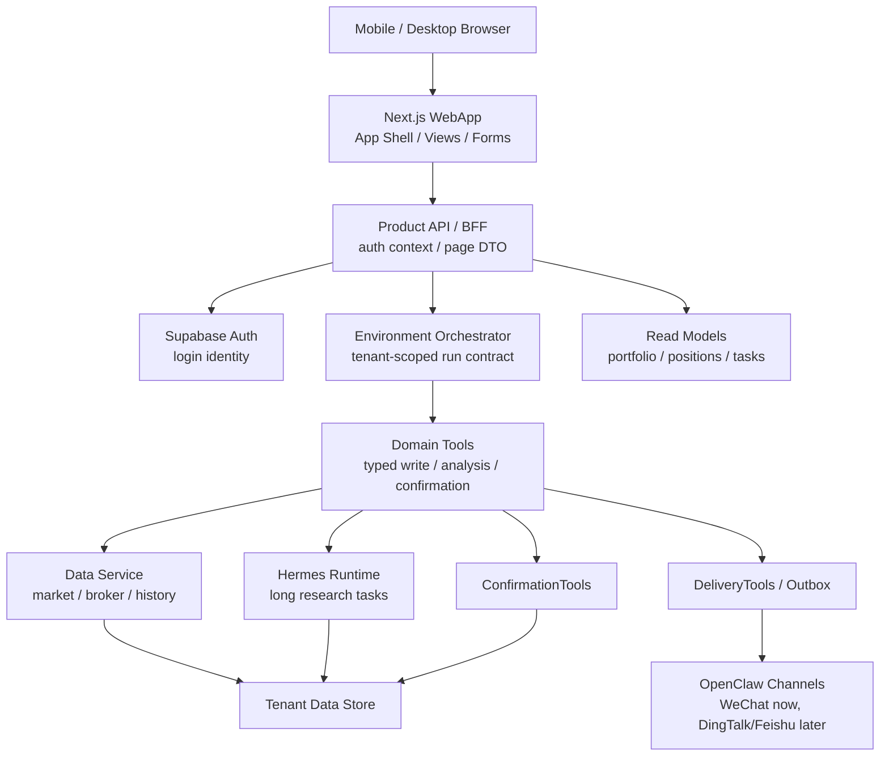
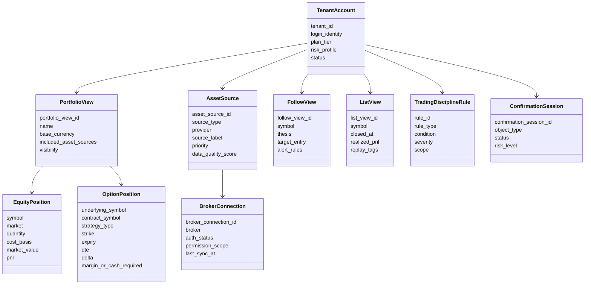
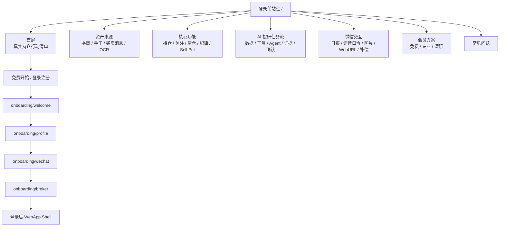
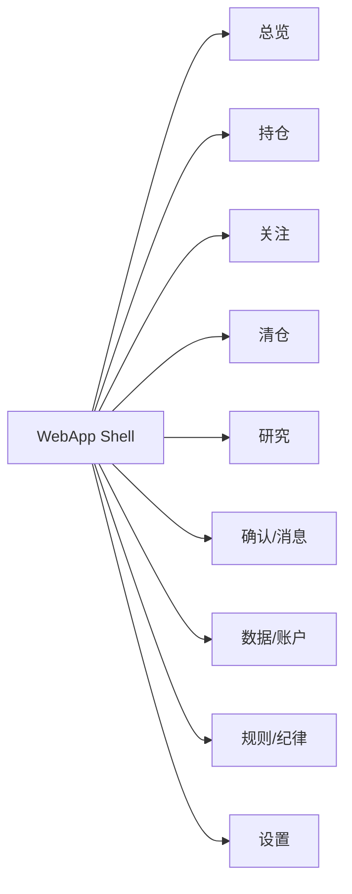
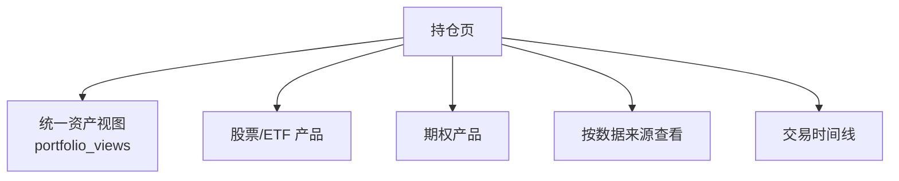
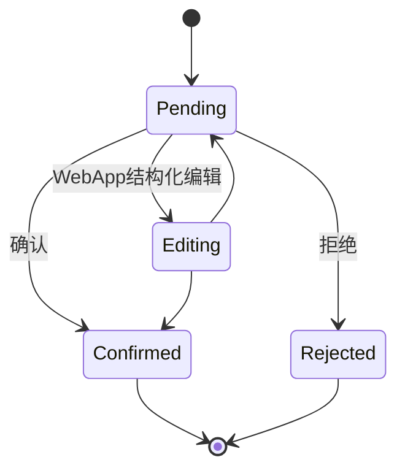
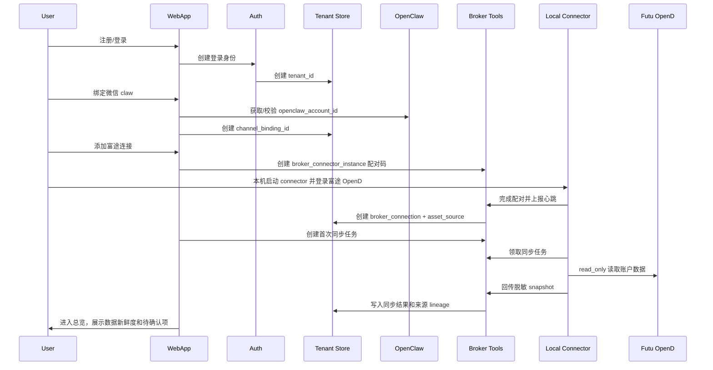

# WebApp 产品体验设计

## 定位

WebApp 分为两层：

1. **登录前站点**：面向传播、注册转化和新用户理解，采用“长期资产管家 + AI 投研任务流”的 B+C 视觉方向，解释资产来源、核心功能、AI 研究任务、微信交互和会员方案。
2. **登录后 WebApp**：3.0 的账号控制台和结构化操作主场。微信 claw 负责高频对话、提醒和轻确认；WebApp 负责登录、绑定、授权、结构化编辑、复杂确认、数据追溯和报告查看。

登录后 WebApp 首屏不是营销页，而是用户进入系统后立即可用的投资工作台。移动端优先，但不把所有内容压成卡片流；股票、期权、资产来源、交易记录这些高密度信息要保留可扫描、可筛选、可下钻的能力。

## 已确认产品决策

| 决策点 | 结论 |
| --- | --- |
| 全局聊天入口 | 不需要。WebApp 不做独立全局聊天，AI 能力嵌入具体页面和任务上下文 |
| Auth | 3.0 首期沿用 Supabase Auth |
| 付费/配额 | 真实付费、配额扣减不进入 P0；登录前站点可以先展示会员方案和权益分层 |
| `portfolio_view` | 首期支持多个 `portfolio_view`，例如全部资产、美股账户、期权策略账户 |
| 富途同步 | 允许用户在 WebApp 手动触发富途实时同步，但必须走队列、限流、审计和 freshness 状态展示 |
| 登录前站点方向 | 以 B「长期资产管家」为主，融合 C「AI 投研任务流」功能介绍；详见 `39-webapp-prelogin-site-bc-design.md` |

## WebApp 与微信分工

| 能力 | 微信 claw | WebApp |
| --- | --- | --- |
| 登录/注册 | 不做 | 主入口，生成 `tenant_id` |
| 微信 claw 绑定 | 只提示去 WebApp | 主入口，创建 `channel_binding_id` |
| 券商授权 | 不做 | 主入口，创建/维护 `broker_connection_id` |
| 账号切换/渠道管理 | 不做 | 主入口 |
| 当前持仓查询 | 高频入口 | 结构化总览和下钻 |
| 交易录入 | 可自然语言/截图触发 | 可表单、批量、文件、OCR 修正 |
| 复杂确认 | 只发摘要和深链 | 主入口，完整上下文确认 |
| 深度研究 | 发起/接收摘要 | 任务中心、报告查看、历史归档 |
| 交易规则/纪律 | 可快捷查询和轻量新增 | 主入口，完整管理和回测关联 |
| 数据源健康 | 简短提示 | 完整数据 lineage、freshness、异常处理 |

## 总体架构图

WebApp 不绕过 Environment Orchestrator 做高风险写入。普通读取可以走 read model；所有会改变事实、规则、授权、确认状态、研究任务的动作，都要生成可审计的 tool call 或 run contract。

## 用户可见领域模型

## 登录前站点信息架构

登录前站点是公开访问的产品介绍层，目标是把系统能力转译成用户能理解的购买和上手路径。首期建议采用单页长页实现，后续可以拆成独立 `/features` 和 `/pricing`。

### 登录前站点页面段落

| 段落 | 用户问题 | 页面表达 |
| --- | --- | --- |
| 首屏 | 这个产品解决什么问题？ | 把真实持仓变成清晰行动，首屏露出持仓视图、风险、待确认和 Sell Put 候选 |
| 资产来源 | 我不连接券商能用吗？ | Futu OpenD、手工录入、买卖消息、OCR、关注清单都能作为来源 |
| 新用户引导 | 我第一次怎么开始？ | 先建立第一份资产视图，再设置纪律、绑定微信、连接券商 |
| 核心功能 | 登录后能做什么？ | 当前持仓、关注清单、清仓复盘、交易纪律、股票分析、Sell Put |
| AI 投研任务流 | AI 是否可追溯？ | 数据进入、规则约束、工具分析、生成报告、微信确认 |
| 微信交互 | 不打开网页能处理吗？ | 日报、确认、语音口令、截图、WebURL、失败补偿 |
| 会员方案 | 为什么付费？ | 更多资产来源、更高频提醒、Sell Put、深研任务和证据链 |

登录前站点的原型见：

- `product-design-v3/39-webapp-prelogin-site-bc-design.md`
- `product-design-v3/prototypes/webapp-prelogin-site-bc.html`
- `product-design-v3/prototypes/webapp-prelogin-site-bc-desktop.png`
- `product-design-v3/prototypes/webapp-prelogin-site-bc-mobile.png`

## 登录后 App 信息架构

### 桌面端导航

桌面端适合左侧导航 + 顶部账号/数据状态条。顶部状态条常驻展示：

1. 当前 `portfolio_view`。
2. 数据新鲜度：富途、腾讯财经、历史行情、本地缓存。
3. 当前市场状态：A 股、港股、美股、盘前盘后。
4. 未处理确认数、异常同步数、运行中任务数。

### 移动端导航

移动端底部建议只保留 5 个一级入口：

| Tab | 内容 |
| --- | --- |
| 总览 | 资产、今日变化、风险、待处理事项 |
| 持仓 | 股票/ETF 与期权分区 |
| 关注 | follow_views、机会、提醒 |
| 研究 | 深研任务、报告、复盘 |
| 我的 | 数据源、规则、绑定、设置 |

“确认/消息”不放进底部 Tab，作为全局右上角 inbox badge 和 push 深链进入，避免占用高频导航位。

## 核心页面设计

### 1. 总览 Dashboard

目标：让用户 30 秒内知道“我的资产现在是否正常、今天需要看什么、有没有必须处理的事项”。

模块：

| 模块 | 内容 |
| --- | --- |
| 资产摘要 | 总资产、现金、股票市值、期权保证金/现金占用、今日盈亏、累计盈亏 |
| 数据状态 | 主源、校验源、最后同步时间、异常源、freshness badge |
| 风险雷达 | 仓位集中度、单标的暴露、期权 DTE、纪律冲突、止损/止盈触发 |
| 今日行动 | 待确认交易、到期/临近到期期权、异动持仓、深研完成 |
| 快捷入口 | 录入交易、同步券商、上传截图、创建关注、发起研究 |

Dashboard 不直接展示过多长文分析。长分析只展示结论卡和“查看报告”。

### 2. 持仓 Portfolio

持仓页是 3.0 的核心工作台，分为统一视图和两个产品明细。

统一视图过滤器：

| 维度 | 例子 |
| --- | --- |
| 市场 | A 股、港股、美股 |
| 品种 | 正股、ETF、期权 |
| 来源 | 富途、长桥、PTrade、手工、微信消息、OCR |
| 账户 | 综合、单券商、单 portfolio view |
| 状态 | 持仓中、待确认、同步异常 |

首期支持多个 `portfolio_view`。用户可以创建“全部资产”“美股账户”“期权策略账户”等视图；每个视图记录包含的数据来源、市场、品种和默认展示货币。`portfolio_view` 只是视图与策略分组，不拥有真实资产，真实资产仍来自 `asset_sources` 和交易事实。

### 3. 股票/ETF 持仓

核心字段：

| 字段 | 说明 |
| --- | --- |
| 标的 | symbol、名称、市场、币种 |
| 仓位 | 数量、市值、组合占比 |
| 成本 | 平均成本、总成本、来源 |
| 盈亏 | 浮盈亏、今日盈亏、已实现盈亏 |
| 策略 | 止盈、止损、加仓条件、纪律冲突 |
| 数据 | 主源、价格时间、置信度 |

主要动作：

1. 查看持仓分析。
2. 设置止盈止损。
3. 加入/移出关注。
4. 查看交易时间线。
5. 发起个股深研。
6. 标记清仓复盘。

### 4. 期权持仓

期权页不复用股票表格，单独设计。首期重点围绕 sell put。

核心字段：

| 字段 | 说明 |
| --- | --- |
| 合约 | underlying、expiry、strike、put/call、contract_symbol |
| 策略 | sell put、covered call、其他 |
| 状态 | open、closing、expired、assigned、rolled |
| DTE | 到期天数和临近到期提醒 |
| 权利金 | 开仓权利金、当前价格、已实现/未实现 |
| 风险 | delta、IV、moneyness、assignment risk |
| 资金 | cash secured、margin required、组合现金占用 |
| 流动性 | bid/ask spread、open interest、volume |

主要动作：

1. sell put 风险分析。
2. 查看 assignment 场景。
3. 到期/roll/平仓提醒。
4. 生成交易草稿，但不自动下单。
5. 对比候选 strike 和 DTE。

### 5. 关注 Follow Views

关注不是普通 watchlist，而是“可能要买入/卖出期权的候选资产池”。

字段：

| 字段 | 说明 |
| --- | --- |
| 标的 | symbol、市场、品种 |
| 关注原因 | thesis、事件、技术形态、估值区间 |
| 目标条件 | 买入价、回调比例、突破价、IV 阈值、sell put strike 区间 |
| 纪律规则 | 是否受“不买中概股”等规则约束 |
| 提醒 | 价格提醒、财报提醒、异动提醒、期权 IV 提醒 |
| 状态 | active、paused、converted_to_position、archived |

### 6. 清仓 List Views

清仓页用于历史持仓查询、复盘和二次买入策略。

字段：

| 字段 | 说明 |
| --- | --- |
| 标的 | symbol、市场、品种 |
| 持有周期 | first_buy_at、last_sell_at、holding_days |
| 已实现盈亏 | realized_pnl、return_pct、fees |
| 退出原因 | 止盈、止损、纪律、基本面变化、资金调仓 |
| 复盘标签 | missed_sell、good_entry、bad_timing、rule_violation |
| 二次买入条件 | target_reentry_price、event_trigger、cooldown_until |

### 7. 交易记录与导入

WebApp 支持四类结构化入口：

| 入口 | 用途 | 确认规则 |
| --- | --- | --- |
| 手工表单 | 单笔买入/卖出/期权开平仓 | 必须确认 |
| 自然语言输入 | 和微信一致，但展示结构化预览 | 必须确认 |
| 图片/OCR 上传 | 成交截图、持仓截图 | 低置信字段必须修正 |
| 文件导入 | CSV、券商对账单 | 批量预览 + 批量确认 |

所有写入都必须保留 `source_type`、`asset_source_id`、`created_by_channel`、`raw_input_ref` 和 `confirmation_session_id`。

### 8. 规则与交易纪律

规则页服务于“操作前提醒”和“复盘时归因”。

规则类型：

| 类型 | 示例 |
| --- | --- |
| 禁止类 | 不买中概股、盘前盘后不下单、不裸卖 call |
| 限额类 | 单标的不超过 20%、单笔期权现金占用不超过 10% |
| 条件类 | 财报前不卖 put、IV 低于某阈值不卖 put |
| 提醒类 | 盈利超过 30% 提醒止盈、DTE 小于 7 天提醒处理 |
| 复盘类 | 违反规则时要求填写原因 |

WebApp 要展示规则命中记录：哪次交易、哪条规则、用户是否 override、override 原因。

### 9. 确认与消息中心

WebApp 是复杂确认主场。

确认对象：

1. OCR 多字段修正。
2. 交易录入确认。
3. 批量导入确认。
4. 高风险期权草稿确认。
5. 规则 override 确认。
6. 数据冲突处理：券商数据和手工数据不一致。

微信和 WebApp 共用同一套 `confirmation_sessions`。一端处理后，另一端必须立即显示已处理/已失效。

### 10. 数据与账户

这一组页面放在“我的”或“数据/账户”下。

| 页面 | 能力 |
| --- | --- |
| 账号资料 | 邮箱、手机号、登录安全、订阅计划 |
| 微信绑定 | 创建/查看 `channel_binding_id`、状态、openclaw_account_id、推送测试 |
| 券商连接 | 富途优先，长桥/PTrade 后续；授权状态、权限范围、同步日志 |
| 数据来源 | 手工、微信消息、OCR、券商 API、文件导入的来源列表 |
| 数据质量 | freshness、source tier、异常冲突、最近修复 |
| 通知策略 | 收盘推送、异动提醒、quiet hours、渠道优先级 |

富途连接页允许用户手动触发实时同步。触发后不是前端直接拉券商接口，而是创建 `broker_sync_job`，由用户本机的 Futu local connector 主动领取任务、读取本地 OpenD 并回传脱敏快照；BrokerTools 按租户、券商、接口频率和用户套餐限流执行。页面展示排队中、同步中、成功、失败、部分成功和最近数据时点。

## 首次使用流程

如果用户先从微信入口进入，可以按已有架构创建 `pending_claim` 的临时 `tenant_id`，但完整注册、绑定确认和授权仍在 WebApp 完成。

## AI 交互在 WebApp 中的位置

WebApp 不做全局聊天入口。AI 应该嵌入具体页面上下文，作为页面动作、解释按钮、分析任务和确认辅助出现：

| 场景 | 交互形态 |
| --- | --- |
| Dashboard | “解释今日变化”“生成今日摘要” |
| 股票持仓详情 | “分析这只持仓”“生成止盈止损建议” |
| 期权详情 | “解释 assignment 风险”“比较 roll 方案” |
| 关注页 | “筛选本周适合 sell put 的标的” |
| 清仓页 | “复盘这笔交易”“生成二次买入条件” |
| 规则页 | “检查这笔交易是否违反纪律” |

每个 AI 入口都必须带页面上下文、数据快照、可用工具范围和输出上限。长任务进入 Hermes，短解释由日常模型完成。

## 移动端适配原则

1. 总览和详情优先，复杂表格变成“摘要行 + 详情抽屉”。
2. 股票和期权不要混在一个长列表里；移动端也要保留产品切换。
3. 关键数字必须展示数据时点和来源 badge。
4. 高风险确认不在小弹窗里完成，跳完整确认页。
5. 所有主动作固定在底部操作条，避免用户滚动后丢失上下文。
6. 图表要有结构化替代文本和明细表入口。

## WebApp API/BFF 契约

WebApp 读取可以走专门 read model，写入必须走工具契约。

| 动作 | 推荐路径 |
| --- | --- |
| 获取总览 | `GET /portfolio/overview` read model |
| 获取股票持仓 | `GET /positions/equity` read model |
| 获取期权持仓 | `GET /positions/options` read model |
| 创建关注 | `FollowViewTools.create` |
| 创建清仓复盘 | `ClosedPositionTools.create_review` |
| 手工录入交易 | `ConfirmationTools.open_confirmation_session` |
| 修改交易纪律 | `TradingDisciplineTools.upsert_rule` + confirmation |
| 触发券商同步 | `BrokerTools.enqueue_sync` |
| 发起深研 | `HandoffProgressTools.create_task` |
| 发送测试推送 | `DeliveryTools.test_channel_delivery` |

客户端不直接拼 `tenant_id` 查询其他账号数据。`tenant_id` 来自登录态，服务端注入 run contract；所有写操作带 `idempotency_key`。

## 权限和安全

1. 券商 token 只存在服务端 secret vault，WebApp 不可读。
2. WebApp 下载报告、图片、语音、CSV 时要使用短期签名链接。
3. 复杂确认深链必须绑定登录态和 `confirmation_session_id`，不能仅靠 URL token。
4. 管理后台默认脱敏，不直接展示用户完整持仓，除非有明确授权和审计。
5. 未来支持多渠道后，WebApp 是唯一渠道绑定管理台。

## MVP 分期

### P0

1. 登录/注册，生成 `tenant_id`。
2. 微信绑定管理。
3. 富途券商连接和同步状态。
4. 富途手动同步触发、排队状态、同步结果和数据时点展示。
5. 多个 `portfolio_view` 的创建、编辑和默认视图选择。
6. 总览 Dashboard。
7. 股票/ETF 持仓页。
8. 期权持仓页，sell put 字段优先。
9. 关注 follow_views。
10. 清仓 list_views。
11. 交易录入和确认中心。
12. 交易规则/纪律管理。
13. 深研任务中心和报告查看。
14. 通知策略和推送测试。

### P1

1. OCR 图片上传和批量修正。
2. 文件导入和批量确认。
3. 历史行情回放和清仓复盘增强。
4. sell put 候选筛选器。
5. 数据质量和冲突处理控制台。
6. 付费计划、用量和配额展示。

### P2

1. 钉钉、飞书渠道绑定。
2. 多组合/家庭账户协作。
3. 高级回测与策略模板。
4. Ops 管理后台。
5. 只读投顾/会计/家人共享视图。

## 需要确认的产品点

以上 5 个 P0 产品点已经确认：

1. 不需要全局聊天入口。
2. 沿用 Supabase Auth。
3. 付费/配额不进入 P0。
4. 首期支持多个 `portfolio_view`。
5. 允许用户手动触发富途实时同步。

后续 WebApp 还需要在进入 PRD 前确认更细的页面优先级、移动端首屏布局和多 `portfolio_view` 的默认模板。
