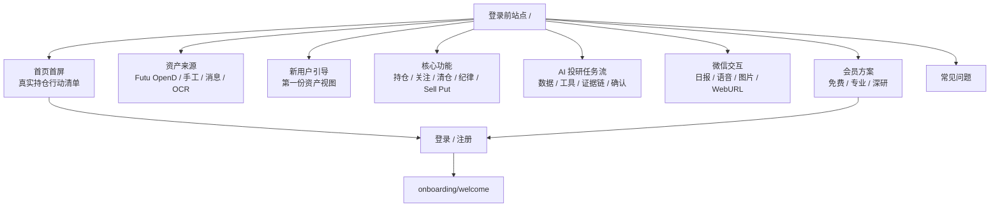
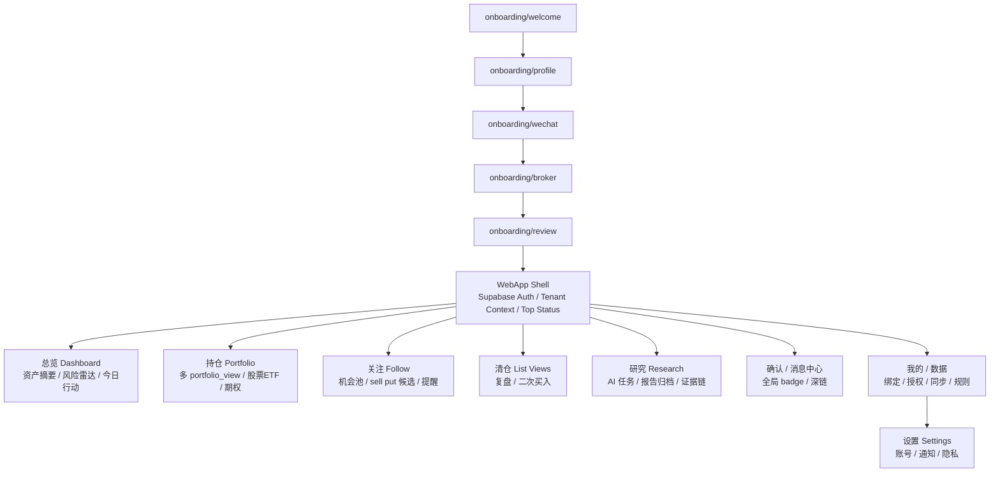
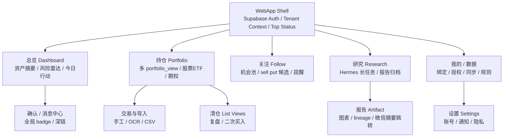

# WebApp 站点层级与高保真原型

## 当前确认结论

本文件现在同时覆盖两类页面：

1. **登录前站点**：以 B「长期资产管家」为主视觉，融合 C「AI 投研任务流」的功能介绍。用于传播、注册转化、功能解释和会员权益展示。
2. **登录后工作台**：沿用红色专业工具风格，承载账号控制台、持仓工作台、确认中心、数据/规则管理和研究报告。

登录前站点已经形成独立高保真原型：

- [登录前站点设计说明](./39-webapp-prelogin-site-bc-design.md)
- [登录前站点 HTML 原型](./prototypes/webapp-prelogin-site-bc.html)
- [桌面截图](./prototypes/webapp-prelogin-site-bc-desktop.png)
- [移动端截图](./prototypes/webapp-prelogin-site-bc-mobile.png)

## 参考风格提炼

附件参考图的关键风格不是单纯暗色，而是“专业交易终端”的信息组织方式：

1. 黑色浏览器/终端窗口作为整体容器。
2. 左侧控制台承载输入、授权、数据源和快捷动作。
3. 右侧主工作台承载核心结论、图表、候选/持仓列表。
4. 当前确认主色改为红色系，用于品牌、选中态、主动作和关键实时数字；告警仍用琥珀色，辅助模块保留少量青色/紫色区分信息域。
5. 所有卡片边界清晰，圆角克制，文本密度较高。
6. 图表和数字来自结构化数据，而不是装饰性视觉。
7. Dashboard 的主工作区优先展示持仓和 Sell Put 资金占用，趋势图下移；富途同步不作为主界面核心功能点，只作为数据 freshness 状态出现。

3.0 WebApp 可以继承这套气质，但业务上要从“单点期权扫描器”升级成“多账户持仓工作台”。

## 更新后的 WebApp Sitemap

### 登录前站点层级

### 登录后 App 层级

### 编码路由映射

| 路由 | 层级 | 页面角色 |
| --- | --- | --- |
| `/` | 登录前 | 公开首页，使用 B+C 登录前站点设计 |
| `/features` | 登录前 | 核心功能介绍页 |
| `/pricing` | 登录前 | 会员权益展示页，P0 不接真实支付 |
| `/login` | 登录前到登录后 | 登录 / 注册入口 |
| `/onboarding/welcome` | 登录后初始化 | 注册后第一屏，选择资产来源和引导路径 |
| `/onboarding/profile` | 登录后初始化 | 风险偏好和基础设置 |
| `/onboarding/wechat` | 登录后初始化 | 微信 ClawBot 绑定 |
| `/onboarding/broker` | 登录后初始化 | 券商 / Futu OpenD 配对 |
| `/dashboard` | 登录后 | 当前总览工作台从 `/` 平移到此处 |
| `/holdings`、`/sell-put`、`/confirmations`、`/data`、`/rules`、`/settings` | 登录后 | 保持当前 P0 工作台路由 |

### 旧版登录后站点层级图

设计结论：

| 层级 | 设计 |
| --- | --- |
| 移动端主导航 | 总览、持仓、关注、研究、我的 |
| 桌面端扩展导航 | 总览、持仓、关注、清仓、研究、确认/消息、数据/账户、规则/纪律、设置 |
| 确认中心 | 不占移动端底部 Tab，使用全局 badge 和深链进入 |
| WebApp Shell | 负责 Supabase Auth、tenant context、当前 `portfolio_view`、数据新鲜度和市场状态 |
| 绑定/授权/同步 | 只在 WebApp 完成，不在微信对话内完成 |

## 登录前高保真原型

登录前站点定稿采用：

| 页面段落 | 说明 |
| --- | --- |
| 首页首屏 | 把真实持仓变成清晰行动，首屏露出产品界面、数据来源、待确认动作 |
| 资产来源 | 解释 Futu OpenD、手工录入、买卖消息、OCR、关注清单 |
| 新用户引导 | 先建立第一份资产视图，再绑定微信、设置纪律、连接券商 |
| 核心功能 | 当前持仓、关注清单、清仓复盘、交易纪律、股票分析、Sell Put |
| AI 投研任务流 | 数据进入、规则约束、工具分析、生成报告、微信确认 |
| 微信交互 | 日报、确认、语音口令、截图、WebURL、失败补偿 |
| 会员方案 | 免费版、专业版、深研版；P0 可先展示权益，不接真实计费 |

## 登录后高保真原型

原型选择的是桌面端 Dashboard，因为它最能代表整个 WebApp 的信息架构和视觉语言。

## 移动端适配原型

移动端采用 5 个主 Tab：总览、持仓、关注、研究、我的。确认中心不占底部导航位，而是通过待处理数字、全局 badge 和消息深链进入。

移动端首屏只保留：

1. 当前 `portfolio_view` 和数据新鲜度。
2. 四个最关键指标：总资产、今日盈亏、现金/保证金、待处理。
3. 今日结论摘要。
4. 重点持仓摘要。
5. Sell Put 资金占用摘要。
6. 组合净值小图。

### 页面结构

| 区域 | 内容 |
| --- | --- |
| 顶部窗口/导航 | 类浏览器窗口、当前路径、主导航、LIVE ACCOUNT 状态 |
| 左侧控制台 | 资产信息、当前 `portfolio_view`、Supabase 登录态、微信绑定、数据 freshness、快捷操作、交易纪律 |
| 主工作台第一层 | 今日持仓结论、股票/ETF 持仓、Sell Put 监控和资金占用 |
| 今日结论 | 组合状态、数据源状态、sell put 风险、今日行动 |
| 图表区 | 组合净值、期权风险/DTE/现金占用，放在持仓信息之后 |
| 数据同步入口 | 不在 Dashboard 强展示；进入“我的 / 数据”里的券商连接页触发 |

### 视觉规范草案

| 项 | 规范 |
| --- | --- |
| 背景 | `#050606` / `#0b0d0e` 终端黑 |
| 面板 | `#141619`，1px 冷灰描边 |
| 主色 | 红色系 `#ff1f3d` / `#ff4357`，用于品牌、选中态、主动作、关键实时数字 |
| 辅色 | 青色表示持仓/数据，紫色表示关注，琥珀表示研究/注意和风险提示 |
| 圆角 | 4px-8px，保持工具感 |
| 字体 | 中文优先系统无衬线；数字/代码用等宽字体 |
| 图表 | 确定性 SVG/Canvas 渲染，不使用生成式图片表达财务事实 |

## 旧版登录后 App Mermaid 源

## 本轮产物文件

| 文件 | 说明 |
| --- | --- |
| `prototypes/webapp-sitemap-prelogin-bc.svg` | 登录前站点 + 登录后工作台的新版 sitemap |
| `prototypes/webapp-sitemap-prelogin-bc.png` | 新版 sitemap 渲染图 |
| `39-webapp-prelogin-site-bc-design.md` | B+C 登录前站点设计说明 |
| `prototypes/webapp-prelogin-site-bc.html` | B+C 登录前站点完整 HTML 原型 |
| `prototypes/webapp-prelogin-site-bc-desktop.png` | B+C 登录前站点桌面截图 |
| `prototypes/webapp-prelogin-site-bc-mobile.png` | B+C 登录前站点移动端截图 |
| `prototypes/webapp-site-map-red.png` | 红色主色站点层级渲染图 |
| `prototypes/webapp-site-map-red.svg` | 红色主色站点层级 SVG 源 |
| `prototypes/webapp-dashboard-terminal-prototype-red.png` | 红色主色桌面 Dashboard 原型 |
| `prototypes/webapp-dashboard-terminal-prototype-red.svg` | 红色主色桌面原型 SVG 源 |
| `prototypes/webapp-dashboard-mobile-red.png` | 红色主色移动端 Dashboard 原型 |
| `prototypes/webapp-dashboard-mobile-red.svg` | 红色主色移动端 SVG 源 |
| `prototypes/webapp-site-map.png` | 绿色参考版站点层级渲染图 |
| `prototypes/webapp-dashboard-terminal-prototype.png` | 绿色参考版 Dashboard 原型 |
| `prototypes/render-webapp-prototype.js` | 原型渲染脚本 |
