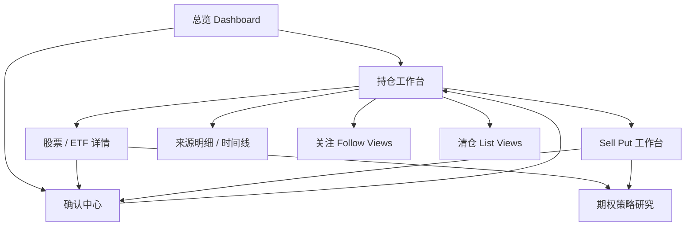

# WebApp 核心页面拆解

## 拆解顺序

Dashboard 已确认后，P0 核心页面按“高频查看 + 高风险操作 + 产品分离”的顺序拆：

1. **持仓工作台**：所有资产的结构化总入口。
2. **股票 / ETF 详情**：单个股票或 ETF 的持仓分析、交易时间线和纪律检查。
3. **Sell Put 工作台**：期权产品独立页，围绕现金占用、DTE、IV、assignment risk 和交易纪律。
4. **确认中心**：所有会改变事实或需要高注意力的人审入口。

这四页覆盖 P0 的主闭环：查看持仓、理解风险、生成草稿、确认写入。

## 页面关系

## 1. 持仓工作台

### 定位

持仓工作台是 WebApp 的核心页，不是 Dashboard 的重复。Dashboard 用于“今天要看什么”，持仓页用于“我到底持有什么、来源是什么、风险在哪里、怎么下钻”。

### 信息优先级

| 优先级 | 模块 | 说明 |
| --- | --- | --- |
| P0 | `portfolio_view` 切换 | 全部资产、美股账户、期权策略账户等多视图 |
| P0 | 股票/ETF 持仓 | 独立表格，展示仓位、盈亏、纪律状态 |
| P0 | 期权持仓 | 独立卡片，展示 DTE、IV、cash secured、风险等级 |
| P0 | 风险雷达 | 仓位集中度、Sell Put 现金占用、到期风险、数据 freshness |
| P1 | 来源明细 | 按富途、手工、OCR、微信消息、文件导入筛选 |
| P1 | 时间线 | 所有交易、确认、修正、规则命中事件 |

### 关键交互

| 交互 | 行为 |
| --- | --- |
| 切换 `portfolio_view` | 重新加载持仓 read model，不改变真实资产 |
| 点击股票行 | 进入股票 / ETF 详情 |
| 点击期权卡片 | 进入 Sell Put / 期权详情 |
| 查看来源明细 | 展示每个仓位由哪些 `asset_sources` 构成 |
| 管理 portfolio view | 进入视图编辑，改变包含来源、市场、品种和默认货币 |

### 页面契约

| 类型 | 契约 |
| --- | --- |
| 读取 | `GET /portfolio/overview`、`GET /positions/equity`、`GET /positions/options` |
| 写入 | 不直接写交易事实；只允许写 `portfolio_view` 配置 |
| 风险 | 不在本页直接确认高风险草稿，跳确认中心 |
| 数据 | 所有数字展示 `source_tier`、`freshness_at` 和 `confidence` |

## 2. 股票 / ETF 详情

### 定位

股票 / ETF 详情页回答三个问题：

1. 这只标的现在赚亏多少，收益从哪里来。
2. 当前风险和纪律冲突在哪里。
3. 下一步应该观察、止盈、止损、加仓还是复盘。

### 页面模块

| 模块 | 内容 |
| --- | --- |
| 持仓摘要 | 仓位占比、市值、成本、浮盈亏、数据源 |
| 纪律命中 | 仓位集中、财报前操作、止盈止损线 |
| 价格与收益路径 | 价格趋势、买入成本、现价、收益区间 |
| 止盈 / 止损策略 | 止盈区、止损线、加仓条件、动作上限 |
| 交易时间线 | 买入、加仓、规则提醒、AI 分析、确认记录 |
| 页面内 AI | 解释变化、生成止盈止损建议、检查纪律、发起深研 |

### 写入边界

| 动作 | 处理 |
| --- | --- |
| 设置止盈止损 | `TradingDisciplineTools` 或 strategy rule，必要时确认 |
| 发起个股深研 | `HandoffProgressTools.create_task` |
| 录入交易 | 打开 `ConfirmationTools.open_confirmation_session` |
| 标记清仓复盘 | 进入清仓 `list_views` 写入流 |

股票详情页可以生成分析和策略草稿，但不能直接写交易事实，不能自动下单。

## 3. Sell Put 工作台

### 定位

Sell Put 是期权产品的首期核心策略页。它不复用股票详情页，而是独立围绕以下维度组织：

1. 现金可用与占用。
2. DTE 到期梯队。
3. IV、delta、premium、bid/ask spread。
4. 是否愿意接股。
5. 交易纪律和确认。

### 页面模块

| 模块 | 内容 |
| --- | --- |
| 现金 KPI | 现金可用、Sell Put 占用、7 天内到期、高注意、候选池 |
| 当前持仓 | 每个 short put 合约的 DTE、delta、IV、cash required、风险等级 |
| 资金占用结构 | 现金担保、保证金、剩余现金、纪律上限 |
| 到期梯队 | DTE 0-7、8-21、22-45、45+ |
| 候选 Strike 对比 | underlying、strike、DTE、IV、premium、纪律结果 |
| 交易纪律与确认 | 愿接股规则、财报前限制、现金占用模拟、确认入口 |

### 风控门

| 条件 | 结果 |
| --- | --- |
| 不在愿接股标的池 | 不能进入推荐，只能作为观察 |
| 财报前高 IV | 只能 analysis_only，不能生成执行清单 |
| 现金占用超过上限 | 阻断草稿，提示释放现金或降低张数 |
| DTE 过近且 ITM | 强制进入高注意确认 |
| 数据非 Futu 主源或过期 | 降级为信息展示，不生成候选 |

### 输出边界

Sell Put 页可以生成“交易草稿”和“人工执行清单”，但确认只表示用户理解并记录，不等于自动下单授权。

## 4. 确认中心

### 定位

确认中心是 WebApp 的高注意力页面。凡是会改变事实、产生交易草稿、修正规则、override 风险纪律或批量导入，都在这里统一确认。

### 确认对象类型

| 类型 | 示例 |
| --- | --- |
| 交易事实 | 手工买入、卖出、期权开仓/平仓 |
| OCR 修正 | 截图识别价格、数量、合约字段低置信 |
| 交易草稿 | Sell Put 候选、roll、平仓、加仓草稿 |
| 规则 override | 违反“不买中概股”“盘前盘后不下单”等纪律 |
| 批量导入 | CSV 或券商对账单导入 |
| 数据冲突 | 富途数据与手工/OCR 数据不一致 |

### 确认结构

| 区域 | 内容 |
| --- | --- |
| 待处理列表 | 按全部、交易、OCR、规则分类 |
| 确认对象 | 对象类型、风险等级、状态、数据时点、动作上限 |
| 结构化明细 | 合约/标的、持仓、权利金、现金占用、建议动作 |
| 证据与审计 | 数据来源、规则命中、模型、RiskReview 结果 |
| 用户备注 | override 原因或执行备注 |
| 操作按钮 | 确认并记录、拒绝/退回 |

### 审计要求

确认中心的每次提交必须写入：

| 字段 | 说明 |
| --- | --- |
| `confirmation_session_id` | 确认会话 |
| `tenant_id` | 账号隔离 |
| `object_type` | 确认对象类型 |
| `source_snapshot_hash` | 源数据快照 |
| `risk_level` | 风险等级 |
| `confirmed_by` | 用户身份 |
| `confirmed_at` | 确认时间 |
| `channel` | webapp / wechat |
| `user_note` | 用户备注或 override 原因 |

## 后续页面拆分

这四页确认后，下一批页面建议拆：

| 页面 | 原因 |
| --- | --- |
| Follow Views | 机会捕捉和买入前管理 |
| Closed/List Views | 清仓回溯和二次买入策略 |
| Research / Artifact | Hermes 长任务、报告和推送深链 |
| My / Data | 微信绑定、富途授权、数据质量、手动同步 |
| Rules / Discipline | 交易纪律完整管理 |

## 本轮产物文件

| 文件 | 说明 |
| --- | --- |
| `prototypes/webapp-core-portfolio-red.png` | 持仓工作台 |
| `prototypes/webapp-core-equity-detail-red.png` | 股票 / ETF 详情 |
| `prototypes/webapp-core-sellput-red.png` | Sell Put 工作台 |
| `prototypes/webapp-core-confirmation-red.png` | 确认中心 |
| `prototypes/render-core-pages.js` | 核心页面原型渲染脚本 |
