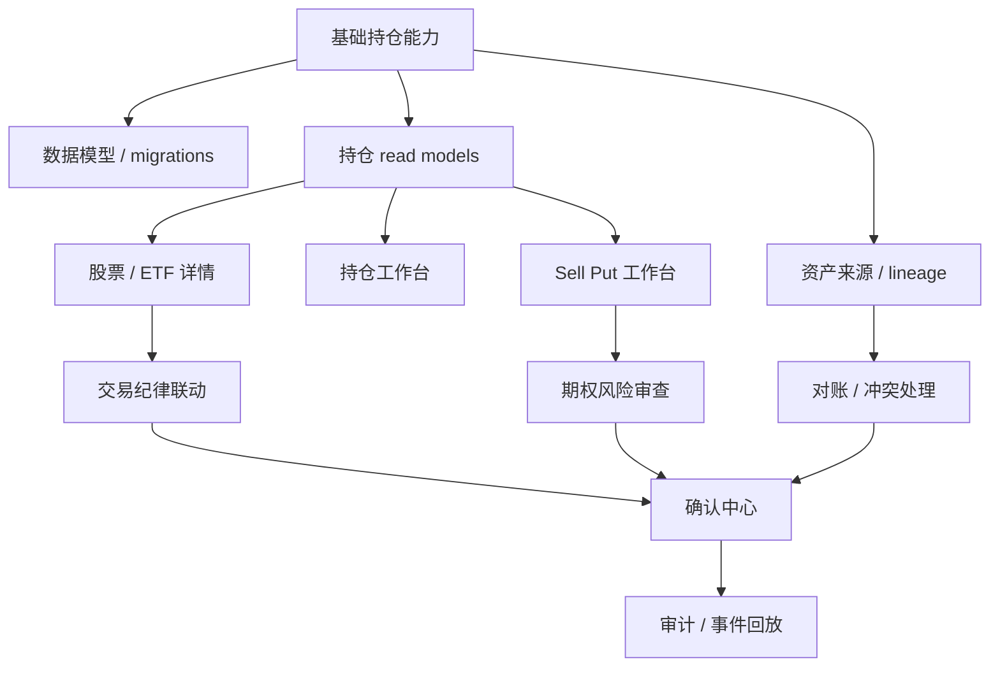
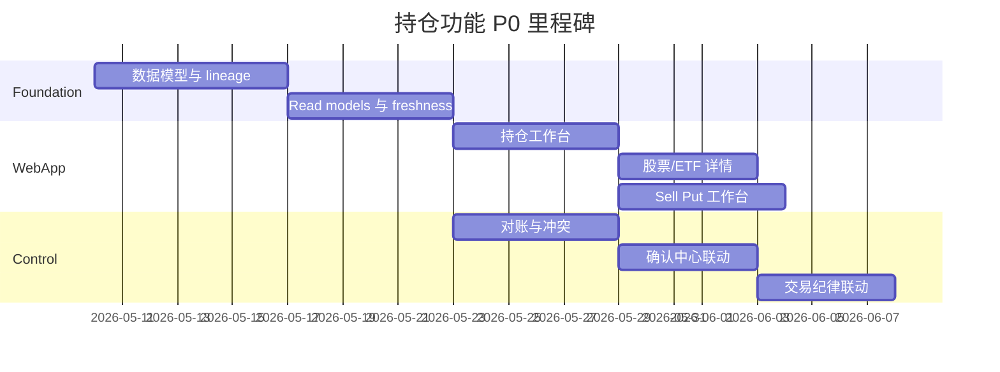

# 持仓功能任务清单

## 目标

围绕 WebApp P0 的持仓功能，形成一份可进入 PRD、研发拆票和验收的任务清单。范围覆盖：

1. 多 `portfolio_view`。
2. 股票 / ETF 持仓。
3. 期权持仓，首期重点 Sell Put。
4. 多来源资产数据与对账。
5. 持仓分析、交易纪律和确认中心联动。

本清单不覆盖机会捕捉、研究报告、清仓复盘和完整账户设置页；这些在后续模块拆。

## 任务地图

## P0 Epic 总览

| Epic | 目标 | 优先级 |
| --- | --- | --- |
| HLD-01 多资产视图 | 支持一个账号下多个 `portfolio_view` | P0 |
| HLD-02 持仓数据模型 | 股票/ETF 与期权分离建模 | P0 |
| HLD-03 资产来源与 lineage | 所有持仓、成交、现金、期权数据可追溯来源 | P0 |
| HLD-04 持仓 read model | 为 WebApp 和微信提供稳定、快速、可解释的持仓读取模型 | P0 |
| HLD-05 持仓工作台 | 展示股票/ETF、期权、风险雷达和数据 freshness | P0 |
| HLD-06 股票/ETF 详情 | 单标的持仓、盈亏、交易时间线、止盈止损和纪律检查 | P0 |
| HLD-07 Sell Put 工作台 | 期权持仓、现金占用、DTE、IV、assignment risk | P0 |
| HLD-08 对账与冲突 | 券商、手工、OCR、微信消息数据冲突进入确认流 | P0 |
| HLD-09 交易纪律联动 | 持仓页和详情页展示规则命中和 override 入口 | P0 |
| HLD-10 确认中心联动 | 高风险动作、交易草稿、OCR 修正和冲突处理进入统一确认 | P0 |

## HLD-01 多资产视图

### 用户故事

用户希望在同一个系统账号下查看不同组合视图，例如“全部资产”“美股账户”“期权策略账户”，但不希望这些视图复制或改变真实资产。

### 任务

| ID | 任务 | 依赖 | 验收 |
| --- | --- | --- | --- |
| HLD-01-01 | 设计 `portfolio_views` 字段：名称、默认货币、包含市场、品种、来源、排序、默认视图 | 已确认首期支持多个视图 | 字段能表达全部资产、美股账户、期权策略账户 |
| HLD-01-02 | 设计 `portfolio_view_sources` / filter config | HLD-01-01 | 一个 view 可包含多个 `asset_source_id` 和市场/品种过滤 |
| HLD-01-03 | WebApp 视图切换状态 | HLD-04 | 切换 view 后持仓、风险、趋势图都更新 |
| HLD-01-04 | 默认 view 和最近使用 view | Supabase Auth / tenant context | 用户重新登录后回到最近视图 |
| HLD-01-05 | 视图编辑确认规则 | ConfirmationTools | 修改 view 不改变交易事实，但需要审计 |

### 不做

1. 不把 `portfolio_view` 当作真实账户。
2. 不在 `portfolio_view` 里复制持仓数据。
3. 不支持跨 `tenant_id` 共享视图，后续家庭/团队再设计。

## HLD-02 持仓数据模型

### 任务

| ID | 任务 | 依赖 | 验收 |
| --- | --- | --- | --- |
| HLD-02-01 | 建立 `instruments` 统一标的主数据 | symbol registry | 股票、ETF、期权合约都能统一索引 |
| HLD-02-02 | 建立 `equity_instruments` 扩展 | HLD-02-01 | 股票/ETF 支持行业、市场、币种、lot size |
| HLD-02-03 | 建立 `option_contracts` 扩展 | HLD-02-01 | 合约包含 underlying、put/call、strike、expiry、multiplier |
| HLD-02-04 | 建立 `portfolio_positions` 统一骨架 | HLD-01 | 只放共用字段，不塞期权 Greeks 或股票基本面 |
| HLD-02-05 | 建立 `equity_positions` 扩展 | HLD-02-04 | 支持股票/ETF 数量、成本、市值、仓位、止盈止损 |
| HLD-02-06 | 建立 `option_positions` 扩展 | HLD-02-04 | 支持 DTE、IV、Greeks、bid/ask、现金/保证金、assignment risk |
| HLD-02-07 | 建立 `cash_balances` / `margin_balances` | Broker source | Sell Put 资金占用可计算 |
| HLD-02-08 | 建立 position snapshot 表 | HLD-04 | 可保存每日/同步后的持仓快照用于趋势和复盘 |

### 验收口径

1. 股票/ETF 和期权字段不混用。
2. 单个期权合约必须能关联 underlying。
3. 任一持仓行必须知道 `tenant_id`、`portfolio_view_id`、`instrument_id`、`as_of`、`source_lineage`。
4. 现金与保证金是独立资产状态，不从股票市值里推测。

## HLD-03 资产来源与 Lineage

### 任务

| ID | 任务 | 依赖 | 验收 |
| --- | --- | --- | --- |
| HLD-03-01 | 标准化 `asset_sources` 类型 | 账号模型 | 支持 broker_api、manual、message_trade_input、broker_message、ocr、file_import、derived |
| HLD-03-02 | 每条交易事件写入 `source_lineage` | HLD-02 | 可追溯原始消息、截图、券商同步 run 或人工录入 |
| HLD-03-03 | 设计 `raw_input_refs` | OCR / 微信 / 文件 | 原始输入可查但敏感数据可脱敏 |
| HLD-03-04 | 数据质量元数据 | Data Service | 每条关键数据有 `freshness_seconds`、`confidence_score`、`fallback_used` |
| HLD-03-05 | 来源优先级策略 | 富途优先 | broker production read-only 高于手工和 OCR |
| HLD-03-06 | 来源 badge 设计 | WebApp | UI 能展示 Futu、manual、OCR、message、derived |

### 验收口径

用户在持仓页看到一个数字时，系统能回答：

1. 这个数字来自哪里。
2. 数据是什么时候更新的。
3. 是否经过确认。
4. 是否和券商数据对账一致。

## HLD-04 持仓 Read Models

### 任务

| ID | 任务 | 依赖 | 验收 |
| --- | --- | --- | --- |
| HLD-04-01 | `portfolio_overview_read_model` | HLD-02/HLD-03 | Dashboard 和持仓页可读取总资产、现金、今日盈亏、待处理 |
| HLD-04-02 | `equity_positions_read_model` | HLD-02-05 | 股票表支持分页、排序、市场/来源过滤 |
| HLD-04-03 | `option_positions_read_model` | HLD-02-06 | 期权卡片支持 DTE、IV、premium、现金占用 |
| HLD-04-04 | `portfolio_risk_read_model` | HLD-09 | 集中度、现金占用、到期风险、规则命中可展示 |
| HLD-04-05 | `position_timeline_read_model` | trade events / snapshots | 单标的详情可展示交易和分析事件 |
| HLD-04-06 | freshness gate | Data Service | 数据过期时 UI 展示降级 badge，不生成高风险草稿 |

### 性能要求

| 查询 | P0 目标 |
| --- | --- |
| Dashboard overview | p95 < 500ms |
| 持仓工作台首屏 | p95 < 800ms |
| 股票/ETF 列表分页 | p95 < 700ms |
| 期权持仓列表 | p95 < 900ms |
| 单标的详情 | p95 < 900ms |

## HLD-05 持仓工作台

### 任务

| ID | 任务 | 依赖 | 验收 |
| --- | --- | --- | --- |
| HLD-05-01 | 实现 `portfolio_view` 切换区 | HLD-01/HLD-04 | 切换视图刷新股票、期权和风险雷达 |
| HLD-05-02 | 实现股票/ETF 持仓表 | HLD-04-02 | 支持仓位、盈亏、纪律状态、点击下钻 |
| HLD-05-03 | 实现期权持仓卡片 | HLD-04-03 | 展示 DTE、IV、premium、风险等级 |
| HLD-05-04 | 实现风险雷达 | HLD-04-04 | 展示仓位集中、现金占用、到期风险、freshness |
| HLD-05-05 | 实现来源/时间线入口 | HLD-03/HLD-04-05 | 用户能查每个持仓的来源和历史 |
| HLD-05-06 | 移动端持仓布局 | Dashboard 移动规范 | 股票和期权分区，不混成长列表 |

### 关键验收

1. 富途同步入口不作为持仓工作台主操作，只展示 freshness 和跳转数据页。
2. 股票/ETF 和期权视觉上分区明确。
3. 任一高注意期权点击后进入 Sell Put 工作台或确认中心。

## HLD-06 股票 / ETF 详情

### 任务

| ID | 任务 | 依赖 | 验收 |
| --- | --- | --- | --- |
| HLD-06-01 | 持仓摘要模块 | HLD-04-02 | 展示仓位、市值、成本、盈亏、数据源 |
| HLD-06-02 | 价格与收益路径 | Historical Store | 展示价格趋势、买入成本、当前价格 |
| HLD-06-03 | 交易时间线 | HLD-04-05 | 买入、卖出、加仓、规则提醒、AI 分析可追溯 |
| HLD-06-04 | 止盈/止损策略模块 | TradingDisciplineTools | 支持止盈区、止损线、加仓条件 |
| HLD-06-05 | 页面内 AI 操作 | Environment Orchestrator | 解释今日变化、生成止盈止损建议、发起深研 |
| HLD-06-06 | 清仓入口 | list_views | 清仓后进入复盘和二次买入条件 |

### 写入边界

股票详情页只生成策略草稿和规则更新请求；交易事实写入必须进入确认中心。

## HLD-07 Sell Put 工作台

### 任务

| ID | 任务 | 依赖 | 验收 |
| --- | --- | --- | --- |
| HLD-07-01 | Sell Put KPI | HLD-04-03 / cash balances | 现金可用、占用、7 天内到期、高注意、候选池 |
| HLD-07-02 | 当前 short put 持仓卡片 | Futu option data | DTE、delta、IV、cash required、风险等级 |
| HLD-07-03 | 资金占用结构 | cash/margin balances | cash secured、margin required、remaining cash、discipline limit |
| HLD-07-04 | 到期梯队 | option_positions | DTE 0-7、8-21、22-45、45+ |
| HLD-07-05 | 候选 strike 对比 | MarketData + RiskReview | strike、DTE、IV、premium、纪律结果 |
| HLD-07-06 | 交易纪律风控门 | TradingDisciplineTools | 愿接股、财报前、现金上限、DTE 过近 |
| HLD-07-07 | 交易草稿生成 | ConfirmationTools | 只生成草稿，不自动下单 |

### 风控验收

1. 缺少期权链 bid/ask、IV、OI、现金/保证金时，不能生成候选交易草稿。
2. `source_tier` 低于交易级主源时，只能展示观察分析。
3. 所有 high_attention 动作必须进入确认中心。

## HLD-08 对账与冲突处理

### 任务

| ID | 任务 | 依赖 | 验收 |
| --- | --- | --- | --- |
| HLD-08-01 | broker sync snapshot | Futu connector | 每次同步保存原始快照 hash 和标准化结果 |
| HLD-08-02 | trade event replay | trade_events | 可由已确认交易重建持仓 |
| HLD-08-03 | reconcile job | HLD-08-01/02 | 比较券商持仓、系统交易、现金保证金 |
| HLD-08-04 | conflict objects | ConfirmationTools | mismatch 进入确认中心 |
| HLD-08-05 | UI 降级状态 | DegradationPolicyTools | 对账失败时 UI 标注，不给高置信策略 |

### 冲突类型

| 类型 | 处理 |
| --- | --- |
| broker-only trade | 生成待确认交易事件 |
| system-only trade | 提醒用户确认是否漏同步或手工错误 |
| quantity mismatch | 进入冲突确认 |
| cash mismatch | 禁止 Sell Put 草稿 |
| option contract mismatch | 强制重新解析合约 |

## HLD-09 交易纪律联动

### 任务

| ID | 任务 | 依赖 | 验收 |
| --- | --- | --- | --- |
| HLD-09-01 | 规则命中 read model | TradingDisciplineRules | 持仓页展示每个仓位规则状态 |
| HLD-09-02 | 股票纪律检查 | Equity Detail | 仓位集中、财报前、止盈止损 |
| HLD-09-03 | Sell Put 纪律检查 | Sell Put Page | 愿接股、现金占用、DTE、财报前 |
| HLD-09-04 | override 理由 | ConfirmationTools | 用户 override 必须填写原因 |
| HLD-09-05 | 规则命中历史 | Audit | 后续复盘可看到纪律执行情况 |

### 验收口径

交易纪律不是静态设置页，而是要在持仓、详情、期权和确认中心持续出现。

## HLD-10 确认中心联动

### 任务

| ID | 任务 | 依赖 | 验收 |
| --- | --- | --- | --- |
| HLD-10-01 | confirmation session 创建 | ConfirmationTools | 从交易录入、OCR、Sell Put、对账冲突都能创建 |
| HLD-10-02 | 确认对象结构化预览 | HLD-10-01 | 用户看到字段、来源、风险、动作上限 |
| HLD-10-03 | 确认提交幂等 | idempotency | 重复点击不会重复写入 |
| HLD-10-04 | 微信/WebApp 状态一致 | channel binding | 一端处理后另一端显示已处理/已失效 |
| HLD-10-05 | 审计写入 | AuditObservabilityTools | 保存确认人、时间、来源快照、用户备注 |

### 验收口径

确认中心必须明确文案：**确认只写系统事实、草稿或执行清单，不代表自动下单授权。**

## P0 里程碑建议

日期只是排期模板，不代表已承诺开始日期。

## 最小可验收版本

如果要压缩 P0，最小可验收版本是：

1. 一个默认 `portfolio_view` + 可创建第二个视图。
2. Futu 只读同步股票、ETF、期权、现金和保证金。
3. 股票/ETF 与期权持仓分区展示。
4. Sell Put 现金占用和 DTE 风险可见。
5. 手工交易和 OCR 先进入确认中心。
6. 对账失败时降级，不生成高风险草稿。
7. 所有写入有 `tenant_id`、source lineage、confirmation session 和 audit。

## 仍需确认

| 问题 | 建议 |
| --- | --- |
| Futu 同步频率 | P0 支持用户手动触发 + 后台定时，前端只展示 freshness |
| A 股期权 | P0 不做；A 股只做股票/ETF 持仓 |
| 自动下单 | P0 明确不做，只做草稿和执行清单 |
| 多券商同时对账 | P0 先 Futu 主源，Longbridge/PTrade 作为后续 |
| 移动端持仓深度 | P0 只做摘要 + 下钻，复杂筛选放桌面端优先 |
