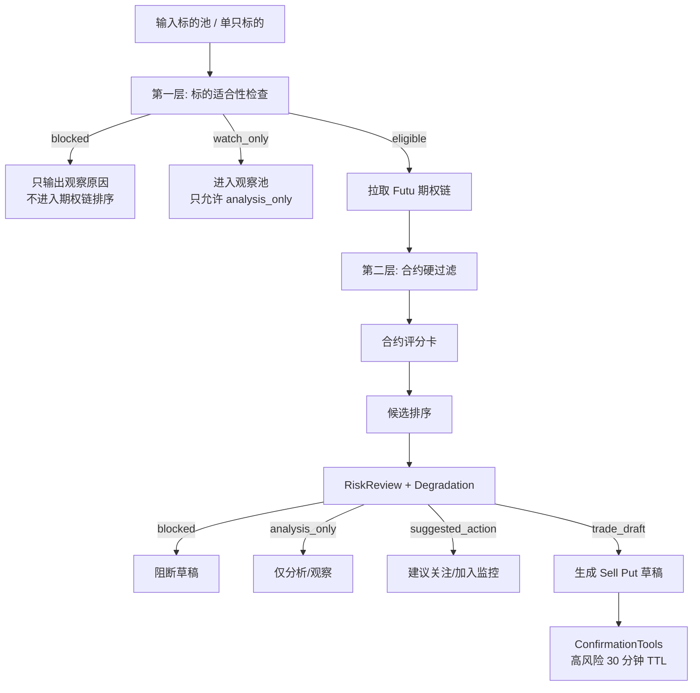
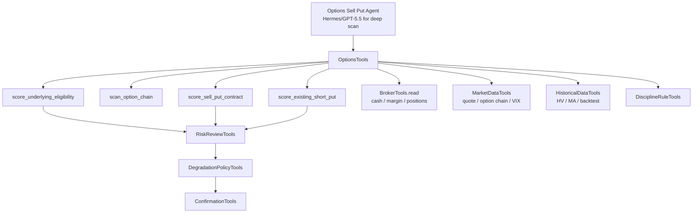

# Sell Put 期权策略规则说明书

## 1. 定位

本文定义 AI 持仓系统 3.0 的 Sell Put 策略规则。它不是券商下单算法，也不是自动交易系统，而是 `OptionsTools`、`RiskReviewTools`、`DisciplineRuleTools`、`ConfirmationTools` 共同使用的策略规则说明书。

P0 只覆盖 **single-leg cash secured put / short put**：

1. 先判断某只股票 / ETF 当前是否适合做 Sell Put。
2. 再在该标的的期权链里筛选、打分、排序适合 Sell Put 的 put 合约。
3. 输出分析、候选、交易草稿和人工执行清单。
4. 草稿必须进入确认中心，不自动下单。

本文结合现有 3.0 产品设计、本地 `sellput-scorecard-system-architecture.md` 中的评分卡思想，以及 3.0 已确认的 Futu 主源、`read_only`、Confirmation TTL 和 no-auto-trading 边界。

## 2. 策略总流程



### 2.1 两层选择模型

| 层 | 目标 | 主要问题 | 输出 |
| --- | --- | --- | --- |
| 第一层：标的适合性 | 判断股票 / ETF 能不能作为 Sell Put 承保标的 | 这只标的是否愿意接股、是否质量足够、是否处在可承保窗口 | `underlying_eligibility_score`、`eligibility_level`、blocked reasons |
| 第二层：期权链排序 | 在合格标的下挑选具体 put 合约 | 哪个 strike、expiry、premium、risk/reward 更适合 | `contract_score`、`candidate_rank`、actionability |

核心原则：**不能因为某个期权权利金高，就绕过标的质量和愿接股判断。** 第一层未通过时，第二层只能做观察，不允许生成交易草稿。

## 3. 输入与数据源

| 数据 | 用途 | P0 优先来源 | 关键质量要求 |
| --- | --- | --- | --- |
| 标的实时行情 | moneyness、趋势、缓冲距离 | Futu quote，Tencent 校验 | Sell Put 草稿要求 fresh |
| 期权链 | strike、expiry、bid/ask、OI、volume、IV、Greeks | Futu option chain | bid/ask、OI、IV/Greeks、DTE 必须完整 |
| 现金 / 保证金 | cash secured、可用资金、资金占用 | Futu broker read-only | 必须 verified，失败即阻断草稿 |
| 持仓与集中度 | 当前股票/期权暴露、同标的占比 | broker snapshot + read model | reconcile 通过 |
| 标的基本面 | 营收、EPS、FCF、负债、行业 | P0 可先接公共源 / 深研 artifact | 缺失时扣分，不伪造 |
| 历史行情 | MA20/50/200、RSI、HV、回撤 | historical store / market data | 指标需有 as_of |
| 市场环境 | VIX、SPY 趋势、市场宽度 | market data source | 市场 regime 影响阈值 |
| 事件日历 | 财报、除息、FOMC、重大事件 | 财报/事件源 | 财报窗口必须显式标记 |
| 用户纪律 | 黑名单、愿接股池、DTE/delta/现金上限 | `trading_rules`、memory、规则页 | hard block 不可被模型覆盖 |

## 4. 第一层：标的适合性规则

第一层回答：**这只股票 / ETF 现在是否适合被拿来卖 Put？**

### 4.1 标的硬门

硬门任一命中，默认不能进入 `trade_draft`。

| 硬门 | 默认规则 | 输出 |
| --- | --- | --- |
| 用户黑名单 / 禁买规则 | 命中“不买中概股”等 hard block | `blocked` |
| 不愿接股 | `assignment_intent = avoid_assignment`，且无 override | `analysis_only` |
| 现金 / 保证金不可确认 | broker cash/margin stale、missing、mismatch | `blocked` |
| 标的行情不可用 | Futu 主源不可用且无可接受 fallback | `blocked` |
| 对账冲突 | 同标的持仓、现金或合约存在 unresolved conflict | `blocked` |
| 停牌 / 异常交易 | halted、重大异常报价、流动性极差 | `blocked` |
| 财报极近 | 财报在到期前 7 天内且未显式允许事件风险 | `analysis_only` 或 `blocked` |
| 重大事件不可评估 | FDA、诉讼、并购、监管等事件在窗口内且风险未知 | `analysis_only` |

### 4.2 标的适合性评分

标的适合性采用 100 分，P0 默认权重如下：

| 维度 | 权重 | 说明 |
| --- | ---: | --- |
| 用户纪律与愿接股匹配 | 20 | 是否在愿接股池、是否命中黑名单、是否符合用户经验和风险偏好 |
| 基本面质量 | 25 | 营收/EPS/FCF/负债/行业稳定性，被指派后是否能接受持有 |
| 技术趋势与价格结构 | 20 | MA20/50/200、RSI、近 30 日回撤、是否破位 |
| 标的与期权流动性基础 | 15 | 市值、股票成交量、期权链整体 OI/volume |
| 事件与市场环境适配 | 20 | 财报、除息、重大事件、VIX/SPY/市场宽度 |

### 4.3 标的评分细则

#### 用户纪律与愿接股匹配（20）

| 指标 | 分值 | 默认规则 |
| --- | ---: | --- |
| 愿接股状态 | 8 | `willing_to_take` 8；`unknown` 4；`avoid_assignment` 0 |
| 规则命中 | 6 | 无规则冲突 6；warn 3；override_required 1；hard_block 0 |
| 账户风险偏好匹配 | 3 | 与用户经验/风险等级匹配 3；偏高 1；明显不匹配 0 |
| 标的熟悉度 / follow 记录 | 3 | 在 follow_views 且有 thesis 3；仅关注 2；陌生标的 0 |

#### 基本面质量（25）

| 指标 | 分值 | 默认规则 |
| --- | ---: | --- |
| 营收增长 | 5 | >15% 5；5-15% 3；0-5% 1；<0 0 |
| EPS / 盈利质量 | 5 | EPS 增长且盈利稳定 5；盈利但波动 3；亏损或恶化 0 |
| 自由现金流 | 5 | FCF 为正且改善 5；为正 3；为负 0 |
| 负债与资产负债表 | 4 | 低负债 4；中等 2；高杠杆 0 |
| 业务/行业稳定性 | 3 | 稳定龙头 3；周期/竞争中 1；高不确定 0 |
| 数据完整度 | 3 | 完整 3；部分缺失 1；关键缺失 0 |

#### 技术趋势与价格结构（20）

| 指标 | 分值 | 默认规则 |
| --- | ---: | --- |
| 价格相对 MA200 | 5 | 在 MA200 上方 5；±5% 内 2；下方 0 |
| MA20/50/200 排列 | 4 | 多头排列 4；中性 2；空头 0 |
| RSI(14) | 3 | 40-60 3；30-40 或 60-70 2；<30 或 >70 1 |
| 近 30 日最大回撤 | 4 | <5% 4；5-10% 2；>10% 0 |
| 关键支撑与 strike 空间 | 4 | 当前价到可选 strike 有明显支撑/缓冲 4；一般 2；无缓冲 0 |

#### 标的与期权流动性基础（15）

| 指标 | 分值 | 默认规则 |
| --- | ---: | --- |
| 市值 / ETF 规模 | 5 | 超大/高流动 ETF 5；中大型 3；小市值 1 |
| 股票 20 日均量 | 4 | >500 万 4；100-500 万 3；10-100 万 1；<10 万 0 |
| 期权链整体活跃度 | 4 | 总 OI 高且多到期活跃 4；一般 2；稀疏 0 |
| 报价稳定性 | 2 | 报价稳定 2；价差跳动明显 0 |

#### 事件与市场环境适配（20）

| 指标 | 分值 | 默认规则 |
| --- | ---: | --- |
| 财报窗口 | 6 | 到期前无财报 6；财报在到期后 4；到期前 >7 天 2；<7 天 0 |
| 除息 / 特殊公司行动 | 3 | 无或已处理 3；窗口内存在 1；影响不可评估 0 |
| 重大事件 | 4 | 无已知重大事件 4；中等事件 2；高冲击事件 0 |
| 市场 regime 适配 | 5 | 正常/温和高波动 5；低波动 3；risk-off 1；panic 0 |
| 相关新闻风险 | 2 | 无显著利空 2；争议/负面升温 0 |

### 4.4 标的适合性等级

| 分数 | 等级 | 动作上限 |
| ---: | --- | --- |
| >= 85 | `eligible_core` | 可进入期权链排序，可生成草稿 |
| 75-84 | `eligible_limited` | 可排序，草稿需限仓并标注主要短板 |
| 65-74 | `watch_only` | 只允许分析和监控，不默认生成草稿 |
| < 65 | `not_suitable` | 不进入候选排序，只输出原因 |

## 5. 第二层：期权链候选规则

第二层回答：**如果这只标的适合做 Sell Put，哪一个 put 合约更适合？**

### 5.1 合约硬过滤

| 条件 | P0 默认阈值 | 结果 |
| --- | --- | --- |
| 合约类型 | 只允许 put，sell-to-open | 非 put 过滤 |
| DTE | 20-60 天；优选 30-45 天 | 超出范围默认过滤或观察 |
| Delta 绝对值 | 0.10-0.35；优选 0.15-0.25 | >0.35 默认过滤 |
| OTM 幅度 | >=5%；优选 8-15% | <5% 不生成草稿 |
| bid/ask spread | <=10%；优选 <=5% | >10% 默认过滤，>20% hard block |
| 合约 OI | >=500；优选 >=1000 | <100 hard block |
| 日成交量 | >=50；优选 >=100 | <10 hard block |
| 最小权利金 | 覆盖滑点和手续费后仍有意义 | 太薄只观察 |
| 现金担保 | `strike * 100 * contracts <= 可用现金上限` | 不足即 blocked |
| 到期前财报 | 默认不跨财报生成执行清单 | 仅 analysis_only，除非用户规则允许 |

### 5.2 合约评分卡

合约评分采用 100 分，P0 默认权重如下：

| 维度 | 权重 | 说明 |
| --- | ---: | --- |
| 期权定价与收益价值 | 30 | IV Rank、IV/HV、年化权利金、权利金/风险 |
| 下行缓冲与风险暴露 | 30 | OTM、delta、breakeven、DTE、事件、Greeks |
| 流动性与执行质量 | 20 | bid/ask、OI、volume、中间价可成交性 |
| 组合与资金适配 | 20 | cash/margin、集中度、到期梯队、纪律匹配 |

#### 期权定价与收益价值（30）

| 指标 | 分值 | 默认规则 |
| --- | ---: | --- |
| IV Rank / IV Percentile | 10 | IVR >70 10；50-70 8；30-50 5；<30 2 |
| IV vs HV(30) 溢价 | 7 | IV/HV >1.3 7；1.1-1.3 5；0.9-1.1 2；<0.9 0 |
| 年化权利金收益率 | 8 | >30% 8；20-30% 6；12-20% 4；5-12% 2；<5% 0 |
| 权利金 / 现金担保风险 | 3 | >5% 3；3-5% 2；1-3% 1；<1% 0 |
| 绝对权利金有效性 | 2 | 对账户规模有意义 2；偏薄 1；不可覆盖摩擦 0 |

#### 下行缓冲与风险暴露（30）

| 指标 | 分值 | 默认规则 |
| --- | ---: | --- |
| OTM 百分比 | 7 | >15% 7；10-15% 6；5-10% 3；<5% 0 |
| Delta 绝对值 | 6 | <0.15 5；0.15-0.25 6；0.25-0.35 3；>0.35 0 |
| Breakeven 缓冲 | 5 | 距现价 >20% 5；10-20% 4；5-10% 2；<5% 0 |
| DTE 适配 | 4 | 30-45 4；20-30 或 45-60 3；7-20 1；<7 或 >60 0 |
| 事件窗口 | 4 | 无财报/重大事件 4；到期后事件 3；到期前事件 0 |
| Greeks 风险 | 4 | theta 效率高、gamma/vega 可控 4；中性 2；高风险 0 |

#### 流动性与执行质量（20）

| 指标 | 分值 | 默认规则 |
| --- | ---: | --- |
| Bid/Ask spread | 8 | <5% 8；5-10% 5；10-20% 1；>20% 0 |
| 合约 OI | 5 | >5000 5；1000-5000 4；500-1000 2；<500 0 |
| 日成交量 | 4 | >500 4；100-500 3；50-100 1；<50 0 |
| 报价稳定 / midpoint 可成交 | 3 | 稳定 3；一般 1；跳动大 0 |

#### 组合与资金适配（20）

| 指标 | 分值 | 默认规则 |
| --- | ---: | --- |
| 现金 / 保证金充足 | 7 | cash secured 且剩余空间充足 7；紧张 3；不足 0 |
| 单标的集中度 | 4 | 指派后单标的 <10% 4；10-20% 2；>20% 0 |
| 期权到期梯队 | 3 | 不集中到同一到期 3；略集中 1；严重集中 0 |
| 同方向风险叠加 | 3 | 无相关标的风险堆叠 3；有一定相关 1；高度相关 0 |
| 交易纪律匹配 | 3 | pass 3；warn 1；override_required/hard_block 0 |

### 5.3 合约等级与动作上限

| 合约分数 | 等级 | 动作上限 |
| ---: | --- | --- |
| >= 90 | A | `trade_draft`，可生成高置信草稿 |
| 80-89 | B+ | `trade_draft`，必须限仓并显示短板 |
| 70-79 | B | `suggested_action`，默认加入监控，不直接推荐执行 |
| < 70 | C | `analysis_only` 或过滤 |

### 5.4 最终排序分

在同一标地下，候选合约主要按 `contract_score` 排序；跨标的扫描时使用综合分：

```text
final_candidate_score = 0.40 * underlying_eligibility_score
                      + 0.60 * contract_score
```

排序 tie-breaker：

1. 更高的 liquidity score。
2. 更低的 cash concentration impact。
3. 更低的 event risk。
4. 更接近用户偏好的 DTE / delta 区间。
5. 更早过期但仍在安全 DTE 区间内的合约优先。

## 6. 默认策略参数

### 6.1 按用户风险偏好

| 参数 | 保守 | 平衡（P0 默认） | 进取 |
| --- | ---: | ---: | ---: |
| 标的最低分 | 80 | 75 | 70 |
| 草稿最低合约分 | 85 | 80 | 75 |
| Delta 绝对值 | 0.10-0.20 | 0.15-0.25 | 0.20-0.35 |
| DTE | 30-45 | 30-45 | 20-45 |
| 最小 OTM | 12% | 8% | 5% |
| 最大单标的指派后占比 | 8% | 12% | 18% |
| 最大 Sell Put 现金占用 | 20% | 35% | 50% |
| 跨财报 | 默认禁止 | 默认禁止 | 需显式确认 |

### 6.2 按市场状态

| 市场状态 | 识别条件 | 策略参数 |
| --- | --- | --- |
| 低波动牛市 | VIX <15，SPY 在 MA50/MA200 上方 | 降低仓位，要求 IV/HV >1.1；DTE 21-35；delta 0.10-0.20；权利金太薄则不做 |
| 正常市场 | VIX 15-25，SPY 趋势健康 | P0 默认：DTE 30-45；delta 0.15-0.25；OTM >=8%；IVR >=30 |
| 温和高波动 | VIX 25-35，SPY 未破关键趋势 | 仓位减半；DTE 20-35；delta 0.10-0.20；OTM >=12%；优先高质量标的 |
| Risk-off | SPY 跌破 MA200 或市场宽度 <40% | 默认只允许 `analysis_only / suggested_action`；草稿需用户高风险规则允许 |
| Panic | VIX >35 或 VIX backwardation 明显 | 默认阻断新 Sell Put 草稿，仅做持仓风险管理 |
| 财报/重大事件窗口 | 到期前存在财报、FDA、诉讼、并购等 | 默认不生成执行清单；只输出事件风险分析 |

## 7. 输出契约

### 7.1 标的适合性输出

```json
{
  "tenant_id": "tenant_x",
  "symbol": "AAPL",
  "as_of": "2026-05-09T10:00:00+08:00",
  "underlying_eligibility_score": 86,
  "eligibility_level": "eligible_core",
  "actionability_cap": "suggested_action",
  "dimension_scores": {
    "discipline_assignment_fit": 18,
    "fundamental_quality": 21,
    "technical_structure": 17,
    "liquidity_base": 14,
    "event_regime_fit": 16
  },
  "blocked_reasons": [],
  "warnings": ["IV Rank moderate, premium may not be rich enough"],
  "data_lineage": {
    "quote_source": "futu",
    "broker_snapshot_id": "bss_001",
    "rule_check_id": "rule_001"
  }
}
```

### 7.2 合约候选输出

```json
{
  "symbol": "AAPL",
  "contract": "AAPL260619P00170000",
  "strategy": "cash_secured_put",
  "expiry": "2026-06-19",
  "strike": 170,
  "dte": 41,
  "premium_mid": 2.35,
  "delta": -0.22,
  "iv": 0.34,
  "breakeven": 167.65,
  "cash_required": 17000,
  "underlying_score": 86,
  "contract_score": 84,
  "final_candidate_score": 84.8,
  "grade": "B+",
  "actionability": "trade_draft",
  "dimension_scores": {
    "option_value": 23,
    "risk_buffer": 26,
    "liquidity_execution": 18,
    "portfolio_fit": 17
  },
  "why_this_contract": [
    "DTE in preferred range",
    "delta within balanced profile",
    "spread below liquidity threshold",
    "cash secured requirement within account limit"
  ],
  "do_not_trade_if": [
    "Futu quote or option chain becomes stale",
    "bid/ask spread widens above 10%",
    "earnings date enters expiry window without explicit approval"
  ]
}
```

## 8. 持仓管理规则

持仓管理不是重新判断“要不要开仓”，而是判断已有 short put 应该 **继续持有、止盈、roll、平仓避险，还是准备接股**。

### 8.1 持仓评分维度

| 维度 | 权重 | 说明 |
| --- | ---: | --- |
| 盈亏状态 | 30 | 已实现利润比例、剩余时间价值、浮盈浮亏 |
| 标的运行状态 | 25 | 当前价距 strike、趋势是否破坏、新增风险事件 |
| IV 环境变化 | 20 | IV 是否下降、VIX 是否改善、vega 风险是否释放 |
| 时间衰减进度 | 15 | 已经过时间、DTE、是否临近事件 |
| 头寸管理 | 10 | 集中度、保证金效率、roll 可行性 |

### 8.2 止盈 / 平仓规则

| 条件 | 默认动作 |
| --- | --- |
| 已实现利润 >=80% | 生成 `close_candidate`，建议买回止盈 |
| 已实现利润 >=50% 且 DTE >21 | 生成 `take_profit_or_hold`，提示释放资金 vs 继续 theta |
| 剩余权利金过薄 | 建议平仓释放保证金 |
| 到期前新增财报 / 重大事件 | 若利润可观，优先生成止盈或避险草稿 |
| 合约流动性恶化 | 不直接建议市价平仓，提示限价和滑点风险 |

止盈动作仍然只是草稿或人工执行清单，不自动下单。

### 8.3 风险预警规则

| 条件 | 风险等级 | 默认动作 |
| --- | --- | --- |
| 标的价格距 strike <5% | high attention | 进入每日监控，提示 roll/close/assignment 三选一 |
| 合约 ITM | high | 生成持仓风险复盘，不自动 roll |
| Delta 绝对值 >0.35 | medium/high | 提醒被指派概率上升 |
| DTE <7 且接近/低于 strike | high | 强制进入确认中心处理计划 |
| 期权价格 >= 开仓 credit 的 2 倍 | high | 提示止损/roll 评估 |
| 标的基本面 thesis 破坏 | high | 不建议 roll，优先考虑平仓或接受纪律损失 |

### 8.4 Roll 规则

Roll 只能在“持仓逻辑仍成立”时生成草稿。

允许 roll 的默认条件：

1. 标的仍在愿接股池，基本面 thesis 未破坏。
2. 新合约可以获得 net credit 或显著改善风险暴露。
3. 新 DTE 优先 30-45 天，不超过 60 天。
4. 新 strike 不高于原 strike；优先 roll down/out。
5. roll 后单标的集中度和总 Sell Put 现金占用不超过纪律上限。
6. 新合约仍通过流动性、DTE、delta、事件和现金/保证金 gate。

不建议 roll 的默认条件：

1. 公司基本面或用户 thesis 已经破坏。
2. roll 需要 net debit 且无法显著降低风险。
3. 只是为了避免承认亏损而延长风险。
4. roll 后会跨越财报或重大事件。
5. roll 后资金占用超过纪律上限。

### 8.5 Assignment 处理规则

系统必须在交易草稿里明确用户的 assignment 意图。

| 用户意图 | 系统策略 |
| --- | --- |
| `willing_to_take` | 可接受指派计划，计算接股成本 `strike - credit - fees`，生成接股后持仓规则 |
| `avoid_assignment` | DTE <7 或 ITM 时优先生成 close/roll 评估，不默认持有到期 |
| `unknown` | 不生成高置信草稿，先要求用户确认是否愿接股 |

Assignment 发生后：

1. 写入 `trade_events` 的 `assignment` 事件。
2. 更新股票 / ETF 持仓成本基础。
3. 将该标的从 option position lifecycle 转入 equity position lifecycle。
4. 生成 post-assignment 计划：止损、止盈、是否允许 covered call（P1）。
5. 保留原 Sell Put 分析、确认、执行备注和 source lineage。

## 9. 与交易纪律模块的关系

Sell Put 策略必须读取 `trading_rules.scope = sell_put` 的规则。P0 至少支持：

| 规则 | 默认处理 |
| --- | --- |
| 不买 / 不接某类标的 | hard block |
| 单标的最大接股占比 | 超过则 blocked |
| 总 Sell Put 现金占用上限 | 超过则 blocked |
| 最小 DTE / 最大 DTE | 超出则过滤 |
| Delta 范围 | 超出则过滤或降级 |
| 财报前不 Sell Put | 默认 hard block |
| 盘前盘后不下单 | 草稿和人工清单提示，不影响分析 |
| 只卖愿意长期持有的标的 | `unknown` 时先确认 assignment intent |

override 只能进入确认中心，且必须记录原因、风险等级、确认人和 TTL。

## 10. 与 Agent / Tools 的关系



工具建议：

| 工具 | 输入 | 输出 |
| --- | --- | --- |
| `options.sell_put.score_underlying` | `tenant_id`、symbol、portfolio_view、risk_profile | 标的适合性分、等级、blocked reasons |
| `options.sell_put.scan_chain` | symbol、DTE/delta/expiry filters | 过滤后的 put 合约列表 |
| `options.sell_put.rank_candidates` | 标的分、期权链、现金/保证金、规则 | 排序候选与解释 |
| `options.sell_put.create_trade_draft` | candidate、risk review、confirmation TTL | `pending_action` |
| `options.sell_put.score_position` | option position、open trade、current chain | 持仓评分和 close/roll/assignment 建议 |

## 11. 数据与存储建议

P0 可以先使用 analysis artifact，不必一次性新增所有评分表；但建议从一开始保留可回放字段。

| 对象 | 建议字段 |
| --- | --- |
| `sell_put_underlying_scores` | `tenant_id`、symbol、score、level、dimension_scores、blocked_reasons、as_of、source_lineage |
| `sell_put_candidate_scores` | contract、strike、expiry、score、rank、actionability、dimension_scores、cash_required、warnings |
| `sell_put_position_scores` | position_id、hold_score、close_suggestion、roll_suggestion、assignment_plan、as_of |
| `strategy_model_versions` | version、weights、thresholds、risk_profile、market_regime_overrides |
| `backtest_runs` | config、score_version、period、symbols、win_rate、drawdown、score_bucket_stats |

所有评分结果必须带 `strategy_model_version`，否则后续回测和复盘无法解释“当时为什么给了这个分”。

## 12. 回测与评估

回测目标不是证明策略一定赚钱，而是验证评分卡是否有区分度。

### 12.1 回测模式

| 模式 | 用途 |
| --- | --- |
| 全量扫描回测 | 每日扫描标的池和期权链，比较高分组与低分组表现 |
| 信号跟踪回测 | 观察某一评分阈值触发后，到期或提前平仓表现 |
| 持仓决策回测 | 比较止盈/roll/持有到期三类规则 |
| 参数稳定性测试 | train/test、walk-forward，防止过拟合 |

### 12.2 核心指标

| 指标 | 说明 |
| --- | --- |
| win rate | 到期 OTM 或提前盈利平仓比例 |
| assignment rate | 被指派比例 |
| average annualized return | 按 cash/margin 加权收益 |
| max drawdown | 策略组合最大回撤 |
| tail loss | 被指派或大幅下跌场景损失 |
| score monotonicity | 高分组是否稳定优于低分组 |
| close/roll effectiveness | 止盈和 roll 是否优于持有到期 |

## 13. 高级量化扩展边界

P0 Sell Put 规则采用两层评分卡和硬门，先保证可解释、可审计、可阻断。更高级的期望值、波动率曲面、高阶 Greeks 和尾部风险管理放入独立扩展文档：

`22-options-advanced-ev-greeks-risk-architecture.md`

落地边界：

1. P0 不依赖完整 PDF EV，但所有评分结果必须保留 `strategy_model_version` 和 `source_lineage`，为后续 replay 和回测留口。
2. P1 引入离散 PDF EV、term structure、skew 作为候选排序和风控 overlay。
3. P2 引入 Vanna、Charm、Zomma、Speed、Vomma 和 tail hedge budget。
4. 高级量化指标只能降低或解释 actionability，不能绕过 P0 的现金/保证金、freshness、对账、纪律和确认硬门。
5. 高级指标的计算必须由 deterministic Domain Tools 完成，GPT-5.5 / Hermes 只负责解释、深研和报告生成。

## 14. P0 验收标准

1. 用户选择单个标的时，系统能先输出标的适合性，而不是直接展示高权利金合约。
2. 标的不适合时，期权链结果只能作为观察，不生成交易草稿。
3. 标的适合时，系统能对期权链 put 合约按规则过滤、打分、排序。
4. 每个候选必须展示总分、维度分、关键短板、现金占用和 blocked reasons。
5. 现金/保证金、期权链关键字段、对账状态、freshness 任一不达标时，Sell Put 草稿必须被阻断。
6. 生成草稿时必须进入确认中心，高风险 TTL 为 30 分钟。
7. 持仓中的 short put 能输出 hold / close / roll / assignment 四类管理建议。
8. 所有输出必须标注“不自动下单”，并保留 source lineage 和 strategy model version。

## 15. 待后续细化

1. P0 是否把 covered call 作为 assignment 后的 P1 入口。
2. Futu 期权链 Greeks 缺失时是否允许本地自算，以及自算模型版本如何记录。
3. HK options 与 US options 的合约单位、交易时间、流动性阈值是否分市场维护。
4. 市场宽度、VIX term structure 的具体数据源。
5. 回测数据是否先接 Polygon / CBOE / OptionMetrics，还是先用已保存 Futu 历史快照。
