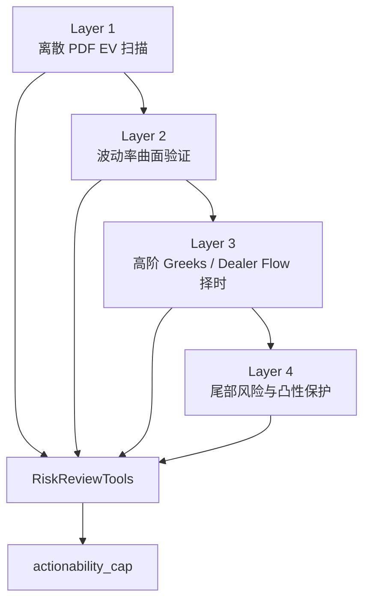

# 高级期权 EV、波动率曲面与高阶 Greeks 风控架构

## 1. 定位

本文是 `21-options-sellput-strategy-rulebook.md` 的高级量化扩展层，用于描述美股期权策略从“评分卡式 Sell Put 筛选”升级到“EV + 波动率曲面 + 高阶 Greeks + 尾部风险”的系统架构。

它不改变 P0 已确认边界：

1. P0 不自动下单。
2. Futu broker 权限为 `read_only`。
3. Sell Put 草稿必须进入确认中心。
4. P0 可以先用评分卡和硬门实现，不强依赖完整机构级 EV / dealer flow 数据。

本文的作用是为 P1/P2 的高级期权能力预留清晰路线，避免后续把 EV、Vanna、Charm、Zomma、Vomma 等指标零散塞进策略逻辑里。

## 2. 为什么不能只用静态 EV

期权策略的 EV 计算有价值，但静态 EV 不能单独决定交易动作。

### 2.1 禁用二元 EV

错误模型：

```text
EV = P(win) * max_profit - P(loss) * max_loss
```

这种模型只看最大盈利和最大亏损，忽略到期价格落在中间区间的大量局部盈亏结果。对于 Sell Put、vertical spread、iron condor 等非线性 payoff，这会严重误导策略。

系统规则：

1. P0 文案不得把二元 EV 当作交易依据。
2. P1 如接入 EV，只允许使用离散 PDF / scenario grid 方式。
3. EV 输出必须展示假设、价格分布、摩擦成本和尾部风险，而不是只展示单个正数。

### 2.2 离散 PDF EV

推荐模型：

```text
EV = sum(P(S_i) * Payoff(S_i)) - fees - slippage - borrow_or_funding_cost
```

其中：

1. `S_i` 是到期或目标日期下的标的价格网格。
2. `P(S_i)` 是价格落入该网格的概率。
3. `Payoff(S_i)` 是策略在该价格点的具体盈亏。
4. 网格粒度可以按价格、收益率或 sigma bucket 实现，P1 不要求直接做到 $0.01 粒度，但必须足够解释策略曲线。

### 2.3 EV 的系统盲区

即便使用 PDF EV，也仍有四类盲区：

| 盲区 | 问题 | 系统补救 |
| --- | --- | --- |
| 静态 IV 假设 | 市场波动率会跳变，且不服从稳定正态 | 引入波动率曲面和 regime gate |
| 路径依赖 | 未到期前会经历保证金、流动性、心理和止损压力 | 引入 drawdown / margin stress |
| 尾部风险 | 低概率事件可能吞掉多年收益 | 引入 tail hedge 和 hard limits |
| 市场微观结构 | dealer hedging flow 会改变短期价格路径 | P2 引入 Vanna / Charm / Gamma flow overlay |

## 3. 四层高级量化架构



### Layer 1: 离散 PDF EV 扫描

目标：判断策略在概率意义上是否具备正向期望。

核心输出：

| 输出 | 说明 |
| --- | --- |
| `raw_ev` | 不含摩擦成本的理论 EV |
| `net_ev` | 扣除手续费、滑点、买卖价差、资金成本后的 EV |
| `ev_per_margin` | 单位现金/保证金占用的 EV |
| `loss_tail_p95 / p99` | 左尾风险损失 |
| `payoff_curve_ref` | payoff 分布曲线 artifact |
| `assumption_set` | 分布假设、IV/HV、期限、事件假设 |

P1 默认规则：

1. `net_ev <= 0` 不允许生成 `trade_draft`。
2. `net_ev > 0` 也不自动升级，必须继续通过 Layer 2-4。
3. 如果 EV 主要来自极端尾部被低估，需降低 actionability。

### Layer 2: 波动率曲面验证

目标：避免在错误的波动率 regime 中机械卖出期权。

#### 期限结构

| 状态 | 识别 | Sell Put 影响 |
| --- | --- | --- |
| Contango | 远月 IV 高于近月，市场相对平稳 | 常规 Sell Put 可继续评估 |
| Flat | 期限结构接近平坦，事件或转折期 | 降低仓位，要求更高标的分和合约分 |
| Backwardation | 近月 IV 显著高于远月，短期恐慌 | 默认阻断裸 short vol 草稿，只允许分析或风险管理 |

#### Skew

| 状态 | 含义 | 策略影响 |
| --- | --- | --- |
| Put skew 正常 | 下行保护有溢价但未极端 | 可按评分卡继续 |
| Put skew 过陡 | 市场正在高价计入左尾风险 | 不建议裸卖深虚值 put；优先考虑有限风险结构或只观察 |
| Put skew 过平 | 下行保护便宜，卖 put 收益可能不足 | 降低期权价值分，必要时不做 |

P1 规则：

1. 期限结构严重 backwardation 时，Sell Put 草稿默认 `blocked`。
2. skew 过陡时，即使 EV 为正，也必须触发 tail risk warning。
3. skew / term structure 数据缺失时，不得声称完成高级 EV 审查。

### Layer 3: 高阶 Greeks 与 dealer flow 择时

目标：把 Vanna、Charm、Gamma flow 等作为择时和风险提示层，而不是 P0 的交易依据。

| 指标 | 含义 | 系统用途 |
| --- | --- | --- |
| Vanna | Delta 对 IV 的敏感度 | 事件后 IV crush 是否可能带来被动买盘/卖盘 |
| Charm | Delta 随时间衰减的变化 | OpEx、周五、尾盘是否存在时间衰减驱动的对冲流 |
| Zomma | Gamma 对 IV 的敏感度 | 极端波动中 Gamma 是否会膨胀失控 |
| Speed | Gamma 对标的价格的敏感度 | 临近 strike 时 Delta 风险是否加速恶化 |
| Vomma | Vega 对 IV 的敏感度 | 尾部保护工具是否具备非线性凸性 |

P2 规则：

1. Vanna / Charm 只能调整择时和风险提示，不可单独把候选升级为 `trade_draft`。
2. dealer flow 数据不完整时，只输出解释型分析。
3. Zomma / Speed 告警优先级高于正向 EV。
4. 高阶 Greeks 输出必须展示数据来源和估算模型版本。

### Layer 4: 尾部风险与反脆弱保护

目标：让 Sell Put 和其他 short volatility 策略不会在极端行情中一次性损毁账户。

核心机制：

| 机制 | 说明 |
| --- | --- |
| tail budget | 每年或每月划拨固定小比例作为尾部保护预算 |
| convexity sleeve | 低 IV 环境下持有高 Vomma 的远期深虚值保护结构 |
| hard margin reserve | 不让 Sell Put 占满可用现金/保证金 |
| stress scenario | 5%、10%、20%、30% 下跌和 IV spike 压力测试 |
| kill switch | Zomma、Speed、margin、liquidity 任一触发极端阈值，阻断新草稿 |

P1/P2 默认规则：

1. Sell Put 总现金占用不能挤占 tail budget 和 liquidity reserve。
2. 任何 short vol 草稿必须展示极端下跌压力测试。
3. 当市场处于 panic regime，系统只允许持仓管理和风险降低类建议。

## 4. 对 Sell Put 评分卡的影响

高级量化层不是替代 `21` 里的两层评分卡，而是作为 overlay。

```text
base_score = 0.40 * underlying_score + 0.60 * contract_score
advanced_adjusted_score = base_score
                        + ev_adjustment
                        + surface_adjustment
                        + flow_timing_adjustment
                        - tail_risk_penalty
```

调整规则：

| 调整项 | 范围 | 说明 |
| --- | ---: | --- |
| `ev_adjustment` | -10 到 +10 | PDF net EV 明确正/负时调整 |
| `surface_adjustment` | -20 到 +5 | term structure / skew 是主要风险门 |
| `flow_timing_adjustment` | -5 到 +5 | Vanna/Charm 仅做小幅择时调整 |
| `tail_risk_penalty` | 0 到 -30 | 左尾、Zomma、Speed、margin stress |

硬规则：

1. advanced score 不能绕过 P0 hard block。
2. `surface_adjustment <= -15` 时，不允许 `trade_draft`。
3. `tail_risk_penalty <= -20` 时，不允许新开仓草稿。
4. `flow_timing_adjustment` 不能单独提升 actionability。

## 5. 工具契约建议

| 工具 | 阶段 | 输入 | 输出 |
| --- | --- | --- | --- |
| `options.ev.compute_pdf_ev` | P1 | strategy legs、price grid、distribution assumptions、fees | `raw_ev`、`net_ev`、payoff distribution |
| `options.surface.analyze` | P1 | option chain by expiry/strike | term structure、skew slope、surface regime |
| `options.greeks.estimate_higher_order` | P2 | chain、IV、rates、model version | Vanna、Charm、Zomma、Speed、Vomma |
| `options.flow.infer_dealer_pressure` | P2 | OI、volume、GEX/VEX source | flow direction、confidence、time window |
| `options.tail_risk.stress_test` | P1 | portfolio、positions、scenario grid | margin stress、tail loss、kill switch flags |
| `options.convexity.plan_tail_budget` | P2 | account size、budget、market regime | hedge budget、candidate structures |

所有工具都必须接受并返回：

1. `tenant_id`
2. `run_id`
3. `strategy_model_version`
4. `source_lineage`
5. `as_of`
6. `confidence`

## 6. 数据要求与落地优先级

| 能力 | P0 | P1 | P2 |
| --- | --- | --- | --- |
| Futu 期权链、Greeks、现金/保证金 | 必须 | 必须 | 必须 |
| 基础 IV Rank / HV | 可用简化版 | 完整历史分位 | 分市场/分期限 |
| PDF EV | 不阻塞 | 接入单标的和单策略 | 支持组合级 |
| Vol surface | 不阻塞 | term / skew 基础分析 | 曲面动态和历史 z-score |
| Vanna / Charm | 不做 | 解释型研究 | 择时 overlay |
| Zomma / Speed / Vomma | 不做 | 压力测试概念 | 组合级风险门 |
| Tail hedge | 不做 | 预算和压力测试 | 结构化保护组合 |

## 7. Actionability Gate

| 条件 | actionability |
| --- | --- |
| P0 数据不 fresh、现金/保证金不可确认、对账失败 | `blocked` |
| PDF EV 缺失但 P0 评分通过 | 最高 `trade_draft`，但标注未完成高级 EV |
| PDF net EV 为负 | 最高 `analysis_only` |
| term structure 严重 backwardation | `blocked` |
| skew 极端陡峭且无尾部保护 | 最高 `suggested_action` |
| Zomma / Speed 极端告警 | `blocked` |
| Vanna / Charm 顺风但其他 gate 未通过 | 不升级 |
| tail budget 或 liquidity reserve 不足 | `blocked` |

## 8. 回测与评估

高级层必须用回测和 replay 证明有效性，不能只凭理论加入生产策略。

### 8.1 回测维度

1. base score vs advanced adjusted score 的分数单调性。
2. PDF EV 正负与真实到期收益的相关性。
3. term structure / skew regime 下的 Sell Put 表现差异。
4. panic / backwardation 中阻断规则是否降低尾部损失。
5. close / roll / assignment 决策是否优于持有到期。
6. tail hedge budget 对组合最大回撤的影响。

### 8.2 反过拟合要求

1. train/test split。
2. walk-forward 验证。
3. 分市场 regime 统计，不只看全周期平均值。
4. 每个策略模型版本都要保留权重、阈值、数据源和 replay bundle。

## 9. 产品呈现

高级量化层不应该把用户淹没在术语里。WebApp 只展示三类信息：

| 层级 | 用户可见表达 |
| --- | --- |
| EV | “扣除成本后，当前结构的理论期望为正/中性/负” |
| 波动率曲面 | “当前波动率结构正常/事件化/恐慌倒挂” |
| 高阶风险 | “短期对冲流顺风/逆风；尾部风险高/正常” |

深研报告可以展开完整解释；微信只推摘要和是否需要用户处理。

## 10. 与 3.0 当前策略的关系

1. `21-options-sellput-strategy-rulebook.md` 是 P0 策略规则主文档。
2. 本文是 P1/P2 高级量化路线，不阻塞第一轮编码。
3. 编码时应先把 `strategy_model_version`、`source_lineage`、`actionability_cap` 留好，避免未来高级层无法回放。
4. GPT-5.5 / Hermes 适合承担高级 EV、曲面解释、深研报告和风险复盘；确定性计算必须由 Domain Tools 完成。
5. 所有高级指标最终仍需经过 `RiskReviewTools`、`DegradationPolicyTools` 和 `ConfirmationTools`。
