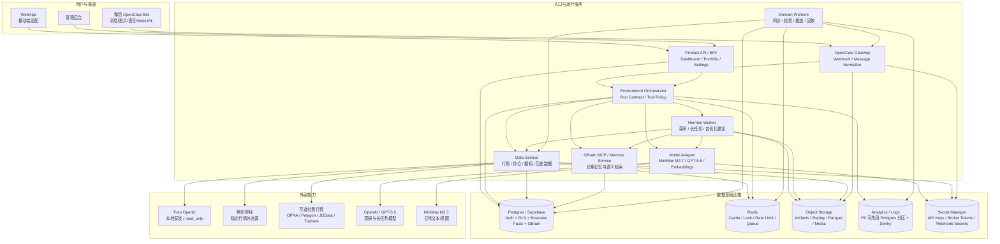
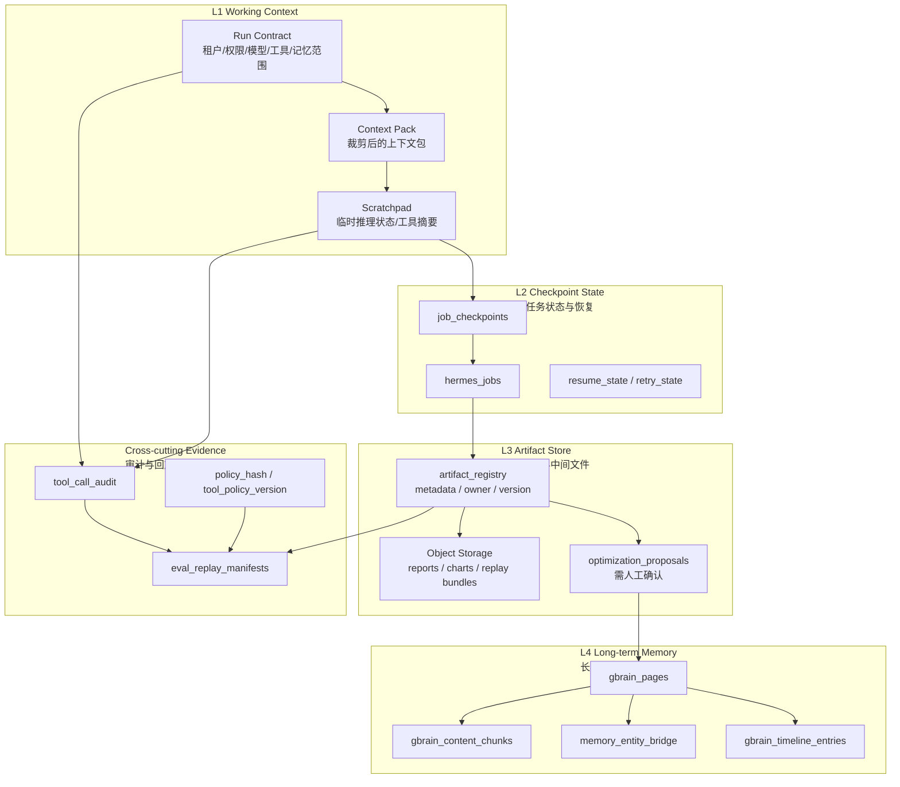
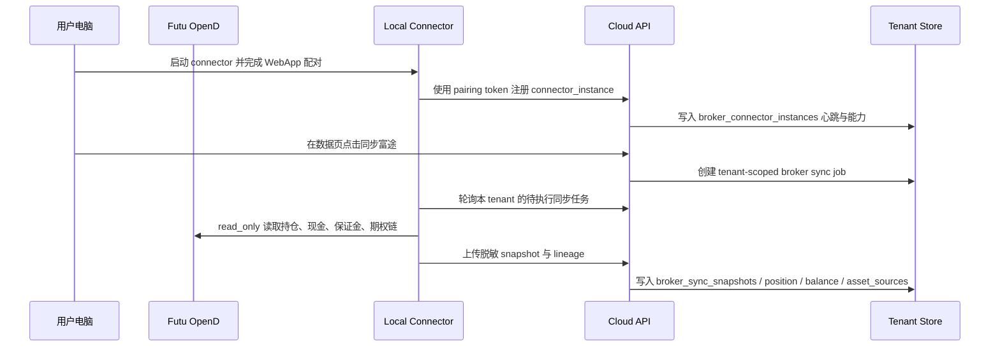

# AI 持仓投资分析系统 3.0 部署资源与存储上下文 Review

> 状态：产品/架构确认稿  
> 范围：部署前置资源、服务器与托管服务、数据库/对象存储/缓存/队列、GBrain 与 Hermes 四层存储映射、上下文管理遗漏项  
> 关联文档：
> - [09-historical-market-data-store.md](./09-historical-market-data-store.md)
> - [12-openclaw-hermes-agent-runtime.md](./12-openclaw-hermes-agent-runtime.md)
> - [13-architecture-hardening.md](./13-architecture-hardening.md)
> - [14-growth-and-scale-readiness.md](./14-growth-and-scale-readiness.md)
> - [15-environment-orchestrator.md](./15-environment-orchestrator.md)
> - [control-plane/07-eval-replay-tools.md](./control-plane/07-eval-replay-tools.md)

---

## 1. 本轮结论

3.0 当前产品与架构方案已经具备进入研发的基础，但部署资源和存储上下文需要补齐一层“落地清单”。

核心判断：

1. P0 可以沿用当前 2.0 的 `Postgres/Supabase + Redis + data-service + webapp + gbrain` 基座，但必须新增对象存储、任务队列/worker、模型适配层、Hermes worker、OpenClaw 网关、Futu OpenD 本地连接方案。
2. 2.0 的 GBrain 模板已经提供了长期记忆、向量检索、时间线、业务实体桥接的雏形，可以继续保留，但它不能替代业务事实库。
3. Hermes 的四层存储需要在 3.0 中明确映射，否则会出现“上下文、长期记忆、研究报告、审计回放”混在一起的问题。
4. 上下文管理的关键遗漏是 `Context Pack Builder`、`Memory Write Gate`、`Artifact Registry`、`Replay/Eval Evidence Store` 和 `Retention/Deletion Policy`。
5. 所有存储都必须以 `tenant_id` 为第一隔离维度；微信 bot、券商账户、portfolio view、follow/list view 都只是 tenant 内部的绑定或视图。

---

## 2. P0 部署资源总览



---

## 3. 上线前需要准备的资源

### 3.1 服务器与运行环境

| 资源 | P0 是否必须 | 用途 | 推荐方式 |
| --- | --- | --- | --- |
| WebApp Hosting | 必须 | 用户 dashboard、持仓、规则、关注清单、清仓回溯、确认中心 | Vercel / Node 容器均可 |
| Product API / BFF | 必须 | WebApp 数据接口、账户/组合/规则/确认流 | 可与 EO 同服务起步 |
| OpenClaw Gateway | 必须 | 微信消息入口、内容标准化、渠道回执、失败补偿 | 独立服务，便于 webhook 和重试 |
| Environment Orchestrator | 必须 | 生成 tenant-scoped run contract、工具权限、memory scope、审计 | P0 可作为 API 模块，建议独立边界 |
| Data Service | 必须 | 行情、期权链、持仓、历史数据、券商连接 | 沿用 2.0 FastAPI，扩展 3.0 adapter |
| Domain Workers | 必须 | 定时同步、历史行情拉取、消息推送、投影刷新、失败重试 | P0 可单 worker，需任务表和幂等 |
| Hermes Worker | 必须 | 深度研究、长任务、复盘、策略报告、候选排序解释 | 独立 worker，不阻塞对话主链路 |
| GBrain Memory Service | 必须 | 长期记忆、语义检索、业务实体记忆桥接 | 沿用 2.0 MCP adapter，补充写入治理 |
| Model Adapter | 必须 | MiniMax M2.7、GPT-5.5、embedding、降级/限流/成本记录 | 独立模块或服务 |
| Futu OpenD Local Connector | 必须 | 美港股行情、期权链、账户持仓 read_only 同步 | 用户本地安装 OpenD，服务端通过受控 connector/relay 读取 |
| Admin/Ops 控制台 | P0 建议 | job、delivery、routing、tenant、失败补偿、数据新鲜度 | 可先做内部页面 |

### 3.2 数据与存储服务

| 资源 | P0 是否必须 | 用途 | 关键要求 |
| --- | --- | --- | --- |
| Supabase Auth | 必须 | 用户注册、登录、身份认证 | 注册时生成 `account_id` 与 `tenant_id` |
| Postgres / Supabase DB | 必须 | 业务事实库、账户、持仓、期权、任务、记忆元数据 | RLS、`tenant_id` 第一隔离键、PITR/备份 |
| pgvector | 必须 | GBrain embedding 检索 | 明确 embedding model/version/dimension |
| pg_trgm | 建议 | GBrain hybrid search 关键词检索 | 2.0 已使用 |
| Redis | 必须 | 缓存、分布式锁、rate limit、短期任务队列 | 不能作为事实源 |
| Object Storage | 必须 | 历史行情 Parquet、Hermes artifact、OCR 原图、语音转写、回放包、图表输出 | Supabase Storage / S3 / R2；本地用 MinIO |
| Analytics / Logs Store | P0 可简化 | trace、latency、推送成功率、工具调用、模型成本 | P0 可 Postgres 分区 + Sentry；增长后迁移 ClickHouse/BigQuery |
| Secret Manager | 必须 | 模型 key、OpenClaw secret、券商 token、webhook secret | P0 可托管平台 secret；禁止进入 prompt/log |
| Backup & Lifecycle | 必须 | 灾备、合规删除、对象存储生命周期 | DB backup、object versioning、tenant purge |

### 3.3 外部 API 与账号准备

| 外部能力 | P0 角色 | 准备项 |
| --- | --- | --- |
| Futu OpenD | 美股/港股行情、期权链、账户 read_only 同步主源 | 本地 OpenD、富途账号、read_only 权限、连接白名单、心跳检测 |
| 腾讯财经 | 稳定行情补充源 | adapter、限频策略、数据新鲜度标记 |
| MiniMax M2.7 | 日常微信/系统文本意图与轻量回复模型 | API key 或 CLI wrapper、统一 model adapter |
| GPT-5.5 | 深研、长任务、复杂策略解释 | API key、长任务预算、模型路由策略 |
| Embedding Model | GBrain 长期记忆向量化 | 统一 provider、维度版本记录、迁移策略 |
| OpenClaw 微信插件 | 消息渠道能力 | bot 绑定、`accountId`、`sessionSpace`、回调域名、TLS |
| 可选付费行情源 | OPRA/美股细粒度期权、A 股/港股增强 | P0 不强依赖，但接口边界预留 |

---

## 4. 推荐部署阶段

### 4.1 本地研发环境

本地研发应尽量把未来 P0 的关键资源模拟出来，避免只跑 WebApp 后期集成爆雷。

建议本地具备：

1. Postgres 15+，启用 `vector`、`pg_trgm`、`pgcrypto`。
2. Redis 7+。
3. data-service。
4. webapp。
5. gbrain MCP adapter。
6. MinIO 或 Supabase Storage 本地替身。
7. model-adapter，至少支持 mock、MiniMax、OpenAI/GPT-5.5 三种 provider。
8. Hermes worker，本地可先以队列 worker 形态运行。
9. Futu OpenD 本地安装，P0 read_only。
10. OpenClaw Gateway mock 或真实 webhook 本地隧道。

2.0 现有 `docker-compose.yml` 已有 Postgres、Redis、data-service、gbrain、webapp，但缺少：

1. Object Storage / MinIO。
2. Environment Orchestrator。
3. Model Adapter。
4. Hermes Worker。
5. OpenClaw Gateway。
6. Domain Worker / Scheduler。
7. Futu OpenD connector。
8. Observability collector。

### 4.2 P0 私有 Beta

P0 私有 Beta 推荐资源：

1. Supabase Auth + Postgres + Storage。
2. Redis 托管实例。
3. WebApp hosting。
4. API/EO/Data Service/Gateway/Hermes/Workers 的容器部署。
5. Sentry 或同类错误监控。
6. 结构化日志与 trace id。
7. 定时任务 runner。
8. 对象存储 bucket 生命周期策略。
9. DB 每日备份与 PITR。
10. 内部 Ops 页面。

P0 不建议先引入的资源：

1. 独立 ClickHouse/BigQuery，除非日志量已经明显压垮 Postgres。
2. 全量 OPRA 付费期权数据，除非要做高频/全市场实时期权扫描。
3. 多区域部署，除非渠道延迟和合规提出明确要求。
4. 复杂服务网格。

### 4.3 增长阶段预留

当用户规模增长到 1 万到 10 万级，需要提前分离：

1. Message ingress 与 reply delivery worker。
2. Broker sync worker。
3. Market data ingest worker。
4. Historical data backfill worker。
5. Projection/materialized view worker。
6. Hermes deep research worker pool。
7. Replay/eval worker。
8. Analytics/event pipeline。

---

## 5. 业务事实库、对象存储、记忆系统的边界

3.0 必须避免把所有信息都写进“memory”。建议把存储边界定义为：

| 存储类型 | 保存内容 | 是否事实源 | 查询方式 | 典型示例 |
| --- | --- | --- | --- | --- |
| Business Facts DB | 账号、持仓、交易事件、portfolio view、follow view、list view、规则、确认状态 | 是 | SQL / RLS | `positions_stock`、`positions_options`、`trade_events` |
| Market Data Store | 历史行情、期权链快照、指标数据、manifest | 是，针对行情快照 | SQL manifest + Parquet/Object | `market_data_manifests`、Parquet K 线 |
| Object Storage | 大文件、报告、图片、语音、OCR、回放包、图表、Hermes artifact | 不是单独事实源，需要 DB metadata | URI + metadata table | `s3://.../artifacts/...` |
| GBrain Memory | 长期记忆、用户偏好、经验教训、复盘 insight、语义检索 chunk | 不是业务事实源 | Hybrid search / graph / timeline | `gbrain_pages`、`gbrain_content_chunks` |
| Runtime Context | 单次 run contract、工具输出摘要、临时 scratchpad | 否 | job/checkpoint | Hermes step context |
| Audit / Replay | 工具调用、输入输出 hash、policy hash、run evidence | 证据源 | replay manifest + object bundle | `eval_replay_manifests` |

原则：

1. 持仓、交易、券商账户、规则、确认状态必须以 Postgres 业务表为事实源。
2. GBrain 负责“用户长期上下文”和“可检索经验”，不负责决定当前持仓真实值。
3. Hermes artifact 是研究产物，需要 metadata、版本、引用来源和过期策略。
4. Object Storage 中的大文件必须有 Postgres metadata，不能只靠路径约定。
5. Replay/Eval 是审计证据，不允许被日常对话随意改写。

---

## 6. GBrain 模板与 3.0 的映射

2.0 已有 GBrain 核心 schema，包含：

1. `gbrain_sources`：tenant 级记忆源。
2. `gbrain_pages`：长期记忆页面，支持 `compiled_truth`、`timeline`、`insight`、`inbox`、`portfolio`、`stock`、`sector`、`strategy`、`event`、`concept`。
3. `gbrain_content_chunks`：内容切片与 embedding，当前为 `vector(1536)`。
4. `gbrain_links`：页面关系图谱。
5. `gbrain_tags` / `gbrain_page_tags`：标签。
6. `gbrain_timeline_entries`：时间线。
7. `gbrain_search_cache`：搜索缓存。
8. `gbrain_minion_jobs`：记忆整理任务。
9. `gbrain_config`：配置。
10. `memory_entity_bridge`：记忆页面与业务实体的桥接，支持 `trade_event`、`position_snapshot`、`daily_report`、`symbol`、`sector`、`strategy`。
11. `memory_sync_log`：业务数据同步到记忆系统的日志。

3.0 应继承这些能力，但需要补充：

| 需要补充 | 原因 | 建议 |
| --- | --- | --- |
| Memory 类型分层 | 当前 `page_type` 不足以表达可信度和写入权限 | 增加 `memory_kind`：`preference`、`lesson`、`confirmed_rule`、`research_summary`、`session_summary`、`broker_fact_ref` |
| 可信度与来源链 | 防止模型把未经确认的研究结论写成事实 | 增加 `source_lineage`、`confidence_level`、`evidence_refs` |
| 过期与保留策略 | 行情/策略上下文会过期 | 增加 `expires_at`、`retention_class`、`last_verified_at` |
| 写入门禁 | Hermes 深研结果不能自动污染长期记忆 | 增加 `Memory Write Gate`，规则类变更走确认 |
| 删除/导出 | 账号级数据隔离与未来合规 | 增加 tenant purge、user export、object cleanup |
| embedding 版本 | 当前 `vector(1536)` 绑定具体模型维度 | 增加 `embedding_model`、`embedding_dimension`、迁移任务 |
| 业务实体扩展 | 3.0 新增 portfolio/follow/list/option/sellput | 扩展 `memory_entity_bridge.entity_type` |

---

## 7. Hermes 四层存储在 3.0 的映射

Hermes 的四层存储建议在 3.0 中落成以下模型：



### L1 Working Context

保存单次运行中真正需要喂给模型的上下文。

包括：

1. `tenant_id`、`account_id`、`portfolio_view_id`。
2. 当前 channel binding。
3. tool policy。
4. model policy。
5. memory scope。
6. 用户当前消息。
7. 历史会话摘要。
8. 相关业务事实切片。
9. 相关 GBrain 记忆切片。
10. 数据新鲜度和限制声明。

关键要求：

1. 不把全量 memory 直接塞给模型。
2. 由 `Context Pack Builder` 生成可审计的上下文包。
3. 每个 context pack 有 `context_pack_id`、输入引用、token 预算、裁剪策略、生成时间。

### L2 Checkpoint State

保存 Hermes 长任务可恢复状态。

包括：

1. `hermes_jobs`。
2. step 状态。
3. retry 状态。
4. checkpoint object ref。
5. 当前工具调用进度。
6. 失败原因与补偿策略。

关键要求：

1. 长任务中断后可以从 checkpoint 继续。
2. checkpoint 不能包含未脱敏 secret。
3. checkpoint 应保存工具输出引用，而不是大 payload。

### L3 Artifact Store

保存研究报告、策略解释、候选排序、图表、回放包等产物。

包括：

1. Sell Put 候选排序报告。
2. 深研报告。
3. 历史回测结果。
4. 复盘总结。
5. OCR 原图与解析结果。
6. 语音转写结果。
7. 生成图表和推送图片。
8. Hermes 自优化建议。

关键要求：

1. 所有 artifact 必须有 metadata 表。
2. metadata 至少包含 `tenant_id`、`artifact_type`、`owner_run_id`、`source_refs`、`created_by_agent`、`model_id`、`expires_at`、`storage_uri`。
3. artifact 不能直接变成长期记忆，需要经过 Memory Write Gate。

### L4 Long-term Memory

保存跨会话长期上下文。

包括：

1. 用户偏好。
2. 用户交易纪律。
3. 已确认的投资规则。
4. 历史复盘经验。
5. 对某个标的的长期观察结论。
6. 用户对策略解释的反馈。
7. 已确认的账户级事实摘要。

关键要求：

1. 长期记忆必须 tenant scoped。
2. 规则类写入要走确认。
3. 研究结论默认是 `research_summary`，不能直接升级为 `confirmed_rule`。
4. 业务事实只保存引用和摘要，不复制成第二套事实源。

---

## 8. 当前方案的主要遗漏项

### 8.1 Context Pack Builder

当前 Environment Orchestrator 已定义 run contract，但还缺少明确的上下文构造器。

需要新增：

1. 输入：run contract、当前消息、业务事实查询结果、GBrain search 结果、session summary、tool policy。
2. 输出：`context_pack`。
3. 能力：去重、排序、token budget、freshness 标记、source citation、tenant isolation check。
4. 审计：保存 context pack metadata 和引用 hash。

建议 P0 就实现最小版本，否则 Hermes 和日常对话会很快出现上下文漂移。

### 8.2 Memory Write Gate

当前 GBrain 已能写入长期记忆，但缺少写入门禁。

需要区分：

1. 自动可写：会话摘要、低风险偏好、已完成任务摘要。
2. 需要确认：交易纪律、风险偏好、默认策略参数、重要资产事实。
3. 禁止直接写：未经验证的外部研究、其他 tenant 数据、券商原始 token、模型推测出的持仓事实。

### 8.3 Artifact Registry

Hermes 深研、回测、Sell Put 排序、OCR、语音、图表都会产生大对象。

当前方案已有 `output_artifact_id` 的概念，但还缺一个统一 artifact registry。

建议新增表：

```sql
artifact_registry(
  artifact_id,
  tenant_id,
  artifact_type,
  owner_run_id,
  owner_agent,
  model_id,
  source_refs,
  storage_uri,
  content_hash,
  pii_class,
  retention_class,
  expires_at,
  created_at
)
```

### 8.4 Session Store 与 Long-term Memory 的边界

当前 routing 中有 `sessionRoot` 和 `memoryRoot`，但 3.0 云端部署时需要统一映射到 DB/Object Storage。

建议：

1. `session_messages` 保存原始对话事件。
2. `session_summaries` 保存窗口摘要。
3. `gbrain_pages` 保存长期记忆。
4. `object_storage` 保存大附件。
5. `routing.json` 只作为本地/迁移兼容配置，不作为生产事实源。

### 8.5 Replay/Eval Evidence Store

控制平面已经设计 replay/eval，但需要确保 P0 表和对象存储路径落地。

需要保存：

1. run contract。
2. tool call request/response hash。
3. data snapshot refs。
4. policy version。
5. model version。
6. output artifact refs。
7. redaction report。

### 8.6 Futu OpenD 本地连接模型

已确认 Futu OpenD 是本地安装连接、read_only 权限。

P0 最终口径：采用用户本地 connector 主动同步 / 拉取任务，服务端不直接访问用户本地 OpenD，也不保存生产券商 token。单用户本地开发可以保留 `local_dev_direct` 模式，用于 data-service 直连 `http://127.0.0.1:8765` 做联调；生产默认使用 `user_local_polling`。

核心对象拆分如下：

| 对象 | 含义 | 生产约束 |
| --- | --- | --- |
| `broker_connector_instances` | 某个 tenant 下的一台本地连接器实例，例如用户 Mac 上运行的 Futu OpenD sidecar | 记录设备、心跳、版本、权限、最近同步状态；不保存 OpenD 密钥 |
| `broker_connections` | 某个 tenant 下的券商账户 / 资产来源，例如“富途主账户” | 绑定 `connector_instance_id`；权限固定 `read_only` |
| `asset_sources` | 进入统一资产视图的数据来源 | 记录 source lineage、quality、provider 与 broker connection |
| `broker_sync_snapshots` | 每次同步后的标准化账户快照 | 只保存脱敏持仓、现金、保证金、期权仓位和同步元数据 |

生产同步链路：



运行模式：

| runtime_mode | 用途 | 说明 |
| --- | --- | --- |
| `local_dev_direct` | 单机开发 / 本地联调 | data-service 通过 `FUTU_CONNECTOR_BASE_URL` 直连本地 sidecar |
| `user_local_polling` | P0 生产默认 | 本地 connector 主动拉任务、上传 snapshot；穿透用户内网问题最少 |
| `relay_websocket` | 后续增强 | 需要实时进度或更低延迟时再引入 |

### 8.7 数据保留、删除和导出

当前方案对增长和隔离有设计，但对用户数据生命周期还不够具体。

需要定义：

1. 对话原文保留多久。
2. 语音/图片/OCR 原始文件保留多久。
3. Hermes artifact 保留多久。
4. historical market data 是否共享、是否可删除。
5. tenant 删除时如何清理 DB、Object Storage、GBrain embedding、cache、replay bundle。

---

## 9. 存储路径与 bucket 建议

### 9.1 Object Storage bucket

| Bucket | Scope | 内容 |
| --- | --- | --- |
| `market-data-shared` | shared | 公共行情 Parquet、全市场历史数据、期权链快照 |
| `tenant-private-data` | tenant | 券商同步快照、手工导入、OCR 解析结果 |
| `conversation-media` | tenant | 微信图片、语音、WebURL 抽取正文 |
| `agent-artifacts` | tenant | Hermes 报告、图表、候选排序、回测输出 |
| `replay-evidence` | tenant/internal | eval/replay bundle、tool call evidence |
| `exports` | tenant | 用户数据导出包 |

### 9.2 路径规范

```text
shared/market-data/{market}/{asset_type}/{symbol}/{bar_type}/{date}.parquet
tenants/{tenant_id}/broker-snapshots/{broker}/{account_source_id}/{yyyy}/{mm}/{dd}/{snapshot_id}.json
tenants/{tenant_id}/media/{channel}/{session_id}/{message_id}/{file_id}
tenants/{tenant_id}/artifacts/{artifact_type}/{yyyy}/{mm}/{artifact_id}
tenants/{tenant_id}/replay/{run_id}/{bundle_id}
tenants/{tenant_id}/exports/{export_id}
```

### 9.3 Metadata 要求

每个 object 都需要 metadata 或 DB 记录：

1. `tenant_id`
2. `source`
3. `content_hash`
4. `pii_class`
5. `created_at`
6. `retention_class`
7. `expires_at`
8. `owner_run_id`
9. `source_refs`

---

## 10. 环境变量与 Secret 清单

### 10.1 现有 2.0 已有

1. Supabase URL / anon key / service role key。
2. OpenClaw webhook secret。
3. WeChat/OpenClaw bot token。
4. OpenAI API key。
5. Longbridge API 配置。
6. Redis URL。
7. Stripe/Sentry/GBrain 配置。

### 10.2 3.0 需要新增

| 变量/Secret | 用途 |
| --- | --- |
| `OBJECT_STORAGE_ENDPOINT` | Supabase Storage/S3/R2/MinIO endpoint |
| `OBJECT_STORAGE_ACCESS_KEY` / `OBJECT_STORAGE_SECRET_KEY` | 对象存储写入 |
| `OBJECT_STORAGE_BUCKET_*` | bucket 映射 |
| `MODEL_ADAPTER_BASE_URL` | 模型统一适配层 |
| `MINIMAX_API_KEY` | MiniMax M2.7 |
| `MINIMAX_CLI_PATH` | 可选 CLI 接入 |
| `OPENAI_API_KEY` / `GPT55_MODEL_ID` | GPT-5.5 深研和长任务 |
| `EMBEDDING_MODEL_ID` / `EMBEDDING_DIMENSION` | GBrain embedding |
| `HERMES_WORKER_QUEUE` | Hermes 任务队列 |
| `HERMES_ARTIFACT_BUCKET` | Hermes artifact 存储 |
| `FUTU_OPEND_HOST` / `FUTU_OPEND_PORT` | 本地 connector 配置 |
| `FUTU_CONNECTOR_TOKEN` | local connector 与服务端认证 |
| `TENCENT_FINANCE_ADAPTER_KEY` | 如果需要认证/代理 |
| `OTEL_EXPORTER_OTLP_ENDPOINT` | trace/metrics |
| `JOB_WORKER_CONCURRENCY` | worker 并发 |
| `DELIVERY_RETRY_MAX` | 推送重试 |
| `CONFIRMATION_TTL_HIGH_RISK_MINUTES` | 高风险确认 TTL，默认 30 |
| `CONFIRMATION_TTL_LOW_RISK_HOURS` | 低风险确认 TTL，默认 24 |

---

## 11. P0 必须补齐的设计/研发任务

| 优先级 | 任务 | 原因 |
| --- | --- | --- |
| P0-blocker | 定义 `artifact_registry` | Hermes、OCR、回放、图表都依赖大对象元数据 |
| P0-blocker | 实现 `Context Pack Builder` 最小版本 | 防止上下文漂移和跨 tenant 泄露 |
| P0-blocker | 实现 `Memory Write Gate` | 防止研究结论污染长期记忆 |
| P0-blocker | 明确 Futu local connector 同步链路 | P0 已确认富途为美港股主源 |
| P0-blocker | Object Storage 接入 | 历史行情、artifact、媒体、replay 都依赖 |
| P0-blocker | Job/Worker 幂等与 DLQ | 定时任务、推送、同步必须可补偿 |
| P0 | Session Store 云端化 | 微信和 WebApp 对话/操作历史需要统一 |
| P0 | Replay/Eval manifest 落表 | 后续验证策略和模型输出质量 |
| P0 | Secret redaction pipeline | 防止券商/模型 key 泄露到日志与 memory |
| P0 | 数据保留/删除策略 | 用户规模增长后必须可治理 |

---

## 12. 最小可行部署组合

如果目标是尽快进入研发和小范围内测，推荐最小组合：

1. Supabase：Auth + Postgres + Storage。
2. Redis：缓存、锁、轻量队列。
3. WebApp：Next.js。
4. API/EO：一个 Node/Python 服务起步，但保留模块边界。
5. data-service：FastAPI。
6. gbrain：MCP adapter。
7. Hermes worker：独立进程，消费 `hermes_jobs`。
8. Domain worker：独立进程，消费 sync/delivery/projection jobs。
9. OpenClaw gateway：独立 ingress。
10. Model adapter：统一模型接口，支持 MiniMax、GPT-5.5、embedding。
11. Futu local connector：用户本机 read_only 同步。
12. Sentry + structured logs。

这套组合不重，但能覆盖 3.0 的关键风险：账号隔离、行情/持仓真实数据、长任务恢复、对象产物、记忆治理、推送补偿。

---

## 13. 决策建议

1. **对象存储必须进入 P0**：否则历史行情、图片/语音、Hermes artifact、replay evidence 都会被迫塞进数据库或本地文件。
2. **GBrain 继续保留，但改成长期记忆层**：它负责“记住和检索”，不负责充当业务事实表。
3. **Hermes 四层存储必须显式落表**：至少落 `hermes_jobs`、`job_checkpoints`、`artifact_registry`、`optimization_proposals`。
4. **上下文由 EO 统一生成**：所有 agent 不直接自由读取 memory，而是拿到经过裁剪和审计的 context pack。
5. **Futu 采用 local connector 主动同步**：避免服务端直接连接用户本地 OpenD 的网络和安全复杂度。
6. **P0 暂不引入重型分析仓库**：Postgres 分区 + object storage + Sentry 足够支撑早期；增长后再拆 ClickHouse/BigQuery。

---

## 14. 开发前已确认

1. Object Storage P0 使用 Supabase Storage；本地研发使用 MinIO。
2. 接受用户本地运行 Futu OpenD/local connector；云端不直接连接用户 OpenD。
3. Hermes artifact 使用 DB metadata + Object Storage；P0 默认保留 90 天，可按 artifact type 调整。
4. P0 图片和语音原始文件默认保留 30 天；OCR/ASR 结构化结果按业务记录保留。
5. GBrain 长期记忆 P0 至少提供后台/内部管理；用户侧管理页放 P1，但 schema 需要支持删除/禁用。
6. P0 做内部 Ops 最小页面：任务、推送失败、broker sync、人工 replay；不做完整运营平台。
