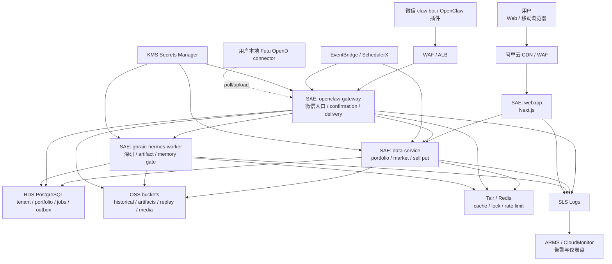

# AI 持仓系统 3.0 阿里云部署方案

> 目标：面向国内网络环境，把原先 Google Cloud Run 部署假设替换为阿里云优先方案。  
> 推荐路径：P0 使用阿里云 SAE + ACR + RDS PostgreSQL + OSS + Tair/Redis + EventBridge/SchedulerX + SLS/ARMS，避免自行维护 Kubernetes 集群。

## 1. 设计原则

1. **国内可访问优先**：服务、对象存储、日志和调度均放在阿里云大陆 Region，减少跨境网络依赖。
2. **容器优先，避免重写应用**：现有 `data-service`、`openclaw`、`gbrain`、`webapp` 都按镜像部署，先不改业务架构。
3. **数据库不再依赖 Supabase Cloud 运行时**：P0 生产建议迁移到阿里云 RDS PostgreSQL；Supabase Auth 若继续使用，只作为认证服务的可替代项，不能作为国内生产强依赖。
4. **对象存储统一 OSS**：Hermes artifacts、历史行情、回放证据、媒体文件都进 OSS bucket，DB 只存 URI/hash/manifest。
5. **券商连接仍保持用户本地**：Futu OpenD 不部署到云端；用户本地 connector 轮询云端任务并上传脱敏快照。
6. **交易动作仍不自动下单**：部署形态不改变 P0 read-only / draft-only / confirmation-first 原则。

## 2. 推荐云产品映射

| 当前能力 | Google Cloud 方案 | 阿里云推荐 | 说明 |
| --- | --- | --- | --- |
| 容器运行 | Cloud Run | SAE（Serverless App Engine） | 支持镜像部署，免维护集群，适合 P0 多服务容器 |
| 镜像仓库 | Artifact Registry | ACR（Container Registry） | 构建/扫描/分发镜像 |
| 业务数据库 | Supabase/Postgres | RDS PostgreSQL | 承载 tenant、portfolio、outbox、job、artifact registry 等业务表 |
| 对象存储 | Supabase Storage / GCS | OSS | 承载历史行情、artifact、replay、媒体 |
| Redis/队列缓存 | Redis | Tair / Redis OSS-compatible | 用于缓存、锁、限流、worker 协调 |
| 定时任务 | Cloud Scheduler | EventBridge 定时规则或 SchedulerX | P0 用 EventBridge HTTP target；复杂分片任务再上 SchedulerX |
| 密钥管理 | Secret Manager | KMS Secrets Manager | 存 API key、delivery secret、DB password |
| 日志 | Cloud Logging | SLS（Simple Log Service） | 结构化日志、查询、告警 |
| APM/监控 | Cloud Monitoring | ARMS + SLS + CloudMonitor | API 延迟、错误、容器指标、告警 |
| 公网入口 | Cloud Run URL | ALB + SAE ingress + WAF | 对外暴露 WebApp / OpenClaw Gateway |
| CDN | Cloud CDN | Alibaba Cloud CDN | Web 静态资源、图片与报告下载加速 |
| DNS | Cloud DNS | Alibaba Cloud DNS | 绑定 app / api / openclaw 域名 |

## 3. 目标架构图



## 4. 服务拆分

| 服务 | 部署形态 | 公网 | 最小规格建议 | 备注 |
| --- | --- | --- | --- | --- |
| `webapp` | SAE Node.js 容器 | 是 | 1 vCPU / 1-2 GiB，1-2 实例 | 移动端 WebApp；后续静态资源走 CDN |
| `openclaw-gateway` | SAE Python/FastAPI 容器 | 是 | 1 vCPU / 1 GiB，最少 1 实例 | 微信入口、确认中心、delivery/outbox |
| `data-service` | SAE Python/FastAPI 容器 | 内网优先，可经网关转发 | 1 vCPU / 1-2 GiB，1-2 实例 | 持仓、行情、Sell Put、历史行情接口 |
| `gbrain-hermes-worker` | SAE/Burstable worker 容器 | 否 | 1-2 vCPU / 2-4 GiB | 深研、artifact、memory gate；可独立扩容 |
| `worker-outbox` | SAE worker 或与 gateway 同镜像不同启动命令 | 否 | 0.5-1 vCPU / 512 MiB | 投递重试、quiet hours、补偿 |
| `worker-scheduler-consumer` | SAE worker | 否 | 0.5-1 vCPU / 512 MiB | 定时任务消费、账户分片 |

P0 可以先把 `openclaw-gateway` 和 outbox worker 合并部署为同镜像不同启动命令；用户规模上来后再拆成独立 SAE 应用。

## 5. 数据与存储设计

### RDS PostgreSQL

承载：

- tenant/account/channel binding
- portfolio views / follow views / list views
- asset sources / broker snapshots / cash / margin
- stock positions / option positions
- confirmation sessions / pending actions
- job runs / outbox / artifact registry
- audit / tool calls / lineage

建议：

- 使用专有网络 VPC，不开放公网数据库。
- 开启自动备份与 PITR。
- 按 tenant_id 建索引和 RLS/应用层隔离校验。
- 生产 migration 继续使用当前 Supabase SQL 迁移，但运行目标改为 RDS PostgreSQL。

### OSS buckets

建议 bucket：

- `ai-holdings-market-data`：历史行情 bars / 期权链快照
- `ai-holdings-artifacts`：Hermes 深研报告、策略报告、模型输出
- `ai-holdings-replay`：回放证据、eval payload
- `ai-holdings-media`：微信图片、OCR/ASR 中间文件

统一对象 key：

```text
tenant/{tenant_id}/yyyy/mm/dd/{domain}/{object_id}.json
```

### Tair / Redis

用途：

- 行情短缓存
- outbox rate limit
- idempotency key
- job lock
- worker heartbeat
- webhook dedupe

## 6. 定时任务方案

P0 推荐：

- EventBridge 定时规则调用 OpenClaw/Data Service 的内部 cron endpoint。
- 每个 endpoint 都必须携带 `OPENCLAW_CRON_SECRET` 或签名头。
- cron payload 必须包含 `tenant_id` 或账户分片范围，不允许无范围全局扫表。

后续增长到多账户并行：

- 使用 SchedulerX 做分布式调度、分片、失败重试和执行历史。
- 大任务拆成：`scheduler trigger -> job_runs -> worker consume`，避免定时器直接执行重任务。

P0 cron：

| 任务 | 频率 | 入口 |
| --- | --- | --- |
| daily-market-scan | 交易日盘后 | `/api/cron/daily-scan` |
| daily-profit-taking | 交易日前 | `/api/cron/profit-taking` |
| heartbeat-check | 每 5 分钟 | `/api/cron/heartbeat` |
| stale-jobs-check | 每 10 分钟 | `/api/cron/stale-jobs` |
| historical-market-sync | 每交易日盘后 | `/api/cron/historical-sync` |

## 7. 网络与安全

1. 所有 SAE、RDS、Redis、OSS 内网访问放在同一 VPC/安全组。
2. 公网只暴露：
   - `app.example.cn` -> WebApp
   - `api.example.cn` -> OpenClaw Gateway
   - 可选 `data.example.cn` 仅管理白名单访问
3. 接入 WAF，保护 `/api/openclaw/*` 和 WebApp 登录入口。
4. KMS Secrets Manager 管理：
   - DB password
   - OpenAI / MiniMax key
   - WeChat secret
   - OpenClaw delivery webhook secret
   - FX provider key
   - Tushare / Longbridge key
5. SAE 应用使用 RAM Role 最小权限访问 OSS、KMS、SLS、RDS。
6. Delivery webhook 使用 HMAC 签名，保留 `X-OpenClaw-Delivery-Signature`。

## 8. 可观测性

### SLS

每个服务输出 JSON 日志字段：

- `tenant_id`
- `request_id`
- `run_id`
- `job_id`
- `channel_binding_id`
- `source_quality`
- `degradation_level`
- `error_code`

### ARMS / CloudMonitor

核心指标：

- API p95 / p99 latency
- 5xx rate
- outbox delivered/retrying/failed
- confirmation timeout rate
- broker snapshot freshness
- historical sync success rate
- model provider fallback rate
- FX fallback rate
- OSS write failure rate
- RDS connection pool saturation

### 告警优先级

| P级 | 条件 |
| --- | --- |
| P0 | confirmation/delivery 全局失败、RDS 不可用、OpenClaw Gateway 5xx 激增 |
| P1 | Futu snapshot freshness 大面积超时、FX fallback 持续、historical sync 失败 |
| P2 | 单 tenant outbox 重试、单 provider fallback、单 bucket 写失败 |

## 9. CI/CD 方案

P0 最小：

1. 本地或 CI 构建镜像。
2. 推送到 ACR。
3. SAE 更新镜像版本。
4. 跑 preflight、health、smoke。

镜像：

- `ai-holdings/webapp:<git_sha>`
- `ai-holdings/openclaw-gateway:<git_sha>`
- `ai-holdings/data-service:<git_sha>`
- `ai-holdings/gbrain-worker:<git_sha>`

部署门禁：

```bash
python3 scripts/production_readiness.py --profile production
python3 scripts/aliyun_preflight.py --profile production
python3 scripts/aliyun_deployment_monitor.py
```

后续需要新增 `aliyun_*` 脚本替换当前 `gcloud` 版本。

## 10. 分阶段落地

### Phase A：阿里云 P0 手动部署

- 创建 VPC、安全组、RDS PostgreSQL、Redis/Tair、OSS bucket、ACR、SAE 应用。
- 手动配置 KMS secrets / SAE env。
- 本地构建并推送镜像。
- SAE 控制台部署镜像。
- 跑 health 和 smoke。

### Phase B：脚本化部署

- 新增 `.env.aliyun.example`
- 新增 `scripts/aliyun_preflight.py`
- 新增 `scripts/deploy-aliyun.sh`
- 新增 `scripts/aliyun_deployment_monitor.py`
- 将 27 号 Google Runbook 标记为备选，28 号阿里云方案作为默认。

### Phase C：生产稳态

- EventBridge/SchedulerX 接入所有 cron。
- SLS/ARMS 仪表盘上线。
- OSS lifecycle、备份、跨区容灾策略上线。
- RDS PITR 演练。
- outbox 投递成功率和确认超时率进入告警。

## 11. 需要改造的代码配置

| 模块 | 改造点 |
| --- | --- |
| artifact store | 新增 `oss` backend，或用 S3-compatible adapter 对接 OSS |
| historical store | 新增 `oss` backend，替代 `supabase_storage` |
| secrets | 支持从 KMS Secrets Manager 读取，保留 env fallback |
| deploy scripts | 新增 Aliyun CLI / ACR / SAE 部署脚本 |
| readiness | `production_readiness.py` 增加 cloud provider profile：`aliyun` |
| monitor | 新增 SAE app health、RDS、OSS、EventBridge/SchedulerX 检查 |
| docs | 27 号 GCP runbook 改为备选，28 号阿里云 runbook 改为主路径 |

## 12. 关键决策

建议现在拍板：

1. **默认生产云：阿里云。**
2. **默认计算平台：SAE，而不是 ACK。** ACK 更适合后续 10 万级多服务扩展，但 P0 运维成本偏高。
3. **默认数据库：RDS PostgreSQL。** 不在国内生产强依赖 Supabase Cloud。
4. **默认对象存储：OSS。**
5. **默认调度：EventBridge P0，SchedulerX P1。**
6. **默认观测：SLS + ARMS + CloudMonitor。**

## 13. 参考资料

- 阿里云 SAE 支持镜像部署和多语言应用托管。
- 阿里云 ACR 支持镜像构建、扫描、复制和分发。
- 阿里云 RDS 支持 PostgreSQL。
- 阿里云 OSS 提供对象存储。
- 阿里云 KMS Secrets Manager 支持密钥生命周期和应用读取。
- 阿里云 EventBridge 支持事件总线、规则和事件追踪。
- 阿里云 SLS 提供日志、指标、Trace 的可观测与分析能力。
- 阿里云 ARMS 提供应用监控、Prometheus、Grafana、告警等能力。
