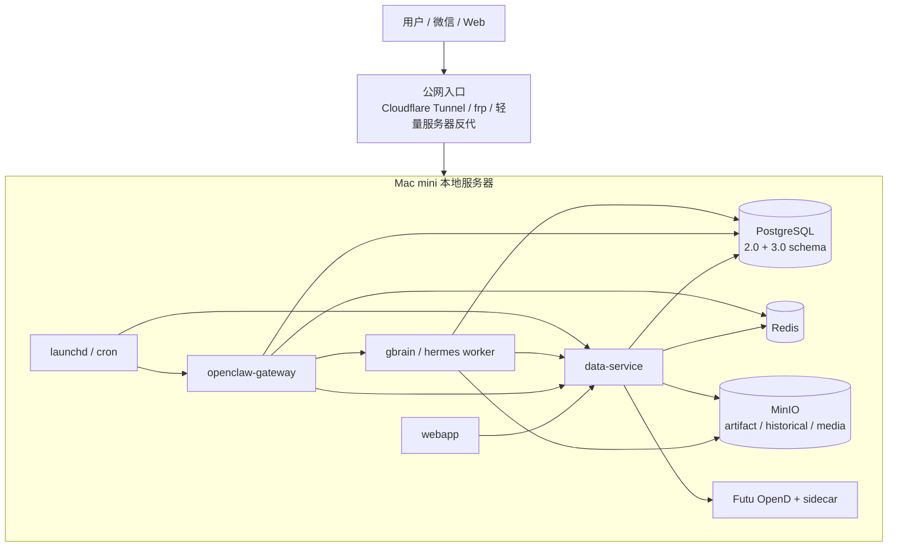

# AI 持仓系统 2.0 -> 3.0 部署升级方案

> 目标：在 2.0 已实现 `OpenClaw + 子 agent + Hermes/GBrain` 桥接的基础上升级到 3.0；尽量保留历史持仓、任务、投递、记忆与报告数据。  
> 推荐路线：**Mac mini 本地 P0 双轨升级 -> 小规模 Beta -> 阿里云生产化迁移**。

## 1. 总体判断

3.0 不应该推倒重来。当前仓库已经具备：

- 2.0 基础表：`trade_events`、`position_snapshots`、`job_runs`、`delivery_runs`、`users` 等。
- 2.0 OpenClaw 能力：Gateway、Delivery、Webhook、安全、Heartbeat、微信认证等。
- 2.0 GBrain/Hermes 基础：`gbrain_sources`、`gbrain_pages`、`gbrain_content_chunks`、`gbrain_minion_jobs`、`memory_entity_bridge`、`memory_sync_log`。
- 3.0 P0 增量 schema：从 `000024_holdings_v3_p0_schema.sql` 开始，新增 `tenant_accounts`、`channel_bindings`、`asset_sources`、`portfolio_views`、股票/期权持仓分离、confirmation、artifact、run contract、delivery_outbox、Hermes handoff、tool contracts 等。
- 3.0 连接器边界：`000027_broker_connector_instances.sql` 支持用户本地 Futu connector。

因此最稳妥的方案是：

```text
保留 2.0 历史事实表
    +
追加 3.0 schema
    +
把 2.0 数据作为 legacy_v2 asset source 投影到 3.0 read model
    +
新写入逐步切到 3.0 confirmation / outbox / artifact / portfolio tables
```

## 2. 部署路线

### 阶段 A：Mac mini 本地 P0

适合当前测试和 P0 阶段。



建议本地部署方式：

- Docker Compose 跑 `PostgreSQL / Redis / MinIO`。
- 本机进程或 Docker 跑 `webapp / openclaw / data-service / gbrain`。
- Futu OpenD 跑在同一台 Mac mini 或同一局域网机器。
- 外网入口只暴露 `webapp` 和 `openclaw-gateway`，不要暴露 DB/Redis/MinIO/Futu OpenD。
- 本地 `.env` 使用 `OPENCLAW_DELIVERY_MODE=log` 或受控 webhook；正式微信回调前保持 HMAC。

### 阶段 B：Mac mini 双轨升级

在同一个数据库里追加 3.0 migration，不删除 2.0 表。

```text
2.0 legacy write path:
trade_events / position_snapshots / job_runs / delivery_runs / gbrain_*

3.0 new write path:
pending_actions / confirmation_sessions / broker_snapshots / portfolio_positions /
artifact_registry / delivery_outbox / hermes_jobs / handoff_tasks

bridge:
legacy_v2 asset_source + projector + read model compare
```

核心要求：

1. 2.0 历史表只读保留。
2. 3.0 read model 可读取/投影 2.0 历史持仓。
3. 新消息、新确认、新报告优先写 3.0 表。
4. GBrain 历史记忆保留，3.0 只增加 memory write gate 和 entity bridge。
5. OpenClaw 路由保持 `routing.json` 字段语义，映射到 `channel_bindings`。

### 阶段 C：小规模 Beta

Mac mini 继续作为主服务器，但开始接真实用户路径：

- 真实微信 OpenClaw 插件回调。
- 真实 Futu 本地 read-only connector。
- 历史行情落 MinIO。
- Artifact 落 MinIO。
- 定时任务用 `launchd/cron`。
- 每日自动备份 DB + MinIO 到外接盘和云端对象存储。

### 阶段 D：阿里云生产迁移

当用户数、可靠性或付费需求上来后迁阿里云：

- SAE 部署 `webapp / openclaw / data-service / gbrain-worker`。
- RDS PostgreSQL 承接 2.0 + 3.0 schema 和历史数据。
- OSS 替代 MinIO。
- Tair/Redis 替代本地 Redis。
- EventBridge/SchedulerX 替代 cron。
- SLS/ARMS 替代本地日志。

迁移时仍保留同一个数据模型：

```text
Mac mini Postgres dump -> RDS PostgreSQL restore
Mac mini MinIO export -> OSS import
本地 .env -> KMS/SAE env
Futu OpenD 仍在用户本地，不迁云端
```

## 3. 历史数据保留策略

### 3.1 保留哪些历史数据

| 2.0 数据 | 保留方式 | 3.0 中的使用方式 |
| --- | --- | --- |
| `users` | 原表保留 | 生成/补齐 `tenant_accounts` |
| `trade_events` | 原表保留，不改写 | 作为 `legacy_v2_trade_events` 来源投影到持仓读模型 |
| `position_snapshots` | 原表保留，不改写 | 作为历史持仓快照和回测/复盘依据 |
| `job_runs` | 原表保留 | 历史任务只读；新任务逐步写 `hermes_jobs / handoff_tasks` |
| `delivery_runs` | 原表保留 | 历史投递只读；新投递写 `delivery_outbox` |
| `gbrain_sources/pages/chunks` | 原表保留 | 继续作为长期记忆；新增 memory gate 和 entity bridge |
| `memory_entity_bridge` | 保留并继续使用 | 连接 2.0 记忆与 3.0 instruments/positions/artifacts |
| `daily_reports / profit_taking_action_plan` | 原表保留 | 历史报告和止盈计划可迁入 artifact 或只读展示 |

### 3.2 不建议做的事

不要在升级阶段：

1. 批量重写 `trade_events`。
2. 批量删除 2.0 `position_snapshots`。
3. 把 GBrain 历史记忆重新生成一遍并覆盖旧 page。
4. 把 2.0 `delivery_runs` 强行改造成 `delivery_outbox`。
5. 一次性把 Supabase Auth / users / tenant_id 全部换掉。

正确做法是：**保留原表，新增 bridge/projection。**

## 4. 数据映射方案

### 4.1 tenant/account 映射

2.0：

- `users.id` 已经是事实上的 tenant 根。
- `routing.json.tenantId` 是数据隔离根。
- `routing.json.accountId` 是 OpenClaw 微信机器人账号 ID。

3.0：

- `tenant_accounts.tenant_id = users.id`
- `channel_bindings.tenant_id = users.id`
- `channel_bindings.openclaw_account_id = routing.json.accountId`
- `channel_bindings.session_space = routing.json.sessionSpace`
- `channel_bindings.memory_root/session_root/identity_root/data_root` 继承 `routing.json`

### 4.2 持仓历史映射

2.0：

- `trade_events`：手工/微信/OCR 成交事实
- `position_snapshots`：由成交事实计算的持仓快照

3.0：

- `asset_sources` 新增一条 `legacy_v2_trade_events`
- `portfolio_views` 新增默认视图
- `portfolio_positions/equity_positions/option_positions` 由 projector 生成

投影原则：

1. 股票/ETF 进入 `equity_positions`。
2. 期权进入 `option_positions`；P0 先支持 OCC 风格合约代码自动识别，无法自动识别的历史期权后续进入人工核对队列。
3. 历史成本、数量、清仓状态保留在 read model 和 source lineage。
4. 2.0 快照 ID 和 `computed_from_event_ids` 写入 `source_lineage`，便于回溯。

### 4.3 GBrain/Hermes 记忆映射

2.0 GBrain 继续作为长期记忆源。

3.0 新增：

- `agent_runs`
- `run_contracts`
- `context_packs`
- `artifact_registry`
- `hermes_jobs`
- `handoff_tasks`

桥接原则：

1. 2.0 `gbrain_pages` 不重写。
2. 新深研报告写 `artifact_registry`，必要时再经 memory write gate 写入 GBrain。
3. 业务事实不直接写 GBrain，必须先写业务表，再由 memory sync 生成摘要。
4. `memory_entity_bridge` 负责把旧 page 关联到新 `instrument_id / portfolio_position_id / artifact_id`。

## 5. 升级步骤

### Step 0：冻结和备份

在任何 schema 升级前：

```bash
pg_dump "$DATABASE_URL" > backups/v2-before-v3-$(date +%Y%m%d-%H%M%S).sql
```

备份 MinIO/对象文件：

```bash
mc mirror local/market-data backups/market-data
mc mirror local/hermes-artifacts backups/hermes-artifacts
mc mirror local/replay-evidence backups/replay-evidence
mc mirror local/tenant-media backups/tenant-media
```

### Step 1：应用 3.0 增量 migration

只追加 `000024+`：

```bash
./scripts/apply-supabase-migrations.sh --via psql --seed
```

验收：

- `tenant_accounts`
- `channel_bindings`
- `asset_sources`
- `portfolio_views`
- `portfolio_positions`
- `pending_actions`
- `artifact_registry`
- `delivery_outbox`
- `hermes_jobs`
- `broker_connector_instances`

这些表存在且不影响 2.0 表。

### Step 2：生成 2.0 -> 3.0 tenant/channel bridge

写入：

- `tenant_accounts`
- `channel_bindings`
- `asset_sources`
- 默认 `portfolio_views`

来源：

- `users`
- `routing.json`
- 现有 `.env` / OpenClaw 配置

已落地脚本：

```bash
# 先生成 SQL 并审阅
python3 scripts/routing_to_channel_bindings.py /path/to/routing.json \
  --output /tmp/routing-to-channel-bindings.sql

# 审阅无误后写入当前数据库
python3 scripts/routing_to_channel_bindings.py /path/to/routing.json --apply
```

脚本约定：

1. 继承 2.0 `routing.json.tenantId` 到 3.0 `tenant_id`。
2. 继承 2.0 `routing.json.accountId` 到 3.0 `channel_bindings.openclaw_account_id`。
3. 继承 `sessionSpace / memoryRoot / sessionRoot / identityRoot / dataRoot`，避免 OpenClaw 会话和记忆路径迁移后错位。
4. 仅做增量 upsert，不删除旧路由、不覆盖 2.0 原始文件。

### Step 3：历史持仓投影

运行只读 projector：

```text
trade_events + position_snapshots
  -> portfolio_positions
  -> equity_positions / option_positions
```

已落地脚本：

```bash
# 生成全量投影 SQL 并审阅
python3 scripts/legacy_v2_projector.py \
  --output /tmp/legacy-v2-to-v3-projector.sql

# 只投影单个 tenant，适合先灰度验证
python3 scripts/legacy_v2_projector.py \
  --tenant-id <tenant_uuid> \
  --output /tmp/legacy-v2-to-v3-projector-one-tenant.sql

# 审阅无误后写入当前数据库
python3 scripts/legacy_v2_projector.py --tenant-id <tenant_uuid> --apply
```

脚本约定：

1. 从 `users` 补齐 `tenant_accounts`。
2. 从 `position_snapshots` 的最新快照生成 3.0 持仓读模型。
3. 生成 `legacy_v2_trade_events` 资产来源，保留 `source_lineage`。
4. 股票/ETF 写入 `equity_positions`；OCC 风格期权合约写入 `option_positions`。
5. 默认保留清仓持仓，用于清仓回溯；如果只想投影当前持仓，可加 `--exclude-closed`。
6. 不更新、不删除 2.0 `trade_events / position_snapshots`。

验收：

1. 3.0 dashboard 资产合计与 2.0 持仓快照对齐。
2. 股票/ETF 和期权分离。
3. 清仓标的进入 list/closed view。
4. 关注清单不从历史自动生成，除非用户确认。
5. 所有投影行带 `source_lineage`。

### Step 4：OpenClaw 双轨路由

保留 2.0 OpenClaw 入口，但新增 3.0 handler：

| 输入类型 | 2.0 兼容 | 3.0 新路径 |
| --- | --- | --- |
| 普通问答 | 保留 | OpenClaw -> model adapter / data-service |
| 买卖消息 | 保留解析 | OpenClaw -> pending_actions -> confirmation |
| 图片/OCR | 保留 | 低置信进入 confirmation |
| 语音/ASR | 新增/保留 | 文本候选进入 confirmation |
| 深研任务 | Hermes bridge 保留 | Hermes job -> artifact_registry -> handoff |
| 投递 | delivery_runs 历史只读 | delivery_outbox 新写入 |

### Step 5：Hermes/GBrain 双轨

1. 保留 2.0 `gbrain_*`。
2. Hermes 长任务开始写 `agent_runs/run_contracts/hermes_jobs/artifact_registry`。
3. memory write gate 决定哪些内容进入 GBrain。
4. 旧 GBrain page 可通过 bridge 关联到新标的和持仓。

### Step 6：切 WebApp 到 3.0 read model

WebApp 先只读：

- `/api/v3/portfolio/overview`
- `/api/v3/portfolio/positions`
- `/api/v3/portfolio/views`
- `/api/v3/confirmations`
- `/api/v3/handoffs`

保留回退：

- 如果 3.0 read model 空或投影失败，显示 2.0 历史只读提示。

### Step 7：启用新写入

当 3.0 read model 验收通过：

- 新买卖消息写 `pending_actions`，确认后写 3.0 业务事实。
- 新 broker sync 写 `broker_sync_snapshots` 和 `broker_position_snapshots`。
- 新报告写 `artifact_registry`。
- 新投递写 `delivery_outbox`。

2.0 表只保留历史读，不再作为主要写入目标。

## 6. Mac mini 部署配置建议

| 组件 | 推荐 |
| --- | --- |
| Mac mini | 16GB 内存最低，24/32GB 更好；512GB 起步，1TB 更稳 |
| DB | PostgreSQL Docker volume，开启每日 dump |
| Object storage | MinIO，本地盘 + 外接盘备份 |
| Redis | Docker Redis，允许重建，不作为事实源 |
| Web/OpenClaw/API | 本机进程或 Docker Compose |
| Hermes worker | 默认 0/按需启动，深研时再跑 |
| Futu OpenD | 同机或局域网，read_only |
| 外网入口 | Cloudflare Tunnel / frp / 阿里云轻量反代 |
| 备份 | 每日 DB dump + MinIO mirror + 每周离线外接盘 |

## 7. 阿里云迁移方案

当从 Mac mini 迁到阿里云：

### 数据迁移

1. 停止写入。
2. `pg_dump` Mac mini PostgreSQL。
3. 在阿里云 RDS PostgreSQL restore。
4. 校验 row count、关键 tenant、历史持仓和 GBrain pages。

### 对象迁移

1. MinIO buckets 导出。
2. 上传到 OSS。
3. 更新 env：
   - `HERMES_ARTIFACT_STORAGE_BACKEND=oss`
   - `HISTORICAL_STORAGE_BACKEND=oss`
4. 保留旧 URI 到新 OSS URI 的映射表或兼容层。

### 服务迁移

1. 镜像推 ACR。
2. SAE 部署 `webapp/openclaw/data-service/gbrain-worker`。
3. EventBridge/SchedulerX 接 cron。
4. SLS/ARMS 接日志监控。
5. 微信/OpenClaw 回调域名切到阿里云 Gateway。

## 8. 验收清单

### 数据验收

- 2.0 `trade_events` row count 不变。
- 2.0 `position_snapshots` row count 不变。
- `gbrain_pages/chunks` row count 不变。
- 3.0 `tenant_accounts` 覆盖所有 2.0 users。
- 3.0 `portfolio_positions` 与 2.0 最新持仓快照资产数量一致。
- 期权持仓单独进入 `option_positions`。
- 清仓历史可在 list/closed view 查询。
- 所有 3.0 投影都有 `source_lineage`。

### 功能验收

- WebApp 能读 3.0 holdings。
- OpenClaw 文本/语音/OCR 不绕过 confirmation。
- Hermes 深研产物进入 artifact registry。
- Delivery outbox 能投递/重试/记录失败。
- Futu real sync 仍为 read-only。

### 回滚条件

如果出现：

- 3.0 read model 与 2.0 资产差异无法解释。
- confirmation 写入失败。
- OpenClaw 投递失败率异常。
- GBrain memory 被错误污染。

立即：

1. 停止 3.0 新写入。
2. WebApp 回退 2.0 只读视图。
3. OpenClaw 只保留普通问答/通知。
4. 使用 `v2-before-v3` 备份恢复。

## 9. 最终建议

我建议采用以下路径：

1. **当前阶段：Mac mini 本地 P0。**
   - 保留 2.0 数据。
   - 追加 3.0 schema。
   - 做 legacy projector。
   - WebApp 切 3.0 read model。

2. **小规模 Beta：Mac mini + 外网隧道。**
   - 接真实微信、真实 Futu、真实 confirmation。
   - 每日备份。
   - 开启 Sentry 或轻量云日志。

3. **正式生产：迁阿里云。**
   - RDS PostgreSQL + OSS + SAE + Tair + EventBridge + SLS/ARMS。
   - 迁移 DB dump 和 MinIO 对象。
   - Futu OpenD 仍保持用户本地 connector。

这个方案最大化复用 2.0 已有能力，最小化历史数据风险，同时让 3.0 的多账户、股票/期权分离、confirmation、artifact、Hermes handoff 和对象存储逐步接管新工作流。
