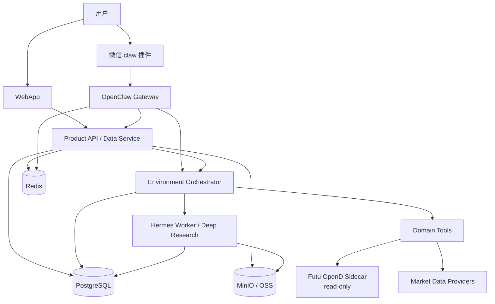

# AI 持仓系统 3.0 全新部署方案

> 适用场景：不从 2.0 升级，不保留旧 `trade_events / position_snapshots / gbrain_*` 数据，直接部署一套干净的 3.0 P0 环境。  
> 推荐路线：**Mac mini 本地全新部署 -> 单用户真实链路验证 -> 小规模内测 -> 阿里云生产化**。

## 1. 和 2.0 升级路线的区别

| 项目 | 2.0 升级部署 | 3.0 全新部署 |
| --- | --- | --- |
| 数据库 | 保留 2.0 表，再追加 3.0 migration | 从空库应用全部 migration |
| 历史持仓 | 用 `legacy_v2_projector.py` 投影 | 不运行 legacy projector |
| OpenClaw 路由 | 可导入既有 `routing.json` | 新用户绑定时直接写 `channel_bindings` |
| GBrain/Hermes | 保留旧记忆并桥接 | 从空的 artifact/memory store 开始 |
| 对象存储 | MinIO/OSS 迁移旧对象 | 新建 bucket/prefix |
| 风险 | 历史数据一致性风险 | 主要是新链路配置和权限风险 |

全新部署的原则是：**先把账号、渠道、券商连接、对象存储、定时任务和确认链路跑通，再导入真实资产。**

## 2. 本地 P0 资源

Mac mini 本地全新部署建议先准备：

| 组件 | P0 建议 |
| --- | --- |
| 服务器 | Mac mini 16GB 起步，24/32GB 更稳 |
| 数据库 | PostgreSQL，本地 Docker volume 或本机服务 |
| 缓存/队列 | Redis，可重建，不作为事实源 |
| 对象存储 | MinIO，bucket：`market-data`、`hermes-artifacts`、`replay-evidence`、`tenant-media` |
| Web/API | `webapp`、`data-service`、`openclaw-gateway` |
| Agent | Hermes/GBrain worker 按需启动 |
| 券商连接 | Futu OpenD 本地安装，read-only |
| 外网入口 | Cloudflare Tunnel、frp 或轻量云服务器反代 |
| 备份 | 每日 DB dump + MinIO mirror |

## 3. 全新部署架构



## 4. 部署步骤

### Step 0：复制全新部署代码

从当前工程复制一份干净代码目录，排除本地密钥、依赖、构建产物和运行缓存。

```bash
rsync -a \
  --exclude='.git' \
  --exclude='.env' \
  --exclude='.env.local' \
  --exclude='node_modules' \
  --exclude='.next' \
  --exclude='__pycache__' \
  --exclude='.pytest_cache' \
  --exclude='.run' \
  --exclude='.logs' \
  ./ ../ai-holdings-analyzer-v3-fresh-deploy/
```

复制后的新目录保留 `.env.example / .env.production.example`，但不保留真实 `.env`。

### Step 1：初始化环境变量

```bash
cd ../ai-holdings-analyzer-v3-fresh-deploy
cp .env.example .env
```

必须替换：

- `DATABASE_URL / SUPABASE_DB_URL`
- `SUPABASE_URL / SUPABASE_ANON_KEY / SUPABASE_SERVICE_ROLE_KEY`
- `MINIMAX_API_KEY`
- `OPENAI_API_KEY` 或统一 model adapter 对应 key
- `OPENCLAW_DELIVERY_WEBHOOK_SECRET`
- `OBJECT_STORAGE_*`
- `FUTU_CONNECTOR_*`

### Step 2：启动基础设施

```bash
docker compose up -d postgres redis minio
```

如果暂时不使用 Docker：

```bash
./scripts/setup-supabase-env.sh --mode local
./scripts/start-local-services.sh
```

### Step 3：应用数据库 migration

空库部署直接应用全部 migration：

```bash
./scripts/apply-supabase-migrations.sh --via psql --seed
```

验收重点：

- `tenant_accounts`
- `channel_bindings`
- `asset_sources`
- `portfolio_views`
- `portfolio_positions`
- `equity_positions`
- `option_positions`
- `pending_actions`
- `delivery_outbox`
- `artifact_registry`
- `run_contracts / hermes_jobs / handoff_tasks`

### Step 4：创建首个系统账号

全新部署不需要导入旧 `routing.json`。首个账号由 WebApp/Supabase Auth 创建用户，再补齐：

1. `tenant_accounts`：系统账号和数据隔离根。
2. `portfolio_views`：至少一个默认资产视图。
3. `asset_sources`：手工录入、消息录入、OCR、Futu connector 等来源。
4. `channel_bindings`：用户绑定微信 claw 插件后写入。

如果 P0 需要手工 bootstrap，可先用 seed 脚本创建测试账号，再通过绑定流程覆盖。

### Step 5：配置 Futu 本地只读连接

用户本地运行 Futu OpenD，系统只保存连接实例和同步快照，不保存生产交易 token。

```bash
FUTU_SIDECAR_MODE=real \
FUTU_OPEND_HOST=127.0.0.1 \
FUTU_OPEND_PORT=11111 \
python3 -m local_connectors.futu_opend.server
```

数据服务连接：

```bash
FUTU_CONNECTOR_MODE=local_connector
FUTU_CONNECTOR_BASE_URL=http://localhost:8765
```

### Step 6：启动应用服务

```bash
./scripts/start-local-services.sh
```

或使用 Docker Compose 启动完整栈：

```bash
docker compose up -d
```

### Step 7：跑 P0 验证

```bash
./scripts/verify-p0.sh
```

有真实 Futu OpenD 后再跑：

```bash
./scripts/verify-p0.sh --with-futu-real
```

有真实微信/确认/投递 hook 后再跑：

```bash
./scripts/verify-p0.sh --with-live-confirmation --with-live-e2e
```

### Step 8：开启定时任务

P0 本地可用 `launchd / cron`：

- 每日行情采集。
- 每日持仓快照同步。
- confirmation 过期扫描。
- delivery outbox 重试。
- artifact/object storage 完整性检查。
- DB 和对象存储备份。

正式生产迁阿里云后改用 EventBridge/SchedulerX。

## 5. 阿里云全新生产部署

全新生产部署推荐采购：

| 能力 | 阿里云服务 |
| --- | --- |
| 应用托管 | SAE 或 ECS + Docker Compose |
| 数据库 | RDS PostgreSQL |
| 对象存储 | OSS |
| 缓存/队列 | Tair/Redis |
| 定时任务 | EventBridge / SchedulerX |
| 日志 | SLS |
| 监控 | ARMS / CloudMonitor |
| 镜像 | ACR |
| 域名/TLS | ALB 或 Nginx + 证书服务 |
| 密钥 | KMS / SAE 环境变量 |

迁云时仍保留 Futu OpenD 本地运行模式：云端只连用户本地 connector 暴露的受控只读接口，或通过用户本地 agent 主动上报快照。

## 6. 验收清单

全新部署完成标准：

1. 空库 migration 全部通过。
2. 首个 `tenant_accounts` 可登录 WebApp。
3. 绑定微信后 `channel_bindings` 正确写入，且 tenant 维度隔离。
4. 手工录入、买卖消息、OCR、Futu 同步都能创建带来源的资产数据。
5. 股票和期权分别进入 `equity_positions / option_positions`。
6. Sell Put 候选、确认草稿和投递回执完整跑通。
7. Hermes 深研产物写入 `artifact_registry` 和对象存储。
8. 历史行情可以优先读本地/对象存储。
9. 定时任务带 tenant/channel binding 执行，失败可重试。
10. 备份、恢复演练和监控告警至少完成一次。

## 7. 本轮代码复制结果

本轮会生成一份新目录：

```text
/Users/jerry.wu/Documents/vibecodingapp/ai-holdings-analyzer-v3-fresh-deploy
```

该目录用于全新部署演练，默认不包含：

- `.env / .env.local / webapp/.env.local`
- `.git`
- `node_modules`
- `.next`
- `.run / .logs`
- Python cache 和 pytest cache

后续如果确认这条路线，可以在新目录内初始化新的 git 仓库，作为 3.0 clean-room 部署基线。
