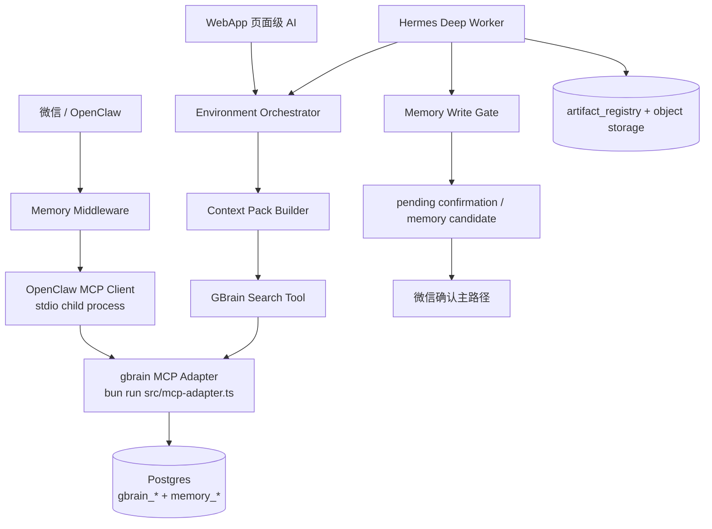

# GBrain 3.0 可用化与部署升级方案

> 背景：2.0 版本已经有 `gbrain_*` schema、OpenClaw memory 目录和本地 `gbrain` adapter，但没有形成稳定可运行的长期记忆服务。3.0 必须把 GBrain 从“模板/表结构/测试代码”升级为真实可启动、可检索、可写入治理、可被 Hermes 使用、可运维的 memory runtime。

## 1. 本地当前能力

| 层 | 当前已有 | 状态判断 |
| --- | --- | --- |
| Schema | `000017_gbrain_core_schema.sql`：sources/pages/chunks/links/tags/timeline/cache/minion_jobs/config | 可作为长期记忆库基础 |
| OpenClaw 扩展 | `000019_gbrain_openclaw_extensions.sql`：`memory_entity_bridge`、`memory_sync_log`、RLS、用户创建 source 触发器、cron seed | 有桥接雏形，但 entity 类型还停留在 2.0 |
| MCP adapter | `gbrain/src/mcp-adapter.ts`：stdio MCP，tools 包括 `health / ensure_source / upsert_page / get_page / search / add_timeline_entry / create_link / get_page_context` | 可被 OpenClaw 以子进程方式调用，不适合直接当 Docker 网络服务 |
| OpenClaw client | `openclaw/gateway/memory/mcp_client.py`：启动 `bun run ./gbrain/src/mcp-adapter.ts`，通过 stdin/stdout JSON-RPC 调 MCP tool | 这是 P0 推荐调用方式 |
| Memory middleware | `openclaw/gateway/memory/*`：交易/分析信号入队、搜索、页面 upsert 封装 | 有代码，但需要打开真实配置和 smoke |
| Hermes 3.0 | `hermes-runtime / context-pack / memory-gate / artifact-registry / model-adapter` | 已能单测和 smoke，尚缺 DB 队列 worker 闭环 |
| 部署配置 | `docker-compose.yml` 有 gbrain service 和健康检查 | 当前 stdio 形态下更适合健康/调试，不应被理解为远程 MCP 服务 |

结论：当前 GBrain 不是空白，但也还不是“生产可用服务”。3.0 P0 应采用 **OpenClaw/Hermes 按需启动 stdio adapter + Postgres 长期记忆表 + artifact/object storage** 的方式先跑通；P1 再评估引入上游 remote MCP / HTTP / OAuth 能力。

## 2. 上游开源版本检查

| 项目 | 最新状态 | 对本系统的意义 |
| --- | --- | --- |
| `garrytan/gbrain` | 2026-05-10 master，`0.31.10`，commit `cb5bf1d3327b4d981775d35fa39b6a9abdbd0b79` | 上游已经显著演进，包含 cold-start 导入、多 source、doctor、PGLite/Postgres、remote/OAuth、minions 等能力 |
| `imphillip/gbrain-openclaw` | 2026-04-06，`0.1.0`，commit `44b6fb37995a3ee52baf2bea301c9eb9e5b60ea2` | 更接近 OpenClaw 早期适配版，能力较轻，适合作为历史参考 |

本轮已同步的安全更新：

1. `@modelcontextprotocol/sdk` 升到 `^1.29.0`。
2. `zod` 改成显式依赖，避免依赖传递包碰巧存在；当前固定在 Zod 3 线以兼容 OpenAI SDK peer 约束。
3. `mcp-adapter.ts` 适配 Zod 3/4 兼容的 two-argument record 写法。
4. `docker-compose.yml` 修正 `GBRAIN_EMBEDDING_MODEL` 环境变量名。
5. 新增 `scripts/verify-gbrain-runtime.sh`，用于 GBrain runtime 验证。

不直接覆盖上游代码的原因：

1. 上游 `garrytan/gbrain` 是通用个人知识脑，3.0 是金融持仓系统，业务事实边界完全不同。
2. 本系统必须遵守 tenant/account/channel binding 隔离，不能让 memory 自由写入持仓事实。
3. 上游 cold-start 会导入邮件、日历、联系人等通用数据；本系统 P0 暂不接这些隐私源。
4. 上游多 source 能力值得吸收，但应映射为本系统的 `tenant_id + memory source + asset source`，不能照搬默认 source 语义。

## 3. 3.0 目标定位

GBrain 在 3.0 中只做三件事：

1. **长期记忆**：用户偏好、交易纪律、复盘教训、分析风格、历史研究摘要。
2. **语义检索**：给 OpenClaw 日常对话和 Hermes 深研提供 memory context。
3. **业务实体桥接**：把记忆页面关联到 `instrument / portfolio_position / option_position / artifact / strategy_rule`。

GBrain 不做：

1. 不作为持仓、现金、期权合约、券商快照的事实源。
2. 不直接更新 `portfolio_positions`。
3. 不直接生成可执行交易动作。
4. 不绕过 confirmation 保存交易纪律和策略参数。

## 4. 运行架构



P0 不把 `gbrain` 暴露成公网服务。OpenClaw 和 Hermes 在同一主机/容器内通过 stdio 子进程调用 adapter，减少鉴权面和网络攻击面。

## 5. 存储设计

| 存储 | 负责内容 | 表/对象 |
| --- | --- | --- |
| Business Facts | 真实账户、资产、交易、持仓、行情快照 | `tenant_accounts / asset_sources / portfolio_positions / broker_* / market_*` |
| GBrain Memory | 长期记忆、偏好、教训、摘要、可检索上下文 | `gbrain_sources / gbrain_pages / gbrain_content_chunks / gbrain_links / gbrain_timeline_entries` |
| Bridge | memory 和业务实体的弱关联 | `memory_entity_bridge / memory_sync_log` |
| Artifact | 深研报告、Sell Put 报告、周度优化确认清单 | `artifact_registry` + MinIO/OSS/Supabase Storage |
| Replay/Audit | run contract、context pack、工具调用轨迹 | `agent_runs / run_contracts / context_packs / handoff_*` |

## 6. P0 必补能力

| 优先级 | 能力 | 具体实现 |
| --- | --- | --- |
| P0-1 | GBrain runtime 验证 | `scripts/verify-gbrain-runtime.sh` 纳入部署前检查 |
| P0-1 | 真实 DB health-check | 迁移完成后跑 `bun run src/mcp-adapter.ts --health-check` |
| P0-1 | OpenClaw memory 开关 | 明确 `GBRAIN_MCP_RUNTIME / GBRAIN_MCP_ADAPTER_PATH / GBRAIN_DATABASE_URL` |
| P0-1 | Memory write gate | Hermes 只能写 candidate 或 confirmation，不直接写业务事实 |
| P0-1 | Memory entity 扩展 | `memory_entity_bridge.entity_type` 增加 3.0 实体：`instrument / portfolio_position / option_position / artifact / strategy_rule / follow_item / closed_position` |
| P0-1 | Artifact 持久化 | Hermes artifact writer 使用 Postgres sink + MinIO/OSS/Supabase object store |
| P0-2 | Minion/Dream 作业 | P0 先做 nightly reindex/search-cache-clean，不做自动改写 memory |
| P0-2 | cold-start 金融版 | 导入 Obsidian 投资笔记、历史报告、交易纪律，不导入邮件/联系人 |
| P0-2 | doctor/check | 检查 migration、embedding 维度、source drift、RLS、检索可用性 |

## 7. 本地 Mac mini 部署步骤

1. 应用 DB migration，确保 `vector / pg_trgm / gbrain_* / memory_*` 存在。
2. 配置 `.env`：

```bash
GBRAIN_MCP_RUNTIME=bun
GBRAIN_MCP_ADAPTER_PATH=./gbrain/src/mcp-adapter.ts
GBRAIN_DATABASE_URL=$DATABASE_URL
GBRAIN_EMBEDDING_MODEL=text-embedding-3-small
GBRAIN_OPENAI_API_KEY=...
GBRAIN_LIVE_MODELS_ENABLED=false
HERMES_ARTIFACT_STORAGE_BACKEND=file
HERMES_ARTIFACT_BASE_URI=file://hermes-artifacts
HERMES_ARTIFACT_FILE_ROOT=.artifacts/hermes
```

3. 部署前验证：

```bash
./scripts/verify-gbrain-runtime.sh
```

4. OpenClaw 启动后，通过 memory middleware 触发一次 `ensure_source / upsert_page / search`。
5. Hermes smoke 生成 artifact，并确认不写业务事实。
6. 每日备份包含 Postgres `gbrain_* / memory_*` 和 `.artifacts/hermes`。

## 8. 阿里云部署方案

阿里云生产环境建议：

| 组件 | 部署方式 |
| --- | --- |
| Postgres | RDS PostgreSQL，启用 `vector / pg_trgm / pgcrypto` |
| Object Storage | OSS，bucket 分 `hermes-artifacts / tenant-media / replay-evidence` |
| GBrain adapter | 不单独公网暴露；作为 OpenClaw/Hermes 容器内 stdio 子进程 |
| Hermes worker | SAE/ECS worker，消费 `hermes_jobs`，写 artifact 和 handoff |
| Cron | EventBridge/SchedulerX 调 reindex、search-cache-clean、artifact retention |
| Logs/metrics | SLS/ARMS 采集 adapter stderr、Hermes job status、MCP failure rate |

生产上不要直接把 stdio MCP adapter 做成独立容器网络服务。如果后续需要远程调用，再做 P1：

1. 增加 HTTP/SSE MCP transport。
2. 所有请求必须带 tenant-scoped run contract。
3. 服务端校验 allowed tools、memory scope、channel binding。
4. 单独加 rate limit、audit log 和 secret redaction。

## 9. 验收标准

GBrain 3.0 可用化完成标准：

1. `./scripts/verify-gbrain-runtime.sh` 通过。
2. OpenClaw 可以为一个真实 tenant 写入一条用户偏好 memory，并能检索回来。
3. Hermes 深研可以读取 context pack 中的 GBrain 片段。
4. Hermes 写 memory 时，业务事实被拒绝，用户偏好进入 candidate，交易纪律进入 confirmation。
5. Artifact 写入对象存储和 `artifact_registry`。
6. `memory_entity_bridge` 能关联一个 `instrument` 和一个 `artifact`。
7. 清空/禁用某 tenant memory 时不会影响其他 tenant。
8. 部署监控能看到 MCP adapter health、search latency、embedding failure、Hermes job failure。

## 10. 近期执行建议

短期不要重写成完整上游 `garrytan/gbrain`。更稳的路径是：

1. P0：让当前 Postgres adapter 真实可用，补验证、health、memory gate、artifact 持久化。
2. P0.5：做金融版 cold-start，只导入 Obsidian 投资笔记、2.0 历史报告和交易纪律。
3. P1：吸收上游 doctor、多 source drift、remote MCP、minion resilience 等能力。
4. P1：如果多用户规模变大，再把 stdio adapter 演进为内部 HTTP/SSE MCP service。

这样既吸收上游最新成果，又不会把持仓系统最重要的业务事实边界打散。
