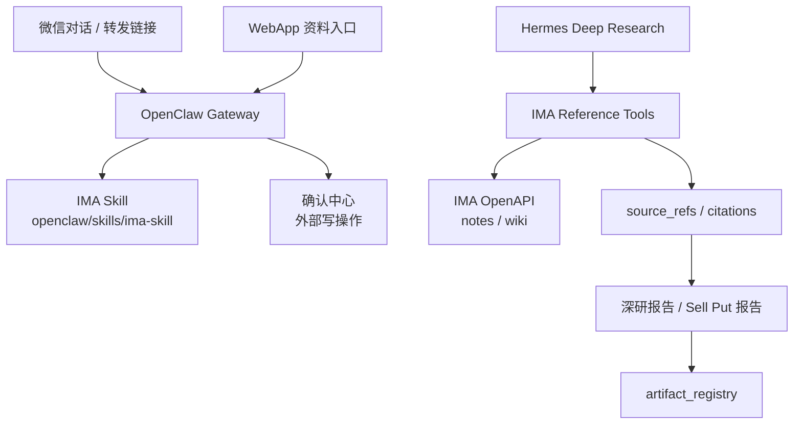

# IMA 参考资料源集成方案

> 目标：把 IMA 中的微信公众号文章、网页、笔记和知识库内容接入 OpenClaw 与 Hermes，作为投资分析和策略研究的参考源。  
> 边界：IMA 内容是研究证据和观点素材，不是行情、持仓、券商快照或交易事实源。

## 1. 已安装技能

IMA 技能包已安装到：

```text
openclaw/skills/ima-skill
```

安装版本：

```text
ima-skills 1.1.7
SHA256 bd5878416aed4c358deb2b9bc34dfd7602a0da9d9602582227794791289f73b2
```

技能来源：

- 介绍页：<https://skillhub.cn/skills/ima-skills>
- 下载包：<https://app-dl.ima.qq.com/skills/ima-skills-1.1.7.zip>
- API Key：<https://ima.qq.com/agent-interface>

## 2. 能力范围

| 模块 | 能力 | 本系统用途 |
| --- | --- | --- |
| Notes | 搜索笔记、读取笔记、新建笔记、追加笔记 | P0 只作为研究资料检索；写笔记需用户明确指令 |
| Knowledge Base | 搜索知识库、浏览知识库、获取媒体信息、导入网页/微信文章 URL | 微信公众号文章和网页资料源 |
| File Upload | PDF/Word/PPT/Excel/Markdown/Image/TXT/XMind/Audio 上传 | P0 非主路径，后续用于研报资料归档 |
| URL Import | `mp.weixin.qq.com`、网页 URL 导入知识库 | 适合作为微信文章入库路径 |

## 3. OpenClaw / Hermes 分工



OpenClaw 负责：

1. 微信文章 URL 的接收、识别、入库确认。
2. 日常对话中的 IMA 搜索。
3. 外部写入类动作的确认，例如导入 URL 到知识库、追加笔记。

Hermes 负责：

1. 深度研究时检索 IMA 参考资料。
2. 把 IMA 搜索结果作为 `source_refs` 写入 context pack。
3. 在报告中标注“资料来源于 IMA / 微信文章 / 知识库”，并保留时间和可追溯 ID。

## 4. Tool Contract

已加入 P0 tool registry：

| Tool | Runtime | 权限 | 用途 |
| --- | --- | --- | --- |
| `reference.ima.search` | OpenClaw + Hermes | read | 搜索 IMA 笔记/知识库 |
| `reference.ima.read` | Hermes | read | 读取 IMA media/note 原文，生成引用 |
| `reference.ima.import_url` | OpenClaw | controlled_write | 导入网页或微信公众号文章 URL 到 IMA 知识库 |

关键规则：

1. IMA 参考源必须进入 `source_refs`，不能只把结论塞给模型。
2. IMA 内容的时效性、作者、标题、media_id/note_id/URL 要尽量保留。
3. 任何来自 IMA 的观点都不能直接写入 `portfolio_positions`。
4. `reference.ima.import_url` 是外部写操作，默认需要用户明确指令或确认。
5. 如果 IMA 不可用，策略分析应降级为“未纳入 IMA 参考源”，不能伪造引用。

## 5. 环境变量

```bash
IMA_OPENAPI_CLIENTID=
IMA_OPENAPI_APIKEY=
IMA_BASE_URL=https://ima.qq.com
IMA_SKILL_VERSION=1.1.7
IMA_SKILL_DIR=./openclaw/skills/ima-skill
IMA_DEFAULT_KNOWLEDGE_BASE_ID=
IMA_REFERENCE_SOURCE_ENABLED=false
```

凭证从 <https://ima.qq.com/agent-interface> 获取。

## 6. 验证

本地验证：

```bash
./scripts/verify-ima-skill.sh
```

无凭证时，验证脚本只检查：

1. 技能包文件完整。
2. `meta.json` 版本为 `1.1.7`。
3. Node 版本满足 `>=18`。
4. 知识库文件上传 preflight 脚本可运行。

配置凭证后，验证脚本会额外检查 IMA 官方 API 鉴权/更新接口。

## 7. 投资分析使用方式

### 微信文章作为机会/风险参考

用户转发微信公众号文章 URL：

1. OpenClaw 识别 `mp.weixin.qq.com/s/...`。
2. 如果用户明确要保存，调用 `reference.ima.import_url` 导入指定知识库。
3. 如果只是分析该文章观点，Hermes 通过 IMA 或 URL 读取摘要作为参考。
4. 结论必须分成：
   - 文章观点
   - 可验证市场事实
   - 对持仓/候选标的的影响
   - 不确定性和反例

### 深研/Sell Put 引用 IMA

Hermes 深研时：

1. 先从持仓事实、行情、期权链取硬数据。
2. 再用 IMA 搜索公司、行业、政策、事件的相关笔记和微信文章。
3. IMA 内容只进入观点和背景部分，不能覆盖行情/券商/交易所数据。
4. 输出中保留引用来源，标明“参考资料，不构成事实确认”。

## 8. P0 不做的事

1. 不自动把所有微信文章导入 IMA。
2. 不把 IMA 笔记正文推送到群聊或不相关渠道。
3. 不用 IMA 内容直接触发交易执行。
4. 不把 IMA API Key 写入数据库、日志或 artifact。
5. 不在没有用户确认时追加/修改已有 IMA 笔记。

## 9. 后续研发任务

1. 实现 `IMAReferenceClient`：封装 `ima_api.cjs` 调用、错误处理和引用 DTO。
2. 实现 OpenClaw URL capture：识别微信文章 URL，生成导入确认。
3. 实现 Hermes reference tool：`search -> read -> source_refs`。
4. 在报告模板中增加“参考资料来源”区块。
5. 给 IMA 调用加 rate limit、超时、失败降级和审计。
