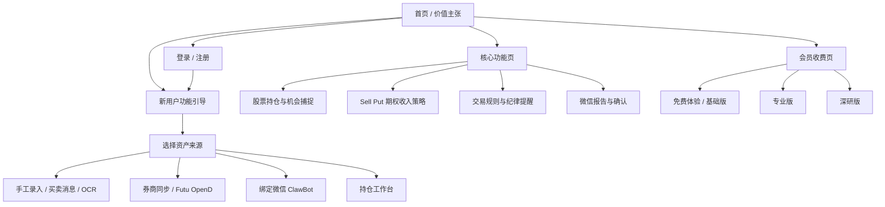

# WebApp 增长型站点与新用户引导高保真方案

> 目标：在不改动当前生产 WebApp 路由的前提下，先给出三套可比较的高保真产品方向，用于确认 AI 持仓系统 3.0 的外部传播站点、新用户功能引导页、核心功能页和会员收费页的视觉与信息架构。

## 可打开原型

- 高保真对比稿：[`prototypes/webapp-growth-concepts.html`](./prototypes/webapp-growth-concepts.html)

## 参考站点与借鉴点

本轮不是复制某一个站点，而是抽取成熟金融工具网站的商业表达方式，并映射到持仓系统 3.0 的真实能力。

| 参考对象 | 可借鉴点 | 对本系统的映射 |
| --- | --- | --- |
| TradingView | 首页直接展示专业图表能力，会员页按数据、提醒、图表能力分层 | 市场行情、历史数据、异动提醒、组合级监控能力需要被前置表达 |
| Sharesight | 以“多账户资产统一视图”和低门槛免费开始作为核心转化点 | 持仓系统的新用户引导应先解决资产录入/同步，再进入策略分析 |
| Seeking Alpha Premium | 以研究、评级、组合健康和 AI 报告建立付费理由 | 深研报告、个股评分、持仓健康检查和微信报告适合放入 Pro/研究版权益 |
| OptionStrat / SensaMarket 类期权工具 | 以策略构建器、期权链、概率、希腊字母和实时数据建立专业感 | Sell Put 模块应强调候选排序、资金占用、到期/roll/assignment 规则 |
| Kubera 类资产追踪工具 | 以跨账户、跨币种、净资产视图减少用户维护成本 | 多券商、多来源、汇率与数据来源可信度要在 onboarding 和首页中可见 |

参考链接：

- TradingView Pricing: https://www.tradingview.com/pricing/
- Sharesight US: https://www.sharesight.com/us/
- Seeking Alpha Premium: https://help.seekingalpha.com/what-is-seeking-alpha-premium
- SensaMarket: https://www.sensamarket.com/
- Kubera multi-currency tracker: https://www.kubera.com/blog/multi-currency-portfolio-tracker

## 站点层级结构

## 三套设计方向

### 方案 A：Alpha 控制台

**定位**：面向主动投资者、Sell Put 用户和已经有一定交易经验的人。  
**主张**：30 秒看清持仓、风险和下一步动作。  
**视觉**：黑底、红色高亮、交易终端密度，强调专业、及时、可执行。  
**最适合**：官网首页、核心功能页、期权功能页、专业版转化页。

核心页面表达：

- 首页：把真实持仓看板、今日风险、Sell Put 候选和微信确认放在首屏。
- 新用户引导：按“连接资产 -> 设置规则 -> 绑定微信 -> 生成第一份报告”推进。
- 核心功能页：股票和期权分开表达，突出策略建议不是聊天，而是基于持仓和行情的操作清单。
- 会员页：按数据刷新、持仓数量、Sell Put 分析、深研任务和推送频率分层。

### 方案 B：长期资产管家

**定位**：面向从 Excel/截图/手工记录迁移而来的普通投资者。  
**主张**：让每一笔持仓都有来源、纪律和复盘。  
**视觉**：白底、深红、米白/浅灰信息面板，强调可信、轻松、可上手。  
**最适合**：新用户 onboarding、移动端、基础会员转化、长期资产复盘。

核心页面表达：

- 首页：弱化复杂交易术语，突出多账户统一资产视图、清仓回顾、关注清单和纪律提醒。
- 新用户引导：允许用户先手工录入或上传截图，不强迫一开始就连接券商。
- 核心功能页：用“持仓前、持仓中、持仓后”的生命周期解释系统。
- 会员页：以“省时间、少漏看、可复盘”为付费理由。

### 方案 C：AI 投研任务流

**定位**：面向愿意为深研、自动化研究和复杂期权分析付费的高级用户。  
**主张**：让 AI 围绕你的真实持仓做研究。  
**视觉**：黑白底、红色任务流、证据链卡片，强调 agent、审计、模型分工和可追溯。  
**最适合**：深研版会员页、核心功能页中的 AI 研究能力、未来团队/高阶用户版本。

核心页面表达：

- 首页：展示从数据源、规则、工具、agent 到微信报告的完整链路。
- 新用户引导：让用户选择第一个任务目标，例如“降低回撤”“找 Sell Put 标的”“复盘清仓股”。
- 核心功能页：突出任务状态、证据来源、模型角色、失败补偿和确认机制。
- 会员页：围绕深研任务额度、历史行情回测、期权 EV/Greeks 和报告留存定价。

## 初步推荐

建议采用 **A 为主、B/C 融合** 的落地方式：

- 官网首页和核心功能页用方案 A：传播冲击力最强，能快速建立“这是专业持仓工作台”的认知。
- 新用户引导页吸收方案 B：降低第一次使用门槛，避免新用户被期权和 agent 概念压住。
- 会员页采用 A+C 混合：基础版强调持仓同步和推送，专业版强调 Sell Put，深研版强调 AI 研究任务与证据链。

确认方向后，下一步可以把选定方案拆成 Next.js 页面：

1. `/marketing` 或公开首页：未登录用户访问的产品介绍。
2. `/features`：核心功能页，按股票、期权、纪律、微信交互分区。
3. `/pricing`：会员收费页。
4. `/onboarding/welcome`：注册后的新用户引导页，承接现有 `/onboarding/profile` 流程。
