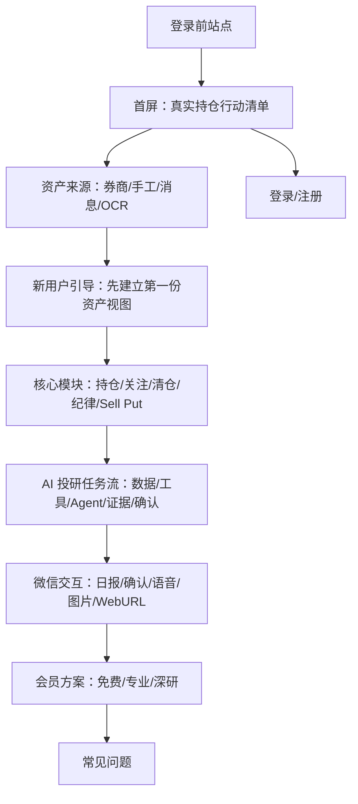

# 登录前站点页面设计：长期资产管家 + AI 投研任务流

> 方向确认：以方案 B「长期资产管家」为主视觉，融合方案 C「AI 投研任务流」的功能表达。目标是做一套完整、可移动端适配、可直接拆到 WebApp 的登录前站点页面。

## 可打开原型

- 完整登录前站点原型：[`prototypes/webapp-prelogin-site-bc.html`](./prototypes/webapp-prelogin-site-bc.html)

## 页面定位

这套站点不是当前持仓工作台的替代品，而是未登录用户进入系统前看到的商业站点。它承担三件事：

1. 让用户快速理解：这是一个围绕真实持仓工作的 AI 投资系统，不是泛聊天工具。
2. 降低第一次使用门槛：允许先手工录入、截图 OCR、买卖消息或微信绑定，不强迫一开始连接券商。
3. 建立付费理由：基础能力解决资产视图和提醒，专业能力解决 Sell Put 和风险，深研能力解决 AI 研究任务和证据链。

## 信息架构

## 设计原则

- 主视觉采用 B：白底、红色主色、清晰资产管理感，减少内部系统术语。
- 功能介绍吸收 C：将 agent、证据链、工具调用、确认机制转译为用户能理解的“AI 研究任务流”。
- 第一屏必须露出真实产品状态：持仓视图、资产来源、风险提醒和待确认动作。
- 移动端优先保证阅读路径：导航收起为登录/开始按钮，产品预览纵向堆叠，价格卡片单列。
- 不暴露内部实现文案：不出现 P0、broker sync、replay、Hermes、MiniMax 等内部表达。

## 页面段落

1. **首屏**：把分散持仓整理成可执行行动清单。
2. **资产来源**：Futu OpenD、手工录入、买卖消息、OCR、微信渠道。
3. **新用户引导**：先录入第一笔资产，再逐步绑定微信、设置纪律、连接券商。
4. **核心功能**：当前持仓、关注清单、清仓复盘、交易纪律、股票分析、Sell Put。
5. **AI 投研任务流**：数据源、规则、分析工具、研究任务、证据链、微信确认。
6. **微信交互**：文本口令、语音口令、图片/OCR、WebURL 读取、确认补偿。
7. **会员方案**：免费试用、专业版、深研版。
8. **FAQ**：券商 token、是否自动下单、数据来源、移动端适配。

## 后续落地建议

确认视觉后，可以按以下路线进入代码实现：

1. 推荐把 `/` 作为登录前公开首页；已登录用户从首页 CTA 或登录状态进入 `/dashboard`。
2. 将当前登录后总览工作台从 `/` 平移到 `/dashboard`，避免公开首页和持仓工作台共用同一路由。
3. 新增 `/features`，复用本页核心功能、资产来源、AI 投研任务流和微信交互段落。
4. 新增 `/pricing`，从本页会员区拆分为独立页面；P0 只展示权益，不接真实扣费。
5. 新增 `/onboarding/welcome`，把本页的新用户引导段落转为注册后的真实引导入口，再衔接现有 `/onboarding/profile`。

### 编码入口路由表

| 路由 | 页面 | 编码说明 |
| --- | --- | --- |
| `/` | 登录前首页 | 使用本设计稿的完整长页；首屏、资产来源、核心功能、AI 投研、微信、会员和 FAQ 都在本页 |
| `/features` | 核心功能介绍 | 从首页拆分复用，强化股票/期权分离、交易纪律、关注清单、清仓复盘 |
| `/pricing` | 会员方案 | 展示免费版、专业版、深研版；P0 不接支付 |
| `/dashboard` | 登录后总览 | 承接当前 `webapp/src/app/page.tsx` 的持仓 Dashboard |
| `/onboarding/welcome` | 新用户欢迎引导 | 注册后第一屏，帮助用户选择资产来源和第一步配置 |
