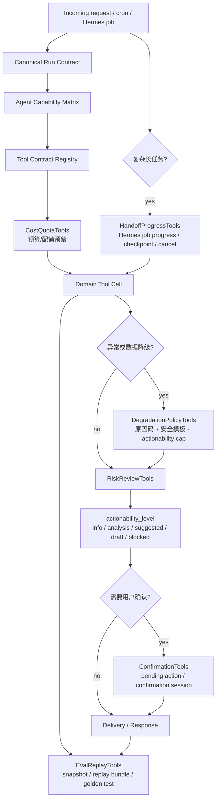

# Control Plane 设计索引

## 定位

控制面负责约束 OpenClaw-side agents、Hermes-side agents 和 Domain Tools 的运行边界。它不直接做股票/期权分析，也不直接生成投资结论，而是决定：

1. 哪个 agent 可以调用什么工具。
2. 工具调用前是否有契约、权限、成本和数据边界。
3. 工具失败或数据降级时如何安全回复。
4. 高风险输出是否能升级成建议或交易草稿。
5. 受控写入是否需要用户确认。
6. 事故后能否重放、评测和复盘。

一句话：**控制面是多 agent 金融系统的刹车、方向盘和行车记录仪。**

## 8 类契约能力

| 文件 | 能力 | 核心问题 |
| --- | --- | --- |
| `01-tool-contract-registry.md` | Tool Contract Registry | 工具 schema、版本、权限、风险、运行时限制的事实源 |
| `02-agent-capability-matrix.md` | Agent Capability Matrix | 每个 agent 能调用什么、写到哪里、必须过哪些 gate |
| `03-confirmation-tools.md` | ConfirmationTools | 交易录入、OCR 修正、规则 override、交易草稿如何确认 |
| `04-risk-review-tools.md` | RiskReviewTools | 输出最终是信息、观察、建议、交易草稿还是阻断 |
| `05-cost-quota-tools.md` | CostQuotaTools | GPT-5.5、期权链、OCR、券商同步、付费数据源如何控成本 |
| `06-handoff-progress-tools.md` | HandoffProgressTools | OpenClaw handoff 给 Hermes 后，长任务如何查进度、取消、恢复 |
| `07-eval-replay-tools.md` | EvalReplayTools | agent run 如何重放、评测、回归测试和事故复盘 |
| `08-degradation-policy-tools.md` | DegradationPolicyTools | 数据源、券商、Hermes、OpenClaw 失败时如何统一降级 |

## 控制面运行链路

## OpenClaw + Hermes 下的分工

| Runtime | 控制面重点 |
| --- | --- |
| OpenClaw-side | 快速校验账号、能力矩阵、配额和数据质量；轻量回复必须受 `RiskReviewTools` 的行动等级约束；推送必须经过 outbox 和 recipient validation |
| Hermes-side | 长任务必须通过 `HandoffProgressTools` 建立可恢复任务；工具调用不能扩大上游 run contract；自主优化只能生成 proposal；最终输出仍要过 `RiskReviewTools` |
| Domain worker | 券商同步、历史行情采集、回测切片等 deterministic worker 仍需 tool contract、idempotency、quota/rate limit、trace 和 replay evidence |

## 推荐执行顺序

### P0 上线前

1. 建立最小 `tool_contracts` 和 `agent_capability_matrix` 配置。
2. 所有工具调用接入 Tool Policy Gate，并记录 `tool_policy_hash`。
3. 所有高成本工具接入 `CostQuotaTools`。
4. 高风险输出统一进入 `RiskReviewTools`，必须落 `actionability_level`。
5. 交易录入、OCR 修正、规则 override、交易草稿接入 `ConfirmationTools`。
6. 数据源、券商、期权链、规则服务失败时走 `DegradationPolicyTools`，不让 agent 自行编降级话术。
7. Hermes 长任务接入 `HandoffProgressTools`，用户能查询进度。
8. 关键 run 接入 `EvalReplayTools`，至少能重放持仓查询、交易录入、sell put、深研和推送错投场景。

### P1 首个可用版本

1. Tool Contract 和 Capability Matrix 管理界面或配置审查流程。
2. 订阅等级、预算预留、usage events 和超额体验。
3. Hermes checkpoint、取消、恢复和任务进度推送。
4. 事故复盘包、脱敏 replay bundle、golden tests 和回归测试集。
5. DegradationPolicy 的运营后台：原因码、模板、触发次数、恢复状态。

## 关键产品原则

1. **agent 可以提出候选结论，不能自己升级行动等级。**
2. **工具可以返回数据，不能绕过数据质量门变成交易建议。**
3. **Hermes 可以优化流程，不能自动放宽金融规则或工具权限。**
4. **用户确认的是待确认动作，不是让系统自动下单。**
5. **降级不是话术问题，是控制面裁决问题。**
6. **评测不是上线后补救，是每个关键能力的验收条件。**

## 仍需统一的接口字段

后续进入实现设计时，8 类能力需要共享以下字段：

| 字段 | 用途 |
| --- | --- |
| `run_id` | 一次 OpenClaw/Hermes/domain worker 执行的主追踪 ID |
| `tenant_id` | 系统账号和数据隔离边界 |
| `agent_role` | 当前调用者角色 |
| `runtime` | openclaw、hermes、domain_worker |
| `tool_name` / `tool_version` | 工具契约与回放依据 |
| `tool_policy_hash` | 当时生效的权限策略 |
| `idempotency_key` | 幂等写入和重试保护 |
| `lineage_refs` | 行情、持仓、券商、历史数据、artifact 引用 |
| `data_quality` | freshness、source tier、fallback、reconcile 状态 |
| `actionability_level` | info_only、analysis_only、suggested_action、trade_draft、blocked |
| `degradation_reason_code` | 降级和阻断原因 |
| `confirmation_session_id` | 受控写入确认链路 |
| `replay_bundle_id` | 回放、评测和事故复盘证据包 |
