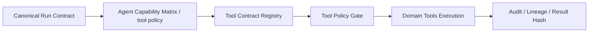
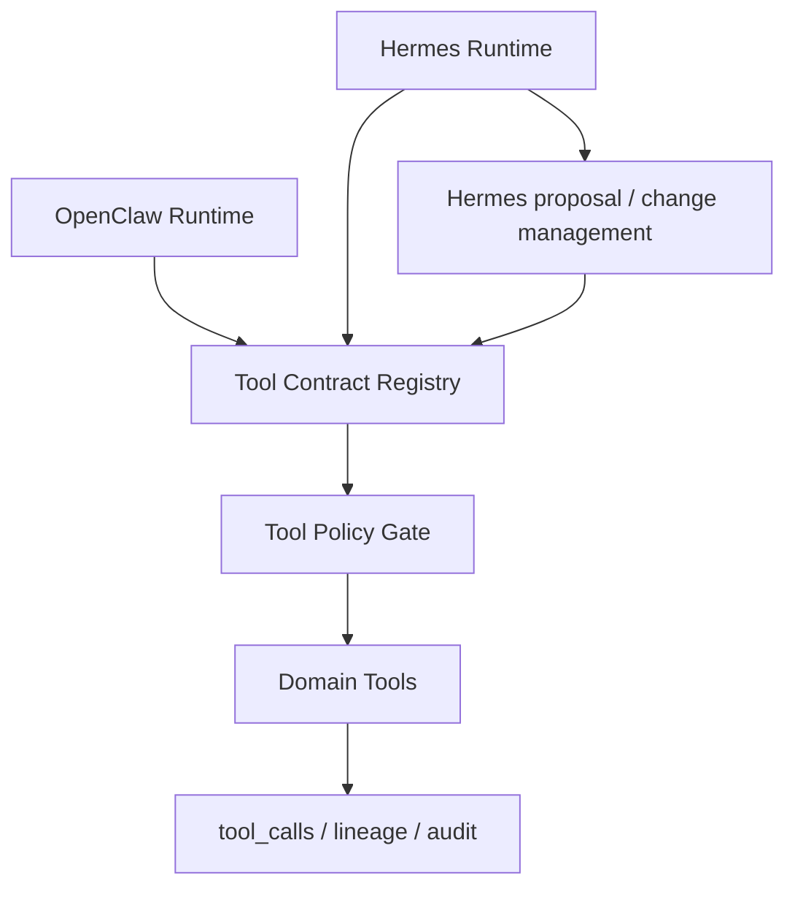
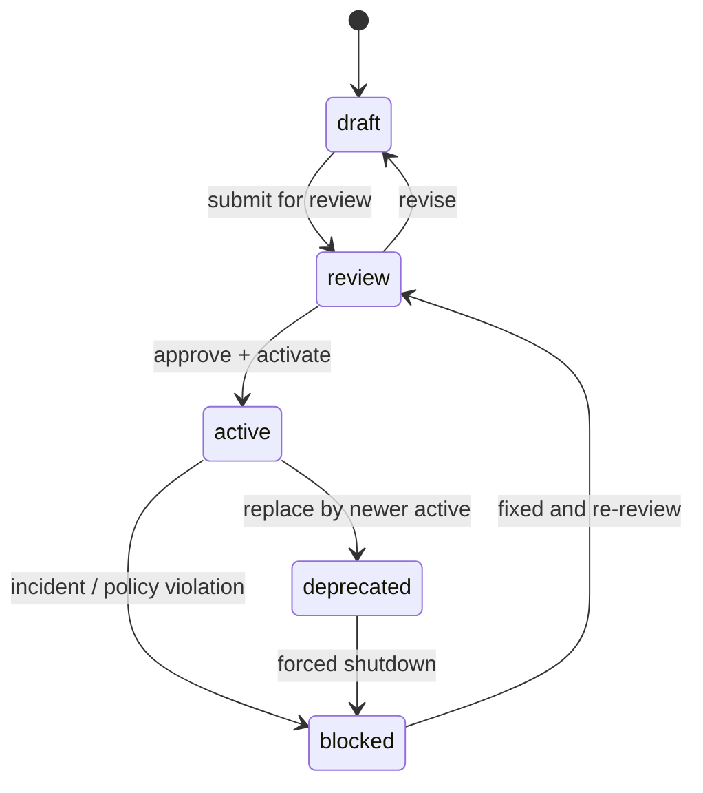
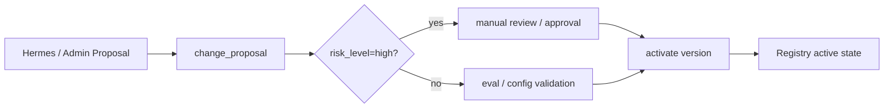
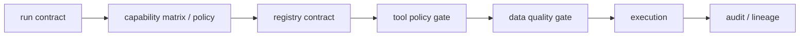

# Tool Contract Registry 设计

## 定位

`Tool Contract Registry` 是 AI 持仓投资分析系统 3.0 的控制面事实源，用来统一定义 Domain Tools 的：

1. 工具契约与 schema。
2. 版本与发布状态。
3. 权限等级与风险等级。
4. 运行时限制与必经 gate。
5. 审计、回放和跨 runtime 对齐所需的元数据。

它的职责是“定义什么工具在什么条件下可被调用”，不是“执行工具本身”。

一句话口径：

> Tool Contract Registry 是 Tool Policy Gate 的事实源，但不是执行器；它负责定义工具契约、版本、权限、风险、运行时限制和发布状态，由 Tool Policy Gate 在运行时执行校验，由 Domain Tools 完成真实调用与审计。

## 为什么需要这一层

根据现有 3.0 设计，OpenClaw 与 Hermes 都必须通过同一套 Domain Tools 调用金融能力，不能各自维护两套金融逻辑；同时系统已经明确需要 `Tool Policy Gate`、`Canonical Run Contract`、`Data Quality Gate`、`DegradationPolicyTools` 和 `HandoffProgressTools` 等控制面能力。

因此，Registry 要解决的核心问题不是“做一个工具 catalog”，而是防止以下漂移：

1. `schema drift`：OpenClaw 与 Hermes 对同一工具使用不同输入输出结构。
2. `permission drift`：agent 优化或新版本上线后，调用权限悄悄变大。
3. `version drift`：运行中的 job、回放结果、审计记录无法定位当时生效的工具版本。
4. `policy drift`：数据新鲜度、纪律检查、确认流程等 gate 在不同 runtime 中被绕过或口径不一致。

## 设计目标

1. 让 OpenClaw 与 Hermes 统一走同一套工具 schema，不再各自维护金融逻辑。
2. 让 Tool Policy Gate 有单一事实源可查，运行时不靠 agent 内部 prompt 记忆权限。
3. 让高风险工具和高风险契约变更具备明确的发布治理，尤其纳入 Hermes proposal/change 管理。
4. 让审计、回放、故障定位都能回答“当时允许了什么、依据是什么、版本是什么”。
5. 让平台默认保持统一受控，同时保留灰度与 `tenant override` 能力。

## 非目标

1. 不直接执行任何 Domain Tool。
2. 不替代 `Tool Policy Gate`、`Data Quality Gate` 或 `DegradationPolicyTools`。
3. 不让 Hermes 直接修改金融规则、数据源路由或高风险工具权限。
4. 不把 Registry 本身做成第二套 agent 编排系统。

## 核心对象

| 对象 | 作用 | 产品口径 |
| --- | --- | --- |
| `tool_contract_family` | 一个稳定的工具能力标识 | 例如 `broker.cash_margin.read`、`options.sell_put.rank_candidates` |
| `tool_contract_version` | 某个工具契约的版本快照 | 定义 schema、权限、风险、运行时限制、必经 gate |
| `contract_release` | 某个版本的发布状态与适用范围 | 决定是 `draft`、`review`、`active`、`deprecated` 还是 `blocked` |
| `runtime_projection` | 面向运行时的可查询投影视图 | 给 Tool Policy Gate 和审计链读取，不给 agent 自行解释 |
| `tenant_override` | 在平台默认之上的受控覆盖 | 用于灰度、特定租户白名单或紧急阻断 |
| `change_proposal` | 对契约变更的提案对象 | Hermes 可以提交 proposal，但高风险变更不能自动生效 |

## 核心原则

### 1. Registry 是事实源，不是执行器

运行时链路应当是：



Registry 负责回答：

1. 这个工具叫什么。
2. 当前允许哪些版本。
3. 它属于什么权限、风险、成本和 runtime 边界。
4. 它在调用前必须经过哪些 gate。
5. 它当前处于什么发布状态，是否允许灰度或 tenant override。

它不负责回答：

1. 这次调用是否满足当前 run contract。
2. 这次调用是否真的通过了数据质量门。
3. 工具调用执行结果是什么。

这些由 `Tool Policy Gate`、`Data Quality Gate` 与 `Domain Tools` 负责。

### 2. OpenClaw 与 Hermes 必须共享同一套工具 schema

OpenClaw 与 Hermes 的差异只能体现在 runtime policy 与使用方式上，不能体现在金融逻辑或 schema 分叉上：

1. OpenClaw 更关注低延迟白名单、同步调用安全、少步骤回复。
2. Hermes 更关注长任务、checkpoint、proposal 治理、恢复与高风险审批。
3. 两者都必须通过同一个 Registry 读取同名工具、同版 schema、同一组权限与风险定义。

### 3. 高风险契约变更必须纳入 Hermes proposal/change 管理

Hermes 可以提出优化建议，但不能直接生效高风险契约变更。尤其以下变更应默认进入 proposal 审核流：

1. 扩大 `permission_class`。
2. 放宽 `risk_class=high` 工具的 gate 要求。
3. 改动 sell put、交易录入、规则 override、券商写入相关契约。
4. 改动数据源路由、交易规则、确认要求或动作等级边界。

## 主要使用场景

### 用户侧间接场景

| 场景 | 用户感知 | Registry 作用 |
| --- | --- | --- |
| OpenClaw 同步回答持仓/行情问题 | 快速、安全、不会越权 | 提供低延迟只读工具的统一契约来源 |
| Hermes 深研或期权筛选 | 长任务可恢复、不会偷偷扩大权限 | 为高风险工具提供统一 schema 与 gate 定义 |
| 用户查询任务进度 | 看到真实阶段而非模糊话术 | 让 HandoffProgressTools 能引用工具 runtime 限制与状态解释 |

### 管理员/产品/风控场景

| 场景 | 需求 | Registry 作用 |
| --- | --- | --- |
| 新增 Domain Tool | 发布前定义 schema、权限、风险和 gate | 形成首个契约草案并进入受控发布 |
| 修改高风险工具 | 不能因 Hermes 自主优化而自动放开 | 通过 proposal + review + activation 完成 |
| 租户灰度 | 仅对白名单租户开放新版本 | 使用 `tenant_override`，但默认仍平台级受控 |
| 故障阻断 | 某工具版本出现事故需要立即停用 | 将版本标记为 `blocked`，供 Tool Policy Gate 即时拒绝 |
| 审计与回放 | 复盘当时为什么允许一次调用 | 通过 `tool_version`、`schema_version`、`policy_hash` 对齐证据 |

## 与 OpenClaw / Hermes / Domain Tools 的关系



边界说明：

1. OpenClaw 从 Registry 获取“同步安全可调用”的统一契约定义，但仍由 Tool Policy Gate 做最后放行。
2. Hermes 从 Registry 获取“深研/长任务允许调用什么、哪些必须 checkpoint/确认/审计”的统一定义。
3. Domain Tools 只接受经 Gate 放行后的调用，不自行定义第二套权限口径。
4. Hermes 的优化和变更建议只能进入 proposal/change 管理，高风险契约变更不能自动激活。

## 数据模型草案

### Contract Version 草案

```json
{
  "tool_name": "options.sell_put.rank_candidates",
  "tool_version": "1.0.0",
  "input_schema_version": "v1",
  "output_schema_version": "v1",
  "owner": "options_product",
  "permission_class": "read | controlled_write | proposal_write | admin_write",
  "risk_class": "low | medium | high",
  "cost_class": "free | metered | expensive",
  "runtime_scope": ["openclaw", "hermes"],
  "forbidden_runtimes": [],
  "requires_freshness_gate": true,
  "requires_reconciliation_gate": true,
  "requires_rule_check": true,
  "requires_confirmation": false,
  "lineage_required": true,
  "idempotency_required": true,
  "timeout_ms": 30000,
  "publish_status": "draft | review | active | deprecated | blocked",
  "rollout_mode": "platform_default | canary | tenant_override",
  "degradation_policy_key": "options_high_risk_fallback",
  "handoff_profile": {
    "supports_checkpoint": true,
    "supports_resume": true,
    "user_visible_wait_reason": "waiting_market_or_broker_data"
  }
}
```

### Change Proposal 草案

```json
{
  "proposal_id": "uuid",
  "proposal_type": "tool_contract_change",
  "tool_name": "options.sell_put.rank_candidates",
  "from_version": "1.0.0",
  "to_version": "1.1.0",
  "change_scope": [
    "input_schema",
    "risk_class",
    "requires_rule_check"
  ],
  "risk_level": "high",
  "proposed_by": "hermes | admin | product_ops",
  "activation_mode": "manual_approval_required",
  "status": "draft | pending_review | approved | rejected | activated",
  "review_notes": null
}
```

### 概念表草案

| 对象 | 关键字段 | 说明 |
| --- | --- | --- |
| `tool_contract_versions` | `tool_name`、`tool_version`、`permission_class`、`risk_class`、`runtime_scope`、`publish_status` | Registry 的核心版本表 |
| `tool_contract_bindings` | `tool_name`、`capability_role`、`allowed_intents` | 让 Capability Matrix 能映射到工具族 |
| `tool_contract_overrides` | `tenant_id`、`tool_name`、`tool_version`、`override_reason`、`expires_at` | 受控灰度和租户例外 |
| `tool_contract_proposals` | `proposal_id`、`tool_name`、`change_scope`、`risk_level`、`status` | Hermes proposal/change 管理入口 |

## 发布状态与生命周期

### 版本状态

至少区分以下状态：

| 状态 | 含义 | 是否可被运行时使用 |
| --- | --- | --- |
| `draft` | 草案，尚未进入评审 | 否 |
| `review` | 正在评审、等待审批 | 否 |
| `active` | 平台默认可用版本 | 是 |
| `deprecated` | 可兼容读取，禁止新接入 | 有条件 |
| `blocked` | 因风险或事故被强制停用 | 否 |

### 生命周期图



### 高风险变更治理



规则：

1. 高风险契约变更不能自动生效。
2. Hermes 只能提交 proposal，不能直接把 `review` 改成 `active`。
3. `tenant_override` 只能覆盖已发布版本，不应用来绕过审批制造隐藏版本。

## 运行时决策链

Registry 在运行时的正确位置如下：



解释：

1. `Canonical Run Contract` 定义这次运行是谁、为什么、风险等级是什么、可见数据范围是什么。
2. `Agent Capability Matrix` 定义这个 agent role 理论上允许哪些工具族、禁止哪些工具族。
3. `Tool Contract Registry` 把“工具族”解析成具体契约版本、schema、权限、风险和 gate 要求。
4. `Tool Policy Gate` 依据 run contract + capability + registry 做放行或拒绝。
5. `Data Quality Gate` 依据契约要求检查 freshness、reconcile、discipline rule 等条件。
6. `Domain Tools` 执行后把 `tool_version`、`lineage_refs`、`result_hash` 写回审计。

## 与其他控制面能力的接口关系

### Agent Capability Matrix

Registry 不负责定义“哪个 agent 可用哪个工具族”，但负责给 Matrix 一个稳定的契约目标：

1. Capability Matrix 以角色和意图映射到工具族。
2. Registry 提供每个工具族当前活跃版本及风险、权限、runtime 边界。
3. 两者共同形成 Tool Policy Gate 的 allow/deny 依据。

### Canonical Run Contract

Registry 不生成 run contract，但要求所有工具调用都能落到可追溯的契约版本：

1. `tool_policy_hash` 需要能追溯到 Registry 的活跃投影。
2. Hermes job 只能继承或收窄工具权限，不能借变更契约扩大 `data_scope`。
3. 缺失 `tenant_id` 或缺失策略上下文时，Gate 应直接拒绝，不允许猜测默认版本。

### Data Quality Gate

Registry 不执行数据质量检查，但要声明哪些工具必须经过哪些数据门：

1. `requires_freshness_gate`
2. `requires_reconciliation_gate`
3. `requires_rule_check`
4. `requires_confirmation`

换言之，Registry 定义“这类工具必须过哪些门”，Data Quality Gate 负责执行这些门。

### DegradationPolicyTools

Registry 需要为失败与降级提供统一引用键，而不是让 agent 自由发挥：

1. 工具被 `blocked` 时，DegradationPolicyTools 提供统一阻断文案。
2. 数据质量不达标时，依据契约的 `degradation_policy_key` 降级为观察分析或稍后处理。
3. OpenClaw 与 Hermes 都应复用同一降级口径，避免一个说“可以建议”，另一个说“只能观察”。

### HandoffProgressTools

Registry 不管理任务进度，但要为长任务提供可解释的工具级元数据：

1. 哪些工具天然是长任务或高等待风险。
2. 是否支持 checkpoint / resume。
3. 超时、等待原因和阻塞类型的标准化标识。

这样 HandoffProgressTools 才能把“正在等待行情/券商数据”解释为产品对象，而不是读取底层 trace 原文。

## P0 / P1 范围

### P0

P0 先做最小可用 Registry，并与运行时放行和审计对齐：

1. 建立 `tool_contract_version` 作为单一事实源。
2. 支持 `draft / review / active / deprecated / blocked` 五态。
3. 支持 Tool Policy Gate 的只读查询与版本解析。
4. 对齐 `tool_name / tool_version / schema_version / permission_class / risk_class / runtime_scope`。
5. 对齐审计链所需的 `tool_policy_hash`、`lineage_required`、`result_hash` 引用。
6. 支持最小 `tenant_override`，但默认仍以平台级受控发布为主。
7. 纳入 Hermes proposal/change 管理，高风险契约变更默认手动审批。

### P1

P1 再补控制台和回放治理能力：

1. 管理界面或配置工作台。
2. 版本 diff 与变更解释。
3. Replay / audit 对齐视图。
4. 更完整的灰度发布与租户覆盖管理。
5. proposal workflow 的审批、驳回、回滚与追踪。
6. 与 HandoffProgressTools、DegradationPolicyTools 的更细粒度联动。

## 失败模式与降级

| 失败模式 | 典型风险 | 降级/阻断策略 |
| --- | --- | --- |
| Registry 中找不到工具契约 | 运行时猜版本，导致越权或结果不可复现 | 直接阻断高风险调用；低风险只读请求可返回“当前能力不可用” |
| OpenClaw/Hermes 使用不同 schema | 同名工具返回不同字段，导致逻辑分叉 | 以 Registry 活跃版本为准，旧调用进入 `deprecated` 兼容或阻断 |
| 高风险工具被错误激活 | sell put、交易录入等绕过 gate | 立即标记为 `blocked`，由 DegradationPolicyTools 给出统一安全响应 |
| Hermes proposal 试图自动放大权限 | 自主优化越权 | 变更停留在 `review`，不允许自动进入 `active` |
| tenant override 滥用 | 平台外出现隐形规则分叉 | override 必须有原因、边界和过期时间；默认不允许覆盖审批要求 |
| 契约要求的 Data Quality Gate 缺失 | 用旧数据输出行动建议 | Gate 失败即降级为观察分析或稍后处理，不允许继续执行高风险建议 |
| 审计无法还原当时版本 | 事故后无法解释“为什么允许” | 运行时必须写入 `tool_version` 与 `tool_policy_hash`，缺失即视为不合规 |

## 开发前已确认

1. `tool_contract_family` P0 使用“工具族 + method”，高风险方法单独拆分，例如 `broker.position.read` 与 `broker.order.*` 永不合并。
2. `tenant_override` P0 只允许 rollout/feature flag 级 override，不允许绕过 runtime_scope 和高风险审批。
3. 高风险 contract 由产品/工程/风控共同确认；低风险 schema/timeout 变更可工程审批。
4. `deprecated` contract 兼容窗口 P0 默认 30 天；Hermes 长任务和 replay 保留旧 contract schema 引用。
5. 低风险变更包括文档描述、超时调整、只读 schema 扩展，可走轻量工程审批；涉及写入、权限、交易动作、数据源路由的变更必须走高风险评审。
6. Registry P0 以配置文件/DB seed 驱动；Ops UI 只读或最小编辑。

## 总结

Tool Contract Registry 的首要价值，是把工具 schema、权限、版本、风险和运行时限制收敛成统一事实源，解决的核心问题是 drift，而不是 catalog。它让 OpenClaw 与 Hermes 在同一套 Domain Tools schema 上工作：OpenClaw 侧重低延迟白名单与同步安全，Hermes 侧重长任务、proposal 治理、恢复与高风险审批；两者都必须经过同一个 Registry -> Tool Policy Gate -> Domain Tools 的受控链路。
