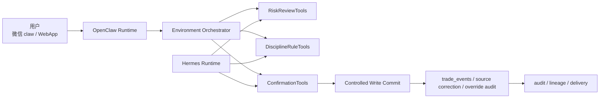
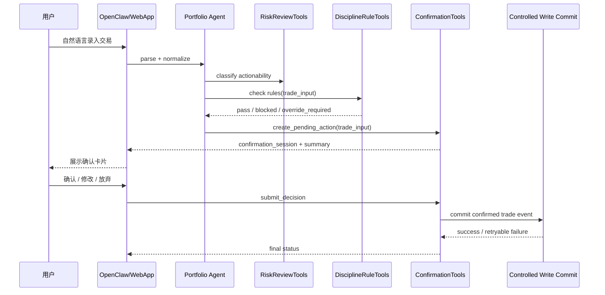
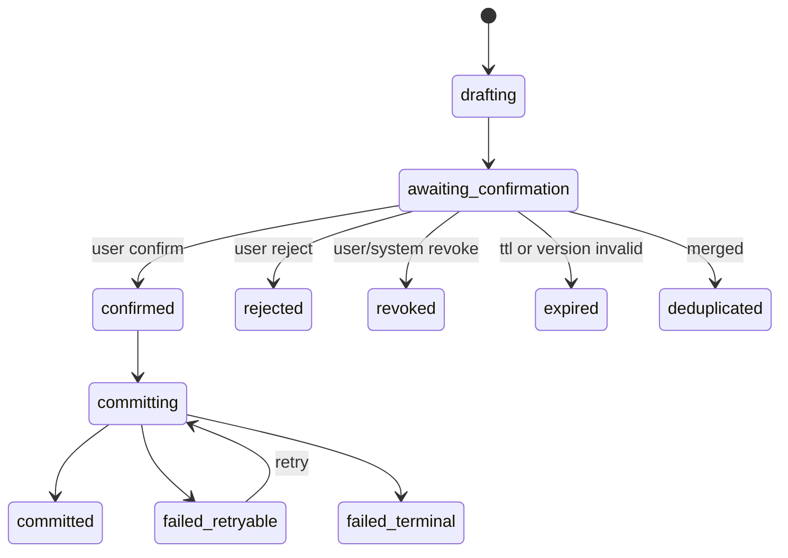

# ConfirmationTools 设计

## 核心定位

`ConfirmationTools` 是 AI 持仓投资分析系统 3.0 的控制面能力之一，用来把**受控写入**统一收口成“先形成待确认动作，再接收用户确认，再进入正式提交”的产品链路。

它解决的不是“怎么分析股票或期权”，而是以下问题：

1. 用户通过微信 claw 或 WebApp 用自然语言录入交易时，系统如何先标准化成可审阅对象，而不是直接写事实。
2. OCR 识别、消息解析、规则 override、交易草稿等高风险动作，如何统一进入 pending action 和 user approval 流。
3. 用户确认后，系统如何保证一次且仅一次提交，避免重复确认、重复写入、跨端冲突和过期误提交。
4. 当确认链路失败、过期、撤销、数据变旧或规则变更时，系统如何安全降级，而不是继续写错事实或给出过时动作。

一句话口径：

> ConfirmationTools 是受控写入的“用户确认闸门”，负责 pending action、confirmation session、user approval、expiry/revoke/dedupe 和 confirmed commit，不负责自动下单，也不替代 RiskReviewTools、DisciplineRuleTools 或 Tool Policy Gate。

## 为什么 3.0 必须补这层

现有 3.0 设计已经明确了几个前提：

1. `11-domain-tools-layer.md` 已把 `ConfirmationTools` 定义为控制面能力，职责是 `confirmation session`、`pending action`、`user approval`。
2. `02-agent-capability-matrix.md` 已明确交易录入、OCR 修正、规则 override、敏感状态变更都属于 `controlled_write`，必须先过确认流。
3. `12-openclaw-hermes-agent-runtime.md` 已确定 OpenClaw 负责微信/Web 同步交互，Hermes 负责复杂分析与草稿产出，因此确认体验必须跨 runtime、跨渠道一致。
4. `13-architecture-hardening.md` 已把交易录入、规则 override、OCR 修正列为 P0 受控写入，要求先形成待确认动作。
5. `05-data-and-broker-integration.md` 和 `10-position-data-model.md` 已明确手工录入、消息交易输入、OCR 都属于用户输入来源，确认后才能进入 `trade_events` 或持仓重建链路。

如果没有 ConfirmationTools，系统会出现三个根本问题：

1. OpenClaw 或 Hermes 只能直接写入，无法把“分析动作”和“事实提交”分开。
2. 微信和 WebApp 会各自维护一套确认逻辑，导致多端状态漂移、重复提交和审计断裂。
3. `trade_draft`、OCR 修正和 override 会混在自然语言里，最终很难回答“用户到底确认了什么、何时确认、是否仍有效”。

## 设计目标

1. 把所有受控写入统一抽象成 `pending_action`，不再让每个 agent 自己发明确认话术。
2. 让微信 claw 与 WebApp 共用同一确认事实源，做到一端确认、另一端立刻收口。
3. 让确认动作具备 TTL、撤销、重复确认幂等、版本校验和审计事件。
4. 把“确认同意”与“正式写入成功”拆开，解决确认后提交失败的可恢复问题。
5. 区分**记录事实**和**确认交易草稿**两类场景，避免把用户确认误解为自动下单授权。
6. 和 `RiskReviewTools`、`DisciplineRuleTools`、`Tool Policy Gate`、`DeliveryTools`、`HandoffProgressTools` 串成统一控制链。

## 非目标

1. 不负责自动下单，也不生成真实券商交易指令。
2. 不替代 `RiskReviewTools` 做 `actionability_level` 判定。
3. 不替代 `DisciplineRuleTools` 判断规则是否允许 override。
4. 不直接解析 OCR、行情、期权链或券商数据；这些仍由 Domain Tools 负责。
5. 不把 WebApp 和微信做成两套独立状态机。

## 适用范围

首期 `ConfirmationTools` 至少覆盖四类动作：

| 动作类型 | 典型来源 | 需要确认的原因 | 确认后进入哪里 |
| --- | --- | --- | --- |
| 自然语言交易录入 | 微信消息、WebApp 表单、聊天输入 | 会写交易事实，且用户表达常有歧义 | `trade_events`、后续持仓重建 |
| OCR 修正 | 成交截图、持仓截图、券商消息截图 | OCR 可能错读数量、价格、方向 | `asset_sources` 修正记录、必要时 `trade_events` |
| 规则 override | 已命中纪律规则但允许破例 | 需要明确用户承担偏离规则的责任 | `discipline_checks` override 记录、相关 pending action 继续 |
| 交易草稿确认 | Equity / Options / Portfolio 产出的 `trade_draft` | 用户需要确认“我理解并接受这份草稿” | 保留为草稿、生成执行清单或跳 WebApp，不直接下单 |

补充边界：

1. `trade_draft` 的确认不等于真实交易执行，只代表系统可以把该草稿升级为“用户已确认的执行草稿”。
2. 对于 `override_allowed=false` 的规则，ConfirmationTools 只能承接解释和阻断，不能放行。
3. 券商真实只读同步、研究 artifact 写入、delivery outbox 写入不属于本工具的核心范围。

## 在整体架构中的位置



控制链应当是：

`intent parse -> tool policy -> data quality / risk review -> rule check -> pending action -> user confirmation -> idempotent commit -> audit + delivery`

其中：

1. `Tool Policy Gate` 负责“这个 role 能不能发起该类待确认动作”。
2. `RiskReviewTools` 负责“这个输出能不能到 `trade_draft`，还是只能停在 `analysis_only`”。
3. `DisciplineRuleTools` 负责“规则通过、阻断，还是可 override”。
4. `ConfirmationTools` 负责“如何确认、何时过期、是否重复、如何最终提交”。

## 核心产品对象

`ConfirmationTools` 应统一维护四个对象：

| 对象 | 作用 | 用户是否可见 |
| --- | --- | --- |
| `pending_action` | 待确认动作的标准化事实对象 | 间接可见，作为确认详情主体 |
| `confirmation_session` | 某次面向用户的确认会话 | 可见，体现在卡片、页面、确认链接、会话编号 |
| `confirmation_event` | 全量审计事件流 | 默认不可见，供审计、回放、排障 |
| `commit_result` | 确认后正式写入的提交结果 | 间接可见，体现在“已记录/已撤销/提交失败待重试” |

原则：

1. 一个 `pending_action` 可以有多个 `confirmation_session`，但任一时刻只能有一个活跃主会话。
2. 多端确认共享同一个 `pending_action`，不能各自创建互不相干的提交对象。
3. `confirmation_event` 要覆盖创建、查看、确认、拒绝、撤销、过期、重复确认、提交成功、提交失败。

## 核心原则

### 1. 先标准化，再确认

自然语言、OCR、消息转发都不能直接请求用户“是不是要这样写入”；必须先被标准化成一条结构化 `pending_action`：

1. 动作是什么。
2. 影响哪个账户、哪个标的、哪个来源。
3. 哪些字段是系统推断，哪些字段来自原始来源。
4. 是否命中过规则、是否有 override。
5. 当前数据是否足够新鲜，是否还允许确认。

### 2. 确认的是“规范化动作”，不是原始话术

用户说“昨天买了点英伟达，大概 10 股 900 多”，系统不应直接保存这句话，而应转换成：

- `instrument=NVDA`
- `trade_action=buy`
- `quantity=10`
- `price=待补充或待确认`
- `trade_time=2026-05-08`
- `source_type=message_trade_input`

用户确认的是这个规范化动作，而不是聊天原文。

### 3. 确认不等于立即成功提交

确认链必须把：

1. `user_confirmed`
2. `commit_succeeded`

拆成两个事件。这样才能处理：

1. 用户已确认，但数据库提交失败。
2. 用户已确认，但下游写入进入补偿重试。
3. 用户已确认，但另一个端已经先提交成功。

### 4. 交易草稿和事实录入要分开

交易录入是在补事实，目标是更新 `trade_events` 等事实层。

交易草稿确认是在确认一份计划或建议，目标是：

1. 把它标记为 `user_acknowledged_trade_draft`。
2. 允许进入 WebApp 执行页、导出清单或人工下单流程。
3. 绝不直接形成 `broker.trade.place_order`。

### 5. 确认窗口受时效性约束

并不是所有待确认动作都能无限期确认：

1. 事实录入类可以更长，因为它记录的是已发生事件。
2. 交易草稿类必须更短，因为价格、期权链、现金保证金和规则上下文会变。
3. 命中规则的 override 还要受规则版本变化影响；规则变了，旧确认默认失效。

## 四类场景设计

## 自然语言交易录入

典型输入：

1. “买入 AAPL 10 股 180”
2. “昨天把 2 张 NVDA 900 put 平掉了”
3. “我刚在富途加了 100 股腾讯，均价 468”

产品流程：



关键产品要求：

1. 录入前先做标的解析和字段标准化，避免把“买入苹果”直接记成自由文本事实。
2. 缺少关键字段时，不进入一键确认，而是进入补字段确认页。
3. 若规则阻断且不允许 override，直接停在 `blocked`，不创建可放行的确认按钮。
4. 若规则需要 override，确认页必须显式展示“你正在破例”。
5. 确认成功后写入 `trade_events`，且 `confirmation_status=confirmed`。

## OCR 修正

典型输入：

1. 用户上传成交截图，OCR 识别成“买入 100 股”，但用户说应为“200 股”。
2. 系统从持仓截图识别出价格和数量，但置信度低。
3. 券商消息截图解析出合约信息不完整。

产品原则：

1. 原始 OCR 结果不可直接覆盖，只能生成“修正差异”。
2. 用户确认的是“从什么值改成什么值”，而不是重新确认整张截图。
3. OCR 低置信字段应优先转为结构化补录，而不是诱导一键确认。

建议体验：

| 场景 | 默认体验 |
| --- | --- |
| 少数字段修正 | 展示字段 diff：原识别值 vs 目标值 |
| 多字段低置信 | 进入 WebApp 结构化编辑 |
| OCR 结果要落交易事实 | 先确认修正，再提交 `trade_events` |
| OCR 结果只修正来源档案 | 写修正记录，不直接改原图或原始文本 |

关键产品要求：

1. `source_type=ocr` 的来源必须带图片 ref、置信度和原始识别 hash。
2. 用户确认后写入的是 correction record 或 confirmed trade event，不是覆盖 raw OCR。
3. OCR 预算不足、图片质量差、字段冲突时，应降级为人工补录，不允许盲确认。

## 规则 override

典型输入：

1. 用户规则禁止盘前交易，但用户想记录一笔盘前成交。
2. 用户规则禁止中概股，但这次想临时破例。
3. sell put 草稿命中财报窗口限制，但用户明确要继续保留草稿。

产品边界：

1. `DisciplineRuleTools` 负责判断是否允许 override。
2. `ConfirmationTools` 负责承接 override 交互、记录用户意图和提交审计。
3. 对 `override_allowed=false` 的规则，不允许通过确认绕过。

override 页面必须展示：

1. 命中的规则名称和解释。
2. 为什么被阻断或为什么需要破例。
3. 破例影响的动作对象。
4. 用户输入或选择的 override reason。
5. 该 override 是一次性的还是只作用于当前动作。

确认成功后：

1. 在 `discipline_checks` 中记录 `result=overridden` 和 `override_reason`。
2. 原始 pending action 继续进入提交链路。
3. 审计中要能追溯“这次动作为何被放行”。

## 交易草稿确认

典型来源：

1. Equity Agent 给出止盈/减仓草稿。
2. Options Sell Put Agent 给出可执行候选或滚仓草稿。
3. Portfolio Agent 给出调仓建议。

这里要严格区分两件事：

1. `RiskReviewTools` 决定该输出能否到 `trade_draft`。
2. `ConfirmationTools` 决定用户是否确认接收或采纳这份草稿。

交易草稿确认后的可能结果：

| 结果 | 含义 |
| --- | --- |
| `acknowledged` | 用户已看过并接受这是一份可执行草稿 |
| `saved_for_later` | 用户保留草稿，但暂不处理 |
| `rejected` | 用户明确放弃该草稿 |
| `expired` | 草稿所依赖的数据已过时，需刷新重算 |

产品边界：

1. 确认交易草稿不直接产生 `trade_events`。
2. 若后续用户把草稿转成“我已经执行了”，应再走交易录入确认流。
3. 对时间敏感的草稿，要展示 `quote_as_of`、`expires_at` 和“过期后需刷新”。

## 用户确认会话

`confirmation_session` 是面向用户的确认窗口，不等于业务动作本身。

它至少要承载：

1. 这次确认针对哪条 `pending_action`。
2. 用户在哪个渠道进入确认。
3. 会话何时过期。
4. 当前是否还能被消费。
5. 这次确认需要什么强度的交互。

建议确认强度分级：

| 强度 | 适用场景 | 体验 |
| --- | --- | --- |
| `light` | 简单交易录入、单字段修正 | 微信一键确认 / WebApp 单击确认 |
| `structured` | OCR 多字段修正、期权交易录入 | WebApp 结构化明细确认 |
| `override` | 命中纪律规则但允许破例 | 需显式勾选并填写理由 |
| `high_attention` | 大额、多腿、时间敏感草稿 | 强制进入 WebApp，展示完整上下文 |

产品规则：

1. 同一 `pending_action` 只能有一个 `active` 主会话，避免多个并行确认窗口同时可提交。
2. 不同渠道可以打开镜像会话，但都指向同一动作版本。
3. 一旦有端完成确认并成功消费，其他端应立刻变成“已处理”。

## 过期、撤销、重复确认

这是 ConfirmationTools 的核心控制面价值，必须独立设计。

## 过期

建议按动作类型区分 TTL：

| 动作类型 | 建议 TTL | 原因 |
| --- | --- | --- |
| 自然语言交易录入 | 24 小时 | 记录已发生事实，时效敏感度较低 |
| OCR 修正 | 24 小时 | 允许用户补字段和慢确认 |
| 规则 override | 30 分钟到当日有效 | 规则上下文和风险口径不应长期悬挂 |
| 交易草稿确认 | 15 分钟或到当前交易会话结束 | 行情、期权链、现金保证金会快速变化 |

过期规则：

1. 过期后不能继续消费旧会话。
2. 事实录入类过期后可允许一键重新生成确认会话。
3. 交易草稿类过期后必须先刷新数据、重跑规则和 risk review，再生成新会话。
4. 规则版本、行情 freshness、现金保证金状态发生关键变化时，即使未到 TTL，也应提前失效。

## 撤销

撤销分为两类：

| 撤销类型 | 含义 |
| --- | --- |
| `user_revoke_pending` | 用户在确认前主动放弃这条待确认动作 |
| `system_revoke_before_commit` | 系统在提交前发现版本冲突、数据过期、权限变化而撤销 |

补充规则：

1. 已 `committed` 的动作不能通过“撤销确认”直接回滚业务事实，应进入单独的修正/冲正流程。
2. 已 `user_confirmed` 但尚未提交成功的动作，允许用户看到“确认已收到，正在入账”，但不应再次撤销到未确认状态。

## 重复确认

重复确认主要来自三类问题：

1. 用户在微信里连续回复“确认”多次。
2. 用户同时在微信和 WebApp 点确认。
3. 推送重试或网络超时导致前端不确定是否已提交。

幂等规则：

1. `submit_confirmation` 必须带稳定的 `decision_id` 或 `idempotency_key`。
2. 首次成功消费会话后，后续重复确认返回同一结果，而不是再次提交。
3. 已完成的确认消息应答要明确，例如“这笔确认已处理，无需重复提交”。
4. 若同一业务意图在短时间内被重复创建，应由 `pending_action` 指纹去重，尽量复用已有会话。

## 微信 claw 与 WebApp 体验

## 微信确认体验

微信侧应服务于“快确认、快放弃、快跳转”，不适合承载过深结构化编辑。

P0 建议能力：

1. 展示简洁确认卡片：动作摘要、关键字段、是否命中规则、过期时间。
2. 支持三种主操作：`确认`、`修改`、`放弃`。
3. 支持自然语言 fallback，例如“确认刚才那笔”“撤销上一条”。
4. 对复杂场景给出 WebApp 深链，例如 OCR 多字段修正、期权多腿草稿、override 理由填写。

建议文案结构：

> 你要记录一笔买入：AAPL 10 股，价格 180 美元，时间 2026-05-09 14:32。<br/>
> 规则检查：通过。<br/>
> 请在 24 小时内确认，或回复“修改 / 放弃”。

微信侧产品原则：

1. 不展示过长 JSON 或内部字段。
2. 多个活跃待确认动作同时存在时，必须先做编号或选择，不能把“确认”默认为最近一条。
3. 对交易草稿要显式提示“这是草稿确认，不会自动下单”。

## WebApp 确认体验

WebApp 是深确认和结构化编辑主场。

P0 建议能力：

1. `Pending Actions` 列表页：按待确认类型、来源、紧急度、过期时间展示。
2. 详情页：展示字段级 diff、规则命中、来源链路、原始消息或 OCR 摘要。
3. 对 OCR 修正支持字段编辑和二次检查。
4. 对 override 支持填写理由、查看规则文本和历史 override。
5. 对交易草稿展示时点、价格 freshness、规则结果和“已确认草稿/已过期”状态。

双端一致性规则：

1. 微信确认后，WebApp 列表立即变为 `已处理`。
2. WebApp 处理后，微信侧再点确认要返回“已处理/已失效”。
3. 所有渠道都读取同一个 `confirmation_session` 和 `pending_action` 状态，不维护本地真相。

## 数据模型草案

## 1. `pending_actions`

```sql
pending_actions (
  id uuid primary key,
  tenant_id uuid not null,
  channel_binding_id uuid,
  source_run_id uuid,
  source_agent_role text,
  action_type text not null, -- trade_input, ocr_correction, rule_override, trade_draft_ack
  action_scope text not null, -- fact_record, source_correction, rule_exception, draft_ack
  target_entity_type text not null, -- trade_event, asset_source, discipline_check, trade_draft
  target_entity_id uuid,
  source_type text not null, -- manual, message_trade_input, broker_message, ocr, derived
  action_payload jsonb not null,
  normalized_summary jsonb not null,
  rule_check_ref uuid,
  risk_review_ref uuid,
  requires_override boolean not null default false,
  confirmation_strength text not null, -- light, structured, override, high_attention
  status text not null, -- drafting, awaiting_confirmation, confirmed, committing, committed, rejected, revoked, expired, deduplicated, failed_retryable, failed_terminal
  fingerprint text not null,
  version integer not null default 1,
  expires_at timestamptz not null,
  confirmed_at timestamptz,
  committed_at timestamptz,
  created_at timestamptz,
  updated_at timestamptz
);
```

设计说明：

1. `fingerprint` 用于识别重复 pending action，例如同一原始消息重复进入。
2. `normalized_summary` 存用户可见摘要，不要求前端重新拼接。
3. `version` 用于在规则、字段、报价更新后失效旧会话。

## 2. `confirmation_sessions`

```sql
confirmation_sessions (
  id uuid primary key,
  pending_action_id uuid not null,
  tenant_id uuid not null,
  channel text not null, -- wechat, webapp
  channel_binding_id uuid,
  session_status text not null, -- active, consumed, expired, cancelled
  session_token text not null,
  presented_version integer not null,
  decision_deadline timestamptz not null,
  consumed_at timestamptz,
  cancel_reason text,
  created_at timestamptz
);
```

设计说明：

1. `presented_version` 保证用户确认的是当前版本，不是老版本草稿。
2. `session_token` 可以挂在微信按钮或 WebApp 深链上。
3. `consumed` 只表示会话被消费，不等于业务提交成功。

## 3. `confirmation_events`

```sql
confirmation_events (
  id uuid primary key,
  tenant_id uuid not null,
  pending_action_id uuid not null,
  confirmation_session_id uuid,
  event_type text not null, -- created, presented, modified, confirmed, rejected, revoked, expired, duplicate_ignored, commit_succeeded, commit_failed
  actor_type text not null, -- user, system, runtime
  actor_ref text,
  event_payload jsonb not null default '{}',
  created_at timestamptz
);
```

用途：

1. 作为审计、回放、客服和事故定位依据。
2. 支撑“到底展示了什么、用户确认了什么、为什么失效”。

## 4. 与既有表的衔接

| 既有对象 | ConfirmationTools 如何衔接 |
| --- | --- |
| `trade_events.confirmation_status` | 交易录入确认成功后写 `confirmed`；争议导入可用 `disputed` |
| `discipline_checks` | 规则 override 在此记录 `result=overridden` 和 `override_reason` |
| `trading_rules.override_allowed` | 决定是否允许进入 override 确认流 |
| `asset_sources` / OCR 相关对象 | 不覆盖原始 OCR，只新增修正记录和来源链路 |
| `delivery_outbox` | 可用于发送确认结果、过期提醒、提交失败待重试提示 |

## 状态机

建议把 `pending_action` 作为主状态机，而不是把状态分散在不同端。

| 状态 | 含义 |
| --- | --- |
| `drafting` | agent 正在归一化动作，还不能展示给用户 |
| `awaiting_confirmation` | 已形成待确认动作，正在等待用户决定 |
| `confirmed` | 用户已确认，但尚未完成正式提交 |
| `committing` | 正在写入事实层或提交下游变更 |
| `committed` | 已成功写入，流程完成 |
| `rejected` | 用户明确拒绝 |
| `revoked` | 用户或系统在提交前撤销 |
| `expired` | 超时或版本失效 |
| `deduplicated` | 被并入另一条等价待确认动作 |
| `failed_retryable` | 已确认，但提交失败，可补偿重试 |
| `failed_terminal` | 已确认，但提交无法恢复，需要人工处理 |



补充规则：

1. `confirmed` 和 `committed` 必须分开，用户体验上要允许出现“已确认，正在入账”。
2. `expired` 和 `revoked` 是终态，但可以触发重新生成新动作。
3. `deduplicated` 不是失败，而是去重收口。

## 关键控制规则

## 1. 幂等键与指纹

至少需要三层去重：

1. 原始输入指纹：同一条微信消息、同一张 OCR 图片、同一条 broker message 不应生成多条待确认动作。
2. 决策幂等键：同一次“确认”重复提交不应重复写事实。
3. 提交幂等键：下游 commit 重试不应重复插入 `trade_events`。

建议指纹示例：

| 场景 | 指纹建议 |
| --- | --- |
| 自然语言交易录入 | `tenant_id:message_hash:normalized_trade_payload` |
| OCR 修正 | `tenant_id:file_hash:correction_payload_hash` |
| 规则 override | `tenant_id:rule_check_id:pending_action_id` |
| 交易草稿确认 | `tenant_id:trade_draft_id:version` |

## 2. 版本失效

以下情况应使旧确认自动失效：

1. 待确认字段被用户修改，`pending_action.version` 增加。
2. 交易草稿依赖的行情、期权链或现金保证金过期。
3. 规则配置变化导致原来的 override 前提不再成立。
4. 原始来源被另一条更高可信来源覆盖，例如 broker sync 已拿到真实成交。

## 3. 多端一致性

系统必须以服务端状态为准，不能以本地 UI 状态为准。

1. 微信和 WebApp 都只消费服务端 `session_token`。
2. 任何端确认成功后，其他端再提交只能拿到幂等回执。
3. 任何端看到的“待确认列表”都基于同一 `pending_actions` 视图。

## P0 / P1

## P0 上线前必须有

1. `pending_actions`、`confirmation_sessions`、`confirmation_events` 三类核心对象。
2. 覆盖四类动作：自然语言交易录入、OCR 修正、规则 override、交易草稿确认。
3. 微信 claw 与 WebApp 共用一套确认状态，不允许各自独立落库。
4. `trade_events.confirmation_status` 与 `discipline_checks.override_reason` 的正式接入。
5. TTL、过期、撤销、重复确认幂等。
6. 已确认但提交失败的 `failed_retryable` 状态和补偿重试。
7. 复杂确认场景可跳转 WebApp，微信保留轻确认入口。
8. 所有高风险确认文案都明确“不会自动下单”。
9. 审计事件可回答谁在何时确认了什么、展示的版本是什么、最终是否提交成功。

## P1 首个可用版本之后补齐

1. 批量确认，例如多条 OCR 修正或多条历史交易补录。
2. 更细粒度的字段级确认和字段级冲突解释。
3. 交易草稿的“提醒我稍后再看”和过期前提醒。
4. 用户在 WebApp 查看确认历史、撤销历史和 override 统计。
5. 更强的风险强度分级，例如大额/多腿期权必须 WebApp 二次确认。
6. 与 `HandoffProgressTools` 联动，对长任务产出的草稿支持“完成后待确认中心”。
7. 可配置的租户级确认策略，例如保守模式下扩大强制 WebApp 场景。

## 失败模式与降级

## 失败模式总览

| 故障 | 风险 | 安全行为 |
| --- | --- | --- |
| 规则服务不可用 | 可能绕过纪律检查 | 不允许创建高风险确认，降级为 `blocked` |
| 风险审查未通过 | 用户把分析误当成动作 | 停在 `analysis_only`，不生成 trade draft 确认 |
| OCR 低置信或图片质量差 | 错误事实写入 | 转结构化补录，不给一键确认 |
| 确认会话过期 | 旧数据被误提交 | 显示已失效；交易草稿需刷新后重建 |
| 提交成功回执丢失 | 用户重复确认 | 依赖幂等键返回既有结果 |
| 已确认但 commit 失败 | 用户以为已完成 | 状态改为 `failed_retryable`，提示“确认已收到，系统正在重试入账” |
| 微信投递失败 | 用户无法在微信确认 | 保留 WebApp 待确认中心和深链 |
| 多端并发确认 | 重复写入 | 第一笔消费成功，其他请求返回“已处理” |
| 更高可信来源已覆盖 | 旧 pending action 继续有效 | 旧动作自动 `expired` 或 `revoked` |

## 降级策略

### 1. 渠道降级

1. 微信卡片发送失败时，保留 WebApp 待确认列表和深链。
2. WebApp 不可用时，简单动作允许微信文本确认；复杂动作转为“稍后在 WebApp 完成”。

### 2. 数据降级

1. 对事实录入类，缺少非关键行情上下文时仍可确认，但要标记为事实补录。
2. 对交易草稿类，行情、期权链、现金保证金或规则上下文过期时，必须失效重建，不能用 fallback 数据继续确认可执行草稿。

### 3. 提交降级

1. 确认已收到但事实层写入失败时，先保留 `confirmed` / `failed_retryable`，不要要求用户重复确认。
2. 若多次重试仍失败，转 `failed_terminal`，由 Ops 或人工补偿处理。

## 与其他控制面的关系

| 控制面能力 | 关系 |
| --- | --- |
| Tool Contract Registry | 定义哪些工具 `requires_confirmation=true` |
| Agent Capability Matrix | 定义哪些 role 最多只能创建确认会话，不能直接提交事实 |
| RiskReviewTools | 决定是否允许输出 `trade_draft`，再交给 ConfirmationTools |
| DisciplineRuleTools | 决定 pass / blocked / override_required；ConfirmationTools 只承接确认 |
| CostQuotaTools | OCR、复杂识别、草稿生成等昂贵动作先过预算闸门 |
| HandoffProgressTools | Hermes 长任务产出草稿后，可进入待确认中心或推送确认入口 |
| DeliveryTools | 负责确认卡片、结果通知和补偿投递 |

## 首期建议的工具面能力

面向运行时，ConfirmationTools 至少需要以下工具入口：

| 工具 | 作用 |
| --- | --- |
| `create_pending_action` | 标准化动作并创建待确认对象 |
| `open_confirmation_session` | 为微信或 WebApp 创建可消费的确认会话 |
| `get_pending_actions` | 读取待确认列表或最近一条活跃动作 |
| `submit_confirmation_decision` | 提交确认/拒绝/撤销 |
| `expire_stale_actions` | 扫描并关闭过期动作 |
| `dedupe_pending_actions` | 合并重复动作 |
| `commit_confirmed_action` | 把已确认动作提交到事实层或草稿层 |

这些工具都是控制面工具，不直接做金融分析。

## 总结

ConfirmationTools 的关键不是“做一个确认按钮”，而是把 3.0 里所有受控写入统一收口为：

`pending action -> confirmation session -> user decision -> idempotent commit -> audit`

只有这样，系统才能同时满足：

1. 微信 claw 和 WebApp 双端一致。
2. 自然语言交易录入、OCR 修正、规则 override、交易草稿统一治理。
3. 过期、撤销、重复确认、提交失败都能被产品化处理。
4. 确认不会被误解为自动下单授权，仍保持 3.0 的受控自主边界。
