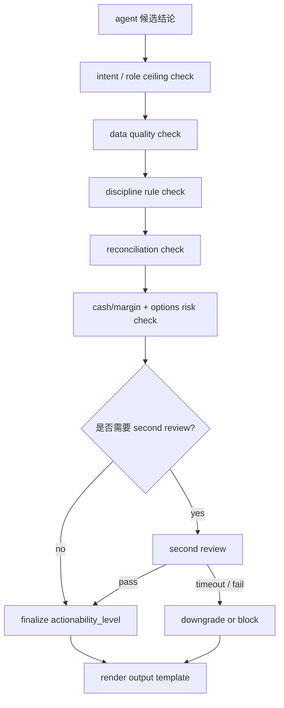

# RiskReviewTools 设计

## 核心定位

`RiskReviewTools` 是 AI 持仓投资分析系统 3.0 的控制面最终 gate，用来把 agent 产出的候选结论，收敛成一个**可审计、可解释、可降级**的 `actionability_level`。

它不负责替代股票、期权、组合或券商工具做分析本身，而是回答最后一个产品问题：

1. 这段结果现在只能当信息看，还是能当分析看。
2. 它是否已经足够进入“建议动作”层。
3. 它能否形成一个待确认的 `trade_draft`。
4. 如果不能，系统应该降级成什么，还是直接 `blocked`。

一句话口径：

> RiskReviewTools 不是“再做一次分析”的 agent，而是把数据质量、纪律规则、对账状态、券商现金保证金、期权风险、权限和二次审查收口成统一行动等级的最终控制面。

## 为什么 3.0 必须补这一层

在现有 3.0 方案里，系统已经明确了三件事：

1. 高风险工具结果不能直接发给用户，必须经过最终风险审查。
2. 每个输出都必须带 `data_quality`、`lineage_refs` 和 `actionability_level`，否则不能进入最终回复。
3. agent 可以提出候选结论，但不能自己决定“现在已经可以执行”。

如果没有 `RiskReviewTools`，会出现四类产品问题：

1. 同一结论在 OpenClaw 和 Hermes 中口径不一致，有时是“建议”，有时只是“观察”。
2. 数据 fallback、对账失败、现金/保证金缺失时，agent 仍可能用自然语言把结果说得像可执行建议。
3. `DisciplineRuleTools`、`ConfirmationTools`、`Agent Capability Matrix` 各自成立，但没有一个地方最终决定“最多能说到哪一步”。
4. 事故复盘时无法回答“为什么这次允许到了 `trade_draft`，上次却只到 `analysis_only`”。

所以，3.0 需要的不是“让模型更谨慎一点”，而是把行动等级变成一个正式产品对象。

## 设计目标

1. 用统一的 `actionability_level` 描述所有 agent 输出，而不是靠自然语言暗示风险。
2. 让高风险建议默认走“先收紧、再放行”的控制链，禁止 agent 自行升级成 `trade_draft`。
3. 把数据质量、纪律规则、对账状态、现金保证金、期权风险、二次审查等关键信号结构化。
4. 把降级和阻断做成稳定产品行为，而不是每个 agent 自己写一段解释。
5. 让 OpenClaw、Hermes、Delivery、Replay、Ops 都能复用同一份风险结论。
6. 让用户看到的状态和动作建议边界清晰，不把“分析能力”误包装成“执行能力”。

## 非目标

1. 不替代 `EquityTools`、`OptionsTools`、`PortfolioTools`、`BrokerTools` 本身的专业分析。
2. 不做自动下单，也不生成可直接提交给券商的真实交易指令。
3. 不把模型置信度直接等同于行动等级。
4. 不让 Hermes 通过优化 prompt 或模板绕过这层 gate。

## 核心原则

| 原则 | 产品口径 |
| --- | --- |
| 最终 gate | `RiskReviewTools` 负责最终确定 `actionability_level`，agent 只能提交候选结论。 |
| 默认保守 | 缺少关键证据时，优先降级到更低行动等级，而不是勉强给建议。 |
| 数据先于措辞 | `actionability_level` 由结构化信号决定，不能被“更有说服力的话术”抬高。 |
| 高风险先审后出 | 越接近交易动作，越依赖规则、对账、现金保证金和二次审查。 |
| 等级与意图分离 | 用户问“查持仓”时，即使数据完整，也不应自动升级成建议。 |
| 统一降级 | fallback、服务不可用、字段不全、等待二次审查，都必须有统一模板。 |
| 可回放可审计 | 每次判级都要能解释“为什么是这个等级，而不是更高/更低”。 |

## 行动等级设计总览

### 五档 `actionability_level`

| 等级 | 含义 | 用户可见体验 | 允许包含的内容 | 明确禁止 |
| --- | --- | --- | --- | --- |
| `info_only` | 信息查询结果 | 事实展示、状态回执 | 持仓、行情、任务状态、原始对账结果 | 动作建议、方向性结论、交易草稿 |
| `analysis_only` | 可分析但不可行动 | 有结论，但必须带限制条件 | 观察、风险解释、情景分析、缺失说明 | 明确“可以买/可卖/可开仓”类表达 |
| `suggested_action` | 可作为人工判断参考的建议 | 给出下一步建议，但不是草稿 | 建议观察、建议人工复核、建议考虑某方向 | 精确交易参数、默认当成可执行草稿 |
| `trade_draft` | 已过主要 gate 的待确认动作草稿 | 给出可确认的草稿对象 | 标的、方向、前提、风险摘要、确认入口 | 自动执行、绕过确认、绕过二次审查 |
| `blocked` | 当前不允许给出行动结论 | 明确说明为什么不能继续 | 阻断原因、补齐条件、可重试条件 | 模糊暗示“其实也可以试试” |

### 关键区分

1. `info_only` 和 `analysis_only` 的区别，不在于有没有“分析文字”，而在于是否开始推导方向性判断。
2. `analysis_only` 和 `suggested_action` 的区别，不在于内容长短，而在于是否允许把结果转化成用户下一步动作建议。
3. `suggested_action` 和 `trade_draft` 的区别，不在于建议是否强烈，而在于是否已经满足形成**待确认草稿**所需的结构化前提。
4. `blocked` 不是系统报错，而是一个正式产品状态，表示“当前不能把结果升级成行动输出”。

### 行动等级的三层上限

`RiskReviewTools` 最终判级，不是从 5 档里随意选，而是同时受三层上限约束：

1. **意图上限**：查询类请求默认上限是 `info_only` 或 `analysis_only`。
2. **角色上限**：由 `Agent Capability Matrix` 决定该 role 最多能输出到哪一档。
3. **证据上限**：由数据质量、纪律、对账、现金保证金、期权风险、确认状态和二次审查共同决定。

最终等级应取三者中的更保守结果。

## 决策输入维度

`RiskReviewTools` 需要的不是 agent 自由发挥的总结，而是一组标准风险输入信号。

### 1. 数据质量

| 信号 | 作用 | 对行动等级的影响 |
| --- | --- | --- |
| `source_tier` | 判断是否主源、授权交易级源还是 fallback | 使用 L3/L4 fallback 时，最高只能到 `analysis_only` |
| `freshness_seconds` | 判断数据是否足够新鲜 | 超过交易建议阈值时，不能形成 `suggested_action` 或 `trade_draft` |
| `completeness` | 判断关键字段是否齐全 | 缺少价格、持仓、Greeks、现金/保证金等关键字段时降级或阻断 |
| `lineage_refs` | 判断数据是否可追溯 | 无来源链路时，不能进入高等级输出 |
| `as_of` | 判断时点是否一致 | 时点错位时只能做观察性分析 |

产品规则：

1. 当前买卖建议必须依赖交易级主源或明确授权的交易级数据。
2. fallback 数据可以帮助用户“先理解发生了什么”，但不能帮助系统“假装现在可执行”。
3. 数据质量不足时，优先降级为 `analysis_only`；如果缺的是关键风控字段，则直接 `blocked`。

### 2. 纪律规则

`DisciplineRuleTools` 不是建议附件，而是行动等级的强制输入。

建议统一使用以下结果：

| 结果 | 含义 | 对行动等级的影响 |
| --- | --- | --- |
| `pass` | 规则通过 | 可继续进入下一层判断 |
| `warn` | 有提醒，但不阻断 | 最高可到 `suggested_action`，是否到 `trade_draft` 取决于其他条件 |
| `override_required` | 需要显式 override | 默认不能直接到 `trade_draft` |
| `hard_block` | 规则禁止 | 直接 `blocked` |
| `service_unavailable` | 规则服务不可用 | 高风险输出直接 `blocked`，低风险输出最多 `analysis_only` |

产品口径：

1. 纪律规则不能作为“解释项”挂在建议后面，而应先决定建议是否存在。
2. agent 不允许因为语言上写得更保守，就绕过 `hard_block`。
3. 需要 override 的场景，不等于允许先给 `trade_draft` 再补确认；默认应停在 `suggested_action` 或 `blocked`。

### 3. 对账状态

`reconciliation_status` 是行动等级中最容易被忽略、但对持仓类建议最关键的输入之一。

| 状态 | 含义 | 对行动等级的影响 |
| --- | --- | --- |
| `matched` | 持仓、现金、期权仓位与券商快照一致 | 可继续判断 |
| `soft_warning` | 有小差异，但不影响核心结论 | 最多到 `suggested_action`，是否允许 `trade_draft` 需看动作类型 |
| `failed` | 核心数据不一致 | 持仓相关建议默认 `blocked` |
| `unknown` | 未完成对账或无最新结果 | 不能形成依赖持仓/现金的高等级建议 |

产品规则：

1. 对账失败时，不输出高置信仓位结论，不输出 sell put 可执行建议。
2. 对账未知时，可以展示“当前系统看到的数据”，但必须停留在 `info_only` 或 `analysis_only`。
3. 只有对账通过或明确可接受的软警告，才允许把持仓、现金、期权仓位带入后续判级。

### 4. 券商现金/保证金

这部分对 sell put、roll、补仓和风险释放类建议是硬门，不是辅助说明。

建议统一判定：

| 状态 | 含义 | 对行动等级的影响 |
| --- | --- | --- |
| `verified_sufficient` | 券商现金/保证金充足且时点可信 | 可继续判断是否到 `trade_draft` |
| `verified_tight` | 足够但空间紧张 | 最多到 `suggested_action`，需强化风险提示 |
| `insufficient` | 现金/保证金不足 | 直接 `blocked` |
| `stale` | 有值但过期 | 最多 `analysis_only` 或 `suggested_action`，不得形成 `trade_draft` |
| `missing` | 无法取得 | cash secured put 等相关动作直接 `blocked` |

产品规则：

1. 对 cash secured put，`missing`、`stale`、`insufficient` 都不能形成 `trade_draft`。
2. 对一般观察类期权分析，如果现金/保证金缺失，可以继续解释风险，但行动等级不得高于 `analysis_only`。
3. 现金/保证金只是必要条件，不是充分条件；即使资金充足，也仍需通过规则、对账和二次审查。

### 5. 期权风险

对于期权相关输出，`RiskReviewTools` 必须要求 agent 提交一份结构化 `options_risk_pack`，而不是只给一段“风险较高”的自然语言总结。

建议首期至少覆盖：

| 风险项 | 为什么影响行动等级 |
| --- | --- |
| `greeks_summary` | 判断 Delta/Gamma/Vega 暴露是否适合进入建议层 |
| `assignment_risk` | 决定 sell put / covered call 是否可进入草稿层 |
| `liquidity_risk` | 价差过宽、成交稀薄时，不应形成 `trade_draft` |
| `event_risk` | 财报、宏观事件、到期前关键窗口会抬高审查要求 |
| `expiry_risk` | 临近到期时，建议更倾向 `analysis_only` 或 `suggested_action` |
| `concentration_risk` | 与账户已有仓位叠加后，可能触发纪律或组合风险阈值 |

产品规则：

1. 缺少 Greeks、流动性或 assignment 风险时，期权建议不能进入 `trade_draft`。
2. 存在重大事件风险或极端临近到期时，即使其他条件满足，也应默认提高到二次审查。
3. 期权风险不是“建议后附一个免责声明”，而是决定能否进入更高行动等级的核心证据。

### 6. 权限、确认与运行时边界

除了金融风险，控制面还要考虑输出是否有合法承接路径：

| 信号 | 作用 | 对行动等级的影响 |
| --- | --- | --- |
| `role_ceiling` | 当前 role 最多允许输出到哪一档 | 超过 ceiling 直接收敛到更低等级 |
| `confirmation_available` | 是否有后续确认流承接 `trade_draft` | 无确认流时不得输出 `trade_draft` |
| `write_scope` | 是否允许创建待确认草稿 | 超范围直接 `blocked` |
| `runtime_mode` | OpenClaw / Hermes / domain worker 输出边界 | 某些同步场景可限制为 `analysis_only` |

产品规则：

1. 没有确认流承接的情况下，不能把结果包装成 `trade_draft`。
2. Role 没有高风险建议权限时，就算证据充足，也必须收敛到更低等级。
3. Runtime 差异只影响“是否允许到达更高层”，不允许改变同一层的定义。

### 7. 二次审查

高风险结论不应只靠一次 agent 生成后直接发给用户。

建议 `RiskReviewTools` 内置 `second_review_required` 机制，至少覆盖以下场景：

| 触发条件 | 建议处理 |
| --- | --- |
| 候选输出试图进入 `trade_draft` | 默认二次审查 |
| 期权相关输出进入 `suggested_action` 以上 | 默认二次审查 |
| 存在 `soft_warning` 对账、资金紧张、重大事件窗口 | 强制二次审查 |
| 数据源存在 fallback 但 agent 仍给出较强建议 | 强制降级，不允许以二次审查补救 |
| `hard_block` 或权限不足 | 不进入二次审查，直接 `blocked` |

二次审查可以由“更强模型 + 规则引擎 + 固定模板检查”组合完成，但产品口径要固定：

1. 二次审查是收口，不是二次生成。
2. 二次审查通过后，最多把候选结果确认到当前允许上限，不应放大原始权限。
3. 二次审查超时或不可用时，默认不能继续保留 `trade_draft` 候选。

## 判级规则

### `info_only`

适用场景：

1. 用户明确在查状态、持仓、任务进度、原始快照。
2. 系统只具备事实展示能力，没有进入分析逻辑。
3. 对账未知但用户只是在看“当前系统看到什么”。

判级要求：

1. 必须有基础来源和时点说明。
2. 不需要纪律规则通过，但若数据缺失应明确显示限制。
3. 不允许夹带隐性建议。

### `analysis_only`

适用场景：

1. 结果包含分析，但数据或风控条件不足以支持动作建议。
2. 使用了 L3/L4 fallback、关键字段不全、数据时点不一致。
3. 规则服务不可用但请求本身不是高风险动作。
4. 期权分析缺少部分关键字段，只能做风险解读。

判级要求：

1. 必须显式写出为什么不能升级。
2. 必须给出缺失项或恢复条件。
3. 允许描述多种情景，但不能让用户误以为系统已经放行某个动作。

### `suggested_action`

适用场景：

1. 数据质量、纪律规则、对账状态总体通过。
2. 可以给出“下一步可考虑做什么”的建议，但还不能形成待确认草稿。
3. 常见于个股止盈止损观察、组合调仓方向建议、期权候选复核建议。

判级要求：

1. 必须带 `risk_summary`、`discipline_result`、`reconciliation_status`。
2. 必须说明这是“供人工判断参考”的建议，而不是已准备执行的草稿。
3. 当存在资金紧张、软警告对账、事件窗口等因素时，`suggested_action` 是常见收敛点。

### `trade_draft`

这是 3.0 里最需要严格定义的一档。

`trade_draft` 不是“更强烈的建议”，而是一个**已通过主要 gate、可以进入确认流的待确认动作对象**。

进入条件建议同时满足：

1. 当前意图和 role 允许进入 `trade_draft`。
2. 数据使用交易级主源或授权主源，且时点满足动作要求。
3. `reconciliation_status` 为 `matched`，或产品明确定义允许的窄场景软警告。
4. `DisciplineRuleTools` 结果为 `pass`，至少不能是 `override_required` 或更差。
5. 券商现金/保证金对该动作已验证且可信。
6. 期权类输出必须提交完整 `options_risk_pack`。
7. 二次审查已通过。
8. 下游存在 `ConfirmationTools` 承接路径。

用户可见语义：

1. 这是“待确认草稿”，不是“系统已经替你下单”。
2. 必须展示草稿前提和主要风险。
3. 必须有确认入口，且允许用户放弃。

### `blocked`

适用场景：

1. 规则硬阻断、权限不足、跨 scope、写范围不允许。
2. 持仓/现金/期权仓位对账失败。
3. cash secured put 需要现金保证金，但当前缺失、过期或不足。
4. 高风险结论需要二次审查，但二次审查失败或不可用。
5. 输出依赖的关键字段缺失，已无法安全降级为建议。

产品要求：

1. 必须解释“为什么被阻断”。
2. 必须指出“什么条件补齐后可以重试”。
3. 不允许用软性措辞把 `blocked` 包装成“其实你也可以考虑一下”。

## 评审流程与状态流

### 端到端流程



### 建议状态机

建议 `RiskReviewTools.review_status`：

| 状态 | 含义 |
| --- | --- |
| `candidate_received` | 收到 agent 候选结论 |
| `precheck_failed` | 意图、role、scope 预检查失败 |
| `data_gate_failed` | 数据质量未过 |
| `rule_gate_failed` | 纪律规则未过 |
| `reconcile_gate_failed` | 对账未过 |
| `risk_pack_incomplete` | 现金保证金或期权风险证据不完整 |
| `second_review_pending` | 等待二次审查 |
| `second_review_failed` | 二次审查失败或超时 |
| `finalized` | 行动等级已确定 |
| `rendered` | 输出模板已生成 |

### 推荐的等级收敛逻辑

| 场景 | 推荐结果 |
| --- | --- |
| 查询持仓、任务状态 | `info_only` |
| fallback 数据、字段不全、时点偏旧 | `analysis_only` |
| 数据和规则通过，但不满足草稿条件 | `suggested_action` |
| 高风险动作、证据完整、二次审查通过、可进入确认流 | `trade_draft` |
| 规则硬阻断、对账失败、资金不足、权限不足 | `blocked` |

## 输出模板与用户可见口径

### 统一输出结构

无论最终等级是什么，建议都统一产出以下结构：

```json
{
  "actionability_level": "analysis_only",
  "review_status": "finalized",
  "summary": "当前只能做观察分析，不能升级为动作建议。",
  "why_this_level": [
    "期权链使用了 fallback 数据",
    "现金/保证金快照已过期"
  ],
  "data_quality": {
    "source_key": "futu_option_chain_fallback",
    "as_of": "2026-05-09T14:32:00+08:00",
    "freshness_seconds": 780,
    "reconciliation_status": "matched"
  },
  "discipline_result": {
    "status": "pass"
  },
  "risk_summary": {
    "cash_margin_status": "stale",
    "options_risk_status": "partial"
  },
  "next_best_action": "等券商现金/保证金刷新后再重新评审。",
  "source_refs": []
}
```

### 不同等级的用户模板要点

| 等级 | 建议模板重点 |
| --- | --- |
| `info_only` | 明确这是事实/状态，不附带动作方向 |
| `analysis_only` | 先给结论，再写限制条件，再写缺失项 |
| `suggested_action` | 先写建议方向，再写这是人工参考，再写风险摘要 |
| `trade_draft` | 先写“待确认草稿”，再写前提、关键参数、风险和确认入口 |
| `blocked` | 先写阻断原因，再写补齐条件，不输出模糊建议 |

### `trade_draft` 的最小用户展示元素

当等级达到 `trade_draft` 时，建议最少展示：

1. 标的与方向。
2. 为什么形成草稿，而不是仅仅建议。
3. 数据时点、对账状态、现金保证金状态。
4. 纪律检查结果。
5. 期权时的 assignment / liquidity / expiry / event risk 摘要。
6. “仍需用户确认”的明确文案。

## P0 / P1

### P0 上线前必须有

1. 统一的 `actionability_level` 五档定义与输出 schema。
2. `RiskReviewTools` 作为独立 final gate，禁止 agent 自行升级到 `trade_draft`。
3. 数据质量输入：`source_key`、`as_of`、`freshness_seconds`、`lineage_refs`。
4. 对账输入：`reconciliation_status` 必须进入判级。
5. 纪律输入：高风险输出必须依赖 `DisciplineRuleTools`。
6. 券商现金/保证金输入：sell put 等高风险动作必须显式校验。
7. 期权风险包：至少覆盖 Greeks、assignment、liquidity、expiry、event risk。
8. 二次审查机制：`trade_draft` 候选默认需要 second review。
9. 五档统一输出模板。
10. 失败模式与降级策略：fallback、规则服务不可用、对账失败、现金保证金缺失等必须有固定口径。
11. 审计字段：记录候选等级、最终等级、降级原因、审查链路。

### P1 首个可用版本建议补齐

1. `tenant` 级风险偏好模式，例如“宁可少建议，也不用 fallback”。
2. 可配置的二次审查策略，不同动作类型使用不同审查强度。
3. 与 `HandoffProgressTools` 打通，让用户看到“等待二次审查”“等待券商资金刷新”等状态。
4. `RiskReviewTools` 的 replay / eval 套件，覆盖 sell put、止盈止损、交易录入修正、对账异常等场景。
5. Ops 视图：查看某次结果为什么被降级、为什么被阻断、二次审查卡在哪。
6. 等级分布与误判指标，例如 `blocked_to_manual_override_rate`、`trade_draft_downgrade_rate`。

## 失败模式与降级

| 失败模式 | 风险 | 推荐结果 |
| --- | --- | --- |
| 行情来自 L3/L4 fallback | 数据不适合交易动作 | 最多 `analysis_only` |
| 持仓/现金/期权仓位对账失败 | 事实基础不可信 | `blocked` |
| 对账未知但用户只查状态 | 可展示原始事实，但不应建议动作 | `info_only` |
| 纪律规则服务不可用 | 高风险建议失去硬门 | 高风险 `blocked`，低风险最多 `analysis_only` |
| 券商现金/保证金缺失或过期 | sell put 风险不可控 | `blocked` 或最多 `analysis_only` |
| 现金/保证金不足 | 动作无法成立 | `blocked` |
| 期权链缺 Greeks 或流动性字段 | 风险评估不完整 | 最多 `analysis_only` 或 `suggested_action`，不能 `trade_draft` |
| 二次审查超时 | 高风险结论无人收口 | `trade_draft` 候选降级为 `suggested_action` 或直接 `blocked` |
| 确认流不可用 | 草稿无法承接 | 不得输出 `trade_draft` |
| 输出模板渲染失败 | 用户看到的口径可能失真 | 回退到最小安全模板，且等级不得升高 |

### 降级原则

1. 能保留观察价值时，优先降级，不优先报错。
2. 涉及真实资金与仓位风险时，优先阻断，不优先“给个保守建议凑合用”。
3. 降级后必须告诉用户缺了什么，而不是只说“稍后再试”。

## 与其他控制面能力的边界

| 能力 | 负责什么 | 不负责什么 |
| --- | --- | --- |
| `Tool Contract Registry` | 定义哪些工具需要风险审查、需要哪些输入 | 不负责最终判级 |
| `Agent Capability Matrix` | 决定 role 的行动等级 ceiling | 不负责逐次审查 |
| `ConfirmationTools` | 承接 `trade_draft` 后的确认动作 | 不负责判断能否进入 `trade_draft` |
| `CostQuotaTools` | 决定预算、限流和超额降级 | 不负责投资风险判级 |
| `HandoffProgressTools` | 暴露长任务和等待状态 | 不负责决定最终行动等级 |
| `DegradationPolicyTools` | 提供统一降级模板与安全文案 | 不负责做风险判定本身 |

边界口径：

1. `RiskReviewTools` 负责的是“最终可说到哪一步”。
2. `ConfirmationTools` 负责的是“说到这一步之后，怎么让用户确认”。
3. `DisciplineRuleTools`、`BrokerTools`、`OptionsTools` 提供证据，但不直接决定最终对用户呈现的行动等级。

## 关键产品结论

1. `actionability_level` 必须成为正式产品对象，而不是模型输出里的附属字段。
2. `trade_draft` 必须被定义为“待确认草稿”，而不是“更强烈的建议”。
3. 数据质量、纪律规则、对账状态、现金保证金、期权风险、二次审查六类证据缺一不可地共同决定高风险输出是否放行。
4. 对 sell put 这类场景，现金/保证金与对账状态是硬门；缺失时不能靠话术弥补。
5. `blocked` 是用户可理解、Ops 可复盘的正式状态，而不是错误兜底。
