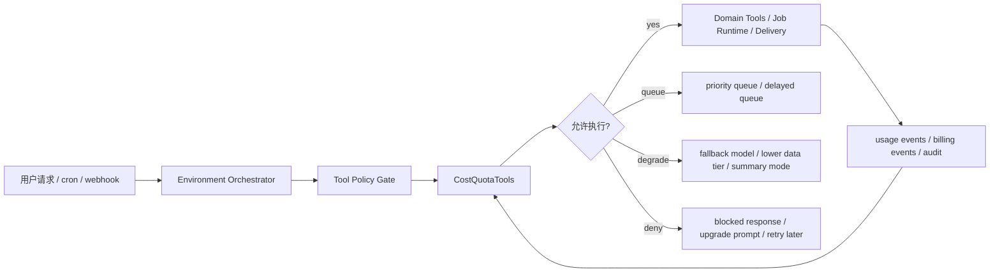
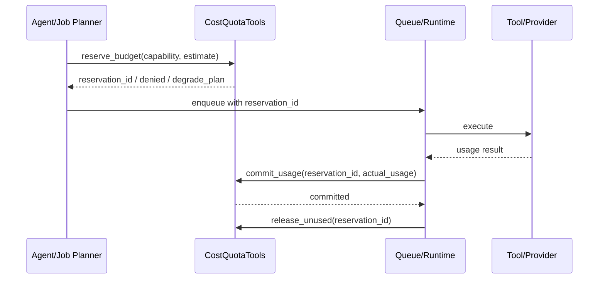
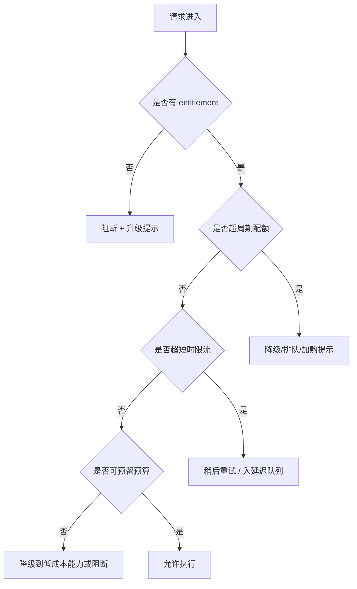
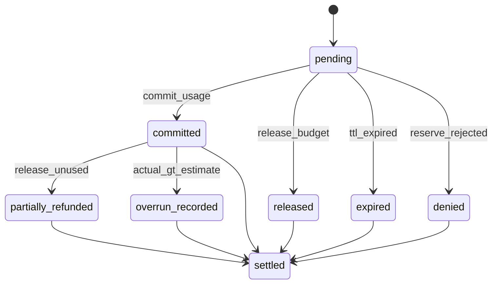
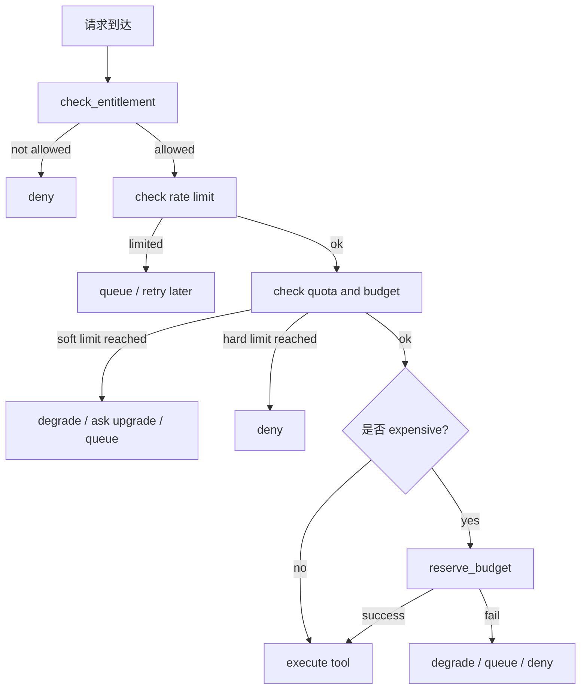
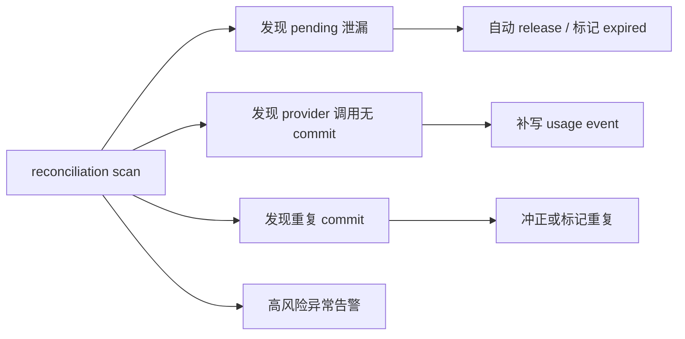
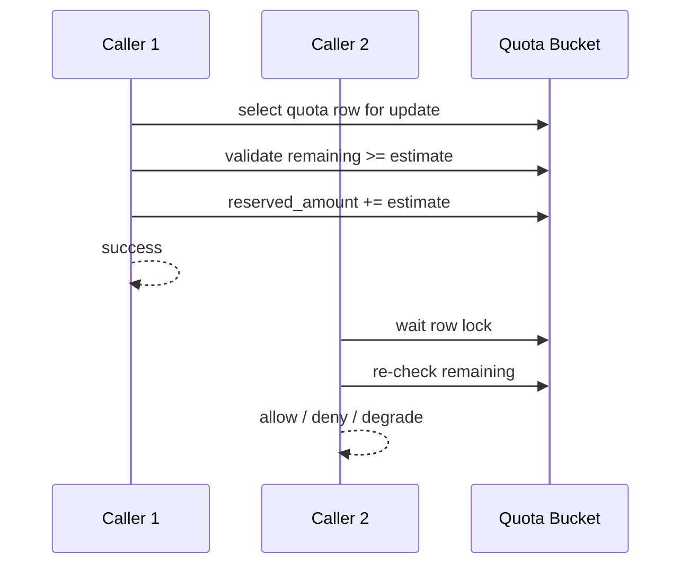
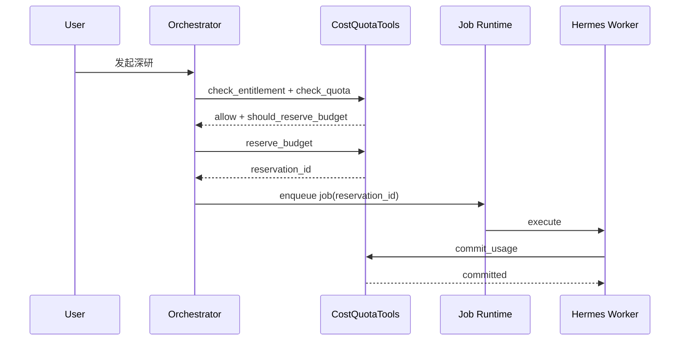
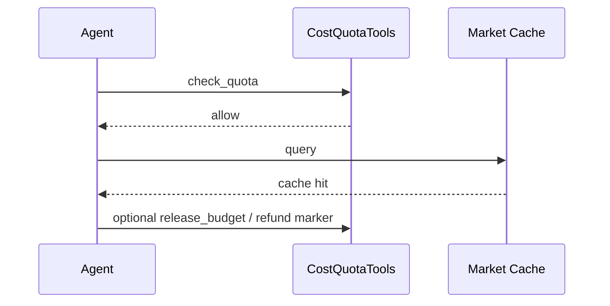
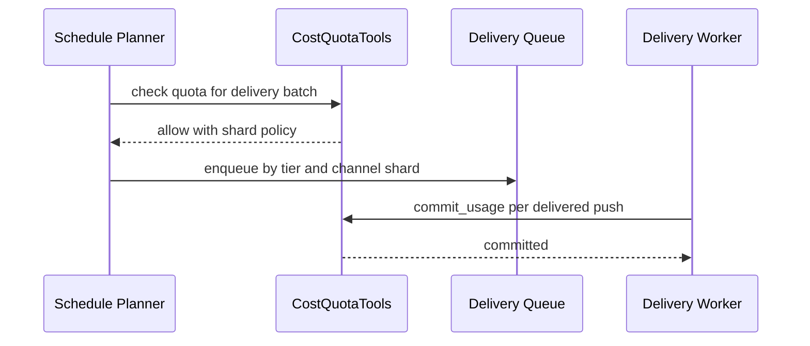

# CostQuotaTools 设计

## 定位

`CostQuotaTools` 是 AI 持仓投资分析系统 3.0 的控制面能力之一，用来统一管理高成本、高并发、强外部依赖能力的**配额、预算预留、限流、计费审计和超额降级**。

它不负责分析股票或期权本身，而是回答五个控制面问题：

1. 这次请求有没有资格调用对应能力。
2. 这次调用要不要先预留预算，避免任务跑到一半才发现超支。
3. 当前租户、订阅等级、provider、任务队列是否允许继续提速。
4. 超额后给用户什么体验，是排队、降级、提示升级，还是直接阻断。
5. 事后如何审计“谁花了多少钱、为什么允许、是否有异常消耗”。

3.0 中，以下能力必须纳入 `CostQuotaTools` 治理：

| 能力 | 成本特征 | 为什么不能放任 agent 自由调用 |
| --- | --- | --- |
| GPT-5.5 deep jobs | 单次成本高、耗时长、易被批量任务打爆 | 深研、长报告、复杂组合归因很容易被滥用 |
| MiniMax 日常调用 | 单次便宜但调用量大 | 10 万级消息入口下，总量成本和峰值并发都可失控 |
| 期权链 | 请求大、字段多、实时性要求高 | sell put 扫描和批量监控最容易触发外部限流 |
| 券商同步 | 受 broker token、连接、频率限制 | 高频同步既烧配额，也可能触发券商风控 |
| OCR | 单次贵、失败率受图片质量影响 | 用户连续截图重试会快速放大成本 |
| 付费行情源 | 真金白银按次或按量收费 | 需要区分交易级、分析级、fallback 级能力 |
| 推送 | 单次便宜但收盘峰值巨大 | 大规模 cron 推送会和深研/行情/券商同步竞争预算和队列 |

## 设计目标

1. **预算先于执行。** 昂贵能力先预留预算，不接受“先跑再结算”。
2. **配额不是单一计数器。** 要同时支持次数、token、symbol 数、图片数、broker 连接数、消息数、美元预算。
3. **订阅等级影响能力边界。** 不只是“能不能用”，还包括频率、优先级、队列 SLA、fallback 策略。
4. **控制面和用户体验分离。** 超额不等于一刀切报错，应区分排队、降级、延迟、提示升级、允许突发透支。
5. **先挡住系统性风险。** provider 限流、cron 雪崩、热门 symbol 重复拉取，比单个用户超额更危险。
6. **审计可追溯。** 每次预算预留、扣减、释放、透支、拒绝都必须进入审计流。

## 在整体架构中的位置



关系边界：

1. `Tool Policy Gate` 负责“这个工具是否允许被调用”。
2. `CostQuotaTools` 负责“允许调用后，当前预算、配额、provider 容量是否还支持执行”。
3. `Durable Job Runtime` 负责“被允许的任务如何排队、恢复、重试”。
4. `Delivery Guard` 负责“推送是否投给正确用户”，但推送额度和批量节流由 `CostQuotaTools` 管。
5. `DegradationPolicyTools` 负责统一降级文案和安全模板，`CostQuotaTools` 提供降级原因和级别。

## 受管对象模型

`CostQuotaTools` 不应只维护一个 `usage_quotas` 表，而应维护四层对象：

| 对象 | 作用 | 示例 |
| --- | --- | --- |
| `entitlement` | 某订阅等级允许哪些能力、到什么边界 | `pro` 可用 GPT-5.5 深研，`free` 不可用 |
| `quota` | 周期性限额 | 每月 20 次深研、每日 50 次 OCR |
| `budget` | 金额或 credit 预算 | 每月 50 美元模型预算、每月 10 美元付费行情预算 |
| `rate_limit` | 短时流量闸门 | 每分钟 5 次 broker sync、每秒 20 次推送发送 |

建议 quota key 统一采用以下维度：

```text
tenant_id
subscription_tier
capability
provider
scope
period
```

其中：

1. `capability` 是产品能力，不直接等同于供应商 API。
2. `provider` 用于审计真实消耗去向，例如 `openai_gpt55`、`minimax_m27`、`futu_option_chain`、`ocr_vendor_a`。
3. `scope` 用于区分交互、定时任务、后台任务、系统补偿等场景。

## 能力分桶

建议先把高成本能力做成 7 个标准桶，避免首期就陷入细碎 SKU。

| capability | 主要对象 | 典型单位 | 默认策略 |
| --- | --- | --- | --- |
| `deep_research` | GPT-5.5 deep jobs | 次数 + token + 美元预算 | 先预留预算，再入 Hermes 队列 |
| `daily_model` | MiniMax 日常对话 | 请求数 + token | 高频限流，共享池，尽量缓存 |
| `option_chain` | 期权链、Greeks、批量筛选 | symbol 数 + 请求数 | watchlist 优先，全市场扫描强限制 |
| `broker_sync` | 券商持仓/现金/保证金同步 | 连接数 + 次数 | 按 broker 和 tenant 双限流 |
| `ocr` | OCR 识别、截图解析 | 图片数 + 页数 | 先判图片质量，再占用配额 |
| `paid_market_data` | 付费行情和历史增强数据 | symbol 数 + 请求数 + 美元预算 | 共享缓存优先，重复请求不重复计费 |
| `delivery` | 微信或其他渠道推送 | 消息数 + 峰值速率 | 允许大批量，但要分级节流和 quiet hours |

## 配额模型

### 1. 周期配额

适合做“用户能用多少次”的产品约束。

| 能力 | 推荐配额维度 |
| --- | --- |
| GPT-5.5 deep jobs | `monthly_count`、`monthly_token_limit` |
| MiniMax | `daily_request_limit`、`daily_token_limit` |
| 期权链 | `daily_symbol_limit`、`daily_scan_jobs` |
| 券商同步 | `daily_sync_count`、`active_connection_limit` |
| OCR | `daily_image_limit`、`monthly_page_limit` |
| 付费行情源 | `daily_symbol_limit`、`monthly_budget_cap` |
| 推送 | `daily_push_limit`、`burst_push_limit` |

### 2. 金额预算

适合控制真实现金消耗，尤其是 GPT-5.5、OCR、付费行情源。

建议支持三种预算口径：

| 口径 | 用途 |
| --- | --- |
| `tenant_budget` | 面向单个租户或顾问账号的消费上限 |
| `tier_pool_budget` | 面向某订阅等级整体成本池，避免低价套餐集体亏损 |
| `provider_budget` | 面向供应商月度预算和采购上限 |

### 3. 短时速率限制

适合保护系统和外部供应商。

| 限流维度 | 示例 |
| --- | --- |
| `tenant_id + capability` | 单个用户一分钟最多 3 次深研触发 |
| `provider + capability` | 全站每秒最多 20 次期权链拉取 |
| `broker_connection_id` | 单个券商连接 5 分钟内最多 1 次全量同步 |
| `channel_binding_id` | 单个渠道每分钟最多 10 条推送 |
| `symbol` | 热门标的的行情请求优先走共享缓存 |

## 预算预留机制

这是 `CostQuotaTools` 最重要的能力。3.0 中凡是 `cost_class=expensive` 的工具，都必须先调用 `reserve_budget`。

### 为什么必须预留

1. GPT-5.5 深研和 OCR 任务往往是异步长任务，不预留就会出现“排到队首才发现没钱”。
2. 期权链、付费行情、券商同步经常是批量操作，必须在任务 fanout 前拦住。
3. 推送虽然单次便宜，但收盘 fanout 时也要预留消息预算和 provider 带宽。

### 生命周期



### 预算预留规则

1. 预留基于**估算成本**，结算基于**实际成本**。
2. 预留必须有 TTL，超时未执行自动释放。
3. 同一 `idempotency_key` 重试时必须复用或恢复原 reservation，不能重复占坑。
4. `commit_usage` 后如果实际消耗高于估算，应记录 `overrun_amount`。
5. 对支持缓存命中的能力，命中共享缓存时允许部分或全部返还预留预算。

### 估算方法建议

| 能力 | 估算方式 |
| --- | --- |
| GPT-5.5 deep jobs | 基于任务模板、输入长度、报告目标长度估算 token 区间 |
| MiniMax | 基于历史均值估算，但通常不单独做强预留，只做速率和周期配额 |
| 期权链 | 基于 `symbols * fields profile` 估算请求成本 |
| 券商同步 | 基于 broker 类型、同步范围、连接状态估算 |
| OCR | 基于图片张数、像素档位、是否多页估算 |
| 付费行情源 | 基于 symbol 数、历史窗口、snapshot/bar 级别估算 |
| 推送 | 基于目标账号数、消息类型、是否带长文摘要估算 |

## 订阅等级设计

订阅等级不应只影响“能否使用”，还应影响：

1. 是否允许触发该能力。
2. 是否允许自动触发，还是只能手动触发。
3. 限流阈值和排队优先级。
4. 超额后的兜底体验。
5. 是否允许 burst 或透支。

建议首版做 4 档：

| tier | 目标人群 | 核心边界 |
| --- | --- | --- |
| `free` | 体验用户 | MiniMax 基础问答、低频推送、公共/缓存数据优先，不开放 GPT-5.5 深研 |
| `pro` | 个人投资者 | 有限深研、有限 OCR、定时券商同步、关注池期权链 |
| `premium` | 重度投资者 | 更高深研额度、更高推送 SLA、更多 broker 连接、更宽期权链扫描 |
| `advisor` | 顾问/多组合用户 | 多租户视角下的高配额、高并发和更强审计，但需更严格预算治理 |

示例策略：

| 能力 | free | pro | premium | advisor |
| --- | --- | --- | --- | --- |
| GPT-5.5 deep jobs | 不可用 | 月 10 次，排队 | 月 40 次，优先队列 | 月 200 次，分账户预算 |
| MiniMax 日常对话 | 基础额度 | 提高额度 | 更高额度 | 按团队池限额 |
| 期权链 | 仅持仓/关注标的 | 小范围 sell put 扫描 | 更大 watchlist 和更高刷新频率 | 多组合并行扫描 |
| 券商同步 | 手动 | 定时低频 | 更高频率 | 多连接、多市场错峰 |
| OCR | 每日少量 | 每日中量 | 每日高量 | 团队池配额 |
| 付费行情源 | 默认关闭 | 有限开启 | 常规开启 | 更高预算池 |
| 推送 | 摘要和低频 | 标准 | 更快 | 优先 SLA |

## 限流设计

配额解决“一个周期里能花多少”，限流解决“短时间里能冲多快”。

### 限流分层

| 层级 | 目标 | 示例 |
| --- | --- | --- |
| 用户级 | 防止单用户刷爆资源 | 单用户 1 分钟内最多发起 3 次 OCR |
| 订阅等级级 | 保证高付费用户体验 | `premium` 深研队列优先于 `free/pro` |
| provider 级 | 防止触发外部封禁 | Futu 期权链每秒最多 N 请求 |
| 系统级 | 保护核心服务稳定 | GPT-5.5 worker pool 同时只跑 M 个 job |

### 推荐限流策略

| 能力 | 推荐限流 |
| --- | --- |
| GPT-5.5 deep jobs | `tenant + tier + global worker pool` 三层限流 |
| MiniMax | `tenant + session` 平滑限流，避免会话刷屏 |
| 期权链 | `provider + symbol batch size + queue shard` |
| 券商同步 | `broker_connection + broker_provider + global sync window` |
| OCR | `tenant + image burst`，并在前置做图片质量筛选 |
| 付费行情源 | `symbol aggregation + provider QPS` |
| 推送 | `channel_binding + delivery queue shard + quiet hours` |

## 超额体验设计

超额体验必须产品化，而不是只返回 429。

### 决策顺序



### 按能力的超额体验

| 能力 | 首选体验 | 次选体验 | 不允许的体验 |
| --- | --- | --- | --- |
| GPT-5.5 deep jobs | 排队并说明稍后推送 | 改用 MiniMax 摘要版 | 悄悄失败或假装已完成 |
| MiniMax | 短时稍后重试 | 返回简版状态查询结果 | 无限重试导致消息风暴 |
| 期权链 | 缩小到持仓/关注范围 | 使用较旧缓存做观察分析 | 用过期链路给出可执行建议 |
| 券商同步 | 延迟到错峰时间窗 | 仅返回上次已对账快照 | 未同步却假装实时 |
| OCR | 让用户重传清晰图 | 进入低优先级队列 | 模糊识别后直接写事实 |
| 付费行情源 | 切回缓存或公共源做观察分析 | 排队到预算窗口重置后 | 伪装成交易级实时数据 |
| 推送 | 压缩为摘要推送 | 延迟推送 | 重试刷屏 |

## 计费与审计

3.0 至少要能回答四个问题：

1. 某个租户本月在哪些能力上花了多少。
2. 某个 provider 的成本是否异常上升。
3. 哪些预算预留没有释放，导致“假性超额”。
4. 哪些失败/重试正在制造无效成本。

建议表结构：

```sql
cost_entitlements (
  id uuid primary key,
  subscription_tier text not null,
  capability text not null,
  enabled boolean not null default true,
  auto_trigger_enabled boolean not null default false,
  priority_class text not null, -- low, normal, high
  overage_policy text not null, -- deny, queue, degrade, burst
  config jsonb not null,
  created_at timestamptz,
  updated_at timestamptz
);

usage_quotas (
  id uuid primary key,
  tenant_id uuid not null,
  subscription_tier text not null,
  capability text not null,
  provider text,
  period text not null, -- daily, monthly
  soft_limit numeric,
  hard_limit numeric,
  used_amount numeric not null default 0,
  reserved_amount numeric not null default 0,
  reset_at timestamptz not null,
  updated_at timestamptz
);

budget_reservations (
  id uuid primary key,
  tenant_id uuid not null,
  run_id uuid,
  job_id uuid,
  capability text not null,
  provider text,
  reservation_status text not null, -- pending, committed, released, expired, denied
  estimated_amount numeric not null,
  committed_amount numeric,
  overrun_amount numeric not null default 0,
  expires_at timestamptz not null,
  idempotency_key text not null,
  metadata jsonb not null default '{}',
  created_at timestamptz,
  updated_at timestamptz
);

usage_events (
  id uuid primary key,
  tenant_id uuid not null,
  run_id uuid,
  job_id uuid,
  reservation_id uuid,
  capability text not null,
  provider text,
  event_type text not null, -- reserve, commit, release, deny, overage, refund
  usage_unit text not null, -- token, request, image, symbol, push, usd
  quantity numeric not null,
  unit_price numeric,
  amount numeric,
  result_status text not null,
  audit_context jsonb not null,
  created_at timestamptz
);
```

关键审计字段：

| 字段 | 用途 |
| --- | --- |
| `run_id` / `job_id` | 把费用绑定到具体交互或后台任务 |
| `reservation_id` | 回放预算预留和释放链路 |
| `capability` | 从产品能力维度做成本归因 |
| `provider` | 从供应商维度做成本治理 |
| `audit_context` | 记录 `tenant_id`、`tier`、`tool_name`、`degrade_reason`、`source_tier` |

## 与具体能力的产品策略

### GPT-5.5 deep jobs

1. 默认只用于 Hermes 长任务和复杂分析，不用于 OpenClaw 日常聊天。
2. 必须先做预算预留，再进入深研队列。
3. 超额优先“排队 + 稍后推送”，其次才是“降级为 MiniMax 摘要版”。
4. 当 provider budget 接近上限时，应先收紧自动触发，再收紧手动触发。

### MiniMax

1. 作为日常对话主模型，不应做强预算预留，但必须做周期配额和速率限制。
2. 对重复状态查询应优先命中缓存，减少模型调用。
3. 若 MiniMax provider 故障，不应自动升级到 GPT-5.5 透支高成本，除非是高阶用户且任务明确需要。

### 期权链

1. 必须区分“持仓/关注标的查询”和“全池 sell put 扫描”。
2. 全池扫描应占用独立配额桶，不与单次查看某只标的混算。
3. 若期权链额度不足，可降级为较少标的、较低刷新频率、仅观察分析。

### 券商同步

1. 同步预算不仅是金钱，更是 broker 连接资源和频率许可。
2. 建议把“用户主动点击同步”和“后台定时同步”分开配额与优先级。
3. 如果 broker provider 限流紧张，应优先活跃用户和高等级用户，低等级用户延后到错峰窗口。

### OCR

1. OCR 前先做图片质量闸门，避免糟糕输入浪费额度。
2. OCR 结果若要写入交易事实或修正持仓，仍需 ConfirmationTools，不因付费就跳过确认。
3. OCR 超额时，应先引导用户手动补字段，而不是继续盲跑 OCR。

### 付费行情源

1. 优先复用共享市场缓存，避免按 tenant 重复花钱。
2. 同一个 symbol 在短窗口内的重复请求，应由系统聚合，不应重复计费。
3. 如果只剩公共 fallback 数据，输出必须降级为观察分析，不得伪装成交易级建议。

### 推送

1. 推送不只看消息条数，还要看市场窗口内的并发峰值。
2. 收盘 fanout 时，`CostQuotaTools` 应与 Job Runtime 一起按 tier、市场、活跃度做分批。
3. 预算紧张时优先保留风险提醒和任务完成通知，压缩普通日报和长文摘要。

## 失败模式与降级

| 失败模式 | 风险 | 控制面行为 | 用户体验 |
| --- | --- | --- | --- |
| quota 表延迟更新 | 可能重复放行 | 预留和提交走强一致写，读缓存只做加速 | 少量排队，不允许静默透支 |
| reservation 泄漏未释放 | 假性超额 | TTL 自动释放 + 对账任务 | 显示“稍后重试”，避免永远锁死 |
| provider 成本单价变化 | 预算失真 | unit price 版本化，允许动态调整估算 | 暂时收紧自动触发 |
| GPT-5.5 队列爆满 | 高等级用户等待过长 | tier priority + 降级到摘要版 | 明确提示稍后推送 |
| MiniMax 故障 | 日常对话不可用 | 切到缓存答复或极简规则答复 | 告知轻量服务降级 |
| 期权链 provider 限流 | sell put 任务雪崩 | 缩小扫描池、提高缓存 TTL | 返回观察结果，不给交易草稿 |
| 券商同步失败 | 持仓事实过期 | 禁止可执行建议，保留快照查询 | 明示“数据待同步” |
| OCR 失败率升高 | 成本高且结果差 | 先停自动 OCR，改人工补录/重传 | 指导重传清晰图片 |
| 付费行情预算耗尽 | 后续请求无法走高质量源 | 切换公共源仅做观察分析 | 提示额度已用尽 |
| 推送通道拥塞 | 任务完成但用户收不到 | 合并消息、摘要化、延后低优先级推送 | 关键提醒优先，普通推送延迟 |

## P0 / P1

### P0 上线前必须有

1. `CostQuotaTools.check_quota`、`reserve_budget`、`commit_usage`、`release_budget` 四个基础接口。
2. 针对 GPT-5.5 deep jobs、OCR、付费行情源的预算预留能力。
3. 针对 MiniMax、期权链、券商同步、推送的 provider-level rate limit。
4. `subscription_tier -> capability` 的 entitlement 配置。
5. usage events 和 reservation 审计表，能按租户、能力、provider 查成本。
6. 超额后的标准化体验：阻断、排队、降级、升级提示四类。
7. 与 Tool Policy Gate 的串联，确保昂贵工具先过成本闸门。
8. 与 DegradationPolicyTools 的串联，确保降级文案一致。

### P1 首个可用版本应补齐

1. 共享缓存命中后的自动返还预算。
2. tier pool budget 和 provider budget 双层治理。
3. 推送预算和 quiet hours 联动，支持“关键消息优先”。
4. broker sync 的错峰和分 broker 预算策略。
5. 成本异常告警，例如单租户深研成本激增、OCR 失败重试异常、付费行情重复拉取。
6. Ops 视图：查看 quota、reservation、overage、provider saturation、tier 成本分布。
7. 审计回放：能解释某次请求为何被允许、排队、降级或拒绝。

## 建议接口

```json
{
  "tool_name": "CostQuotaTools.reserve_budget",
  "input": {
    "tenant_id": "uuid",
    "run_id": "uuid",
    "job_id": "uuid",
    "subscription_tier": "pro",
    "capability": "deep_research",
    "provider": "openai_gpt55",
    "estimate": {
      "usage_unit": "usd",
      "amount": 1.8
    },
    "idempotency_key": "tenant:task:market_day",
    "scope": "hermes_async_job"
  }
}
```

返回建议至少包含：

| 字段 | 含义 |
| --- | --- |
| `decision` | `allow`、`queue`、`degrade`、`deny` |
| `reservation_id` | 成功预留时返回 |
| `degrade_plan` | 降级到哪种模型、数据层或摘要模式 |
| `retry_after_seconds` | 需要延后执行时返回 |
| `blocked_reason` | entitlement、quota、budget、rate_limit、provider_saturation 等 |

## 实现层接口草案

建议把 `CostQuotaTools` 首版收敛为 6 个稳定接口，避免不同 runtime 自己拼装逻辑：

| 接口 | 用途 | 典型调用方 |
| --- | --- | --- |
| `check_entitlement` | 只判断当前 tier 是否有资格使用某能力 | Orchestrator、UI、预检查 |
| `check_quota` | 判断当前 quota、budget、rate limit 是否允许继续 | Tool Policy Gate、Job Planner |
| `reserve_budget` | 为昂贵异步任务做预算预留 | Hermes job planner、OCR、paid market data |
| `commit_usage` | 按实际消耗落账 | Domain Tool worker、delivery worker |
| `release_budget` | 任务取消、缓存命中、失败未执行时释放预算 | Job Runtime、compensation worker |
| `get_cost_decision` | 返回一体化控制面判断，给前台或 agent 直接消费 | OpenClaw-side Agent、Ops view |

### `check_entitlement`

```json
{
  "tool_name": "CostQuotaTools.check_entitlement",
  "input": {
    "tenant_id": "uuid",
    "subscription_tier": "pro",
    "capability": "option_chain",
    "scope": "interactive_request",
    "trigger_mode": "manual"
  }
}
```

建议返回：

```json
{
  "allowed": true,
  "priority_class": "normal",
  "auto_trigger_allowed": false,
  "overage_policy": "degrade",
  "policy_version": "v1"
}
```

### `check_quota`

适合轻量同步路径。它不占坑，只回答“现在能不能做”。

```json
{
  "tool_name": "CostQuotaTools.check_quota",
  "input": {
    "tenant_id": "uuid",
    "capability": "daily_model",
    "provider": "minimax_m27",
    "estimated_usage": {
      "usage_unit": "token",
      "amount": 2500
    },
    "scope": "openclaw_sync_reply"
  }
}
```

### `commit_usage`

```json
{
  "tool_name": "CostQuotaTools.commit_usage",
  "input": {
    "reservation_id": "uuid",
    "tenant_id": "uuid",
    "capability": "deep_research",
    "provider": "openai_gpt55",
    "actual_usage": [
      { "usage_unit": "input_token", "quantity": 18000 },
      { "usage_unit": "output_token", "quantity": 9200 },
      { "usage_unit": "usd", "quantity": 2.14 }
    ],
    "result_status": "success"
  }
}
```

### `release_budget`

`release_budget` 不应只用于失败，还应覆盖三类正常场景：

1. 任务入队后被用户取消。
2. 命中共享缓存，真实 provider 未被调用。
3. 估算金额高于实际消耗，需要返还差额。

## Reservation 状态机

`budget_reservations` 建议使用显式状态机，避免各 worker 自己解释字段。



建议状态定义：

| 状态 | 含义 | 是否占用预算 |
| --- | --- | --- |
| `pending` | 已预留，等待任务执行 | 是 |
| `committed` | 已按实际消耗记账 | 部分或全部已转已用 |
| `released` | 未执行或取消，预算已释放 | 否 |
| `expired` | TTL 到期自动释放 | 否 |
| `denied` | 预留请求被拒绝 | 否 |
| `partially_refunded` | 已结算但有差额返还 | 否 |
| `overrun_recorded` | 实际消耗大于估算，已记溢出 | 已超支落账 |
| `settled` | 对账结束，不再变化 | 否 |

## 控制面判定顺序

为了避免不同入口行为不一致，建议统一以下判定顺序：



硬规则建议：

1. `entitlement` 不通过时，不进入 quota 和预算判断。
2. `rate limit` 是系统保护闸门，优先级高于单租户预算。
3. `soft_limit` 不一定直接拒绝，应先看 `overage_policy`。
4. 只有 `hard_limit` 和 `entitlement=false` 才应直接阻断。

## 同步请求与异步任务的落地差异

### 同步请求

适用于 MiniMax 日常问答、轻量行情查询、少量推送确认。

| 特征 | 建议 |
| --- | --- |
| 延迟敏感 | 尽量只做 `check_quota`，少做重预留 |
| 成本可控 | 可按请求后记账，而不是强预留 |
| 降级重要 | 被限流时优先返回摘要、缓存结果或状态说明 |

### 异步任务

适用于 GPT-5.5 deep jobs、OCR、批量期权链、收盘推送 fanout。

| 特征 | 建议 |
| --- | --- |
| 高成本 | 必须 `reserve_budget` |
| 高并发 | 入队时就要吃掉可见预算，避免队列假繁荣 |
| 可恢复 | reservation 要跟 `job_id + idempotency_key` 绑定 |
| 可取消 | cancel 后必须触发 `release_budget` |

## 与 Job Runtime 的对接草案

建议 job payload 里显式带上成本上下文，避免 worker 二次猜测：

```json
{
  "job_id": "uuid",
  "tenant_id": "uuid",
  "capability": "deep_research",
  "reservation_id": "uuid",
  "idempotency_key": "tenant:task:market_day",
  "cost_policy_snapshot": {
    "subscription_tier": "premium",
    "priority_class": "high",
    "overage_policy": "queue"
  }
}
```

worker 侧强约束：

1. 没有 `reservation_id` 的昂贵任务不得执行。
2. `reservation_id` 与 `tenant_id`、`capability` 不匹配时直接失败并告警。
3. 重试任务默认复用原 reservation，不重新申请。
4. 只有任务真正调用了外部 provider，才允许 `commit_usage`。

## 对账与补偿流程

3.0 必须有一个轻量 nightly reconciliation job，处理以下问题：

1. `pending` 但 job 已完成或已消失的 reservation。
2. provider 成功调用但未 `commit_usage` 的漏账事件。
3. `committed_amount=0` 但 provider 实际有计费的异常。
4. 重复 `usage_events` 或幂等键冲突。

建议补偿流程：



## 告警与 Ops 指标草案

建议首版就把以下指标接到 Ops：

| 指标 | 说明 | 告警建议 |
| --- | --- | --- |
| `quota_denied_count_by_capability` | 被 quota 拒绝的次数 | 短时暴涨时告警 |
| `reservation_pending_count` | 当前未结算 reservation 数量 | 长时间堆积告警 |
| `reservation_expired_count` | TTL 释放数量 | 持续升高说明任务丢失或取消流不完整 |
| `overrun_amount_usd` | 实际超估算金额 | 超阈值告警 |
| `provider_budget_remaining_ratio` | provider 预算剩余比例 | 低于阈值提前收紧自动触发 |
| `cache_refund_ratio` | 因缓存返还的比例 | 过低说明重复调用优化不足 |
| `delivery_cost_per_1k` | 每千条推送的平均成本 | 突增时检查长文摘要策略 |

## API 错误码建议

为避免不同调用方自造错误语义，建议统一：

| 错误码 | 含义 | 调用方动作 |
| --- | --- | --- |
| `entitlement_denied` | 当前 tier 无资格使用能力 | 直接阻断或引导升级 |
| `quota_soft_limited` | 到达软阈值 | 降级、排队或提示加购 |
| `quota_hard_limited` | 到达硬阈值 | 直接阻断 |
| `budget_unavailable` | 无法预留预算 | 排队或降级 |
| `provider_rate_limited` | provider 限流 | 重试、错峰或队列延迟 |
| `provider_budget_exhausted` | provider 总预算不足 | 全局收紧能力 |
| `reservation_conflict` | 幂等键或状态异常 | 进入补偿流 |
| `usage_commit_mismatch` | 提交使用量与预留上下文不一致 | 拒绝记账并告警 |

## 服务 API 草案

如果 3.0 先不拆独立服务，也建议按服务边界设计 HTTP / internal RPC contract，避免未来迁移时重写调用方。

### 推荐资源

| 资源 | 说明 |
| --- | --- |
| `POST /cost-quota/entitlements/check` | 判断 capability 是否有资格使用 |
| `POST /cost-quota/decisions/check` | 一次性返回 entitlement + quota + rate limit 决策 |
| `POST /cost-quota/reservations` | 创建预算预留 |
| `POST /cost-quota/reservations/{id}/commit` | 提交实际消耗 |
| `POST /cost-quota/reservations/{id}/release` | 释放预算 |
| `GET /cost-quota/tenants/{tenant_id}/summary` | 查看租户当前额度摘要 |
| `GET /cost-quota/providers/{provider}/capacity` | 查看 provider 剩余额度和限流状态 |

### `POST /cost-quota/decisions/check`

这是调用方最常用的入口。它应该返回“能否执行”和“如果不能，下一步怎么办”。

```json
{
  "tenant_id": "uuid",
  "run_id": "uuid",
  "subscription_tier": "premium",
  "capability": "paid_market_data",
  "provider": "polygon_realtime",
  "scope": "interactive_request",
  "trigger_mode": "manual",
  "estimated_usage": {
    "usage_unit": "symbol",
    "amount": 25
  },
  "context": {
    "symbol_count": 25,
    "market": "US",
    "is_expensive": true
  }
}
```

建议响应：

```json
{
  "decision": "allow",
  "blocked_reason": null,
  "priority_class": "high",
  "should_reserve_budget": true,
  "reservation_strategy": "required",
  "degrade_plan": null,
  "retry_after_seconds": null,
  "policy_snapshot": {
    "subscription_tier": "premium",
    "capability": "paid_market_data",
    "provider": "polygon_realtime",
    "policy_version": "v1"
  }
}
```

### `GET /cost-quota/tenants/{tenant_id}/summary`

这个接口主要给用户中心、Ops 面板和触达前预览使用，避免前端自己拼 quota 逻辑。

建议返回：

```json
{
  "tenant_id": "uuid",
  "subscription_tier": "pro",
  "capabilities": [
    {
      "capability": "deep_research",
      "entitled": true,
      "used": 6,
      "soft_limit": 10,
      "hard_limit": 10,
      "reserved": 1,
      "reset_at": "2026-06-01T00:00:00Z"
    }
  ]
}
```

## 表字段约束与索引建议

文档前面已经给了基础表结构，这里补首版就该落下去的约束。

### `usage_quotas`

建议约束：

1. 唯一键：`(tenant_id, subscription_tier, capability, provider, period, reset_at)`。
2. `soft_limit <= hard_limit`，除非 `hard_limit` 为空表示不封顶。
3. `used_amount >= 0` 且 `reserved_amount >= 0`。
4. `provider` 允许为空，表示 capability 级总桶。

建议索引：

```sql
create unique index uq_usage_quotas_bucket
on usage_quotas (
  tenant_id,
  subscription_tier,
  capability,
  coalesce(provider, ''),
  period,
  reset_at
);

create index idx_usage_quotas_reset_at
on usage_quotas (reset_at);
```

### `budget_reservations`

建议约束：

1. 唯一键：`(tenant_id, idempotency_key, capability)`。
2. `estimated_amount > 0`。
3. `expires_at > created_at`。
4. `reservation_status` 只允许有限枚举值。
5. `committed_amount` 为空仅允许在 `pending / denied / released / expired`。

建议索引：

```sql
create unique index uq_budget_reservations_idem
on budget_reservations (tenant_id, capability, idempotency_key);

create index idx_budget_reservations_status_expiry
on budget_reservations (reservation_status, expires_at);

create index idx_budget_reservations_job_id
on budget_reservations (job_id);
```

### `usage_events`

建议约束：

1. 每个 `event_type` 必须带稳定幂等键，例如 `event_idempotency_key`。
2. `amount` 和 `quantity` 允许为 0，但不能为负，退款用单独 `refund` 事件表达。
3. `reservation_id` 可为空，但昂贵能力的 `commit` 事件默认不应为空。

建议索引：

```sql
create unique index uq_usage_events_idem
on usage_events (tenant_id, capability, event_type, coalesce(reservation_id, '00000000-0000-0000-0000-000000000000'::uuid), created_at, quantity);

create index idx_usage_events_run_id
on usage_events (run_id);

create index idx_usage_events_provider_created_at
on usage_events (provider, created_at desc);
```

## 幂等与并发控制规则

这是 `CostQuotaTools` 最容易做坏的部分。我们需要明确几条硬规则。

### 幂等键规范

| 场景 | 推荐幂等键 |
| --- | --- |
| GPT-5.5 deep job | `tenant_id:deep_research:job_key:market_day` |
| 期权链批量扫描 | `tenant_id:option_scan:view_id:date_window` |
| OCR 识别 | `tenant_id:ocr:file_hash` |
| 券商同步 | `tenant_id:broker_sync:connection_id:sync_window` |
| 收盘推送 | `tenant_id:delivery:template_key:market_day:channel_binding_id` |

规则：

1. 幂等键必须由调用方稳定生成，不能依赖数据库自增或运行时随机值。
2. 同一个幂等键重试时，应返回原 reservation 或原决策，而不是重新分配额度。
3. 幂等键一旦跨 capability 复用，必须视为调用方 bug 并告警。

### 并发扣减

对 `reserve_budget` 和 `commit_usage`，建议采用“单 bucket 行级锁 + 原子更新”策略，而不是先查后写。

推荐流程：



为什么这样做：

1. 避免两个并发请求同时看到“余额还够”。
2. 避免高峰期靠 Redis 近似计数导致超卖。
3. 对真正高价值桶，宁可锁竞争高一点，也不要账不准。

### 并发优先级

当同一时刻出现争抢时，建议顺序如下：

1. 用户手动触发高风险相关请求。
2. 交易窗口内的关键推送和券商同步。
3. Hermes 深研任务。
4. 后台批量扫描和低优先级日报。

这意味着 `priority_class` 不能只体现在队列，也要体现在 quota decision 上。

## 关键时序草案

### 场景 1：用户手动触发 GPT-5.5 深研



### 场景 2：命中缓存的付费行情请求



这个场景的重点是：命中共享缓存时，不能沿用 provider 原价记账。

### 场景 3：收盘推送 fanout



这个场景里不建议一次性给全量 fanout 预留巨额预算，而是按 shard 或批次预留。

## 首版实现边界建议

为了保证 3.0 能落地，建议主动收窄首版范围：

1. 先支持 `tenant_budget + provider_budget`，暂不做复杂信用透支。
2. 先按 capability 做主桶，provider 做辅助桶，避免一开始拆得太碎。
3. `get_cost_decision` 可以先由服务内部组合 `check_entitlement + check_quota`，调用方只用一个入口。
4. refund 和 overrun 先做 append-only event，不急着做复杂对冲账本。
5. provider 单价模型先允许手工配置，不急着做动态采购价同步。

这一步的目标不是把成本系统一次做成 billing 平台，而是让 3.0 的高成本能力先有可靠闸门、可解释决策和不会失控的账。

## 数据库 DDL 草案

下面这版不是最终 SQL，而是实现 kickoff 级别的数据库骨架。重点是把关键约束和枚举先收住。

```sql
create table cost_entitlements (
  id uuid primary key default gen_random_uuid(),
  subscription_tier text not null,
  capability text not null,
  enabled boolean not null default true,
  auto_trigger_enabled boolean not null default false,
  priority_class text not null check (priority_class in ('low', 'normal', 'high')),
  overage_policy text not null check (overage_policy in ('deny', 'queue', 'degrade', 'burst')),
  policy_version text not null,
  config jsonb not null default '{}'::jsonb,
  created_at timestamptz not null default now(),
  updated_at timestamptz not null default now(),
  unique (subscription_tier, capability, policy_version)
);

create table usage_quotas (
  id uuid primary key default gen_random_uuid(),
  tenant_id uuid not null,
  subscription_tier text not null,
  capability text not null,
  provider text,
  period text not null check (period in ('daily', 'monthly')),
  soft_limit numeric,
  hard_limit numeric,
  used_amount numeric not null default 0 check (used_amount >= 0),
  reserved_amount numeric not null default 0 check (reserved_amount >= 0),
  reset_at timestamptz not null,
  created_at timestamptz not null default now(),
  updated_at timestamptz not null default now(),
  check (hard_limit is null or soft_limit is null or soft_limit <= hard_limit)
);

create table budget_reservations (
  id uuid primary key default gen_random_uuid(),
  tenant_id uuid not null,
  run_id uuid,
  job_id uuid,
  capability text not null,
  provider text,
  reservation_status text not null check (
    reservation_status in (
      'pending',
      'committed',
      'released',
      'expired',
      'denied',
      'partially_refunded',
      'overrun_recorded',
      'settled'
    )
  ),
  estimated_amount numeric not null check (estimated_amount > 0),
  committed_amount numeric,
  overrun_amount numeric not null default 0 check (overrun_amount >= 0),
  expires_at timestamptz not null,
  idempotency_key text not null,
  metadata jsonb not null default '{}'::jsonb,
  created_at timestamptz not null default now(),
  updated_at timestamptz not null default now(),
  check (expires_at > created_at)
);

create table usage_events (
  id uuid primary key default gen_random_uuid(),
  tenant_id uuid not null,
  run_id uuid,
  job_id uuid,
  reservation_id uuid references budget_reservations(id),
  capability text not null,
  provider text,
  event_type text not null check (
    event_type in ('reserve', 'commit', 'release', 'deny', 'overage', 'refund')
  ),
  event_idempotency_key text not null,
  usage_unit text not null,
  quantity numeric not null check (quantity >= 0),
  unit_price numeric,
  amount numeric,
  result_status text not null,
  audit_context jsonb not null default '{}'::jsonb,
  created_at timestamptz not null default now()
);
```

首版额外建议：

1. `updated_at` 由 DB trigger 统一维护，不靠应用层手动写。
2. `capability`、`subscription_tier`、`event_type` 最终应沉淀为共享 enum 或常量定义。
3. `usage_events` 不做 update，只允许 append，冲正通过 `refund` 或补写 event 实现。

## 接口类型草案

如果实现层主要用 Python/FastAPI 或 TypeScript SDK，对外 contract 建议先稳定成这一层。

### TypeScript 类型示例

```ts
type Capability =
  | 'deep_research'
  | 'daily_model'
  | 'option_chain'
  | 'broker_sync'
  | 'ocr'
  | 'paid_market_data'
  | 'delivery';

type CostDecision = 'allow' | 'queue' | 'degrade' | 'deny';

type OveragePolicy = 'deny' | 'queue' | 'degrade' | 'burst';

type PriorityClass = 'low' | 'normal' | 'high';

interface EstimatedUsage {
  usageUnit: 'token' | 'request' | 'image' | 'symbol' | 'push' | 'usd';
  amount: number;
}

interface CostDecisionRequest {
  tenantId: string;
  runId?: string;
  subscriptionTier: string;
  capability: Capability;
  provider?: string;
  scope: string;
  triggerMode: 'manual' | 'auto' | 'retry' | 'repair';
  estimatedUsage?: EstimatedUsage;
  context?: Record<string, unknown>;
}

interface CostDecisionResponse {
  decision: CostDecision;
  blockedReason?: string | null;
  priorityClass: PriorityClass;
  shouldReserveBudget: boolean;
  reservationStrategy?: 'required' | 'optional' | 'none';
  overagePolicy: OveragePolicy;
  degradePlan?: Record<string, unknown> | null;
  retryAfterSeconds?: number | null;
  policySnapshot: Record<string, unknown>;
}
```

### Python/Pydantic 风格示例

```python
from pydantic import BaseModel
from typing import Literal, Optional, Any

class EstimatedUsage(BaseModel):
    usage_unit: Literal["token", "request", "image", "symbol", "push", "usd"]
    amount: float

class CostDecisionRequest(BaseModel):
    tenant_id: str
    run_id: Optional[str] = None
    subscription_tier: str
    capability: str
    provider: Optional[str] = None
    scope: str
    trigger_mode: Literal["manual", "auto", "retry", "repair"]
    estimated_usage: Optional[EstimatedUsage] = None
    context: dict[str, Any] = {}
```

## Decision Engine 伪代码

真正的难点不在接口命名，而在“决策顺序不能漂”。建议把核心判断收敛成一个单函数或单服务入口。

```python
def get_cost_decision(req: CostDecisionRequest) -> CostDecisionResponse:
    entitlement = load_entitlement(req.subscription_tier, req.capability)
    if not entitlement or not entitlement.enabled:
        return deny("entitlement_denied")

    if req.trigger_mode == "auto" and not entitlement.auto_trigger_enabled:
        return degrade_or_deny("auto_trigger_blocked", entitlement.overage_policy)

    provider_state = load_provider_capacity(req.provider, req.capability)
    if provider_state.rate_limited:
        return queue("provider_rate_limited", retry_after=provider_state.retry_after_seconds)

    quota_bucket = lock_and_load_quota_bucket(req)
    remaining = calc_remaining(quota_bucket)

    if quota_bucket.hard_limit is not None and remaining < required_amount(req):
        return deny("quota_hard_limited")

    if quota_bucket.soft_limit is not None and remaining < required_amount(req):
        return apply_overage_policy(entitlement.overage_policy)

    should_reserve = is_expensive(req.capability) or provider_state.reserve_required
    return allow(
        should_reserve_budget=should_reserve,
        reservation_strategy="required" if should_reserve else "none",
        priority_class=entitlement.priority_class,
        overage_policy=entitlement.overage_policy,
    )
```

这个伪代码的重点是：

1. `rate limit` 和 `provider saturation` 先于 quota 决策。
2. `soft_limit` 不是自动 deny，而是走 `overage_policy`。
3. `should_reserve_budget` 由 capability 和 provider 双方共同决定。

## Reservation 执行伪代码

```python
def reserve_budget(req: ReserveBudgetRequest) -> ReservationResult:
    existing = find_reservation_by_idempotency(
        tenant_id=req.tenant_id,
        capability=req.capability,
        idempotency_key=req.idempotency_key,
    )
    if existing:
        return restore_existing(existing)

    with db.transaction():
        bucket = lock_quota_bucket(req)
        if calc_remaining(bucket) < req.estimate.amount:
            return reject("budget_unavailable")

        reservation = insert_reservation(req, status="pending")
        increment_reserved_amount(bucket, req.estimate.amount)
        append_usage_event(req, event_type="reserve")
        return success(reservation)
```

`commit_usage` 的要点：

1. 先校验 `reservation_id`、`tenant_id`、`capability` 是否匹配。
2. 再把 `reserved_amount` 转移到 `used_amount`。
3. 如果 `actual > estimate`，追加 `overage` 事件并更新 `overrun_amount`。
4. 如果 `actual < estimate`，追加 `refund` 事件并返还差额。

## Worker 执行约束

后面如果多个 worker 接进来，这里最好先立硬约束，不然后面会很难收。

| Worker 类型 | 必须遵守 |
| --- | --- |
| Hermes worker | 没有 `reservation_id` 不得执行昂贵 deep job |
| Market data worker | 命中缓存时必须走低成本记账路径 |
| Broker sync worker | `provider_rate_limited` 时必须错峰重排，不得忙等重试 |
| OCR worker | 图片质量前置失败时不得占用完整 OCR 配额 |
| Delivery worker | 按 shard 或批次记账，不得一次性预留全量 fanout 额度 |

统一规则：

1. worker 不得自己绕过 `CostQuotaTools` 修改 quota 表。
2. worker 不得自己决定 overage policy，只能消费 decision。
3. 所有补偿动作都要补 `usage_events`，不能只改聚合字段。

## 实现顺序建议

如果要分 Sprint 推进，我建议这样拆：

### Sprint 1

1. 建 `cost_entitlements`、`usage_quotas`、`budget_reservations`、`usage_events` 四张表。
2. 实现 `check_entitlement`、`check_quota`、`reserve_budget`。
3. 在 GPT-5.5 deep jobs 和 OCR 两条链路先接入。

### Sprint 2

1. 实现 `commit_usage`、`release_budget`、nightly reconciliation。
2. 接入 paid market data、option chain、broker sync。
3. 出租户 summary 和基础 Ops 指标。

### Sprint 3

1. 接入 delivery fanout 批次记账。
2. 补 `get_cost_decision` 聚合入口。
3. 上线 provider budget 告警、cache refund 统计和 overrun 监控。

这样推进的好处是，我们先把最贵、最容易失控的链路拦住，再扩到高频但单价较低的能力。

## 实现任务清单

为了方便直接拆工，下面按 owner 视角整理一版首期任务清单。

### 1. Schema / Migration

| 任务 | 结果物 | 说明 |
| --- | --- | --- |
| 建四张核心表 | migration SQL | `cost_entitlements`、`usage_quotas`、`budget_reservations`、`usage_events` |
| 建唯一索引和过期索引 | migration SQL | 幂等键、bucket 唯一约束、过期扫描索引 |
| 建更新时间 trigger | DB function + trigger | 统一维护 `updated_at` |
| 建基础 seed 数据 | seed script | 各 tier 的 entitlement 初始配置 |

### 2. CostQuota Service

| 任务 | 结果物 | 说明 |
| --- | --- | --- |
| 实现 `check_entitlement` | service endpoint / internal API | 只看 tier 和 capability |
| 实现 `check_quota` | service endpoint / internal API | 含 quota、budget、rate limit |
| 实现 `reserve_budget` | service endpoint / internal API | 含行锁、幂等恢复 |
| 实现 `commit_usage` | service endpoint / internal API | 支持 overrun/refund |
| 实现 `release_budget` | service endpoint / internal API | 支持 cancel、expire、cache hit |
| 实现 `get_cost_decision` | facade API | 供调用方一站式消费 |

### 3. Provider / Runtime 接入

| 任务 | 结果物 | 说明 |
| --- | --- | --- |
| GPT-5.5 deep jobs 接入 | Hermes planner + worker patch | 入队前 reserve，结束后 commit |
| OCR 接入 | OCR worker patch | 图片质量失败不占满配额 |
| paid market data 接入 | market data worker patch | 缓存命中走低成本路径 |
| option chain 接入 | option scan flow patch | 批量扫描独立 bucket |
| broker sync 接入 | broker sync patch | provider 限流时错峰重排 |
| delivery fanout 接入 | delivery planner/worker patch | 按 shard 计费与限流 |

### 4. Ops / Reconciliation

| 任务 | 结果物 | 说明 |
| --- | --- | --- |
| nightly reconciliation job | scheduled job | 清理泄漏 reservation、补漏账 |
| provider capacity monitor | metrics + alert | 看预算剩余和 provider 限流 |
| tenant summary view | Ops/API endpoint | 支持客服和运营查询 |
| overrun/refund dashboard | dashboard | 看估算误差和缓存返还效果 |

## 测试矩阵

这块建议首版就写进测试计划，不然后面很容易只测 happy path。

### 单元测试

| 模块 | 必测场景 |
| --- | --- |
| entitlement evaluator | tier 不可用、auto trigger 禁止、policy version 切换 |
| quota evaluator | soft limit、hard limit、provider budget 不足 |
| reservation service | 新建、重复幂等键恢复、TTL 到期释放 |
| commit service | 正常提交、overrun、partial refund、mismatch 拒绝 |
| error mapping | 各错误码映射到统一 decision |

### 集成测试

| 链路 | 必测场景 |
| --- | --- |
| GPT-5.5 deep jobs | reserve -> enqueue -> commit 全链路 |
| OCR | 图片质量失败不扣满额度；成功识别后 commit |
| paid market data | cache hit 与 cache miss 成本分流 |
| option chain | 单标的查询与批量扫描分 bucket |
| broker sync | provider rate limit 后重排，不忙等重试 |
| delivery fanout | shard 级批次预留与逐条 commit |

### 并发与恢复测试

| 风险点 | 必测场景 |
| --- | --- |
| quota 超卖 | 两个并发 reserve 争抢同一 bucket |
| duplicate commit | 同一 reservation 被重复提交 |
| cancel after reserve | 任务取消后 release 生效 |
| worker crash | provider 已调用但 commit 丢失，reconciliation 能补 |
| stale reservation | 到期 pending 被自动 expire |

### 回归测试

| 能力 | 回归重点 |
| --- | --- |
| MiniMax 日常问答 | 不因 quota 接入显著增加同步延迟 |
| GPT-5.5 深研 | 排队、降级、稍后推送文案一致 |
| 券商同步 | 失败后不输出“实时已同步”的错误状态 |
| 推送 | 超额或拥塞时不重复刷屏 |

## 验收标准

建议把验收标准拆成功能、正确性、性能、可观测性四类。

### 功能验收

1. 支持按 `subscription_tier + capability` 判断 entitlement。
2. 支持对 GPT-5.5 deep jobs、OCR、paid market data 做预算预留。
3. 支持对 MiniMax、option chain、broker sync、delivery 做限流和配额判断。
4. 调用方能拿到统一 `decision`、`blocked_reason`、`degrade_plan`、`retry_after_seconds`。

### 正确性验收

1. 同一 `idempotency_key` 重试不会重复占用预算。
2. 并发 reservation 不会出现 quota 超卖。
3. cache hit 不会按 provider 原价重复记账。
4. cancel、expire、refund、overrun 都能在 `usage_events` 中回放完整轨迹。

### 性能验收

1. `check_entitlement` 和 `check_quota` 走同步链路时，额外延迟应控制在可接受范围。
2. `reserve_budget` 在高并发下不应成为全站串行瓶颈。
3. nightly reconciliation 在目标数据量下能在维护窗口内完成。

### 可观测性验收

1. Ops 能看见 quota deny、pending reservation、expired reservation、overrun、refund。
2. 能按 tenant、capability、provider 查询 usage_events。
3. 出现 `usage_commit_mismatch`、`provider_budget_exhausted`、`reservation_conflict` 时有明确告警。

## 发布检查清单

上线前建议按下面的 checklist 过一遍：

1. seed 的 entitlement 配置已覆盖 `free / pro / premium / advisor`。
2. GPT-5.5、OCR、paid market data 三条高成本链路已接入 reservation。
3. MiniMax、option chain、broker sync、delivery 已接入至少一层 quota 或 rate limit。
4. reconciliation job 已在预发跑通过。
5. Ops dashboard 能看到核心指标。
6. 超额后的用户提示、降级文案、排队文案已统一。
7. 回放一条 deep job、一条 OCR、一条 paid market data、一批 delivery fanout，账务链路完整。

## 交付物建议

如果要把这份设计交给实现同学，建议最终交付包至少包含：

1. 本文档。
2. DB migration 草案。
3. service API spec。
4. shared types 或 schema 定义。
5. integration checklist。
6. 测试矩阵与验收单。

这样接手的人不需要再从文档里二次整理任务，能直接开始排期和落代码。

## 关键结论

1. `CostQuotaTools` 不是“配额表”，而是高成本能力统一闸门。
2. 3.0 的核心不是只限制 GPT-5.5，而是把 **GPT-5.5、MiniMax、期权链、券商同步、OCR、付费行情、推送** 一起纳入同一套 entitlement、quota、budget、rate limit 和 audit 体系。
3. 首版最不能省的是**预算预留**；没有预留，就无法稳定支撑 Hermes 长任务、OCR、付费行情和收盘 fanout。
4. 超额体验必须产品化，优先排队、降级、摘要化，而不是简单报错。
