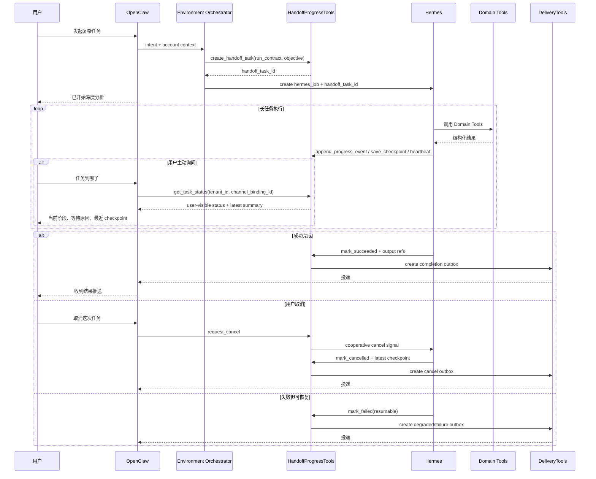
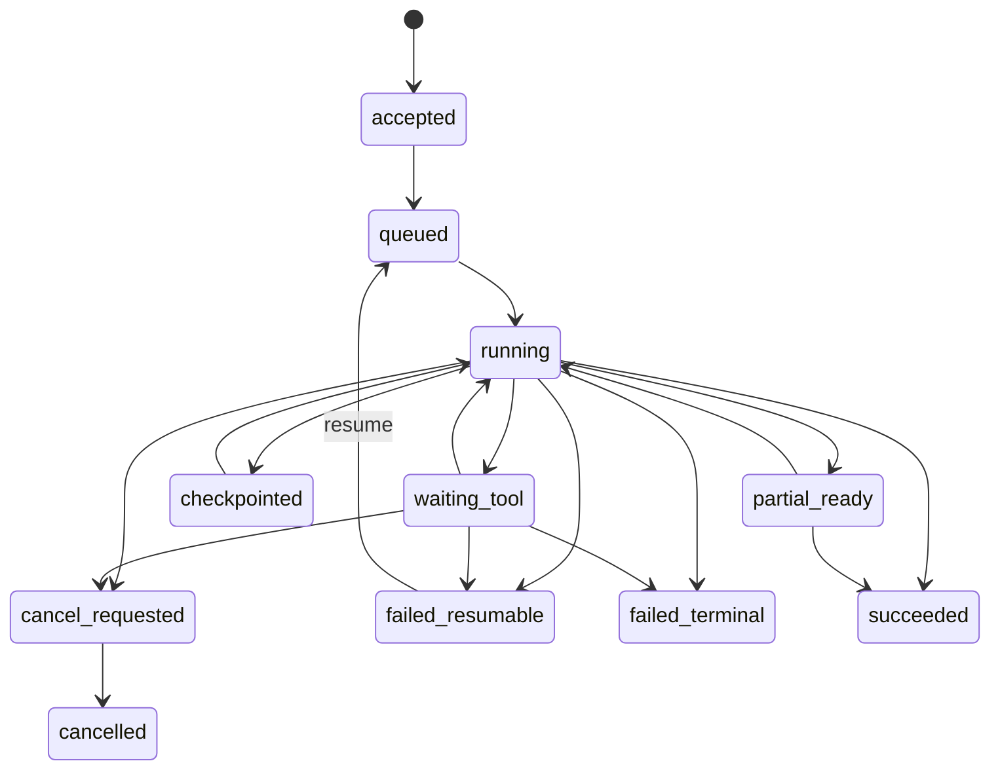

# HandoffProgressTools 设计

## 核心定位

HandoffProgressTools 是 OpenClaw 与 Hermes 之间的控制面能力，不负责做股票、期权或组合分析本身，而负责把“已经 handoff 给 Hermes 的长任务”变成一个**可查询、可解释、可取消、可恢复、可推送**的产品对象。

它解决的不是“任务怎么跑”，而是：

1. 用户把任务交给 Hermes 后，系统如何明确告诉用户“已经开始、做到哪一步了、为什么还没结束”。
2. OpenClaw 如何在不直接介入 Hermes 执行细节的前提下，对长任务提供统一状态查询、取消、恢复和推送闭环。
3. Hermes 如何把 checkpoint、阶段进度、等待原因和最终结果，以结构化方式交回控制面，而不是只留在内部 trace 里。

一句话口径：

> HandoffProgressTools 是 Hermes 长任务的“任务可见性 + 控制权”层，连接 OpenClaw 的用户交互面、Hermes 的执行面和 Delivery 的推送面。

## 设计目标

1. 让用户可以随时问“任务到哪了”，并得到可信、简洁、可操作的回答。
2. 让 OpenClaw 能同步确认 handoff 已成功，并在长任务期间维护用户信任，而不是只说“稍后推送”。
3. 让 Hermes 的长任务具备 checkpoint、取消、恢复和部分结果承接能力。
4. 让任务进度与 `delivery_outbox`、heartbeat、幂等重试兼容，不再额外发明第二套可靠性机制。
5. 让任务状态成为可审计、可运营的数据对象，后续可进入 WebApp 任务中心和 Ops 视图。

## 非目标

1. 不负责 Hermes 内部的推理编排、工具选择和模型决策。
2. 不替代 `SchedulerTools`、`DeliveryTools` 或 durable job runtime。
3. 不负责业务结果是否正确，结果正确性仍由 Domain Tools、Data Quality Gate、RiskReviewTools 负责。
4. 不把所有 tool call 细节直接暴露给用户，用户只看“阶段”和“解释”，不是看底层 trace。

## 为什么 3.0 要补这层

现有 3.0 设计里已经有三个前提：

1. `11-domain-tools-layer.md` 已把 HandoffProgressTools 定义为控制面能力，职责是 `progress event`、`checkpoint`、`cancel/resume`。
2. `12-openclaw-hermes-agent-runtime.md` 已经明确 Hermes 承担复杂长任务，并且 `hermes_jobs` 已有 `status` 和 `checkpoint_ref`。
3. `06-cron-and-interaction-reliability.md` 已经有 outbox、heartbeat、重试和补偿机制，说明“任务完成后再推送”不是难点，难点是“任务进行中如何让用户有控制感”。

如果没有 HandoffProgressTools，OpenClaw 与 Hermes 的 handoff 只有“开始”和“结束”两个点，中间没有统一产品对象，直接后果是：

1. 用户问“到哪了”时，OpenClaw 只能给模板话术，无法回答真实状态。
2. Hermes 内部即使有 checkpoint，也缺一个用户可见的恢复入口。
3. Delivery 只能推最终结果，无法区分“还在跑”“卡在数据源”“已取消”“可恢复失败”。
4. 任务恢复只能走工程手工补偿，不能成为正式产品能力。

## 用户体验原则

1. 不伪造进度。没有真实阶段或 heartbeat 时，不显示精确百分比。
2. 不刷屏。进度更新默认以查询为主、推送为辅，不把每个 tool step 都推给用户。
3. 可取消比可恢复优先。P0 先保证用户能停掉长任务，再做精细恢复。
4. 解释要面向用户。用户看到的是“正在拉取期权链并检查现金保证金”，不是“tool call #17 timeout”。
5. 恢复必须安全。恢复不能扩大 `run contract`、不能越权、不能忽略数据过期。

## 端到端流程



## 产品能力拆解

| 能力 | 用户感知 | 控制面职责 | 归属边界 |
| --- | --- | --- | --- |
| 启动确认 | “已开始分析，预计 3-8 分钟” | 创建 task、生成首条 progress event | OpenClaw 发起，Hermes 执行 |
| 任务状态查询 | “当前在第 3 步：检查期权链与现金保证金” | 聚合最新阶段、checkpoint、heartbeat、等待原因 | OpenClaw 查询，HandoffProgressTools 回答 |
| 取消任务 | “已取消，保留到最近 checkpoint” | 记录 cancel request、驱动协作取消 | OpenClaw 控制，Hermes 落实 |
| 恢复任务 | “从数据检查后继续”或“需重跑” | 校验 checkpoint、数据时效、权限范围 | HandoffProgressTools 决策，Hermes 重启 |
| 长任务推送 | 完成、失败、长时间等待、部分结果 | 决定什么值得推、何时进入 outbox | HandoffProgressTools 决策，Delivery 发消息 |
| Ops 可观测性 | 管理后台可看任务卡住原因 | 暴露状态、事件流、恢复点 | 不直接面向用户 |

## 用户可见交互设计

## 启动确认

当任务从 OpenClaw handoff 到 Hermes 后，OpenClaw 不能只说“稍后推送”，而应该带最小控制信息：

1. 任务标题，例如“英伟达深度研究”或“下周 sell put 候选筛选”。
2. 任务编号或简短引用，例如“任务 #H-240509-01”。
3. 当前状态：`已接收` 或 `排队中`。
4. 预计更新方式：完成后推送，或你也可以随时问“任务到哪了”。

建议回复模板：

> 已开始为你做“英伟达深度研究”。当前状态：已进入 Hermes 分析队列。完成后会推送给你；中途你也可以直接问“任务到哪了”。

## 用户查询“任务到哪了”

P0 先支持最近一个活跃任务的自然语言查询：

1. OpenClaw 根据 `tenant_id + channel_binding_id` 查最近活跃的 `handoff_task`。
2. 如果只有一个活跃任务，直接返回状态。
3. 如果有多个活跃任务，先返回任务列表，让用户点名或选择。
4. 如果没有活跃任务，明确回答“当前没有进行中的深度任务”，而不是复用旧结果。

状态回复最少包含：

1. 任务名称。
2. 当前阶段。
3. 最近一次进度更新时间。
4. 是否在等待外部数据/工具。
5. 是否已有 checkpoint。
6. 下一步动作或预计下一次更新方式。

建议回复模板：

> “下周 sell put 候选筛选”目前进行到第 3/5 阶段：正在拉取期权链并检查现金保证金。最近一次进度更新时间是 14:32，已保存一个可恢复 checkpoint。如果行情源长时间无响应，我会改为先给你可用部分并说明缺失。

## 长任务推送策略

进度不应每一步都推送，默认只推以下节点：

1. 启动确认：同步回复，不进入独立推送。
2. 长时间等待：例如进入 `waiting_tool` 超过 2 分钟，可推一条“仍在处理中，正在等待行情/券商数据”。
3. 部分结果可见：例如深研已完成行业、财报和估值，但新闻补充仍在跑，可推“先看摘要，完整版稍后补齐”。
4. 完成：必须推。
5. 失败：必须推，且给出是否可恢复。
6. 取消：必须推，且说明是否保留 checkpoint。

推送原则：

1. 所有推送仍走 `delivery_outbox`，不允许 Hermes 直接触达用户。
2. 进度推送也要带 `tenant_id/channel_binding_id/openclaw_account_id/content_hash/idempotency_key`。
3. quiet hours 内默认不推一般进度，但完成、失败、用户主动触发的取消确认可以按策略放行。

## 状态模型

HandoffProgressTools 需要同时维护两套状态：

1. **运行态**：给系统、Ops 和恢复逻辑看。
2. **用户可见态**：给 OpenClaw 解释“现在是什么情况”。

### 运行态

建议 `handoff_tasks.status`：

| 状态 | 含义 |
| --- | --- |
| `accepted` | OpenClaw 已创建 handoff task，但 Hermes job 还未建好 |
| `queued` | 已入队，等待 Hermes worker |
| `running` | Hermes 正常执行中 |
| `waiting_tool` | 卡在外部数据源、券商、模型或工具调用 |
| `checkpointed` | 刚写入新的 checkpoint，可继续运行 |
| `partial_ready` | 已有可推送的阶段性结果 |
| `cancel_requested` | 用户或系统已请求取消，等待 Hermes 协作退出 |
| `cancelled` | 任务已停止 |
| `failed_resumable` | 失败，但保留了可恢复 checkpoint |
| `failed_terminal` | 失败，且不能恢复 |
| `succeeded` | 任务完成并产出结果 |

### 用户可见态

建议 `handoff_tasks.user_visible_status`：

| 状态 | 说明 |
| --- | --- |
| `已接收` | 已进入系统，准备交给 Hermes |
| `排队中` | 前面仍有任务，尚未开始 |
| `分析中` | Hermes 正在跑 |
| `等待数据` | 当前被行情、券商、模型或外部工具阻塞 |
| `已有阶段结果` | 已能先看部分内容 |
| `已取消` | 用户取消成功 |
| `可恢复失败` | 任务失败，但可以继续 |
| `失败` | 任务失败且需重新发起 |
| `已完成` | 已完成并已推送或可查看 |

### 统一状态机



补充规则：

1. `checkpointed` 更像事件型状态，允许停留很短，但必须可审计。
2. `partial_ready` 不代表任务结束，只代表可以发阶段性结果。
3. `cancel_requested` 是协作取消，不要求强杀 Hermes 原子步骤。
4. 只有 `failed_resumable` 才允许进入 resume 流。

## Checkpoint 设计

checkpoint 不是为了“技术上能断点续跑”而已，而是为了给产品层三个能力：

1. 用户取消后不白跑。
2. 用户失败后可恢复，而不是只能重来。
3. 用户查询状态时，OpenClaw 能回答“已经完成到哪一段”。

### Checkpoint 类型

| 类型 | 何时写入 | 作用 |
| --- | --- | --- |
| `stage_checkpoint` | 完成一个用户可理解阶段后 | 支持“做到哪了”解释 |
| `data_checkpoint` | 完成昂贵但可复用的数据抓取后 | 支持恢复时少拉一次重数据 |
| `artifact_checkpoint` | 形成可读摘要、提纲、部分报告后 | 支持部分结果推送 |
| `resume_checkpoint` | 在可安全恢复的边界显式落点 | 支持真正 resume |

### 建议阶段粒度

对 Hermes 深研/策略任务，建议 checkpoint 按“用户能理解”的阶段打，而不是按每个 tool call 打：

1. 任务初始化与数据范围确认。
2. 市场与基本面数据收集。
3. 券商/持仓/现金保证金核验。
4. 纪律规则与风险检查。
5. 报告生成与结果整形。
6. 推送前封装。

### 恢复规则

checkpoint 必须带“是否可安全复用”的判断，建议字段为 `data_reuse_level`：

| 值 | 含义 |
| --- | --- |
| `safe_reuse` | 可直接基于 checkpoint 继续 |
| `refresh_before_resume` | 可以保留中间产物，但恢复前必须重新拉取关键数据 |
| `rerun_only` | 只能作为审计记录，不能恢复 |

关键规则：

1. 涉及实时行情、期权链、现金保证金的 checkpoint，默认不是永久可复用。
2. 恢复不能扩大原始 `run contract` 的 `allowed_tools`、`data_scope` 或 `memory_scope`。
3. 如果用户恢复时数据已过 freshness gate，系统应明确告诉用户“将基于已有阶段产物重新校验关键数据后继续”，而不是静默继续旧结论。

## 取消与恢复

## 取消

取消是 P0 必须支持的能力，但必须是**协作取消**：

1. OpenClaw 记录 `cancel` 控制动作，并立即给用户确认“已收到取消请求”。
2. Hermes 在阶段边界、tool call 返回后或安全中断点消费取消信号。
3. 正在执行不可中断写入或外部调用时，不要求强制中断；但要在完成当前原子步骤后尽快退出。
4. 退出时必须写最后一条 progress event，并标记是否保留 checkpoint。

这意味着产品文案不能承诺“立即停止”，而应承诺“停止继续分析，并保留当前可恢复位置”。

## 恢复

恢复是 P1 的重点能力，默认来自两类入口：

1. 用户主动说“继续刚才的深研”。
2. 系统在可恢复失败后提示“是否从上次 checkpoint 继续”。

恢复前必须做三层校验：

1. **权限校验**：当前账号、channel binding、run contract 是否仍匹配。
2. **数据校验**：checkpoint 是否过期，关键数据是否需刷新。
3. **策略校验**：原始任务是否仍然成立，例如 sell put 恢复时是否已经跨到新的市场日。

恢复的三个结果：

1. `resume_in_place`：直接从 checkpoint 继续。
2. `resume_with_refresh`：保留中间产物，但关键数据重拉后继续。
3. `restart_required`：checkpoint 仅可审计，不可恢复，需重新发起任务。

## “任务到哪了”查询协议

建议 HandoffProgressTools 提供一个面向 OpenClaw 的聚合接口：

```json
{
  "handoff_task_id": "uuid",
  "task_title": "英伟达深度研究",
  "status": "running",
  "user_visible_status": "分析中",
  "current_stage": "财报与估值数据收集",
  "stage_index": 2,
  "stage_total": 5,
  "progress_percent": 40,
  "latest_summary": "已完成持仓上下文和价格区间确认，正在补齐近四季财报与估值对比。",
  "waiting_reason": null,
  "latest_checkpoint_at": "2026-05-09T14:32:10Z",
  "last_heartbeat_at": "2026-05-09T14:33:02Z",
  "resume_capability": "available | needs_refresh | none",
  "push_mode": "completion_only | progress_on_block | partial_allowed"
}
```

OpenClaw 不需要知道 Hermes 内部所有步骤，只要有一份稳定的“用户版摘要”即可。

查询优先级：

1. 先查 `handoff_tasks` 当前态。
2. 再拿最新一条 `handoff_progress_events`。
3. 如果进度事件滞后，则回退到 `hermes_jobs.status + last_heartbeat_at + latest_checkpoint_id` 生成粗粒度回答。

## 数据模型

`hermes_jobs` 仍是执行态主表，HandoffProgressTools 不替代它，而是在其上增加**用户可见的 handoff 任务层**。

### `handoff_tasks`

```sql
handoff_tasks (
  id uuid primary key,
  tenant_id uuid not null,
  channel_binding_id uuid not null,
  openclaw_account_id text not null,
  source_run_id uuid not null,
  hermes_job_id uuid not null,
  task_type text not null, -- deep_research, sell_put_scan, portfolio_review, discipline_review
  task_title text not null,
  user_prompt text,
  status text not null,
  user_visible_status text not null,
  current_stage text,
  stage_index int,
  stage_total int,
  progress_percent int,
  waiting_reason text,
  latest_summary text,
  latest_checkpoint_id uuid,
  last_heartbeat_at timestamptz,
  resume_capability text not null default 'none', -- available, needs_refresh, none
  push_mode text not null default 'completion_only',
  degradation_code text,
  idempotency_key text not null,
  created_at timestamptz not null,
  started_at timestamptz,
  finished_at timestamptz,
  cancelled_at timestamptz
);
```

字段说明：

1. `handoff_tasks` 是用户和 OpenClaw 查询的主对象。
2. `hermes_job_id` 保持与执行态一一对应，避免出现“用户态任务”和“真实 Hermes 任务”漂移。
3. `degradation_code` 用于表达“等待数据源”“Heartbeat 过期”“Resume 需刷新”等降级原因。

### `handoff_progress_events`

```sql
handoff_progress_events (
  id uuid primary key,
  handoff_task_id uuid not null references handoff_tasks(id),
  seq_no bigint not null,
  event_type text not null, -- accepted, queued, stage_started, stage_completed, waiting, checkpoint_saved, partial_ready, cancel_requested, cancelled, resumed, failed, succeeded
  status_after text not null,
  user_visible_status text not null,
  stage_key text,
  stage_label text,
  progress_percent int,
  summary text,
  detail jsonb not null default '{}',
  source_refs jsonb not null default '[]',
  created_at timestamptz not null,
  unique (handoff_task_id, seq_no)
);
```

用途：

1. 形成 append-only 事件流，便于审计、回放和状态重建。
2. 给用户查询提供最新“解释句子”。
3. 给 Ops 判断任务为什么卡住、是卡在工具还是模型还是 delivery。

### `handoff_checkpoints`

```sql
handoff_checkpoints (
  id uuid primary key,
  handoff_task_id uuid not null references handoff_tasks(id),
  checkpoint_type text not null, -- stage_checkpoint, data_checkpoint, artifact_checkpoint, resume_checkpoint
  stage_key text,
  stage_label text,
  resume_token text,
  data_reuse_level text not null, -- safe_reuse, refresh_before_resume, rerun_only
  input_refs jsonb not null default '[]',
  artifact_refs jsonb not null default '[]',
  freshness_deadline timestamptz,
  created_at timestamptz not null
);
```

用途：

1. 为恢复提供正式锚点，而不是把 `checkpoint_ref` 只做成 Hermes 内部字符串。
2. 为用户说明“已经完成到哪一步”提供证据。
3. 为部分结果推送提供 artifact 引用。

### `handoff_control_actions`

```sql
handoff_control_actions (
  id uuid primary key,
  handoff_task_id uuid not null references handoff_tasks(id),
  action_type text not null, -- cancel, resume, mute_push, retry_push
  requested_by text not null, -- user, system, ops
  request_channel text not null, -- wechat, webapp, ops_console
  target_checkpoint_id uuid,
  status text not null, -- pending, accepted, applied, rejected, expired
  reason text,
  created_at timestamptz not null,
  applied_at timestamptz
);
```

用途：

1. 让取消/恢复成为正式审计动作。
2. 支持后续 WebApp 任务中心和 Ops 批量处理。

## 事件与推送边界

HandoffProgressTools 只决定“是否值得通知用户”，不直接发送消息。

职责边界：

1. Hermes：产出进度事件、checkpoint、结果引用。
2. HandoffProgressTools：聚合任务状态，判断是否生成用户通知。
3. DeliveryTools：把通知写入 outbox、重试、去重、校验投递目标。
4. OpenClaw：对外显示和解释。

这样可以保持与 `06-cron-and-interaction-reliability.md` 一致：

1. 推送可靠性继续靠 outbox 和 idempotency。
2. progress event 只是状态源，不是消息通道。
3. 即使 Delivery 失败，任务状态查询仍然可用。

## P0 / P1

## P0 上线必须有

1. Handoff task 正式建模，至少有 `handoff_tasks` 和 `handoff_progress_events`。
2. OpenClaw 发起 handoff 后同步返回启动确认。
3. 用户可以查询最近一个活跃 Hermes 任务的状态。
4. Hermes 可以写阶段进度、等待原因和最新 summary。
5. Hermes 可以写至少一种 `resume_checkpoint`。
6. 用户可以请求取消，系统能协作取消并保留最近 checkpoint。
7. 完成、失败、取消三类结果可进入 outbox 推送。
8. progress 查询与推送都受 `tenant_id + channel_binding_id + openclaw_account_id` 约束，不能跨账号串线。
9. 如果 progress event 缺失，可从 `hermes_jobs` 和 heartbeat 回退生成粗粒度状态。

## P1 首个可用版本补齐

1. 从 checkpoint 正式恢复，而不只是失败后重跑。
2. 支持“部分结果先推、完整版稍后补齐”。
3. 支持多个并行任务的任务列表与选择。
4. 支持更稳定的 ETA/剩余步骤预测。
5. 支持 WebApp 任务中心和 Ops 管理台视图。
6. 支持细粒度 push policy，例如仅完成时推送、长等待时推送、允许部分结果推送。
7. 支持恢复前自动 freshness 校验和 `resume_with_refresh`。
8. 支持 stuck task 自动诊断，例如 heartbeat 超时、等待工具过久、checkpoint 长时间不推进。

## 失败模式与降级

| 失败模式 | 用户侧表现 | 控制面降级策略 |
| --- | --- | --- |
| Hermes 正在跑，但 progress event 暂时没写入 | 用户问状态时看到“分析中，但最近进度未更新” | 回退到 `hermes_jobs.status + last_heartbeat_at`，不伪造百分比 |
| Hermes heartbeat 过期 | 用户看到“任务仍在处理中，但执行状态暂未确认” | 标记 `degradation_code=stale_heartbeat`，允许取消或等待 |
| 外部行情/券商工具长时间等待 | 用户看到“正在等待数据源” | 转入 `waiting_tool`，必要时触发一条延迟解释推送 |
| progress event 丢失但 checkpoint 还在 | 用户仍可知道最近完成到哪一段 | 用最新 checkpoint 重建阶段状态 |
| 任务失败但 checkpoint 可恢复 | 用户收到“任务中断，可从上次进度继续” | 标记 `failed_resumable`，开放 resume 入口 |
| 任务失败且 checkpoint 不可用 | 用户收到“任务失败，需要重新开始” | 标记 `failed_terminal`，不提供伪恢复 |
| 用户发起取消时任务在原子工具调用中 | 用户会收到“已收到取消请求，当前步骤完成后停止” | 采用协作取消，不强杀写入步骤 |
| Delivery 推送失败 | 用户暂时没收到消息，但主动询问仍可查到状态 | 继续走 outbox 重试，任务状态不回退 |
| 同一账号有多个活跃任务 | 用户问“到哪了”时可能歧义 | 先返回任务列表，不默认猜测 |
| 恢复时关键数据已过期 | 用户被告知“将先刷新关键数据再继续” | 走 `resume_with_refresh`，而不是继续旧结论 |

## 与现有 3.0 设计的边界关系

HandoffProgressTools 与其他模块的边界必须明确：

1. 它不是 `SchedulerTools`：不负责决定何时触发任务，只负责任务 handoff 后的可见性。
2. 它不是 `DeliveryTools`：不负责真正发消息，只负责生成“该不该通知”的状态与事件。
3. 它不是 `Hermes Runtime`：不负责分析执行，只接收 Hermes 的结构化进度上报。
4. 它不是 `RiskReviewTools`：不判断金融建议能不能行动，只负责说明任务进度和结果生命周期。
5. 它不替代 `hermes_jobs`：`hermes_jobs` 是执行主表，HandoffProgressTools 是用户可见投影层。

## 推荐结论

1. 把 Hermes 长任务抽象成正式的 `handoff_task`，而不是只靠 `hermes_jobs.status` 支撑用户体验。
2. P0 先保证“可查询 + 可取消 + 可完成推送 + 粗恢复锚点”，不要一上来追求精细 ETA。
3. checkpoint 要按“用户可理解阶段”打点，而不是按内部 tool step 打点。
4. 取消必须做成协作取消；恢复必须受数据 freshness 和 run contract 约束。
5. progress event 是状态源，不是消息源；所有用户通知仍应走 outbox。
6. 查询“任务到哪了”应成为 OpenClaw 的基础能力，而不是 Hermes 的内部调试接口。

