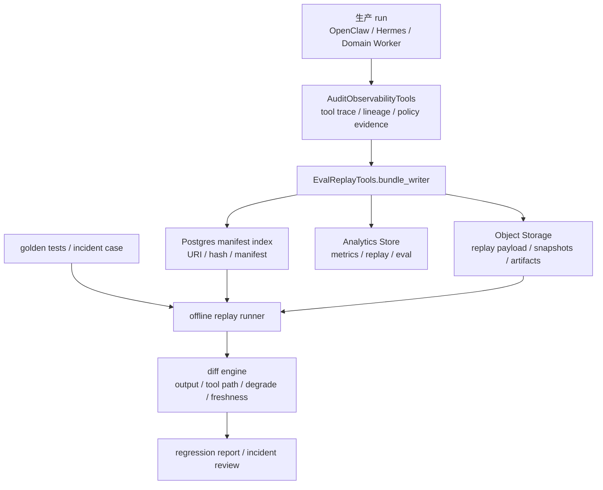
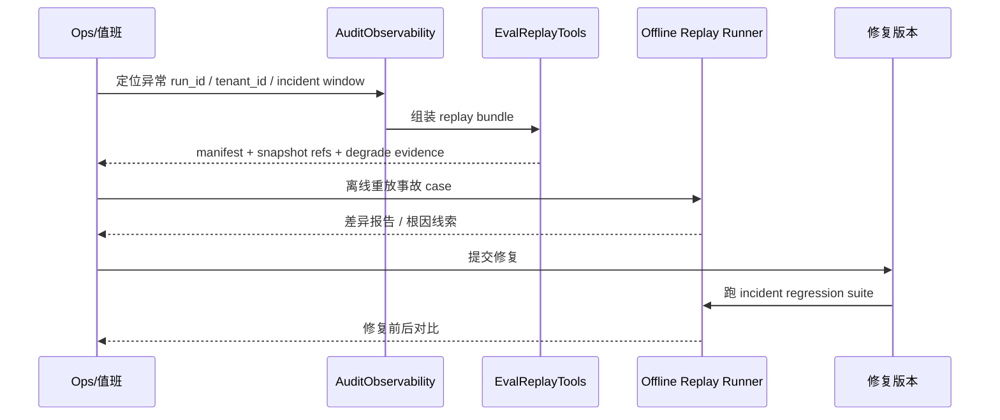

# EvalReplayTools 设计

## 定位

`EvalReplayTools` 是 AI 持仓投资分析系统 3.0 的控制面能力之一，用来把一次 agent run 变成**可重放、可对比、可复盘、可回归验证**的结构化对象。

它不负责做股票、期权或组合分析本身，而负责回答五个控制面问题：

1. 某次结论当时到底用了哪些输入数据、哪些工具结果、哪些策略配置。
2. 当时数据是否新鲜、是否走了 fallback、为什么允许调用这些工具、为什么发生降级。
3. 出事故后，能不能把当时现场重新拼出来，而不是依赖零散日志猜测。
4. 新版本上线前，能不能用一组 golden tests 和回归测试确认关键行为没有漂移。
5. 在保存 replay 证据的同时，如何守住租户边界、PII/token 脱敏和券商敏感信息最小可见。

一句话口径：

> EvalReplayTools 是 run 级证据包、离线回放和评测回归层，不是生产执行器，也不是投研分析能力本身。

## 设计目标

1. 让每次高价值 run 都能沉淀为 replay bundle，而不是只留下零散 trace。
2. 让控制面可以稳定回答“用了哪些数据、数据是否新鲜、是否 fallback、谁调了哪些工具、为什么允许、为什么降级”。
3. 让上线前评测、事故复盘、回归测试共享同一份证据模型，不再各自造格式。
4. 让 replay payload 外置对象存储，Postgres 只保存 URI、hash、manifest 和检索索引。
5. 让 golden tests 与生产 incident case 共用离线 replay 入口，减少“测的是一套、线上跑的是另一套”。
6. 让 replay 默认带脱敏和租户隔离，不把审计能力变成新的数据泄露面。

## 非目标

1. 不替代 `Tool Contract Registry`、`Agent Capability Matrix`、`HandoffProgressTools`、`DegradationPolicyTools` 或 `AuditObservabilityTools`。
2. 不直接执行真实券商写入、真实下单、真实推送，也不允许 replay 触发副作用。
3. 不把 replay 结果当成当前真实世界结果，尤其不能把离线 replay 误当成生产时点的实时执行。
4. 不负责定义工具权限本身；权限定义和放行仍由上游控制面能力负责。
5. 不做通用 BI 平台；它聚焦 run replay、评测和事故复盘闭环。

## 为什么 3.0 必须补齐

现有 3.0 设计已经给出了明确上游约束：

1. `11-domain-tools-layer.md` 已把 `EvalReplayTools` 定义为控制面能力，建议组件就是 `replay bundle`、`golden tests`、`tool result snapshots`。
2. `13-architecture-hardening.md` 已要求 replay/observability 必须能回答：用了哪些数据、是否新鲜/fallback、谁调了哪些工具、为什么允许/为什么降级；并要求 tool call 带 `tool_policy_hash`。
3. `14-growth-and-scale-readiness.md` 已要求 replay payload 外置对象存储，Postgres 只存 `URI/hash/manifest`，并由 Analytics store 承担 `metrics/replay/eval`。

如果没有 `EvalReplayTools`，3.0 会有四个直接问题：

1. 出事故时只能翻日志，不能还原完整现场。
2. Hermes 或 tool policy 变更后，很难判断是能力提升还是行为漂移。
3. golden tests 会停留在 prompt 级或文本级比对，无法覆盖工具输入、快照、降级原因和数据新鲜度。
4. 数据量增长后，trace、artifact、payload 会散落在 Postgres、日志和对象存储里，没有统一证据包。

## 与其他控制面能力的边界

| 能力 | 它负责什么 | `EvalReplayTools` 的边界 |
| --- | --- | --- |
| `Tool Contract Registry` | 定义工具 schema、版本、风险、必经 gate | 读取其版本与契约快照进入 bundle，但不定义契约 |
| `Agent Capability Matrix` | 定义 role 可以调用什么、最大 write scope、runtime gate | 记录当时命中的 matrix 版本和 role 决策，不做权限裁决 |
| `HandoffProgressTools` | 长任务的状态、checkpoint、取消、恢复、用户可见进度 | 可消费其 checkpoint 和阶段事件做 replay，不管理任务进度本身 |
| `DegradationPolicyTools` | 定义故障时该如何降级和给什么安全模板 | replay 只记录当时命中的降级策略、理由和结果 |
| `AuditObservabilityTools` | 采集 tool trace、lineage、审计事件、指标 | replay 基于这些基础事件组装证据包，但不是底层采集器 |

边界原则：

1. `EvalReplayTools` 是证据包与离线重放层，不是实时决策入口。
2. 它可以解释“当时为什么允许/为什么降级”，但解释依据来自上游事实源，而不是自己发明规则。
3. 它必须尊重 `tenant_id` 和最小可见原则，默认不暴露原始敏感 payload。

## 核心对象

| 对象 | 作用 | 说明 |
| --- | --- | --- |
| `replay_bundle` | 一次 run 的完整证据包 | 包含 run contract、tool calls、snapshots、policy refs、outputs、redaction meta |
| `replay_manifest` | 轻量索引和内容清单 | 放在 Postgres 和 Analytics store，指向对象存储中的大 payload |
| `tool_result_snapshot` | 工具结果快照 | 用于离线 replay、golden tests 和事故复盘，避免每次重打外部源 |
| `golden_test_case` | 受控样本 | 代表关键产品场景、关键策略和关键事故的基准输入 |
| `regression_run` | 某次版本回归评测结果 | 记录被测版本、命中用例、通过率、差异摘要 |
| `incident_review_case` | 事故复盘对象 | 绑定事故编号、影响范围、根因、修复版本和回归结果 |

## 生产 replay 与离线 replay

### 生产 replay

生产 replay 指的是：对真实生产 run 生成证据包，保留当时上下文、工具结果快照和策略证据，但**不重新触发真实副作用**。

用途：

1. 审计与合规。
2. 事故复盘。
3. 关键用户争议排查。
4. 线上行为抽样评测。

### 离线 replay

离线 replay 指的是：在测试、预发或离线评测环境中，使用 replay bundle 或 golden test case 重放 agent 逻辑，验证模型、模板、tool policy 或降级逻辑是否漂移。

用途：

1. golden tests。
2. 回归测试。
3. 新版本比较。
4. 修复后验证。

### 硬规则

1. 离线 replay 不得调用真实 broker 写入、真实推送、真实收费数据源写路径。
2. 即使允许在线读取类对照，也必须显式标记 `live_probe=false` 或进入隔离沙箱。
3. replay 结果必须标记为 `replayed`，不能回写成真实事实，也不能驱动下游行动。
4. 产品文案必须明确：**replay 只用于复盘和验证，不代表当前实时世界状态**。

## 端到端流程



流程拆解：

1. 生产 run 结束或进入关键 checkpoint 时，底层审计与 trace 事件被持续采集。
2. `EvalReplayTools` 按 run 粒度组装 replay bundle，并对大 payload 做脱敏和对象存储落盘。
3. Postgres 只保存轻量 manifest、hash、索引字段和检索条件。
4. Analytics store 保存评测结果、差异摘要、通过率和事故统计。
5. 离线 replay runner 读取 bundle 或 golden case，在无副作用模式下重放，并输出 diff。

## 产品能力拆解

| 能力 | 用户/运营感知 | 控制面职责 |
| --- | --- | --- |
| agent run replay | 能解释一次回答/建议当时怎么来的 | 组装 run contract、tool path、policy refs、snapshots、final output |
| tool result snapshots | 不依赖外部源也能复盘 | 固定工具结果、保留 freshness/fallback/source_tier 元数据 |
| golden tests | 上线前知道关键场景有没有漂移 | 管理标准样本、预期行为、容忍阈值 |
| 回归测试 | 修复后知道有没有引入新问题 | 按版本批量回放并比较结果 |
| 事故复盘 | 能从事故到修复形成闭环 | 保存 incident case、根因、修复前后 replay 对比 |
| 隐私脱敏 | 既能复盘又不泄露敏感信息 | tenant 边界、PII/token redaction、券商敏感字段脱敏、最小可见 |

## 数据包与 Manifest 结构

### 设计原则

1. 大对象外置：原始 replay payload、tool snapshots、长文本 artifact、截图等放对象存储。
2. 清单内聚：Postgres 只存检索所需字段和内容摘要。
3. 可校验：所有核心对象都带 `sha256` 或等价 hash。
4. 可解释：manifest 直接能回答“当时用了什么、为什么允许、为什么降级”。

### Replay Bundle 示例

```json
{
  "bundle_version": "v1",
  "bundle_id": "rb_20260509_01",
  "run_id": "run_01",
  "tenant_id": "tenant_redacted",
  "runtime": "hermes",
  "trigger": "wechat_message",
  "generated_at": "2026-05-09T08:30:00Z",
  "mode": "production_capture",
  "run_contract": {
    "intent": "options_sell_put_scan",
    "risk_level": "high",
    "tool_policy_version": "v3",
    "tool_policy_hash": "sha256:tp_123",
    "capability_matrix_version": "v2",
    "session_space": "portfolio",
    "data_scope": {
      "portfolio_view_id": "pv_001",
      "broker_connection_ids": ["bc_redacted_1"]
    }
  },
  "policy_refs": {
    "tool_contract_registry_version": "2026-05-09.1",
    "degradation_policy_version": "2026-05-09.2",
    "risk_review_policy_version": "2026-05-09.1"
  },
  "inputs": {
    "user_prompt_redacted": "帮我看下周 sell put 候选",
    "account_context_ref": "obj://replay/run_01/account_context.json",
    "market_clock": {
      "as_of": "2026-05-09T08:29:41Z",
      "market_session": "pre_open"
    }
  },
  "tool_calls": [
    {
      "seq": 1,
      "agent_role": "options_sell_put_agent",
      "tool_name": "broker.cash_margin.read",
      "tool_version": "1.2.0",
      "tool_policy_hash": "sha256:tp_123",
      "input_hash": "sha256:in_001",
      "result_hash": "sha256:out_001",
      "snapshot_ref": "obj://replay/run_01/tool_snapshots/1.json",
      "freshness_seconds": 12,
      "source_tier": "L1",
      "used_fallback": false,
      "allowed_reason": "capability_matrix_allow + tool_contract_active",
      "degrade_reason": null
    },
    {
      "seq": 2,
      "agent_role": "options_sell_put_agent",
      "tool_name": "options.chain.read",
      "tool_version": "2.0.1",
      "tool_policy_hash": "sha256:tp_123",
      "input_hash": "sha256:in_002",
      "result_hash": "sha256:out_002",
      "snapshot_ref": "obj://replay/run_01/tool_snapshots/2.json",
      "freshness_seconds": 48,
      "source_tier": "L2",
      "used_fallback": true,
      "allowed_reason": "cost_reserved + data_gate_pass_with_analysis_only",
      "degrade_reason": "primary_option_feed_timeout"
    }
  ],
  "decision": {
    "actionability_level": "analysis_only",
    "degradation_applied": true,
    "degradation_policy_key": "options_high_risk_fallback",
    "why_degraded": "option chain fallback + margin freshness insufficient"
  },
  "outputs": {
    "final_response_ref": "obj://replay/run_01/final_response.json",
    "artifact_refs": [
      "obj://replay/run_01/report.md"
    ]
  },
  "redaction": {
    "profile": "prod_strict_v1",
    "pii_redacted": true,
    "broker_secret_redacted": true,
    "token_redacted": true
  }
}
```

### Manifest 示例

```json
{
  "manifest_version": "v1",
  "bundle_id": "rb_20260509_01",
  "run_id": "run_01",
  "tenant_id": "tenant_redacted",
  "runtime": "hermes",
  "intent": "options_sell_put_scan",
  "agent_roles": ["options_sell_put_agent"],
  "tool_names": [
    "broker.cash_margin.read",
    "options.chain.read"
  ],
  "tool_policy_hashes": [
    "sha256:tp_123"
  ],
  "data_freshness_summary": {
    "max_freshness_seconds": 48,
    "has_fallback": true,
    "fallback_count": 1
  },
  "degradation_summary": {
    "degraded": true,
    "policy_key": "options_high_risk_fallback"
  },
  "storage": {
    "bundle_uri": "obj://replay/run_01/bundle.json",
    "manifest_hash": "sha256:manifest_001",
    "payload_hash": "sha256:bundle_001"
  },
  "incident_tags": [],
  "golden_candidate": true,
  "created_at": "2026-05-09T08:30:00Z"
}
```

### Tool Result Snapshot 最小字段

| 字段 | 作用 |
| --- | --- |
| `tool_name` / `tool_version` | 对齐工具契约版本 |
| `input_hash` / `result_hash` | 保证可比对和防篡改 |
| `snapshot_ref` | 指向对象存储中的快照文件 |
| `source_tier` | 记录主源还是 fallback |
| `as_of` / `freshness_seconds` | 记录时点与新鲜度 |
| `lineage_refs` | 记录上游数据引用 |
| `tool_policy_hash` | 回答“当时为什么允许” |
| `degrade_reason` | 回答“为什么降级” |

## 存储与表结构建议

`EvalReplayTools` 不应把大 payload 塞进 Postgres。推荐结构是：

1. Postgres 存 replay manifest 和关系索引。
2. Object Storage 存 bundle、tool snapshots、artifact 和脱敏后的原始输入输出。
3. Analytics Store 存回放结果、diff 指标、通过率、事故标签和趋势统计。

建议表：

```sql
create table eval_replay_manifests (
  id uuid primary key,
  bundle_id text not null unique,
  run_id uuid not null,
  tenant_id uuid not null,
  runtime text not null, -- openclaw, hermes, domain_worker
  intent text not null,
  manifest_version text not null,
  tool_policy_hashes jsonb not null default '[]',
  tool_names jsonb not null default '[]',
  agent_roles jsonb not null default '[]',
  degraded boolean not null default false,
  degradation_policy_key text,
  has_fallback boolean not null default false,
  max_freshness_seconds integer,
  bundle_uri text not null,
  payload_hash text not null,
  manifest_hash text not null,
  redaction_profile text not null,
  incident_id text,
  golden_candidate boolean not null default false,
  created_at timestamptz not null default now()
);

create index idx_eval_replay_manifests_tenant_created
  on eval_replay_manifests (tenant_id, created_at desc);

create index idx_eval_replay_manifests_run_id
  on eval_replay_manifests (run_id);

create table golden_test_cases (
  id uuid primary key,
  case_key text not null unique,
  scenario text not null,
  risk_level text not null,
  source_bundle_id text,
  input_manifest_uri text not null,
  expected_contract jsonb not null,
  tolerance_policy jsonb not null,
  status text not null, -- draft, active, deprecated
  created_at timestamptz not null default now(),
  updated_at timestamptz not null default now()
);

create table regression_runs (
  id uuid primary key,
  suite_key text not null,
  target_version text not null,
  baseline_version text,
  case_count integer not null,
  pass_count integer not null,
  fail_count integer not null,
  diff_summary jsonb not null,
  report_uri text not null,
  created_at timestamptz not null default now()
);
```

补充说明：

1. `eval_replay_manifests` 只保留轻量索引，不存大块原文。
2. `golden_test_cases.expected_contract` 应优先描述结构化预期，不要只做全文字符串匹配。
3. `regression_runs` 可以同时把结果摘要写入 Analytics store，支持趋势分析和看板。

## 隐私脱敏策略

`EvalReplayTools` 是高风险能力，因为它天然会接触 prompt、账户上下文、券商结果和最终结论。必须默认按最严格视角设计。

### 1. tenant 边界

1. 所有 bundle、manifest、snapshot、incident case 都必须带 `tenant_id`。
2. 默认只允许同租户授权范围内查看；Ops 和管理员也应优先看脱敏视图。
3. 跨租户检索必须禁止，除非进入专门的受审计后台场景。

### 2. PII / token redaction

必须做 redaction 的字段包括：

1. 用户姓名、手机号、邮箱、微信标识、地址等 PII。
2. broker token、OpenD 凭证、refresh token、cookie、session secret。
3. 第三方 provider API key、签名串和授权 header。
4. 原始截图中可识别账号号段、身份证明、联系信息。

建议规则：

1. 进入对象存储前先做结构化 redaction，而不是展示时再掩码。
2. hash 保留稳定性，但原文必须去除。
3. 脱敏规则版本应进入 bundle 元数据，方便复盘“当时按什么规则脱敏”。

### 3. 券商敏感信息脱敏

券商相关敏感信息包括但不限于：

1. 完整账号号段。
2. 实盘持仓成本细粒度明细。
3. 订单流水号、成交对手方信息、API session 标识。
4. 现金、保证金、购买力的原始敏感字段，如果对复盘不必要，应做范围化或分桶化。

建议：

1. 默认展示 masked account，例如 `****1288`。
2. 能用区间就不用精确值，尤其是在 golden test 和事故共享复盘场景。
3. tool snapshot 若仅需要通过/阻断判断，可保留 `enough_cash=true`、`margin_state=stale` 这类派生字段，而不是整包返回敏感原文。

### 4. 最小可见原则

1. golden tests 优先用派生特征和脱敏样本，不直接复用原始用户 payload。
2. incident 复盘按角色分层查看：产品看决策链，工程看技术证据，合规看审计字段。
3. 默认不把完整 prompt、完整券商快照、完整 delivery 内容同时暴露给同一个查看界面。

## Golden Tests 与回归测试

### Golden Tests 的作用

golden tests 不是为了判断“文案一字不差”，而是为了锁住关键产品行为：

1. 是否调用了应调用的工具。
2. 是否在该降级时降级，而不是冒进输出。
3. 是否正确带出 freshness、fallback 和 actionability 级别。
4. 是否遵守 `tool_policy_hash` 对应的受控行为。

### Golden Case 类型

| 类型 | 代表场景 | 核心断言 |
| --- | --- | --- |
| 正常只读查询 | 持仓、行情、任务状态 | 工具路径稳定、延迟可控、无无关写入 |
| 高风险分析但应降级 | sell put、现金不足、行情 fallback | 输出必须是 `analysis_only` 或 `blocked` |
| 多源冲突 | 券商持仓与手工修正不一致 | 必须说明冲突，不得输出高置信行动建议 |
| 长任务复盘 | Hermes 深研/复盘任务 | checkpoint、阶段事件和最终 artifact 对齐 |
| 历史事故复现 | 已知线上事故 | 新版本必须覆盖根因并回归通过 |

### 回归测试建议

1. 每次 tool policy、prompt policy、degradation policy 或高风险 Domain Tool 变更，都跑对应回归套件。
2. 回归比较应至少覆盖：
   1. 最终 `actionability_level`
   2. 工具调用路径
   3. 是否 fallback
   4. 降级原因
   5. 关键结构化字段，而不是只比自然语言
3. 对允许文案波动的场景，采用结构化断言加容忍阈值，而不是全文相等。

## 事故复盘流程



建议复盘步骤：

1. 先锁定 `run_id`、`tenant_id`、时间窗口和用户可见影响。
2. 从 replay manifest 查看是否有 fallback、数据过期、降级策略命中和 `tool_policy_hash`。
3. 按 tool snapshot 重建决策链，确认是数据问题、权限问题、模板问题还是降级问题。
4. 把该事故沉淀为 `incident_review_case`，并升级成 golden test 或回归样本。
5. 修复完成后，必须跑 incident 回归，避免“修复一次、下次再犯”。

## P0 / P1

### P0 上线前必须有

1. `replay_bundle + replay_manifest` 基础对象模型。
2. 生产 run 自动生成 manifest，且大 payload 外置对象存储。
3. tool call 级 `tool_policy_hash`、`freshness_seconds`、`used_fallback`、`degrade_reason` 进入 bundle。
4. 至少一套离线 replay runner，明确禁止真实副作用。
5. `tool result snapshots` 能覆盖高风险工具和关键降级路径。
6. 严格脱敏：tenant 边界、PII/token redaction、券商敏感信息脱敏。
7. 至少一组 golden tests，覆盖高风险分析和降级场景。
8. 事故 run 能被转成 incident review case，并进入回归测试。

### P1 增强

1. golden tests 分层管理：按 role、intent、risk class 和事故类型组织。
2. diff engine 支持工具路径差异、结构化字段差异、文案语义差异分层展示。
3. Analytics store 看板：通过率、回归波动、事故类型分布、fallback 热点。
4. 支持从 `HandoffProgressTools` checkpoint 自动生成中间态 replay。
5. 支持按租户套餐或高风险场景设置更长 replay 保留期。
6. 支持更细的 redaction profile 和角色化复盘视图。

## 失败模式与降级

| 失败模式 | 风险 | 降级策略 | 是否允许继续 replay |
| --- | --- | --- | --- |
| 对象存储不可用 | bundle 无法完整写入 | 先写最小 manifest 到 Postgres，标记 `payload_pending`，后台补偿 | 仅允许最小元数据复盘 |
| Postgres manifest 写入失败 | 无法检索 replay | 进入重试队列，object URI 暂存 buffer，告警 | 暂不允许，直到 manifest 补齐 |
| tool snapshot 缺失 | 无法准确重放某一步 | 标记该步 `snapshot_missing`，只允许证据不完整复盘 | 允许，但结论标为不完整 |
| 脱敏失败 | 可能泄露敏感信息 | 直接阻断 bundle 出库，只保留内部告警元数据 | 不允许 |
| bundle hash 校验失败 | 证据包可能被污染 | 标记损坏，禁止作为 golden baseline | 不允许 |
| 离线 replay 误连真实环境 | 可能触发副作用 | 强制使用 sandbox credentials 和 `side_effects_disabled=true` 守卫 | 仅在守卫通过后允许 |
| 上游 policy 版本缺失 | 无法解释为什么允许/降级 | 从审计快照回填；回填失败则标记 `policy_evidence_incomplete` | 允许，但不可作为强审计依据 |
| Analytics store 不可用 | 无法写评测指标 | manifest 与对象存储照常落盘，评测结果异步补写 | 允许 |

原则：

1. replay 能降级为“证据不完整”，但不能悄悄伪造缺失部分。
2. 只要涉及敏感信息泄露风险或副作用风险，默认阻断，不做宽松降级。
3. 任何降级都必须进 manifest，方便后续统计“replay 自己有多可靠”。

## 验收标准

1. 任一高风险 run 都能在 5 分钟内定位到对应 manifest 和 bundle URI。
2. 复盘时能直接回答：
   1. 用了哪些工具
   2. 哪些数据是 fallback
   3. 数据是否新鲜
   4. 为什么允许
   5. 为什么降级
3. 离线 replay 默认零副作用，且有显式保护防止连到真实写路径。
4. golden tests 至少覆盖高风险分析、fallback 降级、多源冲突、事故复现四类场景。
5. replay 出库对象默认完成租户隔离、PII/token redaction 和券商敏感信息脱敏。
6. Postgres 不保存大块 replay payload，只保存 URI、hash、manifest 和检索索引。
7. Analytics store 能承接 replay/eval 指标，支持回归趋势分析。

## 关键结论

1. `EvalReplayTools` 是 3.0 控制面必补能力，因为它把审计、评测、回归和事故复盘统一到同一套 run 证据模型里。
2. 它必须明确是**控制面能力**，不直接做投研分析，也不能被误用成真实执行器。
3. 首期最关键的是三件事：`replay bundle`、`tool result snapshots`、`golden tests`。
4. 设计上必须坚持三条硬约束：对象存储外置大 payload、tool call 带 `tool_policy_hash`、离线 replay 绝不产生真实副作用。
5. 如果这层不补齐，3.0 即使能跑起来，也很难稳定上线、很难做事故闭环，更难在持续迭代中守住高风险分析质量。
