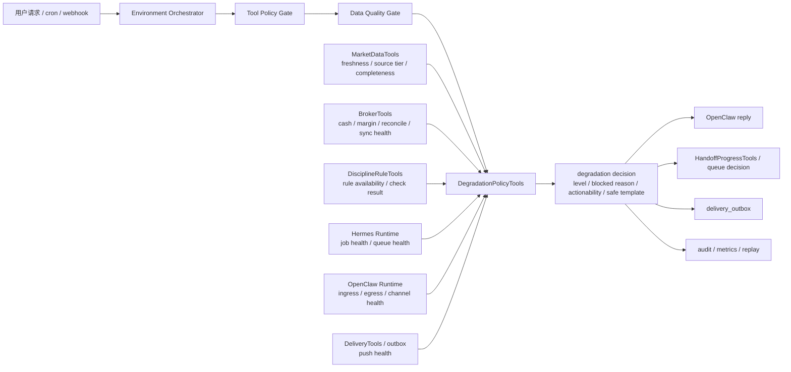
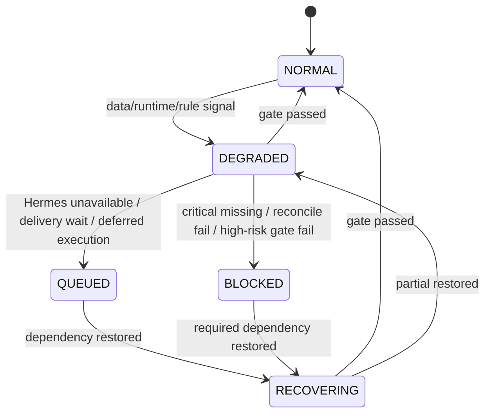

# DegradationPolicyTools 设计

## 定位

`DegradationPolicyTools` 是 AI 持仓投资分析系统 3.0 的控制面能力之一，用来把“什么时候必须降级、降到什么级别、能不能继续给出行动建议、应该对用户怎么说”从 agent 的自由发挥里拿出来，变成统一的产品规则和统一的用户响应对象。

它不负责直接查询行情、券商或运行 Hermes/OpenClaw，而负责回答四个控制面问题：

1. 当前请求是否仍具备可回答、可分析、可建议、可推送的条件。
2. 哪一种失败属于可降级继续，哪一种失败必须阻断。
3. 降级后还能输出到什么行动等级，是否还能给出交易级建议。
4. 用户最终看到的 `blocked reason`、`safe response template` 和后续动作是什么。

一句话口径：

> DegradationPolicyTools 是 3.0 的统一降级裁决层，负责生成结构化降级结论，而不是让 agent 自己临场决定如何“委婉表达”失败。

## 为什么 3.0 必须有这一层

根据现有 3.0 设计，系统已经明确：

1. `11-domain-tools-layer.md` 要求数据质量、纪律规则、风险审查和动作等级不能由 agent 自己决定。
2. `13-architecture-hardening.md` 已把 `Fallback Policy` 列为必补韧性能力，强调数据新鲜度、来源等级、对账状态和运行时健康必须显式治理。
3. `06-cron-and-interaction-reliability.md` 已经把 outbox、重试、补偿和长任务可靠性定义清楚，但“失败后用户到底看到什么”还缺一个统一事实源。
4. `08-market-data-sources.md` 已明确 L1/L2/L3/L4 数据源分层，以及使用 L3/L4 fallback 时只能输出观察分析。

如果没有 DegradationPolicyTools，系统会出现三类危险漂移：

1. **表达漂移**：同样是富途断线，OpenClaw 说“可能有点延迟”，Hermes 说“仍可考虑卖 put”，口径不一致。
2. **动作漂移**：个别 agent 会把数据不新鲜、对账失败或规则缺失情况下的分析，错误升级为交易级建议。
3. **运营漂移**：同一种故障在即时对话、sell put、长任务、推送中的体验不一致，用户无法建立信任。

因此 3.0 不能只做“fallback capability”，还必须做“fallback decision + user-visible policy object”。

## 设计目标

1. **统一裁决。** 降级结论必须由控制面生成，不允许 agent 自己决定风险话术和行动边界。
2. **动作等级清晰。** L3/L4 fallback 只能输出观察分析，不能输出交易级建议。
3. **对高风险任务更严格。** sell put、持仓风险、现金/保证金相关建议在关键数据缺失时必须阻断。
4. **分 runtime 处理。** Hermes 不可用、OpenClaw 不可用、数据源不可用、券商不可用，降级路径应不同。
5. **面向用户可解释。** 每次降级都能产出简洁、可信、统一的中文安全回复模板。
6. **兼容 cron、长任务和推送。** 同一降级策略能同时服务即时对话、后台任务、Outbox 推送和恢复流程。
7. **可运营。** 降级原因、比例、恢复时间和误阻断情况要进入运营与告警视图。

## 非目标

1. 不直接替代 `MarketDataTools`、`BrokerTools`、`DisciplineRuleTools` 或 `DeliveryTools`。
2. 不负责执行重试、补拉、repair job，只负责给出降级级别和用户侧动作边界。
3. 不让 agent 在 prompt 里自行维护一套失败文案或风险边界。
4. 不把所有底层错误原样暴露给用户，用户看到的是产品化 `blocked reason` 和安全模板。

## 在整体控制链中的位置



关系边界：

1. `Data Quality Gate` 负责判断事实是否通过 freshness、source tier、completeness、reconcile 等检查。
2. `DegradationPolicyTools` 负责把这些事实翻译成产品决策：继续、限缩、排队、阻断、稍后推送。
3. `RiskReviewTools` 仍负责最终动作等级，但 DegradationPolicyTools 先决定上限，防止 agent 越级。
4. `HandoffProgressTools` 负责长任务可见性；DegradationPolicyTools 决定长任务是正常运行、排队等待，还是安全阻断。

## 受管对象 / 核心模型

建议把降级结论做成独立对象，而不是只返回一段字符串：

```json
{
  "policy_key": "options_sell_put_missing_critical_chain_fields",
  "request_scope": {
    "intent": "options_sell_put",
    "runtime": "openclaw | hermes",
    "trigger": "wechat_message | webapp | cron | repair_job"
  },
  "signals": {
    "freshness_status": "fresh | stale | unknown",
    "source_tier": "L1 | L2 | L3 | L4",
    "completeness_status": "complete | partial | critical_missing",
    "reconcile_status": "matched | mismatch | unavailable",
    "rule_availability": "available | unavailable",
    "runtime_health": "healthy | degraded | down"
  },
  "degradation_level": "L1 | L2 | L3 | L4",
  "actionability_cap": "info_only | analysis_only | suggested_action | trade_draft | blocked",
  "blocked_reason_code": "broker_reconcile_failed",
  "user_visible_reason": "券商现金与保证金数据暂不可确认",
  "safe_response_template_key": "sell_put_broker_unavailable_cn",
  "next_action": "retry_now | queue | wait_recovery | ask_user_confirm_context",
  "delivery_policy": "reply_now | push_later | outbox_wait | suppress_push"
}
```

核心对象建议：

| 对象 | 作用 | 说明 |
| --- | --- | --- |
| `degradation_policy_rule` | 平台规则定义 | 从失败信号映射到降级级别、动作上限和模板 |
| `degradation_decision` | 单次请求的裁决结果 | 给 OpenClaw、Hermes、Delivery 和审计链消费 |
| `blocked_reason_catalog` | 用户可见原因字典 | 统一中文表述，不让 agent 自由改写 |
| `safe_response_template` | 安全回复模板 | 按场景、任务类型、降级级别、渠道区分 |
| `recovery_hint` | 恢复建议 | 是否排队、等待、重试、改走 WebApp、要求重新授权 |

## 降级判定维度

降级不应只看“报错没报错”，而应统一检查以下 5 类维度：

| 维度 | 典型信号 | 核心规则 |
| --- | --- | --- |
| `freshness` | `freshness_seconds`、`as_of`、市场时段 | 超过策略阈值时，交易级输出必须降级 |
| `source_tier` | L1/L2/L3/L4 | 使用 L3/L4 fallback 时只能输出观察分析 |
| `reconcile` | 券商持仓、现金、保证金、手工录入是否一致 | 对账失败时不能输出高置信持仓或 sell put 可执行建议 |
| `rule_availability` | 纪律规则服务可用性、规则检查是否完成 | 规则不可用时，高风险建议暂停，低风险查询可继续 |
| `runtime_health` | Hermes、OpenClaw、delivery、data-service 健康度 | 决定是同步回复、排队、转 WebApp，还是等待恢复 |

补充维度：

1. `completeness`：期权链、报价、事件数据是否缺关键字段。
2. `cross_check_status`：主源与交叉校验源是否冲突。
3. `delivery_health`：推送链路是否可用，决定是否进入 `outbox_wait`。

## 降级等级定义

为了同时兼容数据源分层和产品动作边界，建议 DegradationPolicyTools 使用以下四级：

| 等级 | 含义 | 允许动作 |
| --- | --- | --- |
| `L1` | 正常，关键能力健康 | 可按正常流程输出 `info_only`、`analysis_only`、`suggested_action` 或 `trade_draft` |
| `L2` | 受控降级，但关键事实仍可确认 | 允许低到中风险分析继续；高风险任务通常降为 `analysis_only` 或 `suggested_action`，不直接进入 `trade_draft` |
| `L3` | fallback 观察级 | 只能输出 `analysis_only`，不能输出交易级建议 |
| `L4` | 阻断级 | 输出 `blocked` 或最小 `info_only`，明确说明缺失与恢复方式 |

硬规则：

1. 使用 L3/L4 fallback 时只能输出观察分析，不能输出交易级建议。
2. `trade_draft` 只允许在 `L1`，并且同时通过 freshness、reconcile、rule check、runtime health。
3. `L2` 适合“事实仍可确认，但体验或范围需要收缩”的场景，例如 Hermes 不可用但轻量查询仍可继续。

## 失败模式与降级矩阵

| 失败模式 | 典型信号 | 默认降级 | 是否允许继续 | 动作上限 | 用户侧行为 |
| --- | --- | --- | --- | --- | --- |
| 数据源失败 | 富途行情超时、主源断连、快照过旧 | `L2` 或 `L3` | 低风险查询可继续 | `analysis_only` 或更低 | 标注最近缓存时间，说明非交易级 |
| 券商失败 | 现金/保证金/持仓读取失败、同步超时 | `L3` 或 `L4` | 轻量查询可继续，交易相关不继续 | `analysis_only` 或 `blocked` | 不输出高置信持仓或 sell put 可执行建议 |
| Hermes 失败 | worker down、队列爆满、job 超时 | `L2` | 轻量查询继续，长任务排队 | `analysis_only` 或 `suggested_action` 取决于任务 | 即时问答继续；长任务排队/稍后处理 |
| OpenClaw 失败 | 微信入口异常、消息无法下发、路由失效 | `L2` 或 `L4` | WebApp 可继续 | 取决于渠道 | WebApp 可查，推送入 outbox 等待恢复 |
| 期权链缺字段 | 缺 bid/ask、volume、OI、IV/Greeks、DTE 任一关键字段 | `L4` for sell put | sell put 不继续 | `blocked` | 明确说明关键字段不完整，暂停候选输出 |
| 纪律规则不可用 | rule service down、规则检查未返回 | `L2` 或 `L4` | 低风险查询可继续 | 高风险任务 `blocked` | 高风险建议暂停，低风险解释仍可回答 |
| delivery 失败 | outbox send fail、channel token 失效 | `L2` | 内容可生成 | 不影响分析动作上限 | 推送改入 outbox，提示稍后补发 |
| data-service 失败 | 聚合服务不可用、标准化快照缺失 | `L3` 或 `L4` | 取决于缓存是否可用 | `analysis_only` 或 `blocked` | 解释服务暂不可用，避免编造结果 |
| cross-check mismatch | 富途与腾讯财经偏差超阈值 | `L3` | 可继续观察 | `analysis_only` | 标注数据源不一致，不给明确动作 |

补充硬口径：

1. 券商现金/保证金、持仓对账失败时，不能输出高置信持仓或 sell put 可执行建议。
2. 期权链缺 `bid/ask`、`volume`、`OI`、`IV/Greeks`、`DTE` 任一关键字段时，sell put 必须降级。
3. 纪律规则服务不可用时，高风险建议暂停，低风险查询可继续。
4. Hermes 不可用时轻量查询继续、长任务排队/稍后处理。
5. OpenClaw 不可用时 WebApp 可查、推送进入 outbox 等待恢复。

## 按任务类型的 fallback 策略

### 等级口径

| fallback 级别 | 典型资源 | 产品行为 | 是否允许 actionability |
| --- | --- | --- | --- |
| `L1` | 主路径健康，L1 交易级数据、券商、规则、runtime 全可用 | 正常执行 | 允许，取决于任务与风险门 |
| `L2` | 有限替代或有限 runtime 退化 | 缩范围、缩动作、缩同步体验 | 部分允许，但默认不进 `trade_draft` |
| `L3` | L3 公共稳定源或部分缓存兜底 | 仅观察、仅解释、仅摘要 | 不允许交易级建议 |
| `L4` | 关键事实或关键控制能力缺失 | 直接阻断或排队 | 不允许 |

### 按任务类型

| 任务类型 | L1 | L2 | L3 | L4 |
| --- | --- | --- | --- | --- |
| 即时问答 | 正常回答 | 缩成轻量查询、减少深链路依赖 | 用缓存或 L3 公共源回答，并明确非交易级 | 只回答状态、原因、恢复建议 |
| sell put | 正常筛选，可给候选与风险说明 | 只做缩小范围分析，通常不进入可执行候选 | 只能做观察分析，不给标的候选排序结论 | 直接阻断 |
| 长任务 / 深研 | 正常 handoff Hermes | 排队、降级成摘要版或拆步执行 | 输出可用部分，缺失部分标注稍后补 | 不启动或停在队列中 |
| 推送 | 正常生成并发送 | 正常生成，发送择机重试 | 降为摘要、延迟发送 | 仅写 outbox，不下发 |
| 持仓风险问答 | 正常 | 若券商对账健康可继续摘要分析 | 只能解释风险观察，不能输出高置信仓位动作 | 阻断并提示等待同步恢复 |

## 安全回复模板

关键原则：

1. 模板由控制面选择，agent 只填参数，不自由改写风险边界。
2. 模板必须显式区分“还能看”与“不能建议”。
3. 高风险阻断模板必须带恢复条件，而不是只说系统繁忙。

### 即时问答

> 当前我能继续给你做观察分析，但这次使用的是降级数据路径，最近数据时间是 `{as_of}`。  
> 因为 `{reason}`，我不会把这次结果当成交易级依据；如果你需要明确买卖或 sell put 判断，建议等主数据源恢复后再看。

### sell put 降级

> 这次我先不输出 sell put 可执行候选。  
> 原因是 `{reason}`，例如现金/保证金未确认、期权链关键字段不完整，或纪律规则检查暂不可用。  
> 在这些条件未恢复前，我最多只能给你做观察分析，不能给出交易级建议。

### 长任务排队 / Hermes 降级

> 这项任务需要 Hermes 深度处理，但当前 `{reason}`。  
> 我已经把任务置为 `{queued_or_waiting}`，恢复后会继续处理；如果你现在只想看轻量版结论，我可以先给你摘要和已确认部分。

### 推送降级 / OpenClaw 或 delivery 降级

> 结果已经生成，但当前推送链路暂不稳定。  
> 我已把内容放入待投递队列，恢复后会自动补发；你也可以先在 WebApp 查看当前结果。

### 纪律规则不可用

> 我可以继续回答这类低风险查询，但现在纪律规则服务不可用。  
> 因此涉及卖 put、加仓、减仓、仓位风险升级这类高风险建议，我会先暂停，不给出可执行结论。

## 状态机

DegradationPolicyTools 需要同时表达“请求现在是什么状态”和“是否仍可恢复”。建议请求级状态机如下：



状态定义：

| 状态 | 含义 | 用户体验 |
| --- | --- | --- |
| `NORMAL` | 全部关键 gate 通过 | 正常回答或执行 |
| `DEGRADED` | 可以继续，但必须收紧动作边界 | 明确标注降级和限制 |
| `BLOCKED` | 关键事实或关键控制能力缺失 | 阻断高风险输出，给恢复条件 |
| `QUEUED` | 当前不适合同步执行，但可等待恢复 | 告知已排队或稍后推送 |
| `RECOVERING` | 依赖恢复中，需要再次校验 | 可展示“正在恢复”，不立即恢复高动作级别 |

规则：

1. `reconcile failed` 对 sell put、现金/保证金类任务应直接进入 `BLOCKED`。
2. `Hermes down` 不应把轻量问答打成 `BLOCKED`，而应进入 `DEGRADED` 或 `QUEUED`。
3. `OpenClaw egress down` 不应影响 WebApp 查看，但应把推送任务放入 `QUEUED`。

## P0 / P1

### P0

1. 建立统一 `blocked_reason_code` 和 `safe_response_template_key`，禁止 agent 自由措辞决定降级。
2. 接入五个关键判定维度：`freshness`、`source_tier`、`reconcile`、`rule_availability`、`runtime_health`。
3. 覆盖六类关键故障：数据源失败、券商失败、Hermes 失败、OpenClaw 失败、期权链缺字段、纪律规则不可用。
4. 对 sell put、现金/保证金、持仓对账相关任务落实硬阻断规则。
5. 接入 OpenClaw 同步回复、Hermes 长任务排队、delivery outbox 等三个关键出口。

### P1

1. 引入按 `intent`、`subscription tier`、`market session` 定制的细粒度降级策略。
2. 增加 cross-check mismatch、delivery 失败、data-service 局部异常等更细故障模板。
3. 支持恢复后自动重放、自动补推和降级前后效果对比。
4. 建立运营后台，支持查看近期 `blocked reason` 排名、恢复时长和误阻断率。

## 指标与运营视图

建议至少追踪以下指标：

| 指标 | 作用 |
| --- | --- |
| `degradation_rate_by_intent` | 看哪些任务最常降级 |
| `blocked_rate_high_risk` | 验证高风险任务是否被严格挡住 |
| `l3_l4_fallback_usage_rate` | 监控是否过度依赖低等级 fallback |
| `broker_reconcile_block_count` | 观察券商同步/对账是否成为主阻塞点 |
| `rule_unavailable_block_count` | 观察纪律规则服务稳定性 |
| `hermes_queue_due_to_runtime_health` | 长任务排队是否过多 |
| `outbox_wait_due_to_openclaw_down` | 渠道侧问题是否影响用户触达 |
| `safe_template_mismatch_feedback` | 用户是否认为降级话术与事实不符 |

运营视图应回答四个问题：

1. 最近 24 小时哪些故障最常触发降级。
2. 哪些降级发生在高风险任务上。
3. 当前有多少任务处于 `QUEUED` 或 `RECOVERING`。
4. 是否出现了 agent 在 L3/L4 下仍输出交易级建议的违规事件。

## 开发前已确认 / 已延后

1. P0 默认保守：L2 及以下不输出交易草稿，只输出 `analysis_only`；用户保守模式放 P1 配置。
2. WebApp 显式展示降级 badge，并与微信模板一致展示数据源、新鲜度、降级原因和不能行动的原因。
3. Advisor/多账户场景的租户级降级 override 放 P1/P2；P0 不实现。
