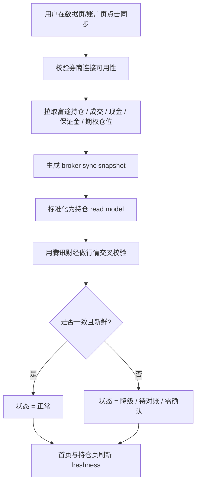

# AI 持仓系统 3.0 PRD 02：数据源、券商同步与对账

## 背景

AI 持仓系统 3.0 需要先解决“数据从哪里来、谁是主源、什么时候算新鲜、冲突时谁说了算”这四件事，持仓分析、风险提示、期权卖 put 候选和后续的确认流，才能建立在可解释、可追溯的数据契约上。

当前已确认的产品前提是：

1. **富途是美股、港股、ETF 和期权的主源。**
2. **腾讯财经是稳定校验源和 fallback。**
3. **P0 不做自动下单。**
4. **Futu 同步入口不放在 Dashboard 主操作，只放在数据页/账户页触发。**
5. **首页只展示 freshness 和同步状态，不承担同步动作。**

本 PRD 只定义数据接入、券商同步、对账和用户可见状态，不展开数据库实现细节。

## 目标

1. 建立统一的数据源分层，明确哪些数据可用于交易级判断，哪些只能用于展示、校验或兜底。
2. 把富途定义为持仓和期权的主事实源，支持持仓、成交、现金、保证金、期权链的同步与展示。
3. 把腾讯财经定义为稳定交叉校验源和 fallback，形成数据一致性检查。
4. 支持多来源资产并存，包括手工录入、消息解析、OCR、券商同步和系统派生数据。
5. 建立 broker sync snapshot 和 reconcile 流程，让每次同步结果、冲突结果和人工处理都可追溯。
6. 建立 read model freshness 规则，让首页、持仓页、账户页都能清楚展示数据是否新鲜、是否可用、是否需要用户确认。

## 非目标

1. 不做自动下单。
2. 不在本 PRD 中定义券商侧具体 API 接口参数和存储表结构。
3. 不把首页做成同步操作中心。
4. 不把腾讯财经定义为交易级主源。
5. 不在 P0 解决所有券商接入问题，重点先完成富途主链路。
6. 不在本 PRD 中覆盖完整的机会捕捉、研究报告和清仓复盘功能。

## 数据来源分类

### 1. 资产事实来源

这类来源决定“我到底持有什么、成交了什么、现金还剩多少”。

| 类别 | 示例 | 产品定位 | 可见范围 |
| --- | --- | --- | --- |
| 券商同步主源 | 富途 | 真实持仓、成交、现金、保证金、期权仓位的主事实源 | 可用于持仓展示、对账和高置信分析 |
| 券商同步补充源 | 长桥、PTrade 等后续接入 | 富途不可用时的补充来源 | P1 及以后 |
| 手工录入 | WebApp 或微信中补录交易 | 用户修正和兜底 | 需要确认状态 |
| 消息解析 | 买卖消息、成交提醒 | 自动识别后进入待确认 | 需要确认状态 |
| OCR 识别 | 持仓截图、成交截图 | 低成本兜底 | 需要确认状态 |
| 系统派生 | 持仓快照、盈亏、风险评分 | 基于事实源生成的展示/分析结果 | 可展示，不可反向当作事实源 |

### 2. 市场行情来源

这类来源决定“当前价格、期权链、波动率和辅助行情是否足够新鲜”。

| 类别 | 示例 | 产品定位 |
| --- | --- | --- |
| 交易级主源 | 富途行情 / 期权链 | 美港股、ETF、期权链的主行情源 |
| 稳定校验 / fallback | 腾讯财经 | 用于交叉校验、展示和异常兜底 |
| 研究与补充源 | Yahoo、Tushare、AkShare、Longbridge 等 | 用于研究、历史补缺和非交易级场景 |

### 3. 来源优先级原则

1. **事实优先于推测**，券商主源优先于手工、OCR 和系统派生。
2. **主源优先于 fallback**，富途优先于腾讯财经和其他公共源。
3. **交易级优先于展示级**，可用于策略判断的数据必须满足 freshness gate。
4. **每条数据保留来源**，用户看到的每个数字都要能追溯来源和更新时间。

## 用户场景

### 场景 1：首次绑定富途后同步持仓

用户在账户页完成富途绑定，触发首次同步，系统拉取当前持仓、现金、保证金和期权仓位，并在持仓页展示同步完成状态。

### 场景 2：盘中查看首页 freshness

用户打开首页，不需要立刻同步，只要看到最新一次成功同步时间、数据是否过期、是否存在待对账冲突即可判断能否继续查看持仓。

### 场景 3：腾讯财经校验到富途行情异常

富途行情不可用、延迟明显或字段不完整时，系统使用腾讯财经做稳定校验和 fallback，并明确标注数据降级，不输出高置信交易建议。

### 场景 4：多来源资产并存

用户同一账号下既有富途同步资产，也有手工补录或 OCR 修正资产。系统允许这些来源并存，但必须区分来源、确认状态和优先级。

### 场景 5：对账发现冲突

系统发现券商持仓与本地交易事件不一致，或现金/期权合约信息不一致，自动进入待对账状态，阻断高置信输出，等待用户确认。

## 同步流程

### 产品流程

### 同步契约

1. 每次同步都必须生成一次可追溯的 **broker sync snapshot**。
2. snapshot 必须能说明：同步时间、来源、覆盖范围、成功/失败摘要、是否存在缺失字段。
3. 同步结果必须进入持仓 read model，作为首页、持仓页、账户页的读取依据。
4. 同步动作只能在数据页或账户页触发，不在 Dashboard 主操作位触发。
5. Dashboard 只展示 freshness、状态和跳转入口，不承担同步主动作。

### 同步优先级

| 优先级 | 数据 | 说明 |
| --- | --- | --- |
| 1 | 富途券商同步快照 | 持仓、成交、现金、保证金、期权仓位的主事实源 |
| 2 | 富途行情和期权链 | 用于当前估值、流动性和 sell put 判断 |
| 3 | 腾讯财经校验 | 用于一致性检查、fallback 和异常提示 |
| 4 | 其他公共或研究源 | 只在主源不可用或研究场景使用 |

## 对账流程

### 对账目标

对账的目标不是“让所有数据长得一样”，而是明确：

1. 哪些数据以券商为准。
2. 哪些数据只是本地草稿或候选。
3. 哪些冲突需要用户确认。
4. 哪些冲突会让系统自动降级。

### 对账输入

| 输入 | 说明 |
| --- | --- |
| 券商持仓快照 | 富途同步结果 |
| 券商成交与现金变化 | 用于校验交易事件和资金变化 |
| 系统交易事件 | 手工录入、消息解析、OCR、确认流结果 |
| 行情校验结果 | 富途与腾讯财经的一致性检查 |

### 对账输出

| 输出 | 说明 |
| --- | --- |
| matched | 券商、本地和行情校验一致 |
| mismatch | 存在数量、现金、合约或更新时间差异 |
| unverified | 缺少足够信息，暂无法判定 |
| needs_user_review | 需要用户确认后继续 |

### 对账规则

1. 真实持仓、现金和保证金以券商主源为准。
2. 系统只有在对账通过后，才可以把 read model 标记为高可信。
3. 任何未匹配交易事件都要进入待确认，不允许默默吞掉。
4. 现金不一致或期权合约不一致时，必须降级，不能继续生成可执行的 sell put 候选。
5. 腾讯财经与富途主源不一致时，系统必须展示冲突，不允许自动覆盖主源。

## 冲突处理

### 冲突类型

| 冲突类型 | 用户看到的含义 | 系统动作 |
| --- | --- | --- |
| broker-only trade | 券商有成交，本地没有对应事件 | 生成待确认项 |
| system-only trade | 本地有交易事件，券商未匹配 | 标记漏同步或录入错误 |
| quantity mismatch | 数量不一致 | 进入对账冲突 |
| cash mismatch | 现金/可用资金不一致 | 降级并阻断高风险输出 |
| option contract mismatch | 合约解析不一致 | 强制重新解析并确认 |
| market data mismatch | 富途与腾讯财经不一致 | 标记为降级校验冲突 |

### 冲突处理原则

1. 冲突先标记，再解释，再确认。
2. 冲突期间保留历史可见性，但降低置信度。
3. 冲突不会自动覆盖真实事实源。
4. 冲突不会触发自动下单，也不会直接进入高风险策略建议。
5. 若冲突涉及期权现金占用或保证金，系统必须优先保护用户资金安全，显示为不可执行状态。

## 数据质量 / freshness

### Freshness 口径

Freshness 不是单一时间戳，而是以下三层共同决定：

1. **券商同步 freshness**：最后一次成功同步离现在有多久。
2. **行情 freshness**：估值、期权链和市场校验数据是否足够新。
3. **对账 freshness**：当前 read model 是否已经和券商快照完成校验。

### 状态等级

| 状态 | 含义 | 产品行为 |
| --- | --- | --- |
| fresh | 数据新鲜且对账通过 | 正常展示，可用于高置信分析 |
| stale | 数据过期但仍可查看历史 | 明确展示过期标识，禁止高置信建议 |
| degraded | 主源异常或 fallback 生效 | 只给观察级结论，不给可执行建议 |
| disputed | 存在对账冲突 | 显示冲突原因，等待用户确认 |
| unavailable | 无法同步或无数据 | 提示重试或转入手工补录 |

### 产品要求

1. 首页必须显示最后一次成功同步时间和当前 freshness 状态。
2. 持仓页必须显示每个仓位的来源、更新时间和对账状态。
3. 当富途主源不可用时，系统可以展示 fallback 数据，但必须明确标记降级。
4. 当数据不新鲜或对账未通过时，系统不能输出高置信交易级建议。
5. freshness 不达标时，页面可以继续读，但不能默认写。

## 用户可见状态

### 首页状态

| 状态文案 | 含义 |
| --- | --- |
| 数据正常 | 最近同步和对账都通过 |
| 同步中 | 正在执行券商同步 |
| 数据过期 | 最近同步已过期，需要手动刷新 |
| 存在冲突 | 有未处理的对账差异 |
| 数据降级 | 主源异常，当前使用 fallback |

### 账户页状态

账户页是同步和对账的主要入口，用户可以在这里看到：

1. 当前券商连接是否正常。
2. 最近一次同步结果。
3. 哪些来源在参与当前资产视图。
4. 哪些项目需要确认或修正。

### 持仓页状态

持仓页需要同时显示：

1. 仓位来源 badge。
2. 最后更新时间。
3. 对账状态。
4. 是否存在 fallback。
5. 是否可用于高置信分析。

### Dashboard 状态

Dashboard 只承载结果，不承载同步动作。

1. 展示 freshness。
2. 展示异常和待处理提醒。
3. 提供跳转到数据页/账户页的入口。
4. 不提供主同步按钮。

## P0 / P1 范围

### P0

| 范围 | 内容 |
| --- | --- |
| P0-1 | 富途主源接入，支持美股、港股、ETF、期权的持仓/成交/现金/保证金同步 |
| P0-2 | broker sync snapshot 与基础 read model 刷新 |
| P0-3 | 腾讯财经作为稳定校验与 fallback |
| P0-4 | 首页、持仓页、账户页的 freshness / 状态展示 |
| P0-5 | 基础对账：数量、现金、合约、更新时间差异识别 |
| P0-6 | 冲突进入待确认状态 |
| P0-7 | 多来源资产保留来源标记与确认状态 |
| P0-8 | P0 不做自动下单 |

### P1

| 范围 | 内容 |
| --- | --- |
| P1-1 | 更多券商接入，如长桥、PTrade 等 |
| P1-2 | 更细粒度的对账修复策略与批量补同步 |
| P1-3 | 更丰富的行情校验源和历史补缺策略 |
| P1-4 | 更完整的冲突处理工作流和人工修正体验 |
| P1-5 | 更复杂的多账户、多组合视图协同 |

## 验收标准

1. 用户绑定富途后，可以在账户页发起同步，并看到同步结果。
2. 同步成功后，首页和持仓页能展示最新 freshness 和更新时间。
3. 富途持仓、成交、现金、保证金和期权仓位能进入统一资产视图。
4. 腾讯财经可以作为校验源参与一致性检查，并在异常时触发降级展示。
5. 任一数据冲突都能被识别为 `matched`、`mismatch`、`unverified` 或 `needs_user_review`。
6. 当存在冲突、过期或 fallback 时，系统不会给出高置信的交易级建议。
7. Dashboard 不出现主同步按钮，数据页/账户页保留同步入口。
8. P0 阶段不会出现自动下单行为。

## 开发前已确认

1. 富途 OpenD 采用用户本地运行方式；P0 按已有富途账号实际权限实现，权限边界为 `read_only`，同步频率配置化。
2. P0 不允许云端保存生产券商 token；云端只保存连接状态、脱敏快照和 source lineage。
3. 不同券商之间的字段口径、币种折算和期权合约命名必须在对账契约中标准化；多币种默认以 `portfolio_view.base_currency` 展示，汇率源走 data-service 并记录更新时间和来源。
4. A 股 P0 只做正股和 ETF，不纳入期权级能力。
5. 多来源资产并存时，UI 持续强化来源 badge、更新时间、对账状态和降级状态。
6. 当主源与 fallback 源持续不一致时，系统默认保守展示；L2 及以下不输出交易草稿，只输出 `analysis_only`。
