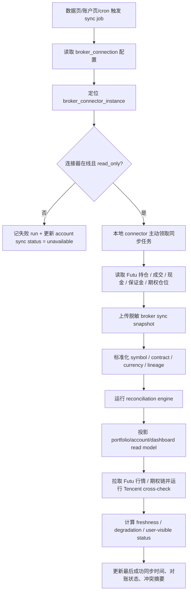
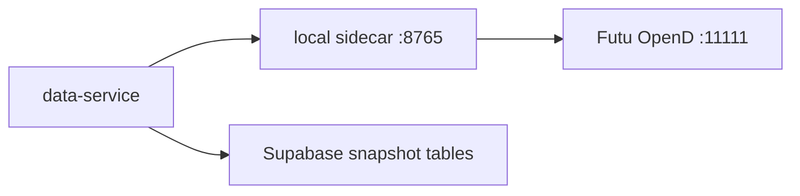
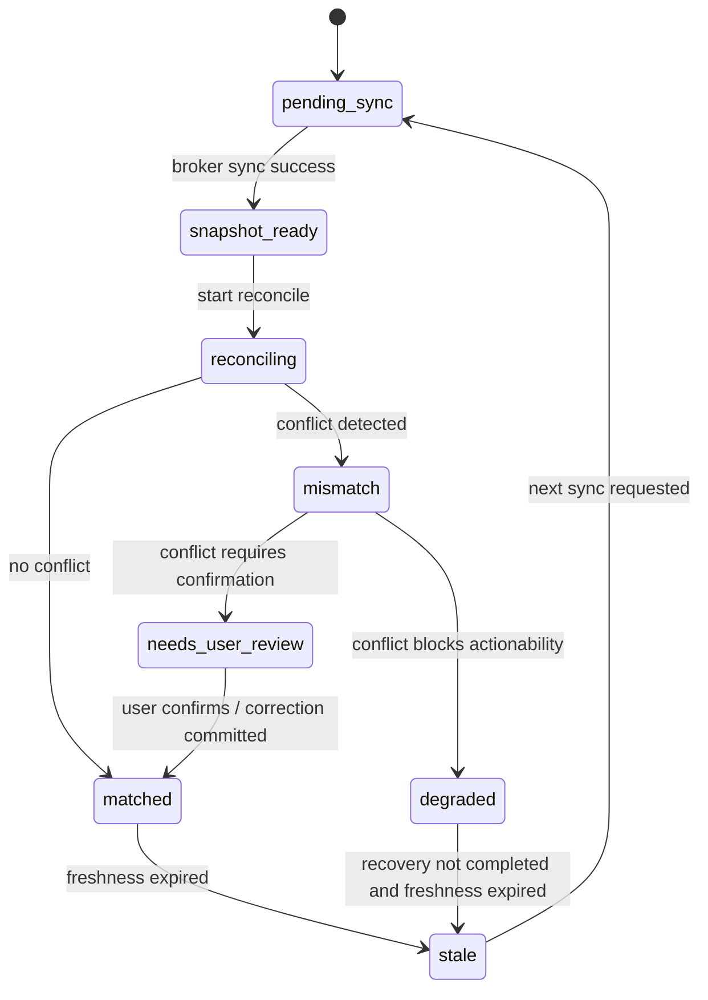

# 数据源、券商同步与对账系统分析

## 1. 系统目标

本文件定义 AI 持仓系统 3.0 在数据源、券商同步、broker snapshot、read model freshness、对账冲突、降级与用户可见状态上的系统边界、接口契约、状态机和测试策略，覆盖以下范围：

1. Futu 主源接入与同步主链路。
2. 腾讯财经交叉校验与 fallback。
3. 多来源资产并存下的事实优先级。
4. broker sync snapshot 与标准化事实层。
5. Dashboard / 账户页 / 持仓页的 freshness 与状态投影。
6. 对账冲突、降级决策和用户确认入口。

> 2026-05-26 决策更新：多用户生产形态下，Futu OpenD 不再作为普通用户个人券商同步方案。管理员侧 Mac mini / OpenD 只提供系统行情、期权链和估值参考；普通用户持仓、现金、成本来自手工录入、微信消息、截图 OCR 和确认写入。本文件中关于用户本地 connector、broker truth 主源的早期设计仅作为历史方案和兼容背景保留，后续实现以本决策为准。

本分析遵循以下硬性系统口径：

1. **Futu 是 P0 系统行情源。** P0 以管理员侧 Futu OpenD 作为美股、港股、ETF 和期权链的系统行情源；不作为普通用户个人持仓、现金、保证金和账户仓位主事实源。
2. **腾讯财经不是交易级唯一依据。** 它只作为稳定校验源与 fallback，不单独驱动交易级判断。
3. **Dashboard 不放同步主按钮。** 同步主入口只在数据页 / 账户页；Dashboard 只展示 freshness、异常和跳转入口。
4. **P0 不自动下单。** 同步、对账、确认、降级都不能直接演化为券商自动交易动作。
5. **前台只读 read model。** raw snapshot、标准化事实和对账中间态不直接暴露给页面。
6. **多来源可并存，但主事实源不可模糊。** 用户确认输入、OCR、消息解析、系统行情和系统派生必须显式保留来源与确认状态。

系统目标不是再重复 PRD，而是把“谁是主源、同步后如何入模、冲突后谁说了算、页面怎么安全展示”收敛成稳定的实现边界。

## 2. 数据分层架构

### 2.1 五层数据架构

| 层级 | 职责 | 核心对象 | 是否直接给前台 |
| --- | --- | --- | --- |
| Broker Account Truth Layer | 保存券商生产只读事实，是持仓、成交、现金、保证金、期权仓位的最高优先级 | `broker_sync_snapshot`、`broker_position_snapshot`、`cash_margin_snapshot` | 否 |
| Market Snapshot Layer | 保存实时或准实时行情快照、期权链快照与交叉校验结果 | `market_data_snapshots`、`cross_check_result` | 否 |
| Historical Store Layer | 保存可回测、可复盘、可审计的历史行情和期权链快照 | `historical_data_manifests`、Parquet / object storage | 否 |
| User Input Layer | 保存手工录入、消息解析、OCR、确认流等低优先级或待确认事实 | `trade_events`、`message_trade_input`、`ocr_extract_result` | 否 |
| Derived Read Model Layer | 面向页面的稳定投影层，汇总 freshness、来源、对账状态、置信度 | `dashboard_data_status_read_model`、`account_sync_status_read_model`、`portfolio_positions_read_model` | 是 |

### 2.2 优先级与使用规则

| 类别 | P0 优先级 | 允许用途 | 不允许用途 |
| --- | --- | --- | --- |
| Futu broker/account 数据 | P0-1 | 真实持仓、成交、现金、保证金、期权仓位、对账基线、高置信分析 | 被 fallback 自动覆盖 |
| Futu 行情 / 期权链 | P0-1 | 估值、盘中判断、Sell Put 风险门 | 在 freshness 不达标时继续给交易级建议 |
| 腾讯财经 | P0-2 | 交叉校验、展示兜底、异常检测、降级观察 | 作为交易级唯一依据 |
| 手工 / 消息 / OCR | P0-3 | 待确认候选、缺失兜底、历史修正 | 未确认前覆盖券商主源 |
| 系统派生数据 | P0-4 | 页面展示、风险摘要、策略上下文 | 反向当作真相源 |

### 2.3 关键架构约束

1. 所有事实写入都必须带 `tenant_id`、`asset_source_id` 和来源 lineage。
2. `broker_connection_id` 是券商账户 / 资产来源边界；`connector_instance_id` 是用户本地 OpenD 连接器实例边界，两者必须分开。
3. Futu 的 broker truth 与 market snapshots 属于两条并行数据线，但都归属于同一主源等级。
4. 历史库只给复盘和回测，不替代实时 freshness gate。
5. 当主源异常时，系统允许展示 fallback 数据，但必须同步下降 actionability。

## 3. 连接器边界

### 3.1 模块边界

| 模块 | 负责 | 不负责 | 上下游依赖 |
| --- | --- | --- | --- |
| `BrokerConnector` | 历史兼容边界；不再作为普通用户生产入口 | 页面聚合、对账裁决、直接交易、云端直连用户 localhost、普通用户个人 Futu 同步 | 旧 `broker_connector_instances`、`broker_connections` |
| `MarketQuoteConnector` | 读取管理员侧 Futu 行情与期权链快照 | 普通用户账户同步、read model 投影 | Futu Quote / Option Chain |
| `CrossCheckConnector` | 拉取腾讯财经等 L3 稳定源，生成校验结果 | 替代主源成为交易级依据 | Tencent Finance adapter |
| `SnapshotNormalizer` | 把原始结果标准化为统一 symbol / market / instrument / currency 口径 | 页面 DTO、风险裁决 | symbol registry、instrument master |
| `ReconciliationEngine` | 对比 broker truth、本地交易事件、行情校验结果，生成冲突对象与对账结论 | 自行给用户风险话术 | `trade_events`、normalized snapshots |
| `ReadModelProjector` | 将标准化事实 + 对账结论投影到 Dashboard / 账户页 / 持仓页 read model | 直接请求外部源 | read model tables/cache |
| `FreshnessGate` | 计算 broker sync freshness、market freshness、reconcile freshness，产出动作上限 | 执行同步或修复 | snapshots、read models |
| `DegradationPolicyGate` | 根据 freshness、source tier、reconcile、completeness、runtime health 给出降级等级 | 自己重试抓数 | `DegradationPolicyTools` |

### 3.2 Futu 连接器边界

1. `BrokerConnector` 只读生产账户，不具备自动下单能力。
2. Futu 在系统中同时扮演 `broker_connection` 和 `market_data_source` 两个角色，但落库与权限边界分开。
3. 账户事实与市场快照必须分别记录 `as_of`、`received_at`、`missing_fields`、`entitlement context`。
4. 若 Futu 某类字段缺失，允许部分写入 snapshot，但必须让 completeness 和 degradation 明确下沉。
5. 生产环境不由云端主动连接用户本机 OpenD；WebApp 创建 tenant-scoped 同步任务，本地 connector 主动轮询任务、读取 OpenD 并上传脱敏 snapshot。
6. `broker_connector_instances` 记录连接器设备、心跳、版本和 runtime mode；`broker_connections` 记录券商账户、权限、连接状态和统一资产视图来源。

### 3.3 腾讯财经边界

1. 腾讯财经定位为 `L3_public_stable`，只能用于校验、fallback 和异常提示。
2. 腾讯财经生成的 `cross_check_result` 不自动覆盖 Futu 主源值。
3. 当富途与腾讯财经偏差超阈值时，系统进入 `market_data_mismatch` 冲突，并把策略降级为观察级。

## 4. 同步 job 流程

### 4.1 触发原则

| 触发源 | 允许 | 说明 |
| --- | --- | --- |
| 数据页手动同步 | 允许 | 主入口之一 |
| 账户页手动同步 | 允许 | 主入口之一 |
| 定时同步 job | 允许 | 盘前、盘中关键窗口、收盘后 |
| Dashboard 主操作按钮 | 不允许 | 只展示状态和跳转入口 |
| 高风险策略页隐式自动同步 | 不允许 | 先读取状态，必要时引导用户去数据页 / 账户页 |

### 4.2 同步 job 主链路



本地开发联调可使用简化链路：



生产链路不使用云端直连用户 `localhost`；简化链路只适用于 `connector_runtime_mode=local_dev_direct`。

```text
触发同步 -> 连接器领取任务 -> 本地读取 OpenD -> 上传脱敏快照 -> 标准化 -> 对账 -> 投影 read model -> freshness/degradation
```

### 4.3 job 契约

建议统一为账号级同步 run：

```json
{
  "sync_run_id": "sync_2026_05_09_001",
  "tenant_id": "tenant_x",
  "broker_connection_id": "bc_futu_001",
  "connector_instance_id": "bci_futu_mac_001",
  "connector_runtime_mode": "user_local_polling | local_dev_direct | relay_websocket",
  "trigger": "account_page | data_page | cron",
  "scope": {
    "positions": true,
    "trades": true,
    "cash": true,
    "margin": true,
    "option_positions": true,
    "market_cross_check": true
  },
  "status": "pending | running | partial | succeeded | failed",
  "started_at": "2026-05-09T09:30:00+08:00",
  "finished_at": null,
  "error_summary": null
}
```

### 4.4 idempotency 与失败处理

1. 同一 `broker_connection_id + trigger window` 必须支持幂等重试。
2. broker truth 写入与 read model 投影分离，避免一次失败污染全部页面状态。
3. 若只拉到部分数据，如持仓成功但现金失败，同步 run 标记 `partial`，并进入降级路径。
4. failure 不直接清空旧 read model，而是保留旧值并提升 freshness / degraded 标识。

## 5. snapshot / read model 流程

### 5.1 snapshot 分层

| 层级 | 输入 | 输出 | 说明 |
| --- | --- | --- | --- |
| raw snapshot | Futu 原始响应、Tencent 原始响应 | 原始 payload + provider metadata | 可审计，不直接给业务页 |
| normalized snapshot | raw snapshot | 统一 symbol / contract / currency / timestamps / missing_fields | 是对账与投影的事实入口 |
| reconcile output | normalized snapshot + trade events | `matched / mismatch / unverified / needs_user_review` + conflicts | 是控制面输入 |
| read model projection | reconcile output + market snapshots | Dashboard / 账户页 / 持仓页 DTO | 页面只读入口 |

### 5.2 broker snapshot 契约

```json
{
  "broker_sync_snapshot_id": "bss_001",
  "tenant_id": "tenant_x",
  "broker_connection_id": "bc_futu_001",
  "connector_instance_id": "bci_futu_mac_001",
  "broker": "futu",
  "as_of": "2026-05-09T09:31:20+08:00",
  "coverage": {
    "positions": true,
    "trades": true,
    "cash": true,
    "margin": true,
    "option_positions": true
  },
  "quality": {
    "missing_fields": [],
    "partial_components": [],
    "source_quality": "broker_verified"
  },
  "summary": {
    "position_count": 14,
    "option_count": 6,
    "cash_currency_count": 2
  },
  "status": "complete | partial | failed"
}
```

### 5.3 市场快照与校验契约

```json
{
  "market_snapshot_group_id": "msg_001",
  "tenant_id": "tenant_x",
  "primary_source": "futu_openapi",
  "cross_check_source": "tencent_finance",
  "symbols": ["AAPL", "0700.HK"],
  "as_of": "2026-05-09T09:31:35+08:00",
  "freshness_seconds": 22,
  "cross_check_status": "matched | mismatch | unchecked",
  "fallback_used": false,
  "missing_fields": []
}
```

### 5.4 read model 设计

#### `dashboard_data_status_read_model`

| 字段 | 说明 |
| --- | --- |
| `tenant_id` | 账号隔离根 |
| `portfolio_view_id` | 当前视图上下文 |
| `last_successful_sync_at` | 最近成功同步时间 |
| `sync_status` | `healthy / syncing / stale / degraded / unavailable` |
| `reconcile_status` | `matched / mismatch / unverified / needs_user_review` |
| `market_status` | `fresh / stale / degraded` |
| `conflict_count` | 未解决冲突数 |
| `can_high_confidence_analyze` | 是否允许高置信分析 |

#### `account_sync_status_read_model`

| 字段 | 说明 |
| --- | --- |
| `broker_connection_id` | 券商连接 |
| `broker` | `futu` |
| `permission_scope` | `read_only` 为 P0 默认 |
| `last_sync_run_id` | 最近同步 run |
| `last_sync_result` | `succeeded / partial / failed` |
| `next_recommended_action` | `retry_sync / resolve_conflict / reauth / wait_recovery` |

#### `portfolio_positions_read_model`

| 字段 | 说明 |
| --- | --- |
| `position_id` | 当前持仓行 |
| `instrument_type` | `stock / etf / option_contract` |
| `source_quality` | `broker_verified / user_confirmed / estimated / conflicted` |
| `reconciliation_status` | `matched / mismatch / unverified` |
| `market_freshness_status` | `fresh / stale / degraded` |
| `fallback_used` | 是否启用 fallback |
| `actionability_cap` | `analysis_only / suggested_action / blocked` |

### 5.5 页面读取规则

1. Dashboard 读 `dashboard_data_status_read_model`，不直接消费 broker snapshot。
2. 账户页读 `account_sync_status_read_model` + 冲突摘要，是同步与对账的主操作页。
3. 持仓页读 `portfolio_positions_read_model`，每个仓位展示来源、更新时间、对账状态、是否 fallback。
4. 任何页面都不应直接展示“原始 provider payload”。

## 6. 对账状态机

### 6.1 对账状态定义

| 状态 | 含义 | 允许页面行为 |
| --- | --- | --- |
| `pending_sync` | 尚未开始同步或等待下次触发 | 可展示旧状态，不允许高置信写相关建议 |
| `snapshot_ready` | broker snapshot 已落地，待进入对账 | 页面可见“同步完成，正在校验” |
| `reconciling` | 正在比对 broker truth、本地事件和校验结果 | 保持上次 read model，突出处理中 |
| `matched` | 主事实与本地事件一致 | 可进入高置信读路径 |
| `mismatch` | 已识别冲突，需要降级 | 页面展示冲突并限制建议 |
| `needs_user_review` | 冲突已定位，等待用户确认 | 进入确认中心 |
| `degraded` | 数据或校验条件不足，无法给交易级结论 | 只允许观察级 |
| `stale` | 当前 snapshot / market / reconcile 已过 freshness 门 | 历史可读，不允许高置信建议 |

### 6.2 状态机



### 6.3 状态转换规则

1. `cash mismatch`、`option contract mismatch`、`margin unavailable` 对 Sell Put 直接把 actionability 打到 `blocked`。
2. `market data mismatch` 不一定影响持仓存在性，但会把交易级行情判断降为观察级。
3. `needs_user_review` 期间页面保持历史可见，但 read model 必须显式展示 `conflicted` 或 `needs review`。
4. `matched` 也必须受 freshness gate 约束；对账通过不代表实时数据永远可用。

## 7. 冲突对象

### 7.1 冲突对象列表

| 冲突类型 | 来源 | 对用户的含义 | 默认系统动作 |
| --- | --- | --- | --- |
| `broker_only_trade` | 券商成交存在，本地无事件 | 存在未录入或未识别交易 | 生成待确认项 |
| `system_only_trade` | 本地有事件，券商无匹配 | 可能漏同步、误录或待确认草稿 | 标记录入异常 |
| `quantity_mismatch` | 券商数量与当前仓位重建不一致 | 当前持仓可信度下降 | 进入 `mismatch` |
| `cash_mismatch` | 现金 / 可用资金不一致 | 资金约束不可信 | 降级并阻断高风险输出 |
| `option_contract_mismatch` | 合约解析、expiry、strike、side 不一致 | 期权仓位解释不可信 | 强制确认或重解析 |
| `market_data_mismatch` | Futu 与 Tencent 校验偏差超阈值 | 行情级判断需保守 | 标记 `degraded` |

### 7.2 冲突对象契约

```json
{
  "conflict_id": "conf_001",
  "tenant_id": "tenant_x",
  "broker_connection_id": "bc_futu_001",
  "conflict_type": "cash_mismatch",
  "severity": "high",
  "position_ref": null,
  "trade_event_refs": ["te_001"],
  "broker_snapshot_ref": "bss_001",
  "system_value": {
    "cash_available": 125000
  },
  "broker_value": {
    "cash_available": 118000
  },
  "detected_at": "2026-05-09T09:32:00+08:00",
  "resolution_status": "open | user_confirmed | system_corrected | ignored_with_reason",
  "actionability_impact": "analysis_only | blocked"
}
```

### 7.3 冲突处理原则

1. 先标记冲突，再解释冲突，再要求确认；不允许静默覆盖。
2. 冲突不会触发自动下单，也不会被视作用户交易授权。
3. 高风险冲突优先保护资金安全，而不是优先保持页面“看起来正常”。
4. 冲突闭环应通过确认中心或账户页完成，不在 Dashboard 做复杂处理。

## 8. Freshness Gate

### 8.1 三层 freshness

| 维度 | 说明 | 典型阈值 | 不满足时 |
| --- | --- | --- | --- |
| `broker_sync_freshness` | 最近一次成功账户同步离当前多久 | 盘中 1-5 分钟，非盘中可放宽 | 进入 `stale` 或 `degraded` |
| `market_freshness` | 主行情 / 期权链是否足够新 | 实时问答 / Sell Put 30-60 秒 | 只允许观察级 |
| `reconcile_freshness` | 当前 read model 是否基于最新 broker snapshot 完成校验 | 与最近成功 sync 对齐 | 不允许高置信读写建议 |

### 8.2 动作门

| 场景 | 必要条件 | 动作上限 |
| --- | --- | --- |
| Dashboard 查看 | 任一可读状态即可，但需展示来源与 freshness | `info_only` |
| 持仓页查看 | broker snapshot 可读，哪怕 stale，也可展示历史状态 | `analysis_only` |
| 一般持仓分析 | broker truth + market freshness + reconcile 通过 | `suggested_action` |
| Sell Put 候选 | 新鲜期权链 + 新鲜标的行情 + 新鲜现金/保证金 + reconcile 通过 | `suggested_action`，必要时进入确认 |
| 任何交易级草稿 | 仅限 L1、关键 gate 通过 | `trade_draft` |

### 8.3 freshness gate 输出契约

```json
{
  "tenant_id": "tenant_x",
  "broker_connection_id": "bc_futu_001",
  "broker_sync_freshness_status": "fresh | stale | unavailable",
  "market_freshness_status": "fresh | stale | degraded",
  "reconcile_freshness_status": "fresh | stale | unavailable",
  "overall_status": "fresh | stale | degraded | disputed | unavailable",
  "actionability_cap": "info_only | analysis_only | suggested_action | trade_draft | blocked"
}
```

### 8.4 硬规则

1. `stale` 页面可继续读，但不能默认给高置信交易级建议。
2. 腾讯财经 fallback 即使是 fresh，也不能把 `source_tier` 从 L3 提升到 L1。
3. Sell Put 只要现金 / 保证金 / 期权链关键字段任一不 fresh 或不 complete，就必须阻断可执行候选。

## 9. fallback / 降级

### 9.1 降级等级

| 等级 | 场景 | 动作边界 |
| --- | --- | --- |
| `L1` | Futu 主链路、对账、规则和运行时都健康 | 可正常输出到 `trade_draft` |
| `L2` | 主事实基本可确认，但局部能力退化 | 一般只到 `analysis_only` 或受限 `suggested_action` |
| `L3` | 使用腾讯财经等 fallback 或存在主源冲突 | 只能观察分析，不能交易级建议 |
| `L4` | 关键事实缺失，如现金/保证金不可确认、期权链关键字段缺失、对账失败 | 直接阻断 |

### 9.2 与 DegradationPolicyTools 对齐

| 信号 | 默认等级 | 用户可见行为 |
| --- | --- | --- |
| Futu 行情超时，但旧 snapshot 尚可读 | `L2` | 展示最近时间，降为观察级 |
| Futu 与 Tencent mismatch | `L3` | 标记“主源与校验源不一致” |
| broker cash / margin 失败 | `L4` | 阻断 Sell Put 和高风险建议 |
| option chain 缺 bid/ask、OI、IV/Greeks、DTE | `L4` | 不输出可执行候选 |
| 对账失败但资产历史仍可读 | `L3` 或 `L4` | 展示冲突，等待用户确认 |

### 9.3 页面降级规则

1. Dashboard 显示状态 badge、最后同步时间、冲突数和跳转入口。
2. 账户页显示同步结果、对账状态、冲突列表和恢复建议。
3. 持仓页显示来源 badge、更新时间、对账状态、fallback 标记、是否允许高置信分析。
4. 所有 L3/L4 输出都必须显式说明“非交易级 / 暂不作为可执行依据”。

## 10. 权限 / secret 安全

### 10.1 权限边界

| 对象 | 安全边界 | P0 规则 |
| --- | --- | --- |
| `tenant_id` | 最高数据隔离根 | 所有同步、对账、read model、审计都必须带上 |
| `broker_connection_id` | 单券商连接边界 | token、权限、同步状态按 connection 隔离 |
| `permission_scope` | 券商权限边界 | P0 只允许 `read_only` |
| `token_ref` | 凭证引用 | 不把明文 token 暴露给页面和通用 agent |
| `asset_source_id` | 数据来源审计边界 | 用于多来源共存与冲突解释 |

### 10.2 secret 处理原则

1. 页面与普通读路径只能读 `token_ref` 和连接状态，不能读凭证明文。
2. broker sync worker 按 `broker_connection_id` 取 secret，不跨租户、不跨连接复用。
3. 是否云端保存 token，还是本地代理连接、云端只保存脱敏 snapshot，P0 需要明确决策。
4. 脱敏 snapshot 可以进入云端 read model，但 secret 不进入 read model。

### 10.3 安全硬约束

1. P0 不自动下单，因此同步链路、对账链路、确认链路都不应拥有实盘交易权限。
2. 即便未来保留 `trade_requires_confirm` 枚举，P0 也不启用该能力。
3. 所有同步与对账 run 都必须审计：谁触发、针对哪个 `broker_connection_id`、读取了什么范围、结果如何。

## 11. 观测指标

| 指标 | 作用 |
| --- | --- |
| `broker_sync_success_rate` | 看 Futu 同步主链路是否稳定 |
| `broker_sync_partial_rate` | 看局部字段缺失是否常见 |
| `sync_latency_p50/p95` | 看手动同步和定时同步体验 |
| `snapshot_to_read_model_latency` | 看同步完成到页面刷新耗时 |
| `reconcile_mismatch_rate` | 看冲突是否高发 |
| `cash_mismatch_block_count` | 看高风险阻断是否主要来自资金口径问题 |
| `market_cross_check_mismatch_rate` | 看富途与腾讯财经偏差情况 |
| `freshness_stale_rate` | 看页面过期率 |
| `l3_l4_degradation_rate` | 看是否过度依赖 fallback 或主链路不稳 |
| `needs_user_review_backlog` | 看确认中心积压情况 |

### 11.1 运营视图问题

1. 过去 24 小时哪些 `broker_connection_id` 最常同步失败。
2. 哪些冲突类型最常阻断高风险建议。
3. 哪些页面经常读取到 stale / degraded read model。
4. 是否出现了 L3/L4 下仍给出交易级建议的违规事件。

## 12. 测试策略

### 12.1 合约测试

1. Futu broker snapshot 标准化契约测试。
2. Tencent cross-check 结果契约测试。
3. conflict object schema 与 degradation decision schema 测试。
4. Dashboard / account / portfolio read model DTO 测试。

### 12.2 状态机测试

| 场景 | 预期 |
| --- | --- |
| 首次同步成功 | `pending_sync -> snapshot_ready -> reconciling -> matched` |
| 数量冲突 | 进入 `mismatch`，页面显示冲突 |
| 现金冲突 | 进入 `degraded` 或 `blocked`，Sell Put 不可执行 |
| Futu 行情异常 + Tencent 正常 | `L3` fallback，可读但不可交易级 |
| freshness 过期 | `matched -> stale`，页面继续读但 actionability 降级 |

### 12.3 故障注入测试

1. Futu 账户接口超时。
2. Futu 期权链缺关键字段。
3. Tencent 校验返回与主源偏差超阈值。
4. secret 失效或连接授权过期。
5. read model 投影失败但 raw snapshot 成功。

### 12.4 端到端测试

1. 账户页手动同步 -> 持仓页更新 -> Dashboard freshness 更新。
2. broker-only trade 进入确认中心。
3. system-only trade 标记录入异常，不覆盖主事实。
4. stale 状态下页面显示历史值但不允许高风险建议。
5. P0 无任何自动下单路径暴露。

## 13. 实施顺序

### 13.1 P0 最小闭环

1. 建 `broker_connections` 只读权限模型与 Futu 主连接器。
2. 打通 broker sync run、raw snapshot、normalized snapshot 落地。
3. 建基础 reconciliation engine，先覆盖数量、现金、合约、更新时间差异。
4. 建 Dashboard / 账户页 / 持仓页 read model 与 freshness 投影。
5. 接入 Tencent cross-check 和 `L1-L4` 降级裁决。
6. 打通冲突摘要与确认中心入口。

### 13.2 P0 后但仍属近线

1. 增强期权链 completeness 校验和 Sell Put 硬门。
2. 增加 cron 定时同步和关键窗口刷新。
3. 增加更多 read model 指标与运营视图。

### 13.3 明确不提前进入 P1 的事项

1. 多券商统一对账修复策略。
2. 自动补同步 / 自动 repair。
3. 自动下单或半自动实盘执行。
4. 全市场期权历史数据接入。

## 14. 开发前已确认

1. Futu OpenD 采用用户本地运行方式；P0 按已有富途账号实际权限实现，权限为 `read_only`，同步频率配置化。
2. 腾讯财经 P0 维持 L3 补充/校验源，不作为交易级主事实；商用授权/SLA 未确认前不升级。
3. P0 不允许云端保存生产券商 token；云端只保存连接状态、脱敏 snapshot 和 source lineage。
4. 多币种现金、保证金口径和汇率折算统一由 `portfolio_view.base_currency` 和 data-service 汇率源处理，记录更新时间和来源。
5. 期权合约命名、strike 精度、expiry 时区和持仓 side 必须在对账契约中标准化。
6. 当主源持续不稳定时，UI 持续展示来源、降级 badge、新鲜度和不能行动的原因。
7. 确认中心积压纳入 Ops 最小页面；P0 做任务、推送失败、broker sync、人工 replay，不做完整运营平台。
