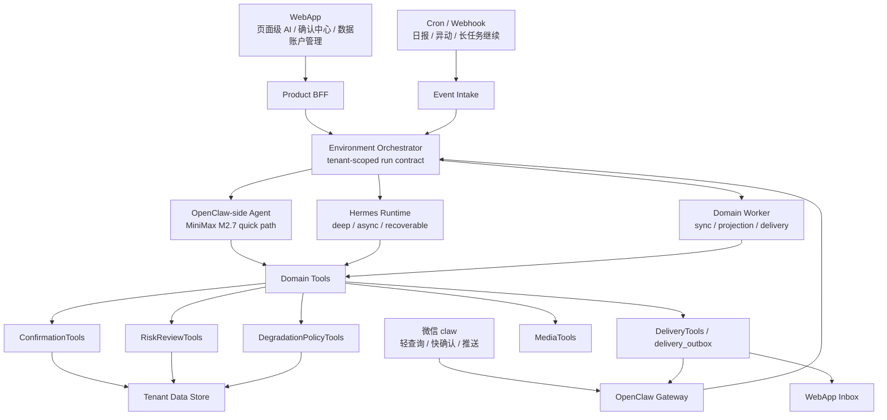
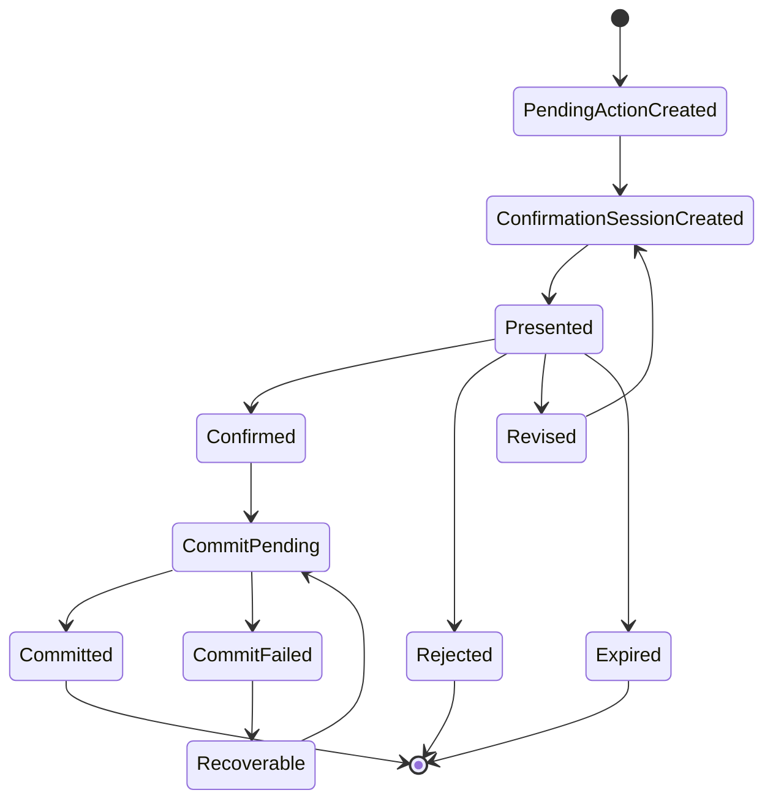
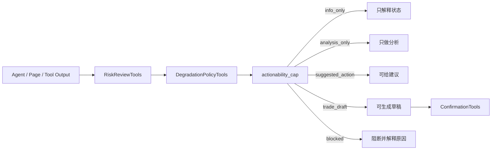
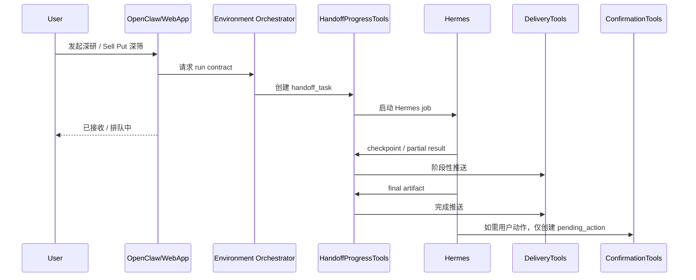

# 交互、确认与 Agent 运行系统分析

## 1. 系统目标

本文件定义 AI 持仓系统 3.0 在 WebApp、微信 claw、确认中心、OpenClaw/Hermes 双 runtime、Environment Orchestrator、媒体工具、降级和推送补偿上的系统边界。

本分析遵循以下硬性口径：

1. **WebApp 没有全局聊天入口。** AI 能力只嵌入具体页面上下文。
2. **微信不做绑定、券商授权或账号切换。** 这些动作只在 WebApp / 管理后台完成。
3. **Environment Orchestrator 是 run contract 签发者。** Agent、Domain Tools、Control Plane 只能继承或收窄 contract，不能扩大权限。
4. **确认中心是高注意动作的统一提交口。** 交易事实、OCR 修正、规则 override、Sell Put 草稿、冲突处理都必须进入确认中心。
5. **确认不等于自动下单授权。** P0 不做自动交易，确认只代表用户接受规范化对象进入后续系统写入或草稿留存。
6. **MiniMax M2.7 负责日常文本与意图。** 图片、语音、图表和链接 artifact 由 Media Tools / Delivery Tools 处理。
7. **Hermes 只处理复杂长任务。** Hermes 不直接写事实层，不绕过确认中心，不直接触达用户。

目标是把“用户说一句话、页面点一个 AI 按钮、系统定时推送一条提醒”都变成可审计、可重放、可降级、可确认的运行链路。

## 2. 交互层架构



### 2.1 职责边界

| 模块 | 负责 | 不负责 |
| --- | --- | --- |
| WebApp | 登录、绑定、券商授权、复杂确认、结构化页面、页面级 AI | 全局泛聊、微信账号切换、直接写底层事实 |
| OpenClaw Gateway | 微信入站、routing、session、消息标准化、出站投递 | 自己判断 `tenant_id`、直接访问券商、直接写持仓 |
| OpenClaw-side Agent | 高频轻量文本、意图识别、短回复、确认卡片解释 | 深研长任务、越权调用工具、高风险动作提交 |
| Hermes Runtime | 深研、复盘、Sell Put 深筛、长任务 checkpoint | 直接触达用户、直接提交事实、扩大工具权限 |
| Environment Orchestrator | 身份解析、意图/复杂度/风险分类、模型和工具策略、run contract | 执行业务工具、生成投资结论 |
| ConfirmationTools | 待确认对象、确认会话、状态流转、幂等提交、审计 | 风险计算、行情查询、自动下单 |
| DeliveryTools | 微信/WebApp 投递、重试、去重、补偿队列 | 生成结论、改变确认状态 |

## 3. Run Contract 契约

Environment Orchestrator 为每次请求生成 `tenant-scoped run contract`。所有下游调用都必须携带 contract 或其收窄版本。

```json
{
  "run_id": "run_20260509_001",
  "tenant_id": "tenant_x",
  "channel_binding_id": "cb_wechat_001",
  "openclaw_account_id": "routing.accountId",
  "session_space": "routing.sessionSpace",
  "trigger": "wechat_message | webapp_action | cron | webhook",
  "entry_surface": "wechat | webapp | system",
  "page_context": {
    "page": "sell_put_workbench",
    "portfolio_view_id": "pv_default",
    "instrument_id": "AAPL"
  },
  "intent": "portfolio_query | trade_record_input | sell_put_analysis | confirmation_decision | deep_research",
  "complexity": "quick | standard | deep | background",
  "risk_level": "low | medium | high | admin",
  "runtime_target": "openclaw_side | hermes | domain_worker",
  "actionability_cap": "info_only | analysis_only | suggested_action | trade_draft | blocked",
  "model_policy": {
    "primary": "minimax-m2.7",
    "deep_research": "gpt-5.5",
    "fallback": "safe_template",
    "max_cost_usd": 0.5
  },
  "tool_policy": {
    "policy_version": "v1",
    "policy_hash": "sha256",
    "allowed_tools": [
      "portfolio.read",
      "market.quote.read",
      "confirmation.create",
      "delivery.enqueue"
    ],
    "forbidden_tools": [
      "broker.trade.place_order",
      "portfolio_positions.direct_update"
    ]
  },
  "memory_scope": {
    "allowed": ["preference", "confirmed_rule", "recent_session"],
    "forbidden": ["other_tenant_memory", "unconfirmed_research_as_fact"]
  },
  "data_scope": {
    "portfolio_view_id": "pv_default",
    "broker_connection_ids": ["bc_futu_001"],
    "symbols": ["AAPL"],
    "requires_freshness": true
  },
  "audit_policy": {
    "trace_level": "full",
    "capture_tool_results": true,
    "create_replay_bundle": true
  },
  "idempotency_key": "tenant_x:sell_put:AAPL:2026-05-09"
}
```

关键规则：

1. 下游 runtime 只能收窄 `tool_policy`、`data_scope`、`actionability_cap`。
2. Hermes 如需新增工具，必须请求 Orchestrator 重新签发 contract。
3. Tool Gateway 必须校验 `tenant_id`、`run_id`、`tool_policy_hash` 和工具调用入参。
4. 所有写入必须记录 `run_id`、`source_lineage`、`idempotency_key`。
5. 当数据、规则或模型状态异常时，`actionability_cap` 必须下降，不能由文案自行解释为可执行建议。

## 4. ConfirmationTools 状态机

确认中心处理的是规范化对象，不处理原始自然语言。



### 4.1 对象类型

| `object_type` | 来源 | 提交结果 |
| --- | --- | --- |
| `trade_event_input` | 手工 / 微信文本 / WebApp 表单 | confirmed `trade_events` |
| `ocr_correction` | 截图 / 图片 OCR | confirmed OCR 修正记录或交易候选 |
| `sell_put_trade_draft` | Sell Put 工作台 / Hermes 深筛 | 交易草稿、执行清单、观察计划 |
| `discipline_rule_override` | 页面 AI / 规则页 / 微信 | 规则例外记录 |
| `reconciliation_conflict` | 对账引擎 | 用户裁决或待处理冲突 |
| `bulk_import_review` | CSV / 对账单 / 文件 | 批量导入确认结果 |

### 4.2 关键字段

```json
{
  "pending_action_id": "pa_001",
  "tenant_id": "tenant_x",
  "run_id": "run_001",
  "object_type": "sell_put_trade_draft",
  "source_surface": "webapp",
  "source_lineage": {
    "portfolio_view_id": "pv_default",
    "broker_snapshot_id": "bss_001",
    "market_snapshot_group_id": "msg_001",
    "rule_check_id": "rule_check_001"
  },
  "risk_level": "high",
  "actionability_level": "trade_draft",
  "status": "pending",
  "expires_at": "2026-05-09T16:00:00+08:00",
  "idempotency_key": "tenant_x:sell_put_draft:AAPL:20260509"
}
```

### 4.3 提交规则

1. `confirmed` 表示用户确认了对象版本；`committed` 表示系统写入目标结果成功。
2. 旧版本确认对象过期后不能复用，必须重新生成。
3. 微信快确认和 WebApp 深确认使用同一 `confirmation_session_id`。
4. 高风险对象必须展示数据时点、来源、风险等级、动作上限和“不会自动下单”提示。
5. `commit_failed` 不能伪装成成功，必须保留可恢复状态和错误原因。

## 5. RiskReview 与降级双门

RiskReview 决定“这个动作是否合理”，DegradationPolicy 决定“当前环境是否允许输出到这个动作等级”。



### 5.1 动作等级

| 等级 | 允许输出 | 典型场景 |
| --- | --- | --- |
| `info_only` | 状态、摘要、任务进度 | 数据只读查询、推送状态 |
| `analysis_only` | 原因解释、风险观察 | 数据过期但仍可说明背景 |
| `suggested_action` | 建议关注、建议复盘、建议设置提醒 | 数据新鲜且低/中风险 |
| `trade_draft` | 交易草稿、Sell Put 执行清单 | Futu/期权链/现金保证金/规则全部通过 |
| `blocked` | 不输出可执行内容 | 关键字段缺失、对账失败、权限不足 |

### 5.2 必须阻断或降级的场景

| 场景 | 处理 |
| --- | --- |
| Futu 持仓或现金/保证金 freshness 不达标 | Sell Put 草稿阻断，保留解释 |
| 期权链关键字段缺失 | 期权候选阻断 |
| broker 对账失败 | 高置信持仓与可执行建议阻断 |
| 纪律规则服务不可用 | 高风险动作阻断，低风险查询可继续 |
| Tencent 与 Futu 偏差超阈值 | 降级为观察，提示数据冲突 |
| Hermes 不可用 | OpenClaw 轻量回复继续，长任务排队或失败补偿 |
| Delivery 失败 | 写 outbox 重试，不丢结果 |

## 6. 页面内 AI 调用边界

WebApp 页面内 AI 通过 BFF 请求 Orchestrator 生成页面级 run contract。

| 页面 | 允许动作 | 默认 actionability 上限 |
| --- | --- | --- |
| Dashboard | 解释资产变化、数据状态、待办摘要 | `info_only` |
| 持仓工作台 | 解释组合结构、仓位集中、风险雷达 | `analysis_only` |
| 股票 / ETF 详情 | 分析波动、止盈止损建议、复盘入口 | `suggested_action` |
| Sell Put 工作台 | 比较候选、解释现金占用、生成草稿 | `trade_draft`，但必须过 gate |
| 确认中心 | 解释差异、展示来源、辅助审阅 | `analysis_only` |
| 规则 / 纪律页 | 解释规则命中、生成规则修改候选 | `suggested_action` 或确认 |

页面内 AI 的实现约束：

1. 每个入口必须显式携带 `page_context`、`portfolio_view_id`、数据时点和来源。
2. AI 不能绕过 BFF 直接调用 Domain Tools。
3. 页面内 AI 输出不能直接写事实，必须生成 `pending_action` 或 analysis artifact。
4. 确认中心内的 AI 只解释当前确认对象，不能生成新的交易建议。

## 7. 微信 / OpenClaw 入口

微信入口由 `routing.json` 的继承字段确定身份：

| 3.0 字段 | 来源 | 作用 |
| --- | --- | --- |
| `channel` | `routing.channel` | P0 固定 `openclaw-weixin` |
| `openclaw_account_id` | `routing.accountId` | OpenClaw 内部微信机器人账号 |
| `account_label` | `routing.accountLabel` | 用户可读别名 |
| `human_name` | `routing.humanName` | 真实用户名 |
| `session_space` | `routing.sessionSpace` | 会话隔离 |
| `memory_root` | `routing.memoryRoot` | 长期记忆路径 |
| `session_root` | `routing.sessionRoot` | 会话路径 |
| `identity_root` | `routing.identityRoot` | 身份配置路径 |
| `tenant_id` | `routing.tenantId` | 3.0 数据隔离根 |
| `data_root` | `routing.dataRoot` | tenant 级数据根 |

微信允许的交互：

1. 当前持仓、任务状态、数据状态的轻查询。
2. 交易录入、截图 OCR、规则候选等操作的发起与确认。
3. Hermes 长任务的发起、进度查询、取消。
4. 定时推送、异动提醒、确认卡片、深链跳 WebApp。

微信不允许的交互：

1. 登录/注册。
2. 微信 claw bot 绑定。
3. 券商授权。
4. 账号切换。
5. 自动交易授权。

## 8. Hermes 长任务流程

Hermes 只通过 `handoff_task` 与系统交互。



### 8.1 handoff 任务字段

| 字段 | 说明 |
| --- | --- |
| `handoff_task_id` | 长任务 ID |
| `tenant_id` | 数据隔离根 |
| `parent_run_id` | 上游 run |
| `runtime_target` | `hermes` |
| `status` | `queued / running / waiting_external / partial / succeeded / failed / cancelled` |
| `progress_summary` | 用户可读进度 |
| `latest_checkpoint_at` | 最近进度 |
| `artifact_refs` | 阶段结果和最终报告 |
| `confirmation_refs` | 生成的待确认对象 |

### 8.2 失败与恢复

1. Hermes 失败时保留 `failed` 状态和可读错误摘要。
2. 长任务结果投递失败时，结果仍可在 WebApp 任务页查看。
3. 用户取消后 Hermes 停止新增工具调用，但保留已完成 artifact。
4. Hermes 不能直接发送微信消息，只能写 `delivery_outbox`。

## 9. Delivery / Outbox

所有主动推送和异步结果都必须先进 `delivery_outbox`。

```json
{
  "delivery_id": "del_001",
  "tenant_id": "tenant_x",
  "channel_binding_id": "cb_wechat_001",
  "openclaw_account_id": "routing.accountId",
  "content_type": "confirmation_card | task_update | daily_summary | media",
  "content_snapshot_hash": "sha256",
  "priority": "normal | high",
  "dedupe_key": "tenant_x:task_001:completed",
  "status": "pending | sending | delivered | failed | retrying | expired",
  "attempt_count": 0,
  "next_retry_at": "2026-05-09T10:00:00+08:00"
}
```

投递规则：

1. `dedupe_key` 防止重复推送。
2. 高风险确认卡片必须带 `confirmation_session_id`。
3. 推送失败走指数退避和补偿，不直接丢弃。
4. WebApp Inbox 与微信投递共用同一消息事实，状态可以不同但内容快照一致。

## 10. Media Tools

Media Tools 是 M2.7 之外的专用工具层。

| 工具 | 功能 | 约束 |
| --- | --- | --- |
| `media.chart.render` | 渲染持仓、收益、风险、期权 DTE 图 | 必须使用结构化数据和 chart spec |
| `media.tts.synthesize` | 生成短语音摘要 | 必须控制长度、敏感内容和成本 |
| `media.image.generate` | 生成非关键视觉素材 | 不能生成交易事实、收益图、风险图 |
| `media.link.render` | 生成 WebApp 深链或报告 artifact | 需要鉴权和过期策略 |
| `media.ocr.extract` | 图片/截图识别 | 低置信进入确认中心 |
| `media.asr.transcribe` | 语音转文本 | 高风险意图必须二次确认 |

金融图表首选确定性渲染，不使用生成式图片表达收益、仓位或风险。

## 11. 权限、Memory 与审计

### 11.1 权限

1. `tenant_id` 是所有表、工具和消息的第一隔离条件。
2. `channel_binding_id` 只代表渠道绑定，不代表资产真相。
3. `openclaw_account_id` 用于微信 bot routing 和投递，不作为数据库隔离根。
4. Tool Gateway 必须拒绝无 contract、contract 过期或 scope 不匹配的调用。

### 11.2 Memory

| Memory 类型 | 可用于 | 不可用于 |
| --- | --- | --- |
| `preference` | 回复风格、关注方向 | 覆盖交易规则 |
| `confirmed_rule` | 纪律检查、提醒 | 跨 tenant 复用 |
| `lesson` | 复盘提醒 | 直接生成事实 |
| `unverified_research` | 背景参考 | 当作持仓或交易事实 |

### 11.3 审计

必须记录：

1. `agent_runs`：入口、intent、模型策略、runtime、状态。
2. `tool_calls`：工具名、入参摘要、结果摘要、policy hash。
3. `model_calls`：模型、成本、延迟、输出 hash。
4. `confirmation_events`：展示、确认、拒绝、过期、提交结果。
5. `delivery_runs`：投递状态、重试、失败原因。
6. `degradation_decisions`：降级原因和动作上限。

## 12. 观测指标

| 指标 | 目标 |
| --- | --- |
| 微信轻查询 P95 延迟 | P0 需可观测，目标后续按实测设定 |
| confirmation commit success rate | 识别确认后提交失败和幂等问题 |
| delivery success rate | 衡量微信推送与补偿质量 |
| handoff task completion rate | 衡量 Hermes 长任务稳定性 |
| degraded response ratio | 判断数据源或规则服务健康 |
| actionability downgrade count | 识别频繁被降级的页面/工具 |
| cross-channel state mismatch | 检测微信与 WebApp 状态不一致 |

## 13. 测试策略

| 测试类型 | 覆盖 |
| --- | --- |
| Contract 单元测试 | 身份解析、工具权限、actionability 上限 |
| Confirmation 状态机测试 | pending -> presented -> confirmed/rejected/expired -> committed/failed |
| 双端一致性测试 | 微信确认后 WebApp 状态刷新，WebApp 拒绝后微信卡片失效 |
| 降级测试 | 数据 stale、对账失败、期权字段缺失、规则服务失败 |
| Delivery 测试 | 去重、失败重试、补偿、过期 |
| Hermes handoff 测试 | 排队、checkpoint、取消、失败、最终 artifact |
| 安全测试 | 跨 tenant、无 contract、扩大工具权限、旧确认重放 |

## 14. 实施顺序

1. 建立 `run contract`、Tool Gateway 校验和审计骨架。
2. 实现 ConfirmationTools 状态机和 WebApp 确认中心最小闭环。
3. 接入 OpenClaw 微信确认卡片与 Delivery/outbox。
4. 实现页面内 AI 的 BFF 调用口，不做全局聊天。
5. 实现 RiskReview + Degradation 的动作等级上限。
6. 接入 Hermes handoff_task、checkpoint、结果 artifact 和投递补偿。
7. 补齐 Media Tools 的 OCR、chart、TTS、link renderer。

## 15. 开发前已确认

| 问题 | 建议处理 |
| --- | --- |
| Sell Put P0 是否允许生成交易草稿 | 已确认：允许生成草稿，但必须确认，且不自动下单 |
| 微信确认卡片是否支持足够结构化字段 | 已确认：微信 claw 不支持按钮/卡片；P0 使用文本口令、语音口令和 WebApp 深链 |
| MiniMax M2.7 供应商接口和失败降级 | 已确认：通过统一 `model adapter` 接入，fallback 模板内置在 adapter |
| Hermes artifact 存储格式 | 已确认：DB metadata + Object Storage；P0 默认保留 90 天，可按 artifact type 调整 |
| confirmation TTL 默认值 | 已确认：高风险 30 分钟，低风险 24 小时 |
| 语音输入是否进入 P0 | 已确认：P0 支持语音输入/语音口令、ASR 识别和二次确认 |
