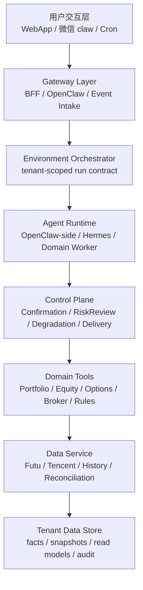
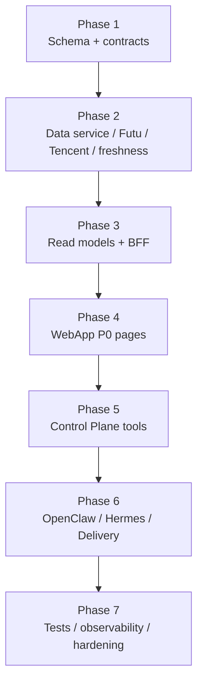

# 架构整合与编码入口

## 1. 目的

本文件把三份 PRD 和三份系统分析收束成编码前的统一入口。它不进入代码实现，只回答四个问题：

1. 哪些架构结论已经固定。
2. 哪些契约必须先实现，避免编码阶段分叉。
3. 哪些问题可以延后，哪些问题会阻塞编码。
4. P0 应该按什么顺序拆任务。

## 2. 已完成的分层结论

### 2.1 三条系统分析的分工

| 文件 | 主责 | 与其他层的接口 |
| --- | --- | --- |
| `01-holdings-core-system-analysis.md` | WebApp 页面、持仓 read model、股票/ETF 与期权产品边界 | 消费 data read model，调用 Domain Tools，进入确认中心 |
| `02-data-broker-reconciliation-system-analysis.md` | Futu/Tencent、broker snapshot、freshness、对账、冲突 | 产出 source truth、read model、degradation inputs |
| `03-interaction-confirmation-agent-system-analysis.md` | WebApp/微信交互、run contract、确认中心、Hermes、推送 | 控制高风险写入、消息投递、长任务和动作等级 |

## 3. 固定的 P0 架构原则

1. `tenant_id` 是 3.0 账号和数据隔离根，注册时生成。
2. 微信绑定后生成 `channel_binding_id`，并映射 `openclaw_account_id = routing.json.accountId`。
3. `portfolio_view` 是展示/聚合口径，不是资产真相源。
4. 资产事实必须记录 `asset_source_id`、`source_lineage`、`reconciliation_status`。
5. Futu 是美股/港股/ETF/期权/现金/保证金 P0 主源；腾讯财经是校验和 fallback。
6. Dashboard 不放富途同步主按钮，只展示 freshness、异常和跳转入口。
7. 股票/ETF 与期权独立建模、独立 read model、独立分析工具。
8. Sell Put 可以生成交易草稿和执行清单，但 P0 不自动下单。
9. 所有高注意动作必须进入 ConfirmationTools。
10. WebApp 不做全局聊天；微信不做绑定、授权和账号切换。
11. MiniMax M2.7 负责日常文本/意图；GPT-5.5 负责深研和长任务的核心推理；Hermes 是承载深研和长任务的 agent runtime。
12. 图片、语音和金融图表通过 Media Tools，不由 M2.7 自由生成关键金融视觉。

## 4. 共享核心契约

### 4.1 Tenant / Channel

| 对象 | 关键字段 | 用途 |
| --- | --- | --- |
| `tenant_account` | `tenant_id`、login identity、status | 数据隔离根 |
| `channel_binding` | `channel_binding_id`、`tenant_id`、`channel`、`openclaw_account_id`、status | 微信投递和入站解析 |
| `broker_connection` | `broker_connection_id`、`tenant_id`、broker、permission scope、auth status | 券商只读连接 |
| `portfolio_view` | `portfolio_view_id`、filters、base currency、included sources | 页面聚合口径 |

### 4.2 Source / Data Quality

| 对象 | 必备字段 |
| --- | --- |
| `asset_source` | `asset_source_id`、source type、provider、priority、quality |
| `broker_sync_snapshot` | `tenant_id`、`broker_connection_id`、coverage、as_of、status |
| `market_snapshot_group` | primary source、cross-check source、freshness、fallback flag |
| `reconciliation_result` | status、conflict type、affected objects、review requirement |
| `read_model_status` | freshness、last sync、reconcile status、actionability cap |

### 4.3 Run / Confirmation

| 对象 | 必备字段 |
| --- | --- |
| `agent_run` | `run_id`、`tenant_id`、trigger、intent、runtime、risk、status |
| `run_contract` | model policy、tool policy、memory scope、data scope、idempotency key |
| `pending_action` | object type、risk level、source lineage、TTL、status |
| `confirmation_session` | session id、channel state、decision state、object version |
| `confirmation_event` | viewed、confirmed、rejected、expired、commit result |
| `delivery_outbox` | channel binding、content hash、dedupe key、retry status |

## 5. 编码任务切分

### Phase 1: Schema + contracts

目标：先把 `tenant_id`、source lineage、read model、run contract、confirmation、delivery 的数据骨架定下来。

输出：

1. Supabase migrations 或现有 schema 扩展草案。
2. TypeScript / Python shared DTO。
3. Tool policy 和 actionability enum。
4. 幂等键、审计字段、状态枚举。

验收：

1. 所有新增业务表带 `tenant_id`。
2. 所有写入型对象带 `source_lineage` 或 `run_id`。
3. 股票/ETF 与期权分表或扩展模型明确分离。

### Phase 2: Data service / Futu / Tencent / freshness

目标：实现数据主链路，让页面读取的数据先可信。

输出：

1. Futu 只读 broker sync adapter。
2. Futu quote / option chain adapter。
3. Tencent Finance cross-check adapter。
4. ReconciliationEngine 最小可用版本。
5. FreshnessGate 与 DegradationPolicy 输入。

验收：

1. 可手动触发 Futu 同步并生成 snapshot。
2. 部分失败不会清空旧 read model。
3. Tencent 只能校验和 fallback，不覆盖主源。

### Phase 3: Read models + BFF

目标：为 WebApp 提供稳定页面 DTO。

输出：

1. Dashboard overview DTO。
2. Portfolio overview DTO。
3. Equity positions DTO。
4. Option positions DTO。
5. Confirmation inbox DTO。

验收：

1. Dashboard 能展示 freshness 和异常，但没有同步主按钮。
2. `portfolio_view` 切换不改写事实。
3. 每个 DTO 带 freshness、reconcile、source quality。

### Phase 4: WebApp P0 pages

目标：按已确认的原型和页面拆解落地 P0 核心页面。

范围：

1. Dashboard。
2. 持仓工作台。
3. 股票 / ETF 详情。
4. Sell Put 工作台。
5. 确认中心。
6. 数据 / 账户页中的富途同步入口。
7. 规则 / 纪律页的最小管理入口。

验收：

1. 移动端可用。
2. WebApp 无全局聊天入口。
3. 页面内 AI 入口都带页面上下文和动作上限。
4. 富途同步入口不抢 Dashboard 主视觉。

### Phase 5: Control Plane tools

目标：让高风险动作可控。

输出：

1. ConfirmationTools 状态机。
2. RiskReviewTools。
3. DegradationPolicyTools。
4. DisciplineRuleTools。
5. AuditObservabilityTools。

验收：

1. Sell Put 草稿必须经过现金/保证金/期权链/规则/对账 gate。
2. 旧确认不能重放。
3. 降级时 actionability 下降，而不是只改文案。

### Phase 6: OpenClaw / Hermes / Delivery

目标：接入微信轻交互、确认卡片、长任务和推送补偿。

输出：

1. OpenClaw inbound 到 Orchestrator。
2. 微信确认卡片与 WebApp 确认中心共用状态。
3. Hermes handoff_task、checkpoint、artifact。
4. Delivery/outbox、去重、重试、补偿。
5. Media Tools 的 chart / OCR / link 最小集。

验收：

1. 微信上不能绑定/授权/切换账号，只能引导。
2. Hermes 不直接写事实层。
3. 推送失败后 WebApp Inbox 仍可查看结果。

### Phase 7: Tests / observability / hardening

目标：上线前验证核心安全和稳定性。

输出：

1. Contract、confirmation、degradation 单元测试。
2. Futu partial sync、对账冲突、fallback 集成测试。
3. WebApp 页面关键路径测试。
4. 跨端确认一致性测试。
5. OpenTelemetry / trace / replay bundle 最小闭环。

验收：

1. 跨 tenant 访问测试必须失败。
2. 数据 stale 时 Sell Put 草稿必须被阻断。
3. delivery 重复投递被 dedupe。

## 6. 编码前参数

### 可延后，不阻塞 P0 编码

| 问题 | P0 处理 |
| --- | --- |
| 付费 / 配额 UI | 不进 P0，只保留内部 cost/quota 字段 |
| 钉钉 / 飞书绑定 | 保留 channel abstraction，不实现 |
| 完整语音输出和多轮语音体验 | P1；P0 支持语音输入/语音口令、ASR 识别和二次确认 |
| 复杂文件导入 | P2，P0 保留确认中心对象类型 |
| 10 万级全量分片实现 | P0 按可迁移架构设计，不提前重型化 |

### 已确认编码前参数

| 参数 | 确认值 | 实现含义 |
| --- | --- | --- |
| Futu OpenD 部署方式 | 本地安装连接 | P0 以用户本地 Futu OpenD 为连接前提，系统侧只做受控只读连接配置、状态检测和同步任务 |
| Futu 权限范围 | `read_only` | BrokerConnector、同步任务、工具权限和 run contract 均不得包含实盘下单能力 |
| MiniMax M2.7 API 接入方式 | 统一 `model adapter`；可使用 MiniMax CLI | 产品代码只依赖统一模型适配层，MiniMax CLI 可作为本地/运维接入实现，不让业务逻辑直接绑定 CLI |
| confirmation TTL | 高风险 30 分钟，低风险 24 小时 | `pending_action` / `confirmation_session` 按风险等级写入过期时间，过期对象不可复用 |
| Sell Put 草稿范围 | 允许生成草稿，不自动下单 | Sell Put 工作台和 Hermes 可生成草稿、执行清单和待确认对象，但不具备自动下单权限 |
| Hermes job 超时 | 轻任务 5 分钟，深研 30 分钟 | 超时进入可恢复排队/失败补偿 |
| 微信确认方式 | 文本口令、语音口令、WebApp 深链 | 微信 claw 不支持按钮/卡片，确认流不依赖结构化按钮 |
| Object Storage | P0 使用 Supabase Storage，本地研发用 MinIO | 历史行情、artifact、media、replay 均写对象存储，DB 只存 metadata/hash |

### 开发前 gate 状态

A 类 42 项、B 类 15 项、C 类 13 项已经全部完成确认，完整记录见 `../24-pre-development-confirmation-checklist.md`。后续编码以该文件的 `0.1 / 0.2 / 0.3` 确认记录为准。

## 7. 第一轮编码建议

第一轮不要直接从 UI 开始。建议先做一条最薄但完整的竖切：

1. `tenant_id` + `portfolio_view` + Futu mock/snapshot。
2. Dashboard / Portfolio read model。
3. ConfirmationTools 最小状态机。
4. Sell Put 草稿被 gate 阻断/允许的最小流程。
5. WebApp 展示 freshness、持仓、期权占用、确认 inbox。

这条竖切能最早验证 3.0 的关键架构假设：数据可信度、持仓/期权分离、run contract、确认中心和降级动作等级。
